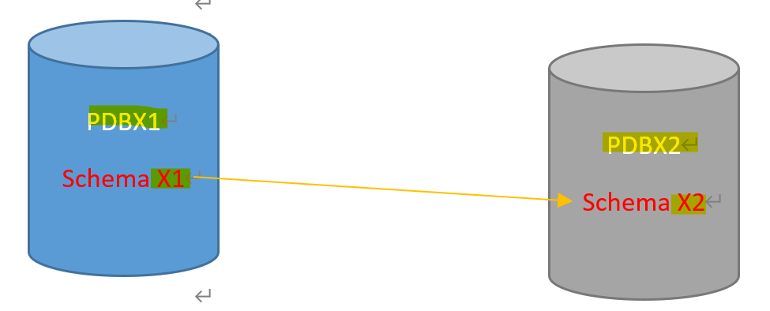
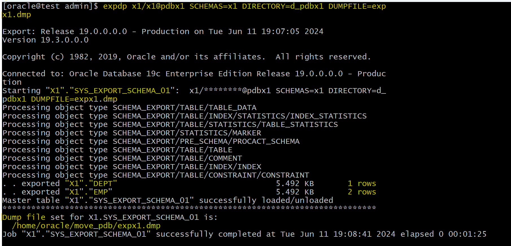
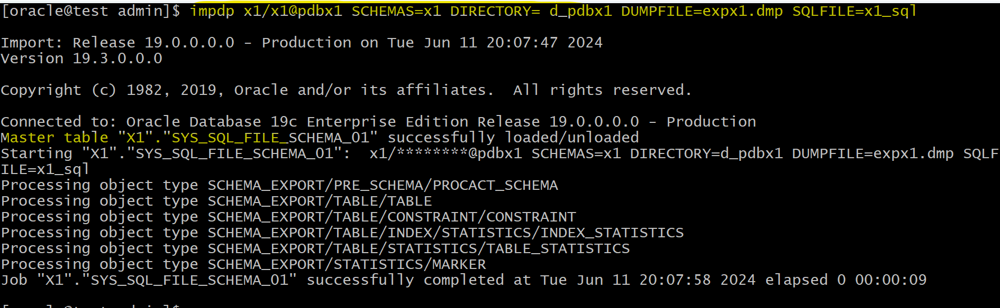
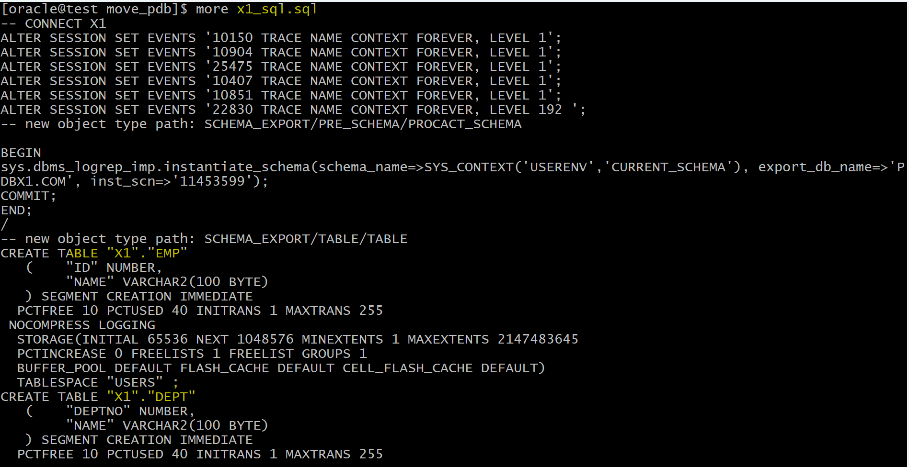
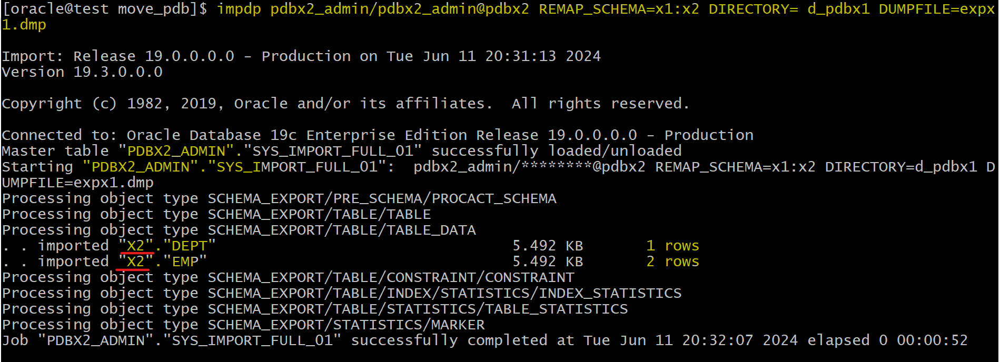
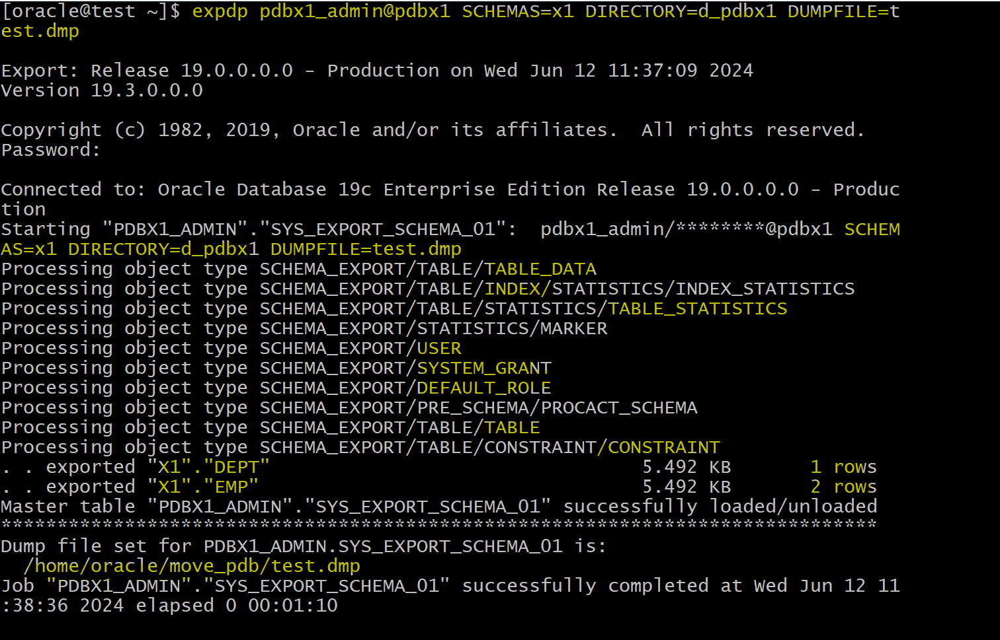
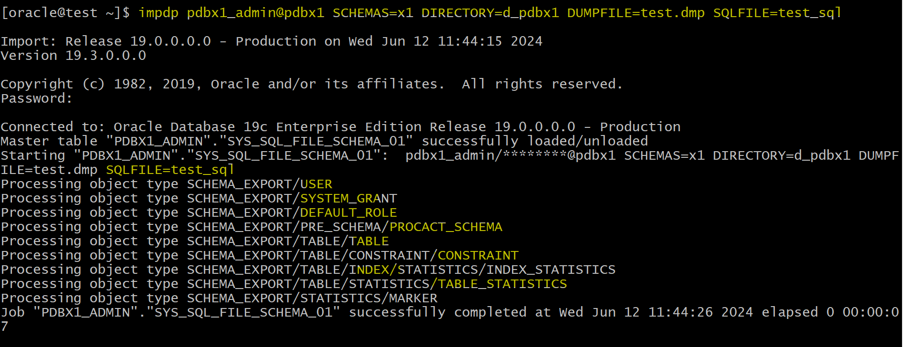
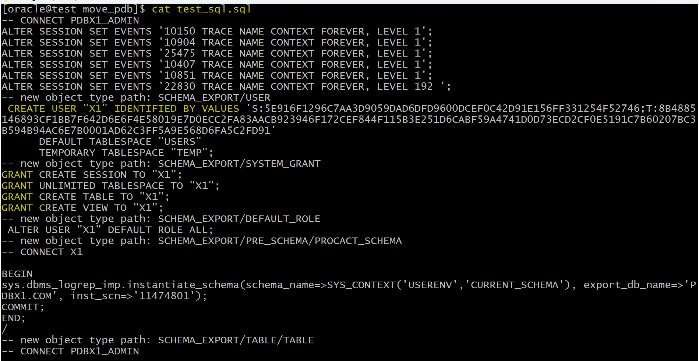
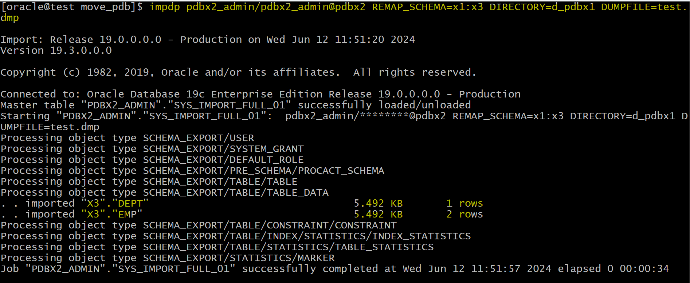

# Moving Data Between PDBs

[Back](../index.md)

- [Moving Data Between PDBs](#moving-data-between-pdbs)
  - [Lab: Moving Data Between PDBs](#lab-moving-data-between-pdbs)
    - [Requirements](#requirements)
    - [Create Source PDB](#create-source-pdb)
    - [Create Target PDB](#create-target-pdb)
    - [Create Directory in Source PDB](#create-directory-in-source-pdb)
    - [Export Data from Source PDB to a Dump File](#export-data-from-source-pdb-to-a-dump-file)
    - [Import the dump file into Target PDB](#import-the-dump-file-into-target-pdb)
    - [Option: Export schema using user with DBA roles](#option-export-schema-using-user-with-dba-roles)

---

## Lab: Moving Data Between PDBs

### Requirements

- We have 2 pluggable databases

  - 1. `pdbx1` which contains **schema** called `x1`
    - `x1` schema contain some objects like tables and views
  - 2.`pdbx2`, am empty pdb

- Task:

  - we need to move the **schema** `x1` from pluggable `pdbx1` to pluggable database `pdbx2`
  - Note: we will change the schema `x1` to be `x2` in the pluggable `pdbx2`

- Using `Data Pump`



---

### Create Source PDB

- Create `pluggable` **pdbx1** using `DBCA` from seed

  - make the admin user `pdbx1_admin`

- Grant admin `DBA` role

```sql
sqlplus / as sysdba

show user
--USER is "SYS"
show con_name
--CON_NAME
--------------------------------
--CDB$ROOT

-- verify creation
show pdbs
-- 8 PDBX1                          READ WRITE NO

alter session set container=pdbx1;
show con_name
--CON_NAME
--------------------------------
--PDBX1

-- gran privilege
grant create session, dba to pdbx1_admin;
```

- Update the **Tnsnames file** and test the connection

```sh
vi $ORACLE_HOME/network/admin/tnsnames.ora

# add:
PDBX1 =
  (DESCRIPTION =
    (ADDRESS_LIST =
      (ADDRESS = (PROTOCOL = TCP)(HOST = test.com)(PORT = 1521))
    )
    (CONNECT_DATA =
      (SERVER = DEDICATED)
      (SERVICE_NAME = pdbx1.com)
    )
  )
```

- Verify tnsname

```sql
sqlplus pdbx1_admin@pdbx1

show user
show con_name
```

- Create user called `x1`
  - Grant him some privileges

```sql
create user x1 identified by x1;
grant create session, create view, create table, unlimited tablespace to x1;

connect x1/x1@pdbx1
show user
show con_name
```

- Create some objects

```sql
create table emp (id number primary key, name varchar2(100));
Insert into emp values (1, ' khaled');
Insert into emp values (2, ' ahmed');
Commit;

Create table dept ( deptno number primary key , name varchar2(100 ) );
Insert into dept values (1, ' sales dept ');
Commit;

-- verify
SELECT count(*) FROM emp;
-- 2
SELECT count(*) FROM dept;
-- 1
```

---

### Create Target PDB

- Create pluggable `pdbx2` using DBCA from seed

  - make the admin user `pdbx2_admin`

- Grant him DBA role

```sql
sqlplus / as sysdba
show user
show con_name

-- verify pdb creation
show pdbs

alter session set container=pdbx2;
show con_name
grant create session, dba to pdbx2_admin;
```

- update the Tnsnames file and test the connection

```sh
vi $ORACLE_HOME/network/admin/tnsnames.ora

# add:
PDBX2 =
  (DESCRIPTION =
    (ADDRESS_LIST =
      (ADDRESS = (PROTOCOL = TCP)(HOST = test.com)(PORT = 1521))
    )
    (CONNECT_DATA =
      (SERVER = DEDICATED)
      (SERVICE_NAME = pdbx2.com)
    )
  )
```

- create user called x2
  - grant him some privileges

```sql
sqlplus pdbx2_admin/pdbx2_admin@pdbx2

create user x2 identified by x2;
grant create session, create view, create table, unlimited tablespace to x2;

connect x2/x2@pdbx2
show user
show con_name
```

---

### Create Directory in Source PDB

- Create physical direcotry in OS

```sh
mkdir /home/oracle/move_pdb
```

- create logical directory in pdbx1 ( for exporting the dmp file )

```sql
connect pdbx1_admin@pdbx1;
CREATE DIRECTORY d_pdbx1
AS '/home/oracle/move_pdb';

GRANT read, write ON DIRECTORY d_pdbx1 TO x1;
exit
```

---

### Export Data from Source PDB to a Dump File

```sh
# in terminal
# expdb: a utility of data pump to export database
#   with X1 connection
#   schema: x1
#   directory: use dir to export
#   dumpfile: specify the file name for export
expdp x1/x1@pdbx1 SCHEMAS=x1 DIRECTORY=d_pdbx1 DUMPFILE=expx1.dmp
```



---

- The dump file is binary file
  - to understand the file, can Generate a SQL script from the dump file

```sh
# in terminal
# import the dmp file then output the sql file containing DDL helps in understanding the data in the dmp file
impdp x1/x1@pdbx1 SCHEMAS=x1 DIRECTORY= d_pdbx1 DUMPFILE=expx1.dmp SQLFILE=x1_sql
```




> note:
>
> - All DDL statements are read from the dump file ( **not** the DML )
> - DDL does not include creation of user/schema, `x1`.
>   - This is why must create the schema in target pdb.
>   - The reason for this is that this dump file is created by x1, the schema which created by sys. So x1's file cannot include the sql to create its owner.

---

### Import the dump file into Target PDB

- Import the x1 Schema Into pdbx2 By Using Data Pump Import
  - Note: we will map the schema x1 to x2 inside the pdbx2;

```sh
# import from dump file
# remap to tell oracle to convert schema
impdp pdbx2_admin/pdbx2_admin@pdbx2 REMAP_SCHEMA=x1:x2 DIRECTORY= d_pdbx1 DUMPFILE=expx1.dmp
# ORA-39002: invalid operation
# ORA-39070: Unable to open the log file.
# ORA-39087: directory name D_PDBX1 is invalid
```

> - No such file or directory due to there is no directory created in the target PDB.

- Create directory in target PDB

```sql
sqlplus pdbx2_admin/pdbx2_admin@pdbx2;

CREATE DIRECTORY d_pdbx1
AS '/home/oracle/move_pdb';
```

- Import data

```sh
# in terminal
# import data from a dump file
impdp pdbx2_admin/pdbx2_admin@pdbx2 REMAP_SCHEMA=x1:x2 DIRECTORY= d_pdbx1 DUMPFILE=expx1.dmp
```



- Verify in target pdb

```sql
sqlplus x2/x2@pdbx2

-- verify
SELECT count(*) FROM emp;
-- 2
SELECT count(*) FROM dept;
-- 1
```

---

### Option: Export schema using user with DBA roles

- In the above steps, schema is export using x1, a user without DBA role. Therefore, x1 has not privilege to create user.

- The following is on top of the above lab, but focus on the exporting schema in the source PDB.

```sh
# using pdbx1_admin with DBA role
expdp pdbx1_admin@pdbx1 SCHEMAS=x1 DIRECTORY=d_pdbx1 DUMPFILE=test.dmp
```



- To understand the dump file:

```sh
# generate the sql file
impdp pdbx1_admin@pdbx1 SCHEMAS=x1 DIRECTORY=d_pdbx1 DUMPFILE=test.dmp SQLFILE=test_sql
```





> - the sql includes the statement to create user and grant privileges.

---

- Import schema in the target

```sh
impdp pdbx2_admin/pdbx2_admin@pdbx2 REMAP_SCHEMA=x1:x3 DIRECTORY=d_pdbx1 DUMPFILE=test.dmp
```



> - target pdb automatically create user x3

- Verify

```sql
sqlplus pdbx2_admin@pdbx2
show con_name
show user

select count(*) from x3.dept;
-- 1
select count(*) from x3.emp;
-- 2
```

---

Comparison:

- When using a user without DBA role, the target pdb must create a schema first.
- When using a user with DBA role, the target pdb can skip creation of schema beforehand.

---

[TOP](#moving-data-between-pdbs)
