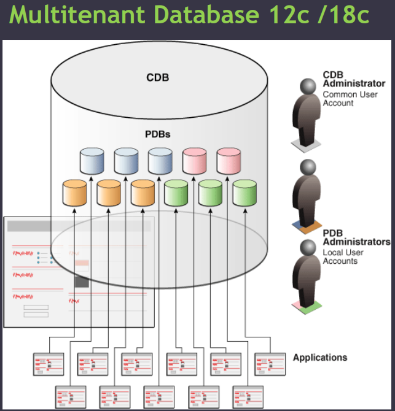

# DBA - Multitenant architecture

[Back](../index.md)

- [DBA - Multitenant architecture](#dba---multitenant-architecture)
  - [Multitenant Architecture](#multitenant-architecture)

---

## Multitenant Architecture

- `multitenant architecture`

  - enables an Oracle database to function as a **multitenant container database (CDB)**.
  - Starting in Oracle Database 21c, a multitenant container database is the only supported architecture.

- Benefits:
  - Reduce cost
  - Saving resources
  - Easy maintenance
  - Easy backup
  - Easy cloning
  - Separation of rules
    - PDB Admin vs CDB Admin

- Every CDB has the following containers:

  - 1. Exactly one CDB root container called `CDB$ROOT`

    - Contains `Metadata` and `Common users` **shared** amonge all PDBs.

  - 2. Seed PDB called `PDB$SEED`

    - it is a template used to create another PDB

  - 3. Zero or more user-created

---

[TOP](#dba---multitenant-database)
