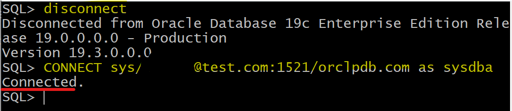

# DBA - Connect: Login SQL\*PLUS

[Back](../../index.md)

- [DBA - Connect: Login SQL\*PLUS](#dba---connect-login-sqlplus)
  - [Login using OS Authentication](#login-using-os-authentication)
  - [Easy Connect](#easy-connect)
  - [Lab: Easy Connect with service name](#lab-easy-connect-with-service-name)
  - [Lab: Easy connect using TNS name](#lab-easy-connect-using-tns-name)

---

## Login using OS Authentication

- This is not an easy connect.
- Can use this method to login even if the `Listener` is down, because it use password file, but not `Listener`.
- Login using `/`

- Condition
  - the user should login on the same machine that the Oracle instance is running.用户必须登录到同一个机器.
  - The user should be in a group "DBA"


```sh
# using OS authentication
sqlplus / as sysdba     # using password file for authentication

# login using database auth and tnsname
sqlplus sys@tns_name as sysdba

```

---

- Login from the OS terminal

```sh
sqlplus user_name@tns_name as sysdba
```

---

## Easy Connect

- `Easy Connect`:

  - a **syntax** currently used by Oracle programs and applications when connecting to an
    Oracle Database service.

- At its simplest, an `Easy Connect string` includes a **host name**, an optional **port**, and the database **service name**:

- Required the `Listener` up and running.
- Needs to wait 60s for listener to register.
  - Alternatively, after login using OS auth, input `alter system register;`.

---

## Lab: Easy Connect with service name

- SQL terminal

```sql
# syntax
CONNECT user_name/password@host_name:1521/service_name

# example
CONNECT sys/pwd@test.com:1521/orcl.com as sysdba    # orcl.com is the service name of root
CONNECT sys/pwd@test.com:1521/orclpdb.com as sysdba    # orclpdb.com is the service name of pluggable database
```




---

- Stop Listener
  - cannot login, because it requires Listener


---

## Lab: Easy connect using TNS name

```sql
# syntax
CONNECT user_name/password@tns_name

# Example
CONNECT sys/pwd@orcl AS SYSDBA;
```


---

[TOP](#dba---connect-login-sqlplus)
