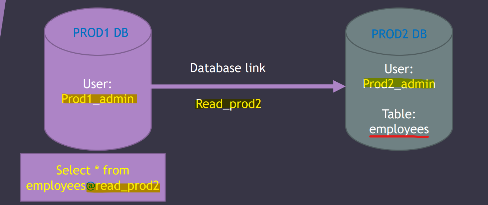
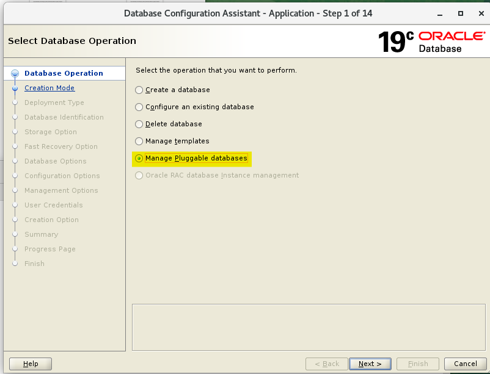
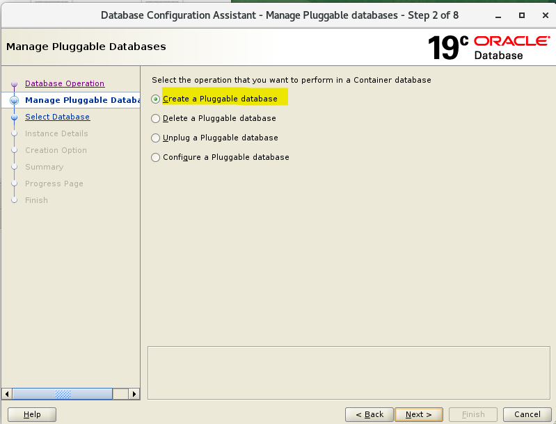
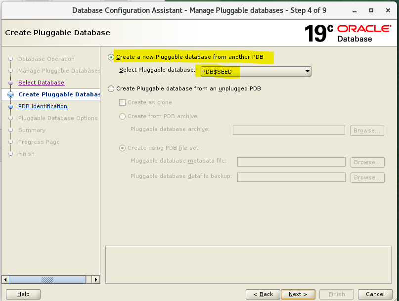
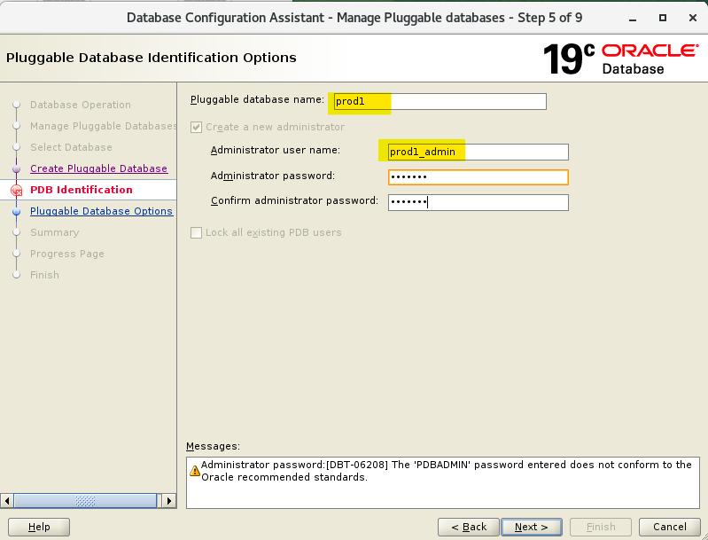
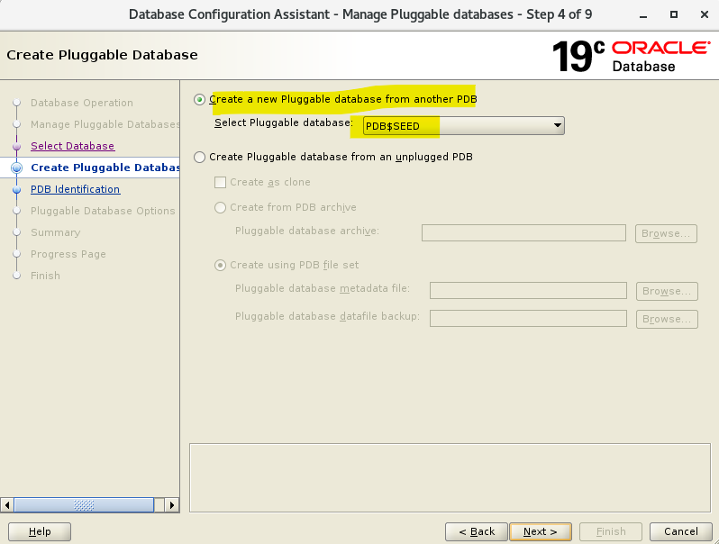
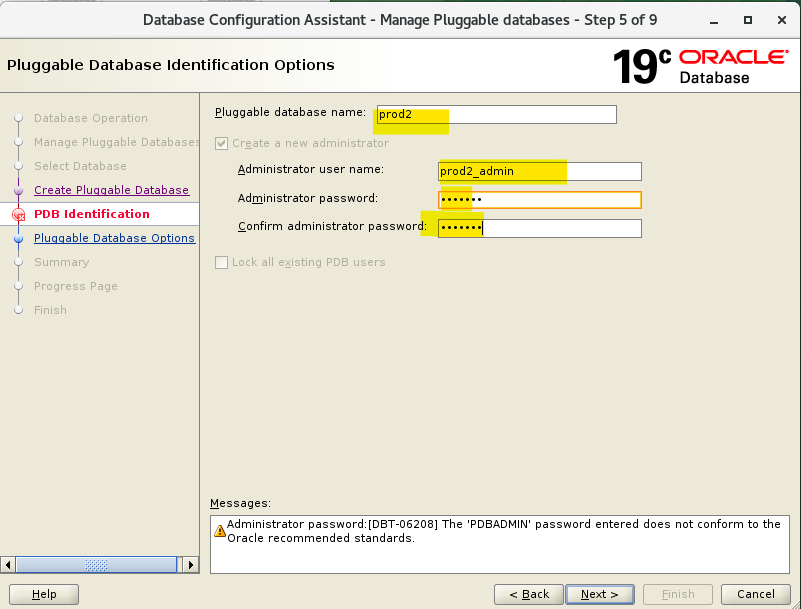
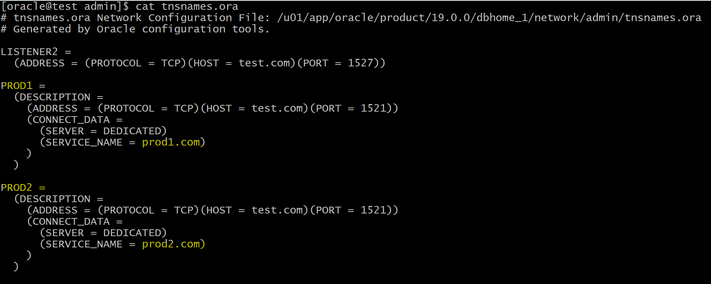
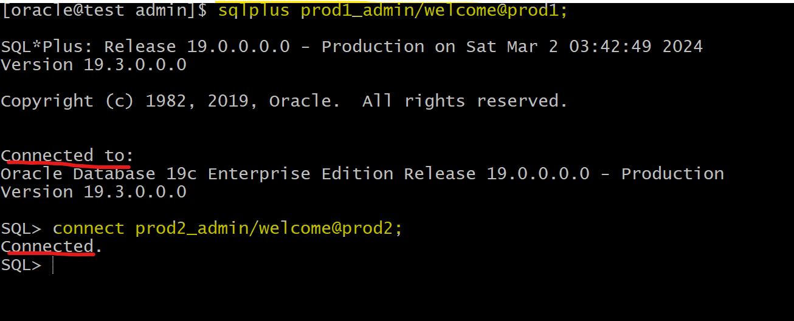
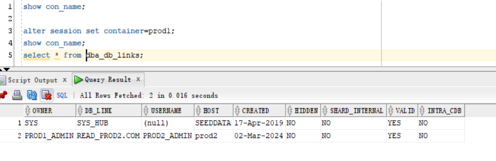

# DBA Net Service - Database Link

[Back](../../index.md)

- [DBA Net Service - Database Link](#dba-net-service---database-link)
  - [Database Link](#database-link)
    - [Lab: Create Database Link](#lab-create-database-link)

---

## Database Link

- `Database Link`:

  - a **schema object** in one database that enables you to **access objects in another database**.

- The other database **need not** be an **Oracle Database system**.

  - However, to access non-Oracle systems you must use `Oracle Heterogeneous Services`.

- `private database link`:

  - only the owner can use this link

- `public database link`

  - everyone can user this link

- Prerequisites:

  - To create a `private database link`, you must have the `CREATE DATABASE LINK` system **privilege**.
  - To create a `public database link`, you must have the `CREATE PUBLIC DATABASE LINK` system **privilege**

- **refer to tables, views, and PL/SQL objects** in the other database:
  - appending `@dblinkname` to the table, view, or PL/SQL object name.



- Statement:

```sql
CREATE DATABASE LINK <database_link_name>
CONNECT TO <user> IDENTIFIED BY <pwd>
USING '<connect_string_for_remote_db>';
# connect_string_for_remote_db:  tnsname entry
```

- Dict for db link: `dba_db_links`

---

### Lab: Create Database Link

- Create 1st pdbs using dbca






- In sqlplus

```sql
# confirm pdb creation
select name, open_mode from v$pdbs;

alter session set container=prod1;
show con_name;

# grant dba role to pdb admin
grant dba to prod1_admin;

```

---

- Create 2nd pdbs using dbca




- In sqlplus

```sql
# confirm pdb creation
select name, open_mode from v$pdbs;

alter session set container=prod2;
show con_name;

# grant dba role to pdb admin
grant dba to prod2_admin;

```

---

- create entry in `tnsname.ora`
  - since db link required tnsname entry

```conf
PROD1 =
  (DESCRIPTION =
    (ADDRESS = (PROTOCOL = TCP)(HOST = test.com)(PORT = 1521))
    (CONNECT_DATA =
      (SERVER = DEDICATED)
      (SERVICE_NAME = prod1.com)
    )
  )

PROD2 =
  (DESCRIPTION =
    (ADDRESS = (PROTOCOL = TCP)(HOST = test.com)(PORT = 1521))
    (CONNECT_DATA =
      (SERVER = DEDICATED)
      (SERVICE_NAME = prod2.com)
    )
  )
```



- Test connection



---

- Create table in the target pdb, prod2
- insert a record

```sql
show con_name;
create table employees (id number, name varchar2(100));
insert into employees values (1, 'adam');
commit;
select * from employees;
```

---

- Create db link in source pdb, prod1

```sql
connect prod1_admin@prod1;
show con_name;
show user;

# create a private database link
create database link read_prod2
connect to prod2_admin identified by welcome
using 'prod2';

# query using db link
select * from employees@read_prod2;
#         ID NAME
# ---------- ------------------------------
#          1 adam

```

---

- query info about this db_link



---

[TOP](#dba-net-service---database-link)
