# DBA Net Service - Listener

[Back](../../index.md)

- [DBA Net Service - Listener](#dba-net-service---listener)
  - [Oracle Net Listener](#oracle-net-listener)
  - [`Listener.ora` File](#listenerora-file)
  - [Lab01: Show Listener's status](#lab01-show-listeners-status)
  - [Lab02: Start and stop the Listener](#lab02-start-and-stop-the-listener)
  - [Lab03: Connect with SQL Developer](#lab03-connect-with-sql-developer)
  - [Lab: Monitoring Listener](#lab-monitoring-listener)

---

## Oracle Net Listener

- `Oracle Net Listener`

  - a **separate process** that runs on the database **server** computer.
  - used to establish the initial connection with Oracle Database server
  - **receives** incoming client connection requests and **manages the traffic** of these requests to the database server
  - clients configured with the **same protocol address** can send connection requests to the listener.
  - Act as a gateway to the Oracle Database.

- Multiple `Oracle isntances` running locally on the same server can use the same `Oracle Listener` as gateway for all connecting client.多实例可以使用同一个监听器.

- Client use a combination of `host name`, where the instance and listener are running, and the uniquely identifying `service name` **to establisha connection**.

- When a connection is **established**, the client and Oracle server communicate **directly** with one another. 建立联系后, 将直接对话.

- security:

  - supports `ACLs (Access Control Lists)` for service and this is supported for all IP protocols.

- **Whenever the machine is started, the listener will be started.**
- When the Listener is down, no one can connect to the database.

---

## `Listener.ora` File

- `Listener.ora`:

  - a SQL\*Net configuration file used to configure Oracle Database Listenters
  - Path(19c): `$ORACLE_HOME/network/admin`

- example:

```conf
# listener.ora Network Configuration File: /u01/app/oracle/product/19.0.0/dbhome_1/network/admin/listener.ora
# Generated by Oracle configuration tools.

LISTENER =
  (DESCRIPTION_LIST =
    (DESCRIPTION =
      (ADDRESS = (PROTOCOL = TCP)(HOST = test.com)(PORT = 1521))
      (ADDRESS = (PROTOCOL = IPC)(KEY = EXTPROC1521))
    )
  )
```

> - LISTENER: a default Listener
>   - listening to 2 types of requests, tcp and ipc
>   - any request to connect with test.com using TCP and port 1521 is a valid connection.
> - TCP/IP:
>   - standard communication protocol for communication between client and server.
>   - Any TCP request to the host of test.com using port 1521
> - IPC:
>   - used only when the client program and Oracle Database are installed on the same system.

---

## Lab01: Show Listener's status

- To show the status the listener

```sh
# using default listener name LISTENER
lsnrctl STATUS

# listener_name is the name of the listener defined in the listener.ora file.
lsnrctl STATUS [listener_name]
```

```conf
Connecting to (DESCRIPTION=(ADDRESS=(PROTOCOL=ipc)(KEY=net)))
STATUS of the LISTENER
------------------------
Alias                     LISTENER
Version                   TNSLSNR for Linux: Version 23.1.0.0.0
Start Date                15-JULY-2022 20:22:00
Uptime                    65 days 10 hr. 5 min. 22 sec
Trace Level               support
Security                  OFF
Listener Parameter File   /oracle/admin/listener.ora
Listener Log File         /oracle/network/log/listener.log
Listener Trace File       /oracle/network/trace/listener.trc
Listening Endpoints Summary...
  (DESCRIPTION=(ADDRESS=(PROTOCOL=ipc)(KEY=net)))
  (DESCRIPTION=(ADDRESS=(PROTOCOL=tcp)(HOST=sales-server)(PORT=1521)))
  (DESCRIPTION=(ADDRESS=(PROTOCOL=tcps)(HOST=sales-server)(PORT=2484)))

Services Summary...
Service "sales.us.example.com" has 1 instance(s).
  Instance "sales", status READY, has 3 handler(s) for this service...
Service "hr.us.example.com" has 1 instance(s).
  Instance "hr", status READY, has 2 handler(s) for this service...
The command completed successfully
```

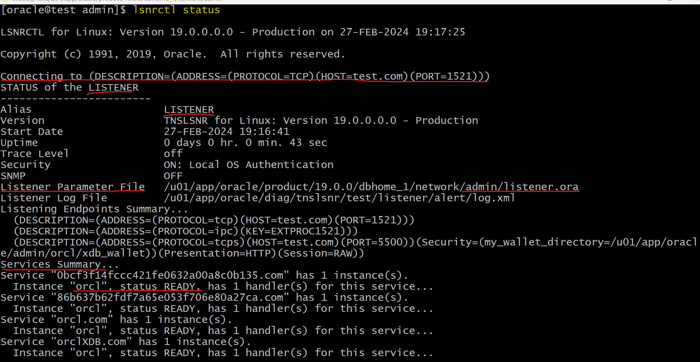

---

## Lab02: Start and stop the Listener

- Stop Listener

```sh
# using default listener name LISTENER
tnsping orcl
lsnrctl STOP
# lsnrctl STOP [listener_name]
# listener_name is the name of the listener defined in the listener.ora file.
tnsping orcl
```

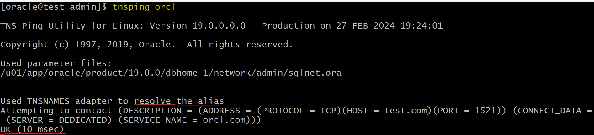

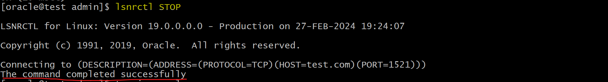

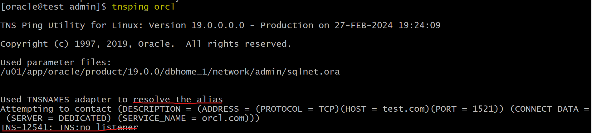

---

- Start listener:
  - note: when starting listener, it will prompt that `The listener supports no servers`.
    - This is because it takes 60 seconds for LREG to register.
    - After 60 seconds, it will show all the registered services.

```sql
tnsping orcl
lsnrctl START
# lsnrctl START [listener_name]
tnsping orcl

```

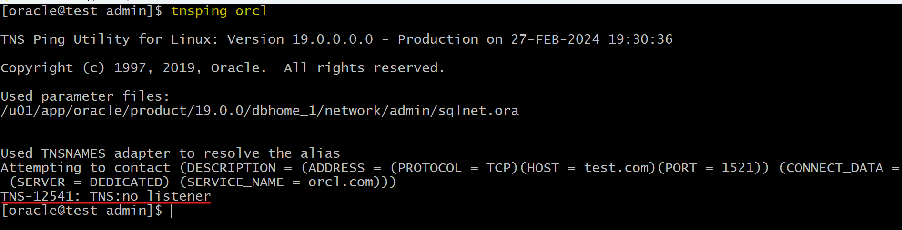
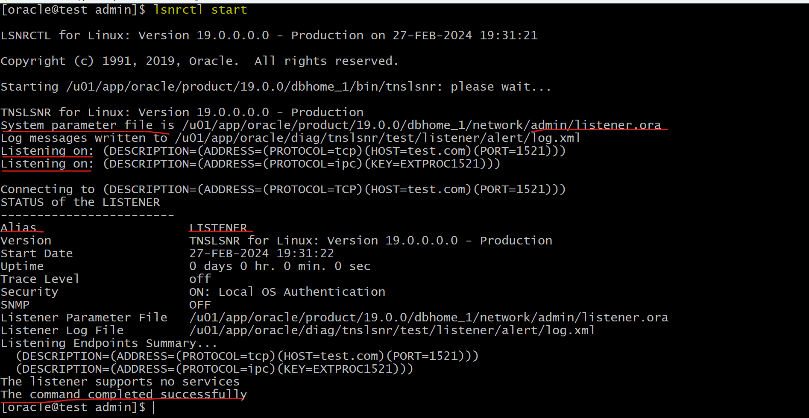
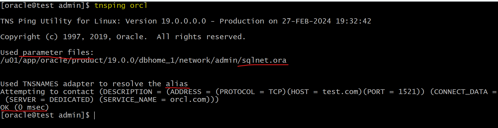

---

## Lab03: Connect with SQL Developer

- Stop listener
- Connect with SQL Deveopler
  - Error: `Status : Failure -Test failed: IO Error: The Network Adapter could not establish the connection (CONNECTION_ID=wje97B8CSTK2k9fqv37Kjg==)`

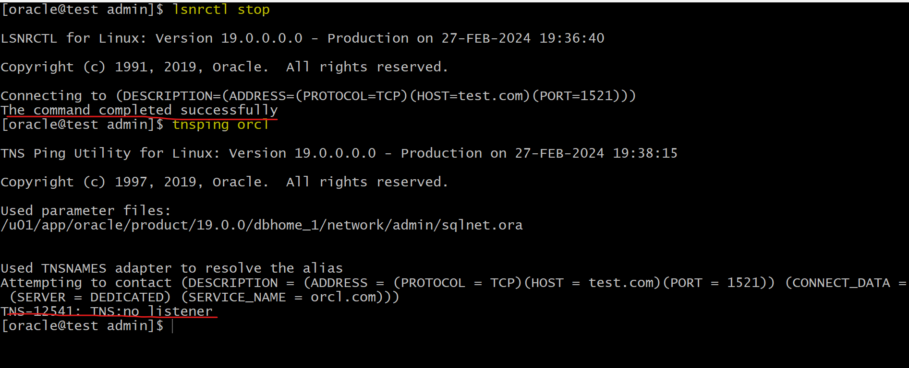

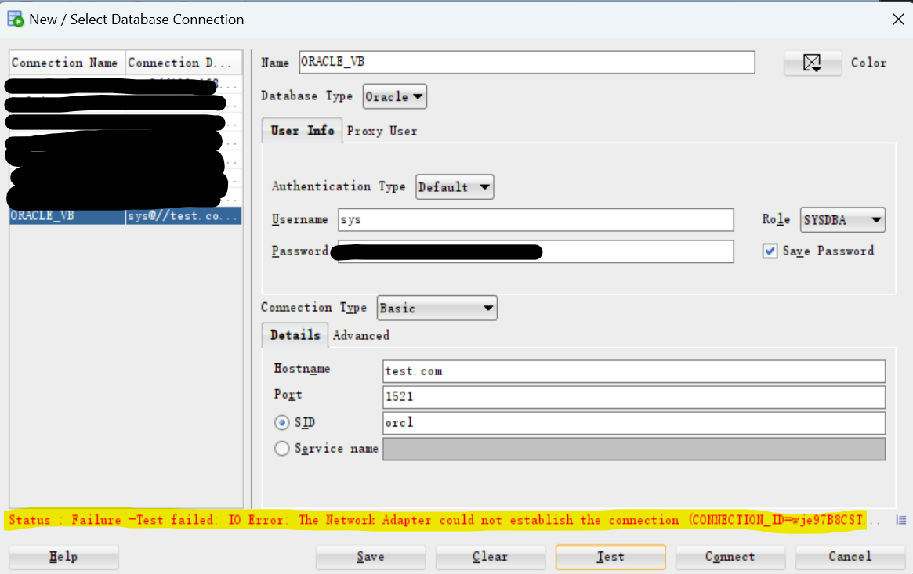

- Start listener
- Connect with SQL Deveopler: success

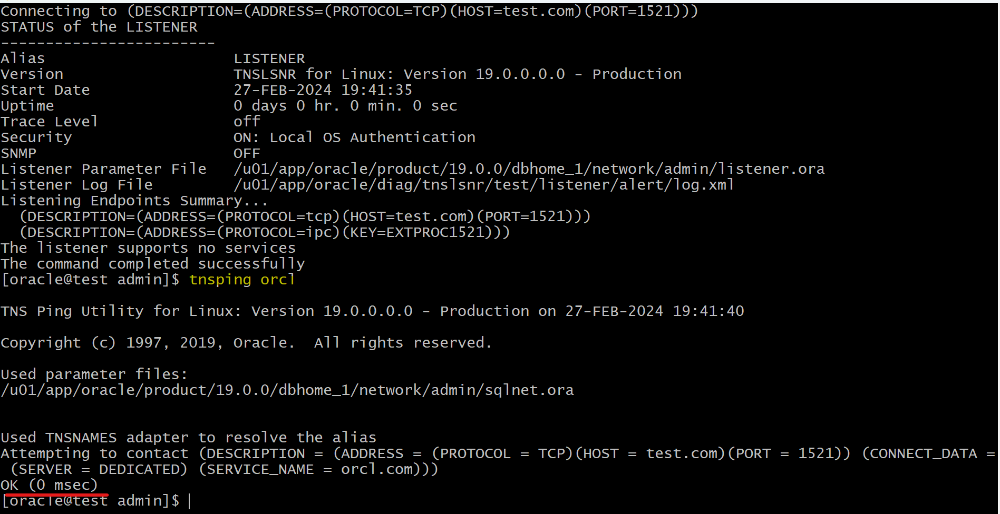

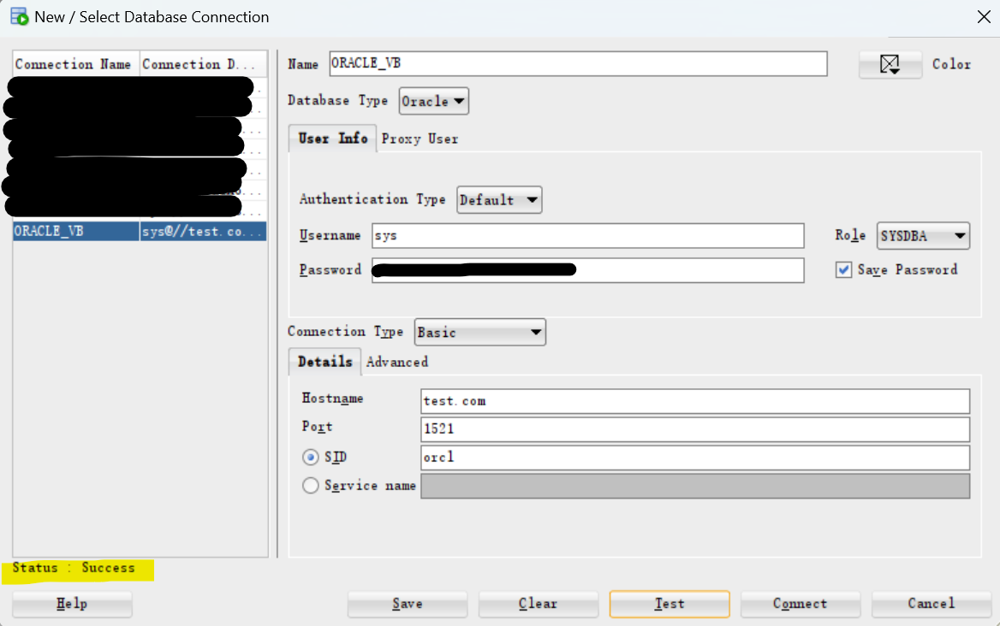

---

## Lab: Monitoring Listener

- `SERVICES` command
  - provides detailed information about the **services** and **instances** registered with a **listener** and the **service handlers** allocated to each instance.

```sh
# using default listener name LISTENER
lsnrctl SERVICES

# listener_name is the name of the listener defined in the listener.ora file.
lsnrctl SERVICES [listener_name]
```

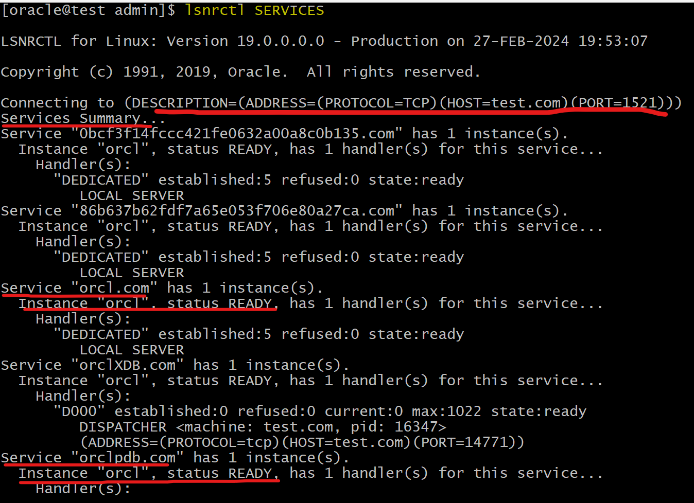

---


---

[TOP](#dba-net-service---listener)
