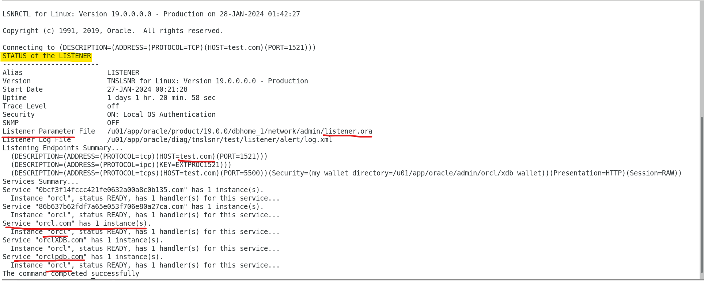
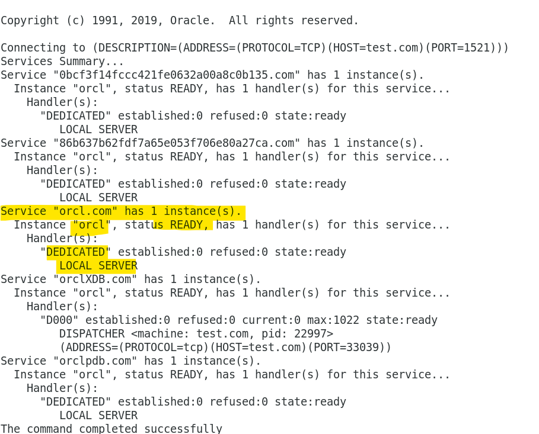

# DBA Net Service - Listener

[Back](../../index.md)

- [DBA Net Service - Listener](#dba-net-service---listener)
  - [Oracle Net Listener](#oracle-net-listener)
  - [Administering the Listener](#administering-the-listener)
  - [STATUS](#status)
  - [Monitoring](#monitoring)

---

## Oracle Net Listener

- `Oracle Net Listener`

  - a separate process that runs on the database server computer.
  - used to establish the initial connection with Oracle Database server
  - **receives** incoming client connection requests and **manages the traffic** of these requests to the database server
  - clients configured with the **same protocol address** can send connection requests to the listener.

- When a connection is **established**, the client and Oracle server communicate **directly** with one another. 建立联系后, 将直接对话.

- security:
  - supports `ACLs (Access Control Lists)` for service and this is supported for all IP protocols.

---

## Administering the Listener

- Using the `Listener Control Utility`

```sh
# using default listener name LISTENER
lsnrctl START
lsnrctl STOP

# listener_name is the name of the listener defined in the listener.ora file.
lsnrctl START [listener_name]
lsnrctl STOP [listener_name]
lsnrctl STATUS [listener_name]
```

---

## STATUS

- To show the status the listener

```sh
# using default listener name LISTENER
lsnrctl STATUS

# listener_name is the name of the listener defined in the listener.ora file.
lsnrctl STATUS [listener_name]
```

```conf
Connecting to (DESCRIPTION=(ADDRESS=(PROTOCOL=ipc)(KEY=net)))
STATUS of the LISTENER
------------------------
Alias                     LISTENER
Version                   TNSLSNR for Linux: Version 23.1.0.0.0
Start Date                15-JULY-2022 20:22:00
Uptime                    65 days 10 hr. 5 min. 22 sec
Trace Level               support
Security                  OFF
Listener Parameter File   /oracle/admin/listener.ora
Listener Log File         /oracle/network/log/listener.log
Listener Trace File       /oracle/network/trace/listener.trc
Listening Endpoints Summary...
  (DESCRIPTION=(ADDRESS=(PROTOCOL=ipc)(KEY=net)))
  (DESCRIPTION=(ADDRESS=(PROTOCOL=tcp)(HOST=sales-server)(PORT=1521)))
  (DESCRIPTION=(ADDRESS=(PROTOCOL=tcps)(HOST=sales-server)(PORT=2484)))

Services Summary...
Service "sales.us.example.com" has 1 instance(s).
  Instance "sales", status READY, has 3 handler(s) for this service...
Service "hr.us.example.com" has 1 instance(s).
  Instance "hr", status READY, has 2 handler(s) for this service...
The command completed successfully

```



---

## Monitoring

- `SERVICES` command
  - provides detailed information about the **services** and **instances** registered with a **listener** and the **service handlers** allocated to each instance.

```sh
# using default listener name LISTENER
lsnrctl SERVICES

# listener_name is the name of the listener defined in the listener.ora file.
lsnrctl SERVICES [listener_name]
```



---

[TOP](#dba-net-service---listener)
