# DBA - Net Service: Listener Control Utility

[Back](../../index.md)

- [DBA - Net Service: Listener Control Utility](#dba---net-service-listener-control-utility)
  - [Listener Control Utility](#listener-control-utility)
    - [Lab: Show current listener's information](#lab-show-current-listeners-information)
    - [Lab: Get Listener's status](#lab-get-listeners-status)
    - [Lab: Start and stop the Listener](#lab-start-and-stop-the-listener)
    - [Lab: Get Services](#lab-get-services)
    - [Lab: Connect with SQL Developer](#lab-connect-with-sql-developer)

---

## Listener Control Utility

- `Listener Control Utility`:
  - enables you to **administer listeners**

| Command    | Description                                    |
| ---------- | ---------------------------------------------- |
| `START`    | start the named listener.                      |
| `STOP`     | stop the named listener.                       |
| `STATUS`   | display basic status information               |
| `SERVICES` | obtain information about the database services |
| `RELOAD`   | reread the listener.ora file                   |
| `SHOW`     | view the current parameter values              |
| `VERSION`  | display the current version                    |

---

### Lab: Show current listener's information

```sh
show current listener
```

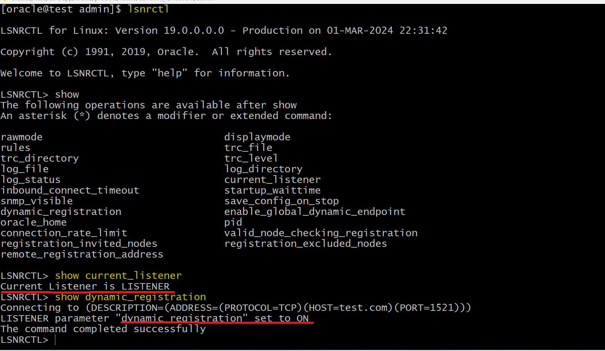

---

### Lab: Get Listener's status

- To show the status the listener

```sh
# using default listener name LISTENER
lsnrctl STATUS

# listener_name is the name of the listener defined in the listener.ora file.
lsnrctl STATUS [listener_name]
```

```conf
Connecting to (DESCRIPTION=(ADDRESS=(PROTOCOL=ipc)(KEY=net)))
STATUS of the LISTENER
------------------------
Alias                     LISTENER
Version                   TNSLSNR for Linux: Version 23.1.0.0.0
Start Date                15-JULY-2022 20:22:00
Uptime                    65 days 10 hr. 5 min. 22 sec
Trace Level               support
Security                  OFF
Listener Parameter File   /oracle/admin/listener.ora
Listener Log File         /oracle/network/log/listener.log
Listener Trace File       /oracle/network/trace/listener.trc
Listening Endpoints Summary...
  (DESCRIPTION=(ADDRESS=(PROTOCOL=ipc)(KEY=net)))
  (DESCRIPTION=(ADDRESS=(PROTOCOL=tcp)(HOST=sales-server)(PORT=1521)))
  (DESCRIPTION=(ADDRESS=(PROTOCOL=tcps)(HOST=sales-server)(PORT=2484)))

Services Summary...
Service "sales.us.example.com" has 1 instance(s).
  Instance "sales", status READY, has 3 handler(s) for this service...
Service "hr.us.example.com" has 1 instance(s).
  Instance "hr", status READY, has 2 handler(s) for this service...
The command completed successfully
```

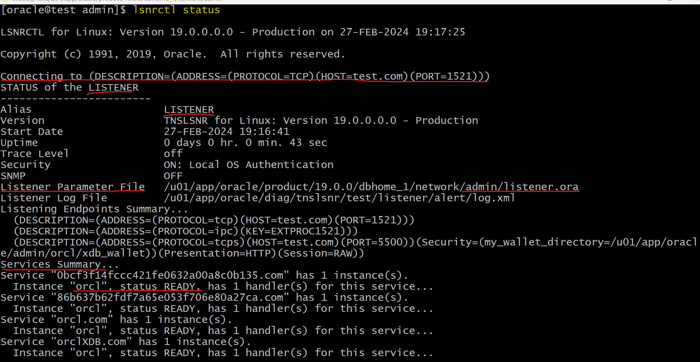

---

### Lab: Start and stop the Listener

- Stop Listener

```sh
# using default listener name LISTENER
tnsping orcl
lsnrctl STOP
# lsnrctl STOP [listener_name]
# listener_name is the name of the listener defined in the listener.ora file.
tnsping orcl
```

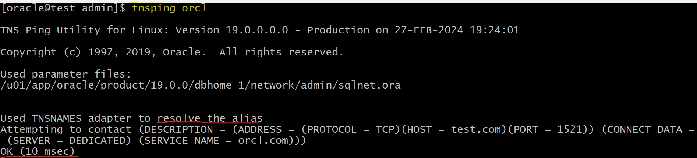

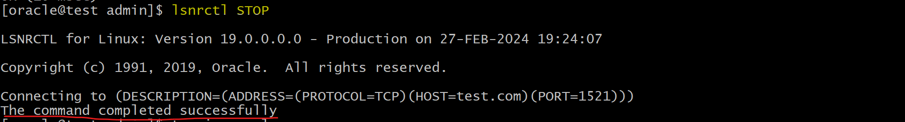

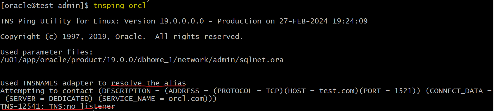

---

- Start listener:
  - note: when starting listener, it will prompt that `The listener supports no servers`.
    - This is because it takes 60 seconds for LREG to register.
    - After 60 seconds, it will show all the registered services.

```sql
tnsping orcl
lsnrctl START
# lsnrctl START [listener_name]
tnsping orcl

```

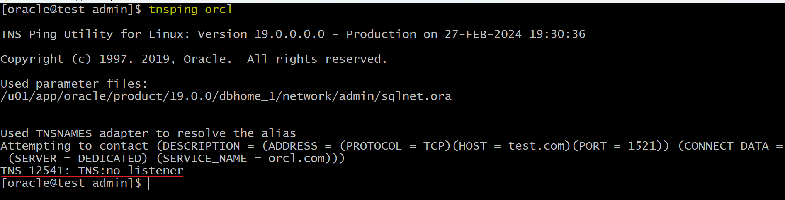
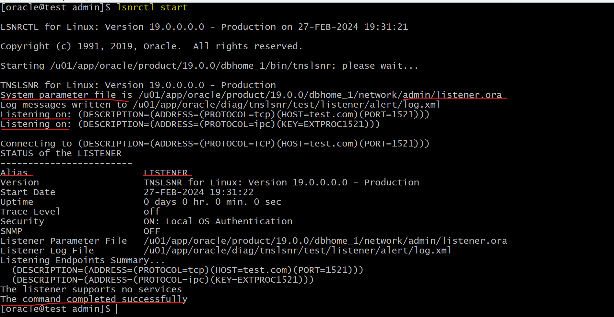
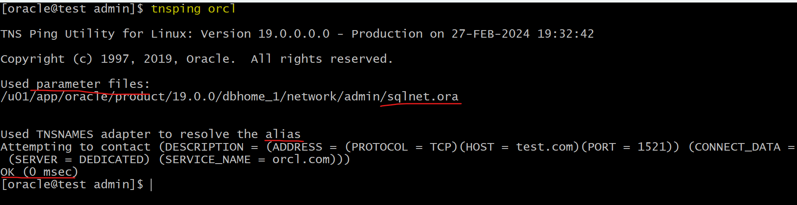

---

### Lab: Get Services

- `SERVICES` command
  - provides detailed information about the **services** and **instances** registered with a **listener** and the **service handlers** allocated to each instance.

```sh
# using default listener name LISTENER
lsnrctl SERVICES

# listener_name is the name of the listener defined in the listener.ora file.
lsnrctl SERVICES [listener_name]
```

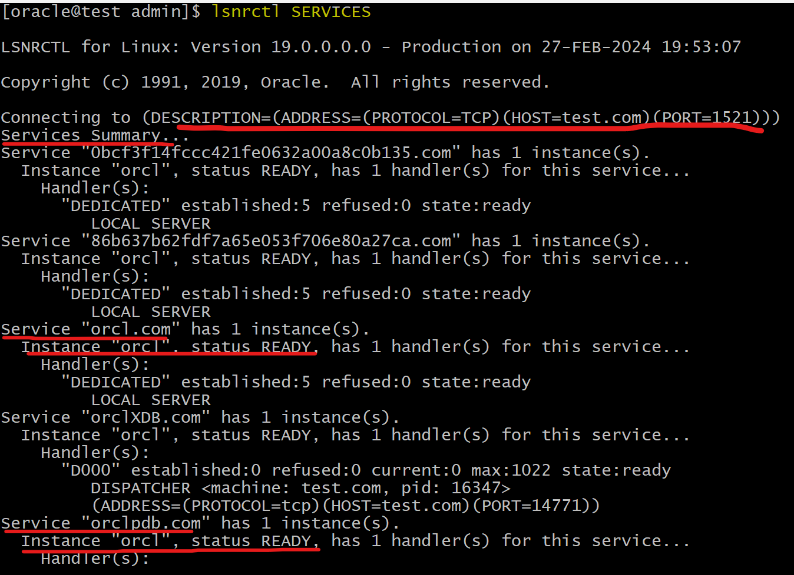

---

### Lab: Connect with SQL Developer

- Stop listener
- Connect with SQL Deveopler
  - Error: `Status : Failure -Test failed: IO Error: The Network Adapter could not establish the connection (CONNECTION_ID=wje97B8CSTK2k9fqv37Kjg==)`

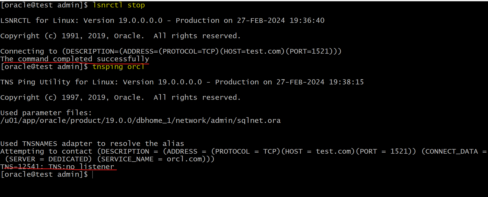

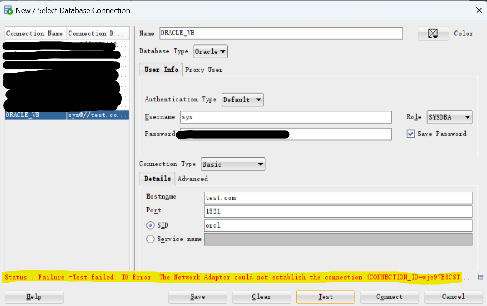

- Start listener
- Connect with SQL Deveopler: success

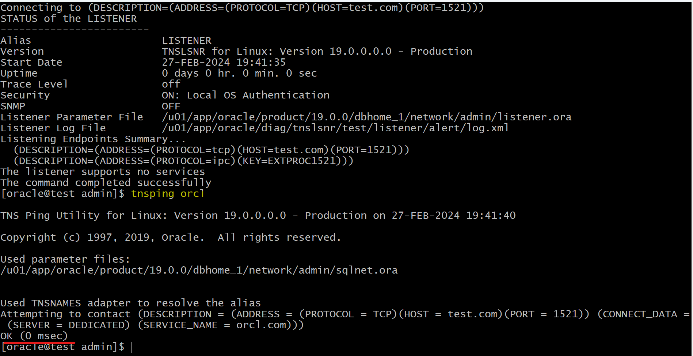

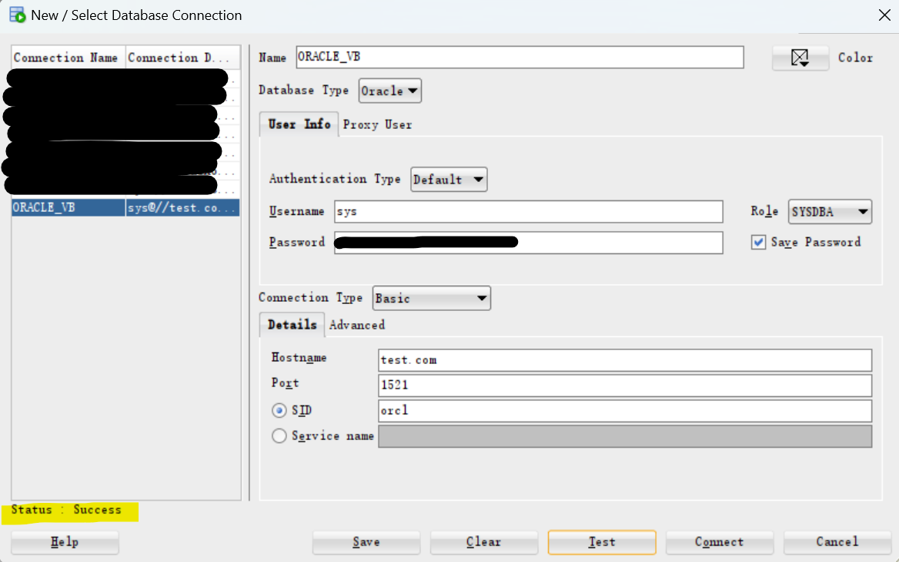

---

[TOP](#dba---net-service-listener-control-utility)
