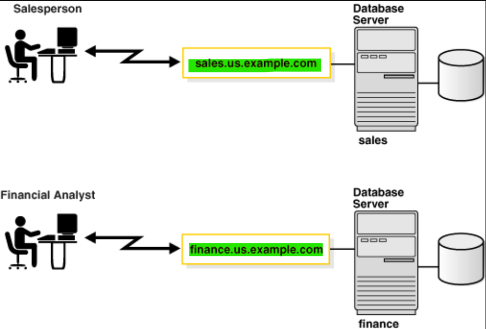

# DBA - Net Service

[Back](../../index.md)

- [DBA - Net Service](#dba---net-service)
  - [Oracle Net](#oracle-net)
  - [Establishing a Connection and Session](#establishing-a-connection-and-session)
  - [Database Identification](#database-identification)
    - [Instance Name](#instance-name)
    - [Services Name](#services-name)
    - [Instance Name vs Service Name](#instance-name-vs-service-name)
    - [Service Name \& Net service](#service-name--net-service)
  - [Connecting to a Database Service](#connecting-to-a-database-service)
    - [Connect descriptor](#connect-descriptor)
    - [Naming Methods](#naming-methods)
      - [Types of Naming Methods](#types-of-naming-methods)
      - [Choosing a Naming Method](#choosing-a-naming-method)
      - [Configuration Steps](#configuration-steps)
      - [Connection process](#connection-process)
      - [Local Naming: `tnsnames.ora`](#local-naming-tnsnamesora)
  - [Localized Management](#localized-management)

---

## Oracle Net

- `Oracle Net`

  - a software layer that resides **on the client** and **on the Oracle Database server**.
  - used to **establish and maintain the connection** between the client application and server, as well as exchanging messages between them, using industry-standard protocols.

- Oracle uses 2 main files for network confguration:
  - `listener.ora`: which defines listeners.
  - `tnsname.ora`: which defines the Net service names.

---

## Establishing a Connection and Session


- 1. the listener receives connect packet.
- 2. if the `service name` is valid then the Listener create `Dedicated SP`, else it will be Error. 监控只会检查服务名.
- 3. the listener connect to the SP and pass the `initialization info` to it.
  - `initialization info` includes user name and pwd for authentication.
- 4. the **SP check the authentication** , if ok Then it create session. 是 sp 认证
- 5. now the SP is acting like **Agent**.

---

## Database Identification

- Understand how databases are identified.

### Instance Name

- `Instance Name`:

  - used to **identify** instance
  - specified by the `INSTANCE_NAME` initialization parameter.

- Default value:
  - `Oracle system identifier (SID)` of the database instance



> - e.g.: **sales** and **finance**. (`us.example.com` is the hostname)

- A running database has at least one `instance`.
  - has at least one `instance name`.
  - can have multiple `instance name`.
  - The combination of `DB_NAME` and `INSTANCE_NAME` forms a **unique identifier** for an instance within a database.

---

- Command to return instance name

```sql
SHOW PARAMETER INSTANCE_NAME;
SELECT instance_name FROM v$isntacnes;
```


---

- multiple computers to **share access** architectures
  - `Oracle Real Application Clusters (Oracle RAC)` allow multiple instances on different computers that share a single physical database.
  - e.g.: two instances, sales1 and sales2, are associated with one database service, sales.us.example.com.


---

### Services Name

- `Database Services`

  - An Oracle database represented to clients. 从用户的角度: db = service.
  - A database can have one or more services associated with it.一个 DB 有多个服务.

- `service name`

  - a **logical representation** of a database.
  - specified by the `SERVICE_NAMES` initialization parameter in the server parameter file.
  - Defaults value:
    - the `global database name`, a name comprising
      - `database name` (`DB_NAME` initialization parameter)
      - `domain name` (`DB_DOMAIN` initialization parameter).

- A `database` can have **multiple** `service names`.
- Associating **multiple** services with **one** `database` enables the following functionality:

  - A single database can be identified different ways **by different clients**.
  - A database administrator can **limit or reserve system resources**.
    - This level of control enables better allocation of resources to clients requesting one of the services.

- For an instance:
  - When an instance starts, it **registers** itself with a `listener` **using one or more service names**.使用服务名注册实例
- For client:

  - When a client program or database connects to a listener, it **requests a connection to a service**. 使用服务名请求连接.

- Command to return service name

```sql
SHOW PARAMETER service_names;
# orcl
SHOW PARAMETER db_name;
# com
SHOW PARAMETER db_domain;
# orcl.com

SELECT name FROM v$database;
# orcl.com
SELECT name FROM v$services;
# ORCL
SELECT * FROM GLOBAL_NAME;
# ORCL.COM
```


---


> - Three Web browsers connecting to the same database server.
>   - two Web browsers are connecting to the `book.us.example.com` service.Here service name of the database is book, host name is us.example.
>   - the other Web browser is connecting to the `soft.us.example.com` service. Here service name of the database is soft, host name is us.example.
>   - Both services are associated with the same database.

---

### Instance Name vs Service Name

- 无对应关系

- A `service name` can identify **multiple** `database instances`
- An `instance` can belong to **multiple** `services`.
- 结果: 服务名与实例名没有必然联系. 关键的是 DB. 而关键是连接到对应的 DB, 即使用服务名即可.
  - the listener acts as a **mediator** between the client and instances and **routes** the connection request to the **appropriate instance**. 监听器是用于路由请求到适当的实例.
  - Clients connecting to a service **need not specify which instance they require**. 用户的连接请求无需包括实例.

---

### Service Name & Net service

- The service name is used to register itself with a listener.
  - Listener can map a request to the specific database.


> - `tnsname.ora`: define a Net service named "orcl" using a descriptor, to map this "**orcl**" to a database with a service name "**orcl\.com**".
> - When client establish a connection using a connection string that contains this "orcl" net service, listener will map this request to the database with a service name "**orcl\.com**".

- The `listener registration process (LREG)` **registers** information about the database instance and `dispatcher processes` with the `Oracle Net Listener`.

---

## Connecting to a Database Service

### Connect descriptor

- `connect descriptor`

  - allow client to establish connection to a database service.
  - used to map to a database.
  - contains detailed information of a connection between a client and an Oracle database.
  - provides the **location of the database** and the **name of the database service**.

- **Components**

  - **Host Name (Hostname)**:
    - the **network location** where the Oracle database server is running.
    - either the `host name` or `IP address`
  - **Port Number:**
    - The port number on which the `Oracle Listener` is **listening** for incoming connection requests.
    - The default port is `1521`.
  - **Service Name**:
    - The name of the Oracle database service to which the client wants to connect.
    - defined in the database's `listener.ora` file.
  - **Protocol**:
    - The network protocol to be used for communication
    - e.g.: `TCP/IP` or `IPC (Inter-Process Communication)`.

- **Use case:**
  - **TNS (Transparent Network Substrate) Entries**, stored in the `tnsnames.ora` file
  - **JDBC Connection Strings**, used in Java Database Connectivity (JDBC) applications
  - **Easy Connect**, a simplified way to specify connect descriptors without the need for a separate `tnsnames.ora` file

---

- Example of **Easy Connect descriptor**:

```conf
sales-server/sales.us.example.com
```

- **database service name**: `sales.us.example.com`
- **host**: `sales-server`
- **default port**: `1521`

- the entry in the `tnsnames.ora` file for the preceding `Easy Connect connect descriptor` and `database service`

- The entry in the tnsnames.ora

```conf
(DESCRIPTION=
  (ADDRESS=(PROTOCOL=tcp)(HOST=sales-server)(PORT=1521))
  (CONNECT_DATA=
    (SERVICE_NAME=sales.us.example.com)))

```

---

### Naming Methods

- `connect string`

  - used by users to initiate a connection request
  - includes
    - user name
    - password
    - connect identifier

- `connect identifier` can be

  - the `connect descriptor`
  - or a **name that resolves to** a `connect descriptor`.

- Example

```sql
# a connect string that has a complete connect descriptor as the connect identifier instead of a network service name.
CONNECT hr@(DESCRIPTION=(ADDRESS=(PROTOCOL=tcp)(HOST=sales-server1)
(PORT=1521))(CONNECT_DATA=(SERVICE_NAME=sales.us.example.com)))

# connect identifiers is a network service name, a simple name for a service.
# uses network service name sales as the connect identifier
# connection processing takes place by first mapping sales to the connect descriptor.
CONNECT hr@sales
```

- `naming method`
  - a resolution method used by a client application to **resolve** a `connect identifier` to a `connect descriptor` when attempting to connect to a database service.
  - the method access to the mapped information about how to **map** a `connect identifier` to a `connect desriptor`. 如何将 map 信息存储的方法.

---

#### Types of Naming Methods

- `Local naming`:

  - Stores network service names and their connect descriptors in a localized configuration file named `tnsnames.ora`

- `Directory naming`:

  - Stores connect identifiers in a **centralized LDAP-compliant directory server** to access a database service.

- `Easy Connect naming`:

  - Enables clients to connect to an Oracle database server by **using a TCP/IP connect string** consisting of a **host name** and optional **port** and **service name**.

- `Easy Connect Plus naming`

- `Centralized Configuration Provider naming`:
  - Stores connect descriptors or database credential references in a **Centralized Configuration Provider**
  - such as Azure App Configuration store or OCI Object Storage as a JSON file.

---

#### Choosing a Naming Method

- Depends upon the size of the organization
  - a small organization with only a few databases
    - `Easy Connect naming`:
      - to make TCP/IP connections with the host name of the database server
    - `local naming`:
      - to store names in tnsnames.ora file on the clients.
  - large organizations with several databases
    - `directory naming`:
      - to store names in a **centralized directory server**.
  - an Internet network
    - configure the application web servers needed to connect to the databases with the `local naming method`.

---

#### Configuration Steps

- 1. Select a naming method.
- 2. **Map** `connect descriptors` to the **names** or to a `connect identifier`.
- 3. Configure clients to use the naming method.

---

#### Connection process

- A typical **process** for establishing a client session using a naming method is as follows:
  - 1. The client **initiates a connect request** by providing a `connect identifier`.
  - 2. The `connect identifier` is **resolved** to a `connect descriptor` **by a naming method**.
  - 3. The client makes the connection **request to the address** provided in the `connect descriptor`.
  - 4. A `listener` receives the request and **directs** it to the appropriate database server.
  - 5. The connection is **accepted** by the `database server`.

---

#### Local Naming: `tnsnames.ora`

- `local naming`

  - to store names in `tnsnames.ora` file on the clients.

---

## Localized Management

- When `localized management` is used, network computers are **configured with the files**:

| File           | Locate                                        | Description                                                                                                                                                                                 |
| -------------- | --------------------------------------------- | ------------------------------------------------------------------------------------------------------------------------------------------------------------------------------------------- |
| `tnsnames.ora` | clients                                       | Contain mapping info. local naming method.                                                                                                                                                  |
| `sqlnet.ora`   | client+db server                              | Contain Client domain, Order of naming methods, Logging and tracing features, Route of connections, External naming parameters, security parameters, and Database access control parameters |
| `listener.ora` | db server                                     | Contain Protocol addresse, listening services, Control parameters                                                                                                                           |
| `cman.ora`     | computer where Oracle Connection Manager runs | Contain listening endpoint, Access control rule list,Parameter list                                                                                                                         |

- Typical path of Configuration files:

  - `$ORACLE_HOME/network/admin`
  - `ORACLE_BASE_HOME/network/admin` for a read-only Oracle home

- Oracle Net checks the other directories for the configuration files.
  - the order for checking the tnsnames.ora file:
    - 1. the path specified by the `$TNS_ADMIN` environment variable.
    - 2.
      - 1. `$ORACLE_HOME/network/admin` environment variable;
      - 2. for a read-only Oracle home:
        - `$ORACLE_BASE_HOME/network/admin`
        - `$ORACLE_HOME/network/admin`

---

[TOP](#dba---net-service)
