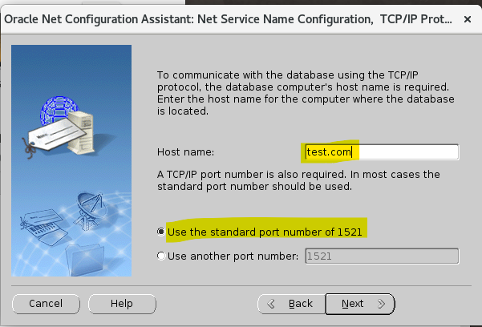

# DBA - Net Service - Oracle Net Configuration Assistant (netca)

[Back](../../index.md)

- [DBA - Net Service - Oracle Net Configuration Assistant (netca)](#dba---net-service---oracle-net-configuration-assistant-netca)
  - [Oracle Net Configuration Assistant (netca)](#oracle-net-configuration-assistant-netca)
    - [Lab: Create a new listener](#lab-create-a-new-listener)
    - [Lab: Remove a new listener](#lab-remove-a-new-listener)
    - [Lab: Create a tnsname](#lab-create-a-tnsname)

---

## Oracle Net Configuration Assistant (netca)

- `Oracle Net Configuration Assistant`:
  - a graphical, wizard-based tool used to configure and manage Oracle Network configurations.

---

### Lab: Create a new listener

- When launch netca, backup files for listener, tnsnames, and sqlnet are created.

- Sevices map to file

---

### Lab: Remove a new listener

---

### Lab: Create a tnsname

---

[TOP](#dba---net-service---oracle-net-configuration-assistant-netca)
