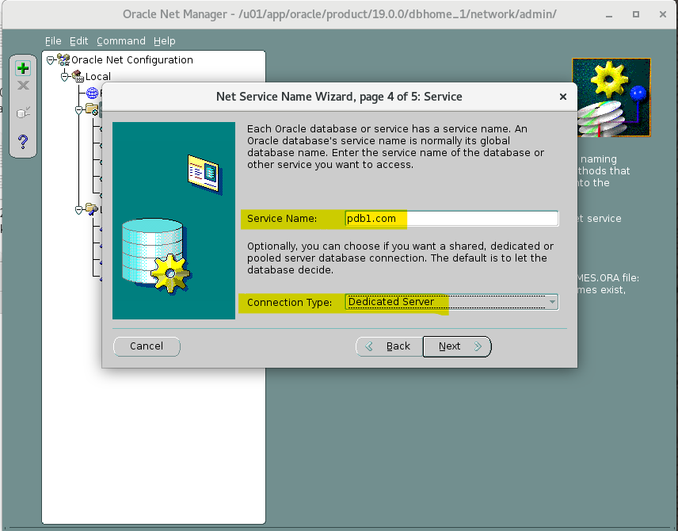

# DBA - Net Service - Oracle Net Manager (netmgr)

[Back](../../index.md)

- [DBA - Net Service - Oracle Net Manager (netmgr)](#dba---net-service---oracle-net-manager-netmgr)
  - [Oracle Net Manager (netmgr)](#oracle-net-manager-netmgr)
    - [Lab: Create new listener](#lab-create-new-listener)
    - [Lab: Create new tnsname](#lab-create-new-tnsname)

---

## Oracle Net Manager (netmgr)

- `Oracle Net Manager (netmgr)`:
  - a tool that assists you in **creating the configuration files** needed for Oracle networking products.

---

### Lab: Create new listener

---

### Lab: Create new tnsname

---

[TOP](#dba---net-service---oracle-net-manager-netmgr)
