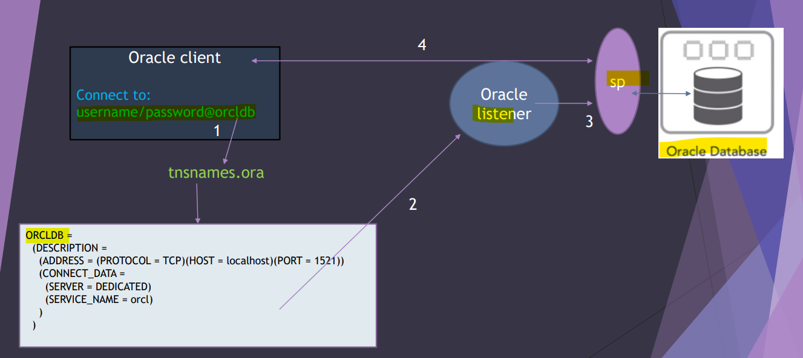
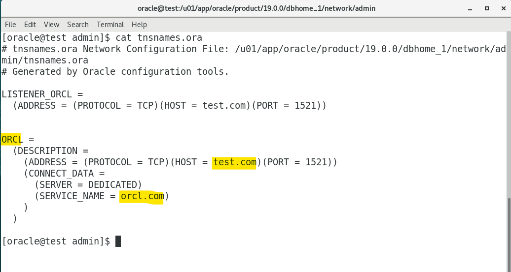
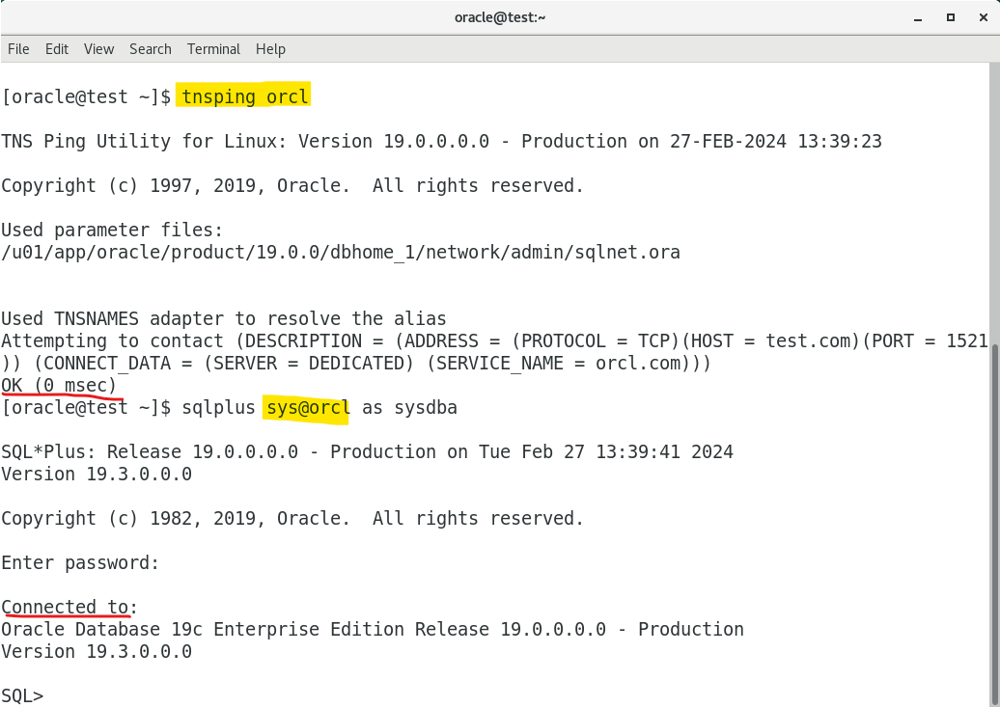
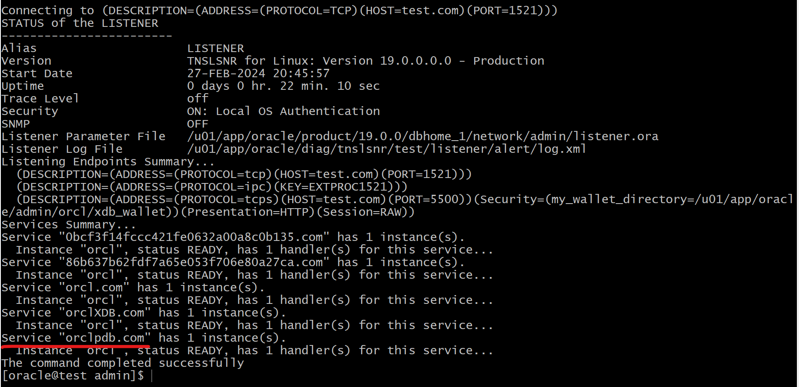
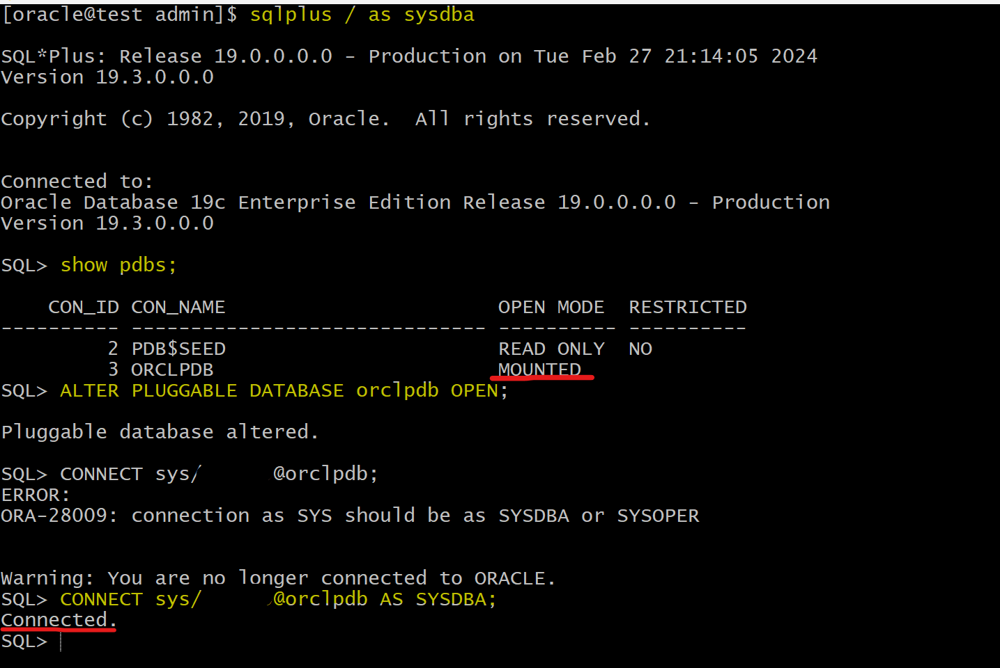
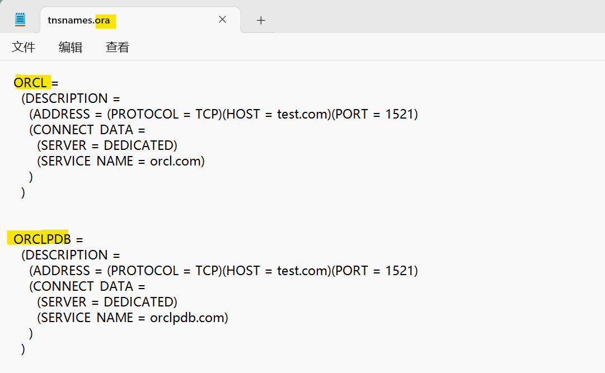
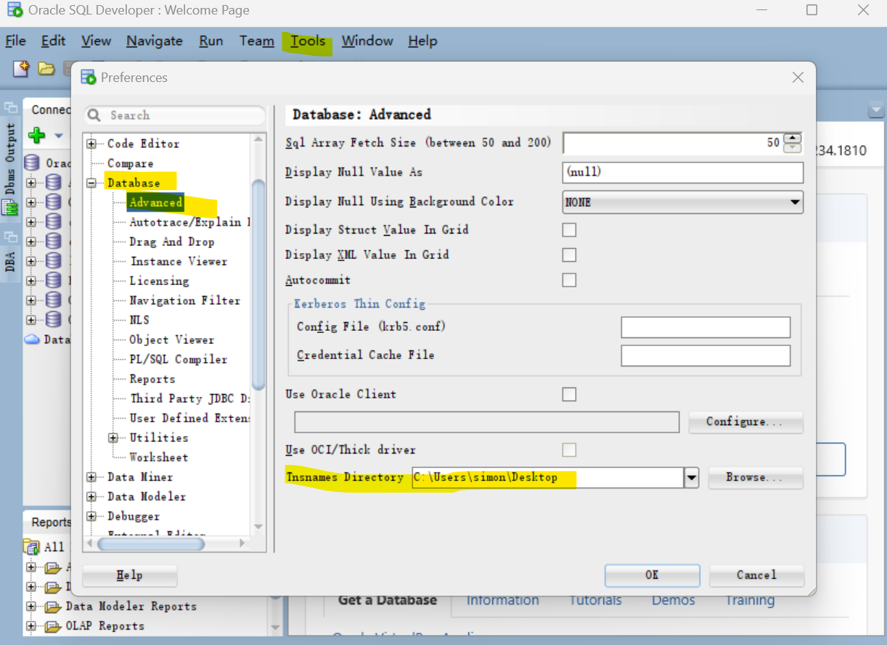
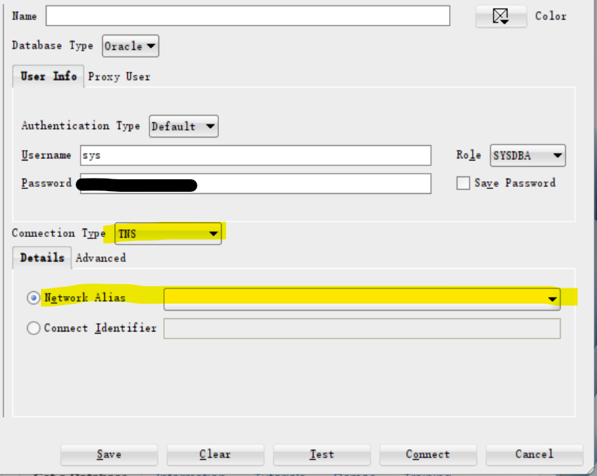
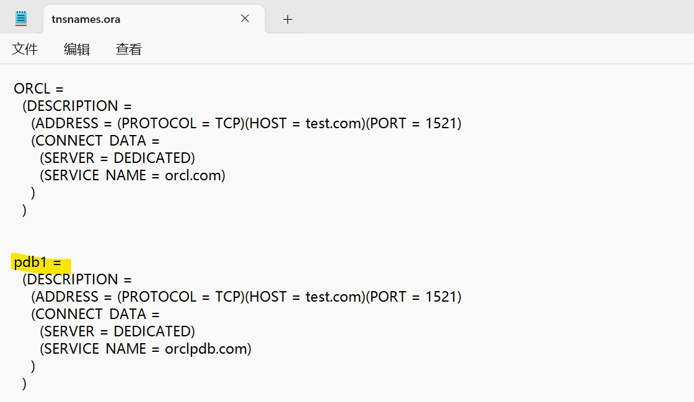

# DBA Net Service - `tnsnames.ora` File

[Back](../../index.md)

- [DBA Net Service - `tnsnames.ora` File](#dba-net-service---tnsnamesora-file)
  - [Client Connection](#client-connection)
  - [`tnsnames.ora` File](#tnsnamesora-file)
  - [Connect using a Connection String](#connect-using-a-connection-string)
  - [Lab: Connect using Connection String](#lab-connect-using-connection-string)
  - [Lab: Create TNS name for PDB](#lab-create-tns-name-for-pdb)
  - [Lab: Connect with SQL Developer using TNS Name](#lab-connect-with-sql-developer-using-tns-name)

---

## Client Connection



- 1. To connect with DB, Client uses a `connection string` containing a tnsname.
- 2. The Oracle client will go to the `tnsname.ora` to find the detail information about the `connect descriptor`, specially the host name and the service name. Then, the information will be sent to the `Oracle listener`.
- 3. `Oracle listener` will check whether the information is a valid.
- 4. If the connection information is valid, the `Oracle listener` will create a `server process` to deal with the Oracle instance and database.

  - This `server process` is **responsible for all the client requests**.

- After the `server process` is created by `Oracle Listener`, there is no need for `Oracle Listener`.
  - If the Oracle Listener is **stopped**, the **session** has been created will **be still connected and valid**.
  - If the client **closes the session** and tried to open the session again, the Oracle Listener should be up and running.
  - 即监听器相当于门卫, 一旦认证, 则 session 持续有效; 但 session 结束, 则需要重新认证.

---

## `tnsnames.ora` File

- `tnsnames.ora`

  - can exist in the both client and server sides as client style.
  - a **configuration file** in Oracle Database that **stores** `net service names` **mapped** to `connect descriptors` for establishing connections to Oracle databases.

- Oracle client will need to know the following:

  - The **hostname** where is the listener is running
  - **Port** number
  - Listener **protocol**
  - **Name of the service** that the listener is handling

---

- Example:

```conf
# tnsnames.ora Network Configuration File: /u01/app/oracle/product/19.0.0/dbhome_1/network/admin/tnsnames.ora
# Generated by Oracle configuration tools.

# Lo
LISTENER_ORCL =
  (ADDRESS = (PROTOCOL = TCP)(HOST = test.com)(PORT = 1521))


ORCL =
  (DESCRIPTION =
    (ADDRESS = (PROTOCOL = TCP)(HOST = test.com)(PORT = 1521))
    (CONNECT_DATA =
      (SERVER = DEDICATED)
      (SERVICE_NAME = orcl.com)
    )
  )


#################################################
# LISTENER_ORCL: local listener
# ORCL:     A TNS name entry

#################################################
# ADDRESS section
#   PROTOCOL parameter: identifies the listener protocol address
#   HOST parameter:     identifies the host name.
#   PORT parameter:     identifies the port. Default = 1521
#   HTTPS_PROXY and HTTPS_PROXY_PORT parameters:
#           Optional, allow the database client connection to traverse through the organization’s forward web proxy.
#           applicable only to the connect descriptors where PROTOCOL=TCPS.
#################################################
# CONNECT_DATA section:
#   SID parameter:          identifies the system identifier (SID) of the Oracle database.
#   SERVICE_NAME parameter  identifies the service. SERVICE_NAMES initialization parameter, typically the global database name
#   INSTANCE_NAME parameter optional, identifies the database instance. useful for an Oracle RAC configuration
#   SERVER parameter        identifies the service handler type.
#        DEDICATED, default value. a dedicated server process is assigned to each user session, providing isolation and dedicated resources for that connection.
#       SHARED, multiple client connections share a common server process.
#       POOLED, typically associated with Oracle Connection Manager. The pool contains shared server processes that are dynamically allocated to client connections as needed.
```

- Usage:

```sql
-- Command uses a connect string that has a complete connect descriptor as the connect identifier instead of a network service name.
CONNECT hr@(DESCRIPTION=(ADDRESS=(PROTOCOL=tcp)(HOST=sales-server1)
(PORT=1521))(CONNECT_DATA=(SERVICE_NAME=sales.us.example.com)))

-- command uses a connect string that uses network service name sales as the connect identifier
CONNECT hr@sales
CONNECT hr/password@sales   # here sales represent the tnsname entry in the client machine.
```

---

## Connect using a Connection String

- format of connection string

```sql
CONNECT username@connect_identifier
```

- Default `Connect Identifier`

  - Linux and UNIX:
    - `TWO_TASK` environment variable
  - Microsoft Windows:
    - `LOCAL` environment variable
  - Usage:
    - if `TWO_TASK = sales`
    - then `CONNECT username` = `CONNECT username@sales`

- `Connect identifiers` used in a connect string **cannot contain spaces** unless enclosed within single quotation marks (') or double quotation marks (").
  - Single quotation marks are required if double quotation marks are used in a connect identifier.
  - Double quotation marks are required if single quotation marks are used in a connect identifier.

```sh
CONNECT scott@'(DESCRIPTION=(ADDRESS=(PROTOCOL=tcp)(HOST=sales-server)
(PORT=1521))(CONNECT_DATA=(SERVICE_NAME=sales.us.example.com)))'

CONNECT scott@'cn=sales, cn=OracleContext, dc=us, dc=example, dc=com'

CONNECT scott@'sales@"good"example.com'
CONNECT scott@"cn=sales, cn=OracleContext, ou=Mary's Dept, o=example"
```

---

## Lab: Connect using Connection String

- Using net service name defined in the `tnsname.ora` to connect with database.





---

## Lab: Create TNS name for PDB

- Get the registered pdb service name from listener



- Add entry in `tnsname.ora` file

```config
ORCLPDB =
  (DESCRIPTION =
    (ADDRESS = (PROTOCOL = TCP)(HOST = test.com)(PORT = 1521))
    (CONNECT_DATA =
      (SERVER = DEDICATED)
      (SERVICE_NAME = orclpdb.com)
    )
  )

```

- Login PDB

```sql
sqlplus /  as sysdba

show pdbs;    # confirm the pdb is open
ALTER PLUGGABLE DATABASE orclpdb OPEN;    # open target pdb
CONNECT sys/pwd@orclpdb AS SYSDBA;    # connect to pdb
show con_name   # confirm it is in the pdb
```



---

## Lab: Connect with SQL Developer using TNS Name

- remember: even though the tns names are defined in the server, it is client style(act like a client).
- Actually, tns name can be used in the client side.

- Copy tnsname to local file "tnsnames.ora"



- Open SQL developer > tool > Preferences > Database > Advanced > Tnsnames Directory



- Create new connection



> unknow reason cannot load tns names. Skip

- The TNS name, the alias, in the client side can be changed.



---

[TOP](#dba-net-service---tnsnamesora-file)

