# DBA - Physical Storage Architecture: Data File

[Back](../../index.md)

- [DBA - Physical Storage Architecture: Data File](#dba---physical-storage-architecture-data-file)
  - [Data File](#data-file)
  - [Use of Data Files](#use-of-data-files)
  - [Permanent and Temporary Data Files](#permanent-and-temporary-data-files)
  - [Online and Offline Data Files](#online-and-offline-data-files)
  - [Data File Structure](#data-file-structure)
  - [Views: Data File](#views-data-file)
    - [Lab: Query Data File](#lab-query-data-file)
      - [`CDB_DATAFILES`: Include all open PDB](#cdb_datafiles-include-all-open-pdb)
      - [`DBA_DATA_FILES`: Current Container](#dba_data_files-current-container)
      - [`v$datafile`: including closed PDB](#vdatafile-including-closed-pdb)
  - [Views: Temp File](#views-temp-file)
    - [Lab: Query Temp File](#lab-query-temp-file)
      - [`CDB_TEMP_FILES`: Include all open PDB](#cdb_temp_files-include-all-open-pdb)
      - [`DBA_TEMP_FILES`: Current Container](#dba_temp_files-current-container)
      - [`V$TEMPFILE`](#vtempfile)

---

## Data File

- `data files`:
  - the structure where the data is stored.
  - Every Oracle database **must have at least one** data file.

---

## Use of Data Files

- Oracle Database **physically stores `tablespace` data** in `data files`. 存储表空间数据.

- Each `nonpartitioned schema object` and each `partition` of an object is stored in its own `segment`, which belongs to only one `tablespace`.

  - For example, the data for a **nonpartitioned table** is stored in a **single** `segment`.
  - `Segment` is stored in one `tablespace`.
  - 即 schema object 对应一个 segment; segment 对应唯一的 tbsp

- `TBSP` vs `data file`
  - Each `tablespace` consists of one or more `data files`. 一个 tbsp 对应一个或多个 df
  - The **data** for a database is collectively stored in the `data files` located in each tablespace of the database. 数据在 df 中.
  - A `segment` can span one or more `data files`, but it **cannot span multiple** `tablespaces`. segment 可以跨 df, 但不能跨 tbsp.
  - A database must have the `SYSTEM` and `SYSAUX` tablespaces.
    - Oracle Database automatically **allocates the first** `data files` of any database for the `SYSTEM` tablespace **during database creation**.创建时, 先创建 SYSTEM tbsp 的 df.
    - The `SYSTEM` tablespace contains the `data dictionary`, a set of tables that contains database metadata.
    - Typically, a database also has an `undo tablespace` and a `temporary tablespace` (usually named `TEMP`).

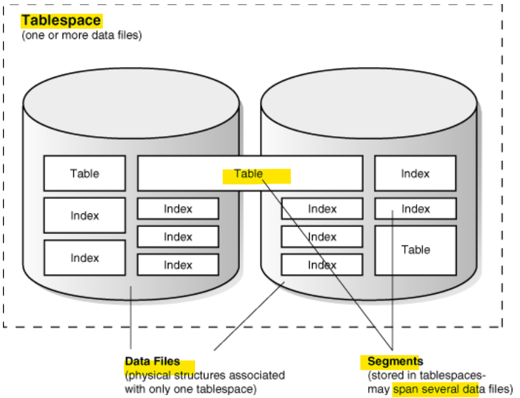

> - One tbsp
> - 2 DF: 一个 tbsp 可以多个 DF
> - segment:
>   - index 和 table 都是对象, 对应相应的 segment
>   - segment 可以跨 df
>   - segment 在一个 tbsp 之下.

---

## Permanent and Temporary Data Files

- Permanent Data Files

  - files designed to store objects(**persistent** `schema objects`) in **permanent** `tablespaces`.
  - 与 permanent tbsp 关联

- Temporary Data Files

  - files designed to store data in hash, sort, and other operations to manage **temporary** `tablespaces`
    - A **temporary** `tablespace` contains schema objects **only for the duration of a session**.
    - also **store result set data** when **insufficient space exists in memory**.

- `Temp files` vs `permanent data files`

  - **Permanent** database objects such as tables are **never stored** in `temp files`.
  - Temp files are always set to `NOLOGGING` mode
    - never have `redo` generated for them.
    - Media recovery **does not recognize** `temp files`.
  - **cannot** make a temp file **read-only**.
  - **cannot create** a temp file with the `ALTER DATABASE` statement.
  - When you create or resize temp files, they **are not always guaranteed allocation of disk space** for the file size specified.
    - On file systems such as Linux and UNIX, temp files are created as sparse files. In this case, disk blocks are allocated not at file creation or resizing, but as the blocks are accessed for the first time.

- Views:

|                          | TEMP             | Permenant        |
| ------------------------ | ---------------- | ---------------- |
| dynamic performance view | `V$TEMPFILE`     | `V$DATAFILE`     |
| data dictionary view     | `DBA_TEMP_FILES` | `DBA_DATA_FILES` |

- 永久归永久
- 暂时:
  - 不能存永久对象
  - 不能只读
  - 不使用 alter db 语句创建
  - nolog: 没有 redo;恢复时无法识别
  - 不保证使用磁盘空间.

---

## Online and Offline Data Files

- Every `data file` is either **online (available)** or **offline (unavailable)**.

- The database **cannot access** `offline data files` until they are brought online.离线 df 不能访问

  - can alter the availability of individual data files or temp files by taking them offline or bringing them online.可以改变状态.

- The database takes a data file offline **automatically** if the database **cannot write to it**.

- Reason to be taken offline:

  - perform offline backups
  - block corruption

- TBSP: offline/online

  - When a data file is taken offline in an online tablespace, the tablespace itself remains online. 其中一个 df 离线, 不影响 tbsp 在线状态
  - can make **all** `data files` of a tablespace temporarily unavailable by taking the `tablespace` itself offline. tbsp 离线, 全部 df 离线.

- Move df:
  - statement: `ALTER DATABASE MOVE DATAFILE`
  - can move an online data file from one physical file to another while the database is open and accessing the file.可以在打开并连线时移动.
  - purpose:
    - Move a tablespace **from one kind of storage to another**
    - Move data files that are **accessed infrequently** to lower cost storage
    - Make a tablespace **read-only** and move its data files to **write-once** storage, such as a `write once read many (WORM)` drive
    - Move a database into Oracle `ASM`

---

## Data File Structure

- `data file header`

  - contains **metadata** about the `data file`
    - e.g., its size and checkpoint SCN.
  - Each header contains
    - **an absolute file number**, which uniquely identifies the data file **within the database**,
    - **a relative file number**, which uniquely identifies a data file **within a tablespace.**
  - 绝对文件号: 在数据库中分别文件; 相对: 在 tbsp 中分别文件.

- creation of a data file for a tablespace

  - allocat the specified amount of **disk space** plus the **overhead** for the `data file header`.
  - the allocated disk space is formatted but contains **no** `user data`.
  - **reserves** the space to hold the data for future `segments` of the associated tablespace.

- As the data grows in a tablespace:

  - Oracle Database uses the free space in the data files to allocate `extents` for the `segment`.

- types of space in a data file:
  - `Extents` are
    - either **used**, which means they **contain segment data**,
    - or **free**, which means they are **available** for reuse.
  - `fragmented free space`
    - empty space that individually are not large enough to be reused for new data
    - Over time, updates and deletions of objects within a tablespace can create `fragmented free space`.

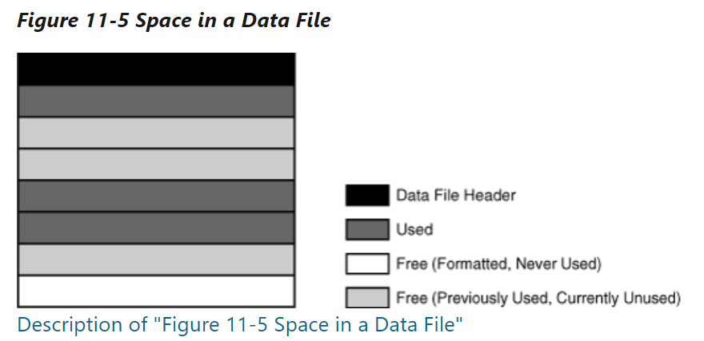

---

## Views: Data File

- Data File

| Views            | Description                                          |
| ---------------- | ---------------------------------------------------- |
| `CDB_DATA_FILES` | describes all database files in open database.       |
| `DBA_DATA_FILES` | describes database files.                            |
| `V$DATAFILE`     | displays datafile information from the control file. |

- Columns:

  - `BYTES`:
    - Size of the file in bytes
    - data + meta Data
  - `USER_BYTES`:
    - The size of the file available for user data.
    - the size without meta data
  - `MAXBYTES`:
    - Maximum file size in bytes
  - `BLOCKS`:
    - Size of the file in Oracle **blocks**
  - `MAXBLOCKS`:
    - Maximum file size in **blocks**
  - `USER_BLOCKS`:
    - Number of blocks which can be used by the data
  - `INCREMENT_BY`:
    - Number of tablespace blocks used as autoextension increment

---

### Lab: Query Data File

#### `CDB_DATAFILES`: Include all open PDB

- Connect to root

```sql
show con_name;
--CDB$ROOT
ALTER PLUGGABLE DATABASE ALL OPEN;
SELECT
    CON_ID
    ,TABLESPACE_NAME
    ,FILE_NAME
    ,STATUS
    ,ONLINE_STATUS
    ,BYTES/(1024*1024) "BYTES"
    ,AUTOEXTENSIBLE
FROM cdb_data_files
ORDER BY 1, 2;
```

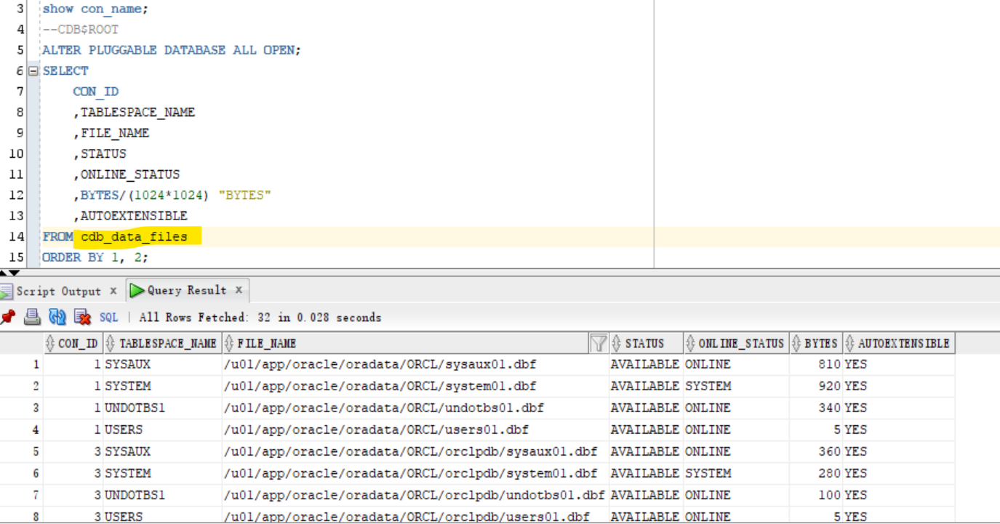

---

```sql
ALTER session SET container=orclpdb;
show con_name;
--ORCLPDB
SELECT
    CON_ID
    ,TABLESPACE_NAME
    ,FILE_NAME
    ,STATUS
    ,ONLINE_STATUS
    ,BYTES/(1024*1024) "BYTES"
    ,AUTOEXTENSIBLE
FROM cdb_data_files
ORDER BY 1, 2;
```

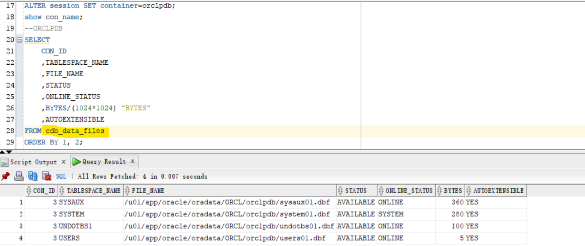

---

#### `DBA_DATA_FILES`: Current Container

```sql
show con_name;
--CDB$ROOT
ALTER PLUGGABLE DATABASE ALL OPEN;
SELECT
    TABLESPACE_NAME
    ,FILE_NAME
    ,STATUS
    ,ONLINE_STATUS
    ,BYTES/(1024*1024) "BYTES"
    ,AUTOEXTENSIBLE
FROM DBA_DATA_FILES
ORDER BY 1, 2;
```

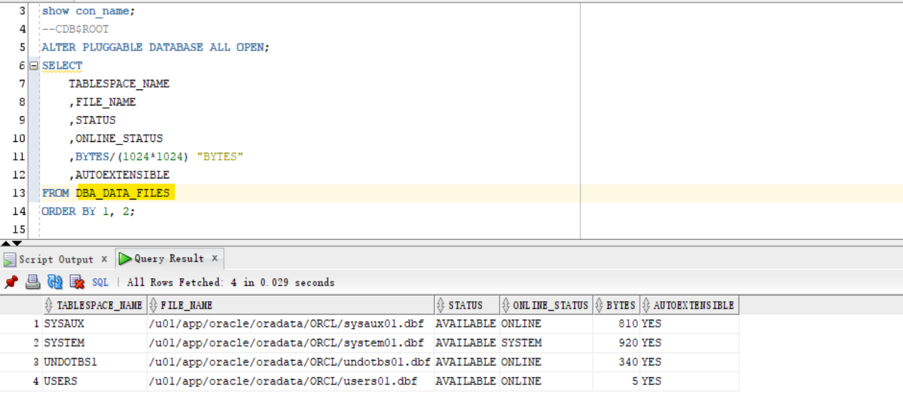

```sql
ALTER session SET container=orclpdb;
show con_name;
--ORCLPDB
SELECT
    TABLESPACE_NAME
    ,FILE_NAME
    ,STATUS
    ,ONLINE_STATUS
    ,BYTES/(1024*1024) "BYTES"
    ,AUTOEXTENSIBLE
FROM DBA_DATA_FILES
ORDER BY 1, 2;
```

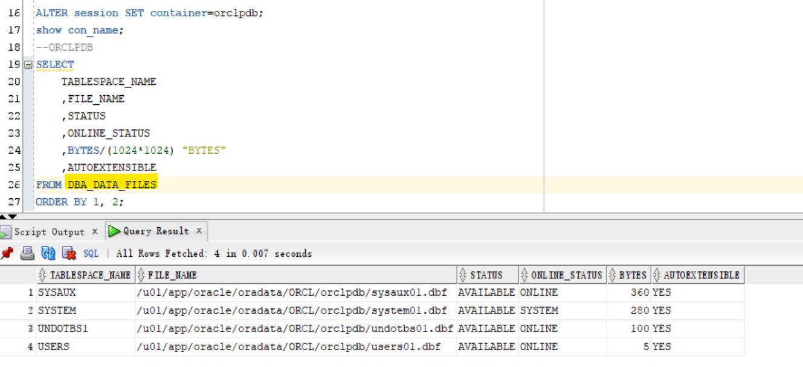

---

#### `v$datafile`: including closed PDB

- Query all data files using v$view
  - return includes the data files of seed pdb.

```sql
show con_name;
--CDB$ROOT
ALTER PLUGGABLE DATABASE ALL OPEN;
SELECT
    CON_ID
    ,TS#
    ,STATUS
    ,ENABLED
    ,NAME
    ,BYTES/(1024*1024) "BYTES"
FROM V$DATAFILE
ORDER BY 1, 2;
```

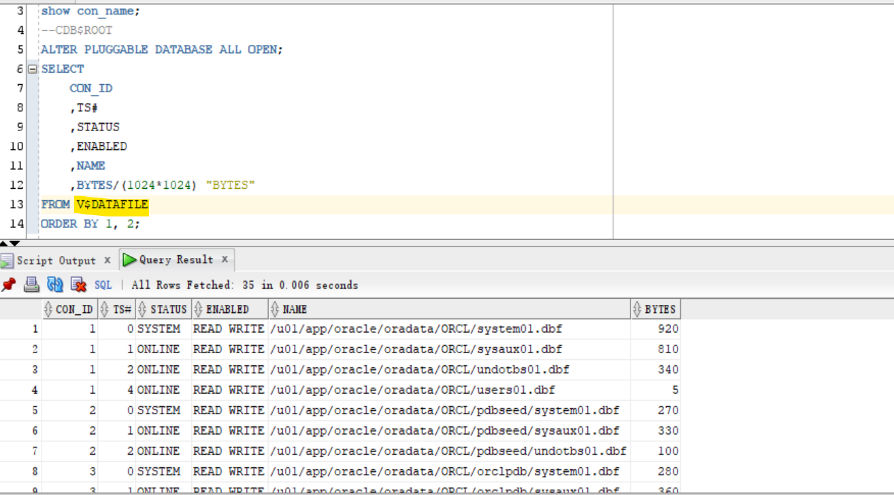

---

```sql
ALTER session SET container=orclpdb;
show con_name;
--ORCLPDB
SELECT
    CON_ID
    ,TS#
    ,STATUS
    ,ENABLED
    ,NAME
    ,BYTES/(1024*1024) "BYTES"
FROM V$DATAFILE
ORDER BY 1, 2;
```


---

## Views: Temp File

| Views            | Description                                                    |
| ---------------- | -------------------------------------------------------------- |
| `CDB_TEMP_FILES` | describes all temporary files (tempfiles) in open database.    |
| `DBA_TEMP_FILES` | describes all temporary files (tempfiles) in current database. |
| `V$TEMPFILE`     | displays temp file information.                                |

---

### Lab: Query Temp File

- A tempfile is a file that is part of an Oracle database.
  Tempfiles are used with TEMPORARY TABLESPACES

- Temporary tablespaces are used for special operations, particularly for sorting data results on disk and for hash joins in SQL. For SQL with millions of rows returned, the sort operation is too large for the RAM area and must occur on disk. The temporary tablespace is where this takes place

---

#### `CDB_TEMP_FILES`: Include all open PDB

- Connect with root container

```sql
show con_name;
--CDB$ROOT
ALTER PLUGGABLE DATABASE ALL OPEN;
SELECT
    CON_ID
    ,TABLESPACE_NAME
    ,FILE_NAME
    ,STATUS
    ,BYTES/(1024*1024) "BYTES"
    ,AUTOEXTENSIBLE
FROM cdb_temp_files
ORDER BY 1, 2;

```

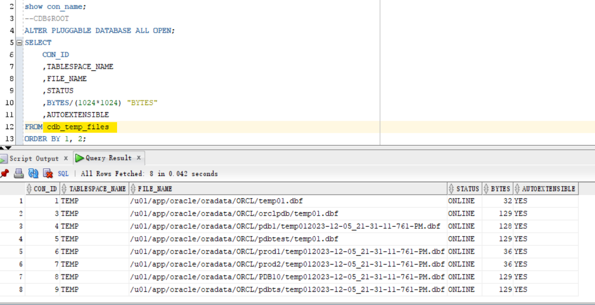

---

```sql
ALTER session SET container=orclpdb;
show con_name;
--ORCLPDB
SELECT
    CON_ID
    ,TABLESPACE_NAME
    ,FILE_NAME
    ,STATUS
    ,BYTES/(1024*1024) "BYTES"
    ,AUTOEXTENSIBLE
FROM cdb_temp_files
ORDER BY 1, 2;
```

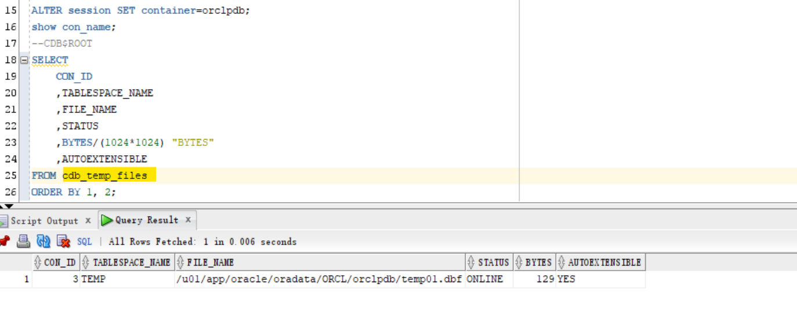

---

#### `DBA_TEMP_FILES`: Current Container

```sql
ALTER session SET container=cdb$root;
show con_name;
--CDB$ROOT
ALTER PLUGGABLE DATABASE ALL OPEN;
SELECT
    TABLESPACE_NAME
    ,FILE_NAME
    ,STATUS
    ,BYTES/(1024*1024) "BYTES"
    ,AUTOEXTENSIBLE
FROM DBA_TEMP_FILES
ORDER BY 1, 2;
```

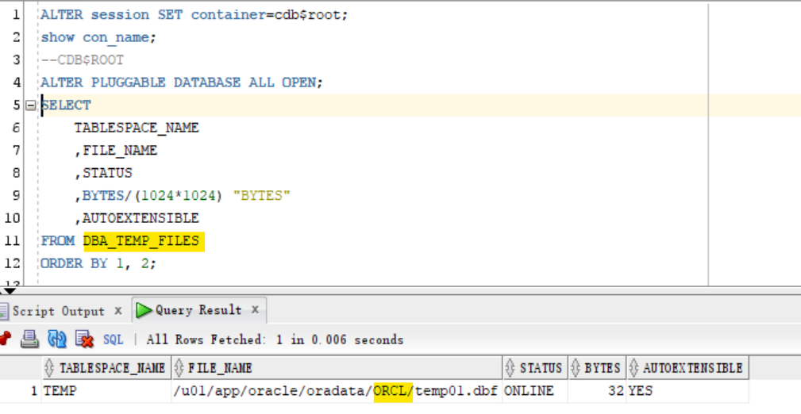

---

```sql
ALTER session SET container=orclpdb;
show con_name;
--ORCLPDB
SELECT
    TABLESPACE_NAME
    ,FILE_NAME
    ,STATUS
    ,BYTES/(1024*1024) "BYTES"
    ,AUTOEXTENSIBLE
FROM DBA_TEMP_FILES
ORDER BY 1, 2;
```

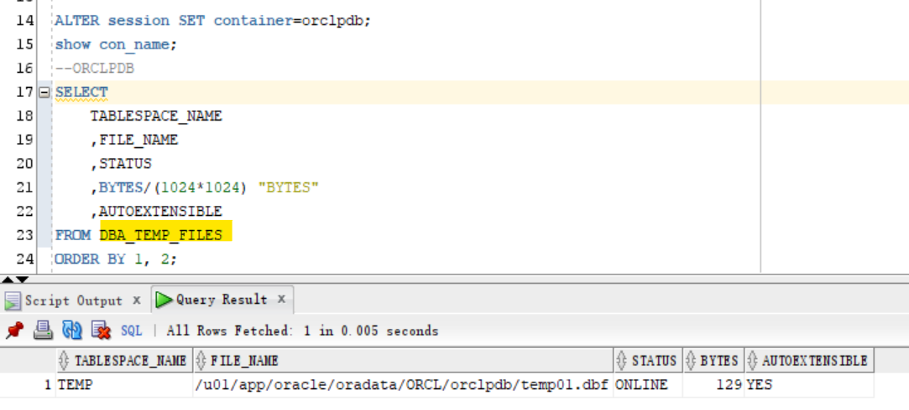

---

#### `V$TEMPFILE`

```sql
show con_name;
--CDB$ROOT
ALTER PLUGGABLE DATABASE ALL OPEN;
SELECT
    CON_ID
    ,NAME
    ,STATUS
    ,ENABLED
    ,BYTES/(1024*1024) "BYTES"
FROM V$TEMPFILE
ORDER BY 1, 2;
```

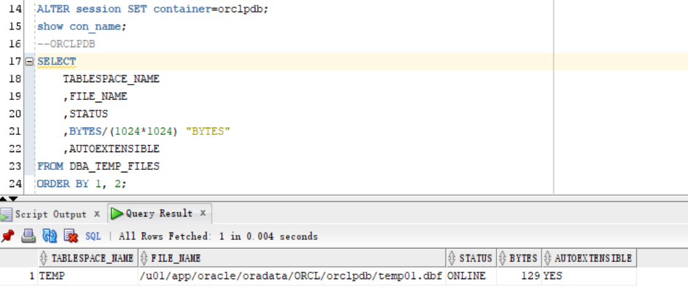

---

```sql
ALTER session SET container=orclpdb;
show con_name;
--ORCLPDB
SELECT
    CON_ID
    ,NAME
    ,STATUS
    ,ENABLED
    ,BYTES/(1024*1024) "BYTES"
FROM V$TEMPFILE
ORDER BY 1, 2;
```

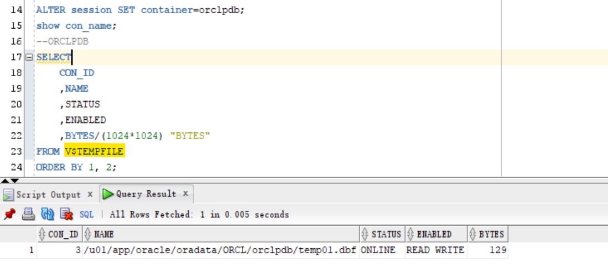

---

[TOP](#dba---physical-storage-architecture-data-file)
