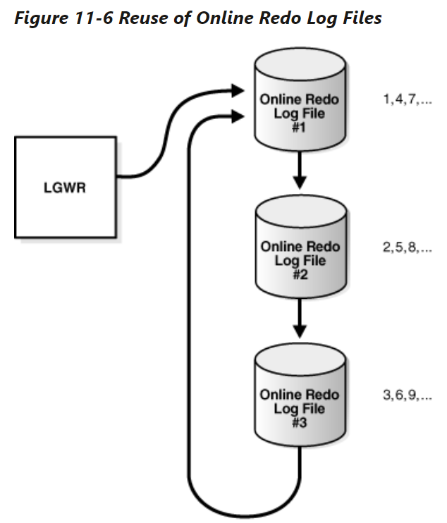
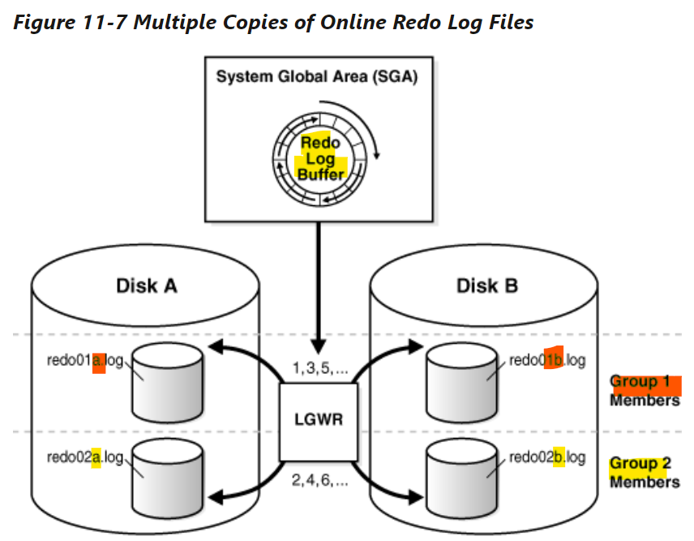

# DBA - Physical Storage Architecture: Online Redo Log

[Back](../../index.md)

- [DBA - Physical Storage Architecture: Online Redo Log](#dba---physical-storage-architecture-online-redo-log)
  - [Online Redo Log](#online-redo-log)
  - [Use of the Online Redo Log](#use-of-the-online-redo-log)
  - [How Oracle Database Writes to the Online Redo Log](#how-oracle-database-writes-to-the-online-redo-log)
  - [Online Redo Log Switches](#online-redo-log-switches)
  - [Multiple Copies of Online Redo Log Files](#multiple-copies-of-online-redo-log-files)
  - [Archived Redo Log Files](#archived-redo-log-files)
  - [Structure of the Online Redo Log](#structure-of-the-online-redo-log)

---

## Online Redo Log

- `online redo log`
  - the most crucial **structure for recovery**
  - **records changes** to the `data files`.
  - consists of two or more preallocated files that store changes to the database as they occur.

---

## Use of the Online Redo Log

- The database maintains `online redo log files` to **protect against data loss**.

  - after an instance failure, the `online redo log files` **enable Oracle Database to recover committed data** that it has not yet written to the data files.

- `Server processes` write every transaction synchronously to the `redo log buffer`
- Then the `LGWR process` then writes to the `online redo log`.

  - Contents of the online redo log **include uncommitted transactions, and schema and object management statements**.

- As the database makes changes to the undo segments, the database also writes these changes to the online redo logs.

  - Consequently, the `online redo log` **always contains the undo data** for permanent objects.
  - DBA can
    - configure the database to **store all undo data** for `temporary objects` in a `temporary undo segment`, which saves space and improves performance,
    - or allow the database to store **both** `permanent and temporary undo data` in the `online redo log`.

- Oracle Database uses the `online redo log` **only for recovery**.
  - However, administrators can **query** `online redo log files` through a SQL interface in the Oracle LogMiner utility (see "Oracle `LogMiner`").
  - Redo log files are a **useful source of historical information** about database activity.

---

## How Oracle Database Writes to the Online Redo Log

- `redo thread`:

  - The `online redo log` for a database instance

- In **single-instance** configurations, only one instance accesses a database, so **only one** `redo thread` is present.
- In an `Oracle Real Application Clusters (Oracle RAC)` configuration, however, multiple instances concurrently access a database, with **each instance having its own** `redo thread`. A **separate** `redo thread` for each instance avoids contention for a single set of online redo log files.

- **An** `online redo log` consists of **two or more** `online redo log files`.
  - Oracle Database **requires a minimum of two** files to guarantee that one file is always available for **writing** in case the other file is in the process of being cleared or archived.

---

## Online Redo Log Switches

- Oracle Database uses **only one** `online redo log file` at a time **to store records written** from the redo log buffer.唯一

- `the current online redo log file`

  - the **online redo log file** to which the `log writer process (LGWR)` process is **actively writing** 当前写入的文件

- `log switch`

  - occurs when the database **stops writing to one** `online redo log file` and **begins writing to another**.

- Scenario: 发生情况

  - Normally: when the `current online redo log file` is **full** and **writing must continue**.
  - DBA can configure log switches to occur **at regular intervals**, regardless of whether the current online redo log file is filled, and **force** log switches **manually**.

- `Log writer` writes to online redo log files **circularly**. When log writer fills the **last available** online redo log file, the process writes to **the first** log file, restarting the cycle.循环写入

> - `LGWR` writes to each online redo log file.
> - The database **assigns** each file **a new `log sequence number`** when a log switches and log writers begins writing to it.
> - When the database **reuses** an online redo log file, this file **receives the next available `log sequence number`**.

---

- Filled online redo log files are available for reuse **depending on the archiving mode**:

  - `NOARCHIVELOG` mode:
    - the archiving is **disabled**
    - a filled `online redo log file` is available after the changes recorded in it **have been checkpointed** (written) to disk by `database writer (DBW)`. 检查点被写入

- `ARCHIVELOG` mode:
  - archiving is enabled
  - a filled online redo log file is available to log writer after the changes **have been written to** the `data files` and the file **has been archived**. 写入到 df 而且 文件被存储.

---

## Multiple Copies of Online Redo Log Files

- Oracle Database can **automatically** maintain **two or more** identical copies of the `online redo log` in **separate locations**.

- `online redo log group`

  - consists of an **online redo log file** and its **redundant copies**.
  - Each group is **defined by a number**, such as group 1, group 2, and so on.

- Purpose:
  - Maintaining multiple members of an online redo log group **protects against the loss of the redo log**.
  - Ideally, the locations of the members should be **on separate disks** so that the failure of one disk does not cause the loss of the entire online redo log.

> - Each member in a group **must be the same size**.
>   - group 1: 2 members, 01a,01b
>   - group 2: 2 members, 02a, 02b
> - LGWR **never writes concurrently** to members of **different groups**. 每次指挥写入同一组.
>   - `LGWR` writes **concurrently** to group 1, **then** writes **concurrently** to group 2, **then** writes to group 1, and so on.

---

## Archived Redo Log Files

- `archived redo log file`

  - a **copy of a filled member** of an `online redo log group`.

- The file **is not considered part of the database**, but is an **offline copy** of an `online redo log file` created by the database and written to a user-specified location. 不认为是 db 的一部分, 只是另外存储的离线副本.

- Purpose: a crucial part of a backup and recovery strategy.

  - **Recover** a database backup
  - **Update** a **standby** database
  - Obtain information about the **history** of a database using the `Oracle LogMiner` utility

- `archiving`:

  - The operation of generating an `archived redo log file`
  - either **automatic** or **manual**.
  - only possible when the database is in `ARCHIVELOG` mode.

- An `archived redo log file` includes

  - the `redo entries`
  - the `log sequence number` of the identical member of the online redo log group.

- If the database is in `ARCHIVELOG` mode, and if **automatic** archiving is enabled, then the `archiver process (ARCn)` will archive one of these files.
  - If A_LOG1 is **corrupted**, then the process can **archive** B_LOG1. 举例, 如果一组其中一个日志 corrupt, 会 archive 另一个日志.
  - The `archived redo log` contains **a copy of every** `redo log group` that existed **starting from the time that you enabled archiving**.

---

## Structure of the Online Redo Log

- Online redo log files contain `redo records`.

- `redo record`

  - made up of a group of **change vectors**, each of which **describes a change to a data block**.
  - e.g., an update to a salary in the employees table generates a redo record that describes changes to the **data segment block** for the table, **the undo segment data block**, and the **transaction** table of the undo segments.

- The `redo records` have all relevant **metadata** for the change, including the following:
  - `SCN` and **time stamp** of the change
  - **Transaction ID** of the transaction that generated the change
  - `SCN` and **time stamp** when the transaction **committed** (if it committed)
  - **Type of operation** that made the change
  - **Name** and **type** of the modified **data segment**

---

[TOP](#dba---physical-storage-architecture-online-redo-log)
