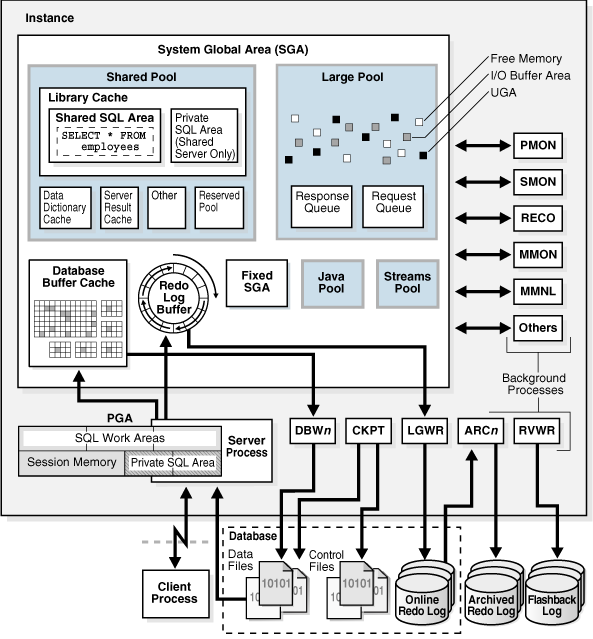

# DBA - Physical Storage Structures

[Back](../../index.md)

- [DBA - Physical Storage Structures](#dba---physical-storage-structures)
  - [Physical Storage Structures](#physical-storage-structures)
    - [Mechanisms for Storing Database Files](#mechanisms-for-storing-database-files)

---

## Physical Storage Structures

- `physical database structures`

  - **viewable** at the operating system level.

- `logical data structures` are **independent** from `physical storage structures`.

  - DBA can manage `physical storage` of data without affecting access to `logical structures`.
  - e.g., renaming a database file does not rename the tables stored in it.

- An `Oracle database` is a **set of files** that store Oracle data **in persistent storage**.所谓数据库即存储数据的文件.

---

- When issue a `CREATE DATABASE` statement to create a `CDB`.

  - `Data files` and `temp files`

    - `data file`:
      - a **physical file** in persistent storage(持久存储) that was created by Oracle Database and **contains data structures** such as tables and indexes.
    - `temp file`

      - a **data file** that **belongs to a temporary tablespace**.
      - The database writes data to these files in an Oracle proprietary format(专有格式) that **cannot be read by other programs**.

    - When DBA create a `PDB` within a `PDB`, the `PDB` **has its own set of data files** within the overall set of data files that makes up the CDB.
      - e.g.,you could create a `CDB` named `mycdb`, and then create two `PDBs` within it: `hrpdb` and `salespdb`.
      - In this case, `mycdb` would have its own set of data files and temp files, as would `hrpdb` and `salespdb`.
      - 即 CDB 有自己的 df, 在其内的 pdb 都有其自己的 df.

  - `Control files`
    - `control file`
      - a **root file** that **tracks the physical components** of the `CDB`.
      - `PDBs` **do not have their own** separate control files.
      - cf 只属于 CDB.
  - `Online redo log files`
    - a set of **files containing records of changes** made to data within the `CDB`.
    - `PDBs` **do not have their own** separate online redo log files.
    - rdlf 只属于 CDB, PDB 没有.

- A `database instance` is a **set of memory structures** that **manage database files** in a `CDB`.
  - 实例是管理 CDB 的 df 的内存.

---

### Mechanisms for Storing Database Files

- Mechanisms 

---

[TOP](#dba---physical-storage-structures)
