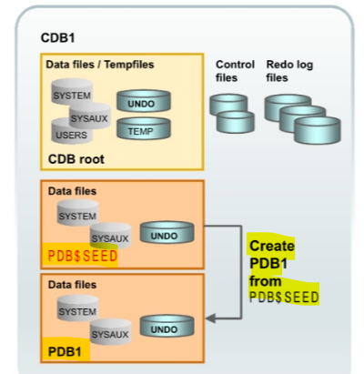

# DBA - Pluggable Database: Create Pluggable Database

[Back](../../index.md)

- [DBA - Pluggable Database: Create Pluggable Database](#dba---pluggable-database-create-pluggable-database)
  - [Create Pluggable Database](#create-pluggable-database)
    - [Create PDB from SEED](#create-pdb-from-seed)
      - [Lab: Explore PDB Seed](#lab-explore-pdb-seed)
      - [Lab: Create a PDB from seed using SQL](#lab-create-a-pdb-from-seed-using-sql)
      - [Lab: Create a PDB from seed using DBCA](#lab-create-a-pdb-from-seed-using-dbca)
    - [Cloning a PDB](#cloning-a-pdb)
      - [Lab: Cloning PDB](#lab-cloning-pdb)

---

## Create Pluggable Database

- Methods:

  - **Create a PDB using the seed**
  - **Clone an existing PDB**
  - **Plug and unplug a PDB**
  - Create a PDB from a non-CDB (not in the course)
  - Plug an unplugged PDB into a different CDB (not in the course)
  - Relocate a PDB to a different CDB (not in the course)
  - Create a PDB as a proxy PDB (not in the course)

- Tools:
  - SQL\*Plus
  - SQL Developer
  - DBCA
  - Enterprise Manager Cloud Control (for cloud)

---

### Create PDB from SEED



- Statement:

  - `CREATE PLUGGABLE DATABASE`
  - copy `data files` from seed to new location.
  - Create `system` and `sysaux` **tbsp**.
  - Create `default schemas` and `common users`.
    - `sys` user will be super user.
    - `system` user can manage the PDB
  - create DB service automatically.

- Prerequisites:

  - current container **must be root**.
  - The CDB must be **in `READ WRITE` mode.**
  - must have `CREATE PLUGGABLE DATABASE` **privileges**.

- Example:

```sql
CREATE PLUGGABLE DATABASE pdb1
  ADMIN USER pdb1admin IDENTIFIED BY welcome  # Create a new user
  ROLES = (dba)     # privilege: give dba role to the new user
  DEFAULT TABLESPACE users  # create a new tbsp,
    # create a df for users tbsp,
    DATAFILE '/u01/app/oracle/oradata/ORCL/pdb1/users01.dbf'
    # assign size
    SIZE 250M
    # auto extend size
    AUTOEXTEND ON
  # convert the file name from the seed dir to the new pdb dir
  FILE_NAME_CONVERT = ('/u01/app/oracle/oradata/ORCL/pdbseed/',
                       '/u01/app/oracle/oradata/ORCL/pdb1/');

```

---

#### Lab: Explore PDB Seed

```sql
show con_name;
# confirm pdb mode
select con_id,name,open_mode
from v$containers;

# move to PDB
alter session set container=PDB$SEED;
# confirm current container
show con_name
# CON_NAME
# ------------------------------
# PDB$SEED

# query all user in seddm using cdb
select con_id, username,DEFAULT_TABLESPACE,common
from cdb_users;

# query all user in seddm using dba
select  username,DEFAULT_TABLESPACE,common
from dba_users;

# query for df
select con_id,file#, name from V$DATAFILE;

# query tbsp
select *
from V$TABLESPACE;

```


---

#### Lab: Create a PDB from seed using SQL

- Create dir for pdb `pdb1`

```sh
cd $ORACLE_BASE/oradata/ORCL
mkdir pdb1
ls
pwd
# /u01/app/oracle/oradata/ORCL/pdb1
```


```sql
# confirm in the root
show con_name
# CON_NAME
# ------------------------------
# CDB$ROOT

# confirm the root is open
select con_id,name,open_mode
from v$containers;
# 1	CDB$ROOT	READ WRITE
# 2	PDB$SEED	READ ONLY
# 3	ORCLPDB   READ WRITE

# create pdb
CREATE PLUGGABLE DATABASE pdb1
  ADMIN USER pdb1admin IDENTIFIED BY welcome  # Create a new user
  ROLES = (dba)     # privilege: give dba role to the new user
  DEFAULT TABLESPACE users  # create a new tbsp,
    # create a df for users tbsp,
    DATAFILE '/u01/app/oracle/oradata/ORCL/pdb1/users01.dbf'
    # assign size
    SIZE 250M
    # auto extend size
    AUTOEXTEND ON
  # convert the file name from the seed dir to the new pdb dir
  FILE_NAME_CONVERT = ('/u01/app/oracle/oradata/ORCL/pdbseed/',
                       '/u01/app/oracle/oradata/ORCL/pdb1/');
# Pluggable database PDB1 created.

# list all containers
select con_id,name,open_mode
from v$containers;
# 1	CDB$ROOT	READ WRITE
# 2	PDB$SEED	READ ONLY
# 3	ORCLPDB	READ WRITE
# 4	PDB1	MOUNTED
```

- explore in the pdb dir
  - 4 df have been copies.


```sql
# move to PDB
alter session set container=pdb1;
show con_name;
# CON_NAME
# ------------------------------
# PDB1

# open pdb1
alter pluggable database open;
#Pluggable database OPEN altered.
```

- explore in the pdb dir
  - user df has been created when pdb is opened.


```sql
# Query user in new pdb, note the new user has been created.
select con_id, username,DEFAULT_TABLESPACE,common
from cdb_users;

select  username,DEFAULT_TABLESPACE,common
from dba_users;

# query df, 4 df, including user
select con_id,file#, name from V$DATAFILE;

# query tbsp, 5 tbsp.
select  * from V$TABLESPACE
```


---

#### Lab: Create a PDB from seed using DBCA


- Explore files created in the OS
  - same as command line


- Query in Oracle DB
  - note: open mode is read write,already opened, not mounted.

```sql
SELECT name, open_mode FROM v$pdbs;
```


- Get service name

```sh
lsnrctl status
```


---

### Cloning a PDB

- `cloning`
  - **copying** a source PDB from a CDB and **plugging** the copy into the same CDB or another CDB.
  - **all users** in the source PDB will be copied, including common users and local users.
  - **all data files** will be copied, **including the password**.
  - **all tbsp** will be copied.
  - **uncommitted transaction** will **not** be copied.
    - **dirty buffer** will **not** be copied.


- Prerequisite:

  - current container must be the root.
  - the current CDB must be in `READ WRITE` mode.
  - privilege: `CREATE PLUGGABLE DATABASE`

- Best practise:

  - put the target PDB into `READ ONLY` mode.

- Statement:

```sql
CREATE PLUGGABLE DATABASE pdb5 from orclpdb
FILE_NAME_CONVERT = ('/u01/app/oracle/oradata/ORCL/orclpdb/',
                       '/u01/app/oracle/oradata/ORCL/pdb5/')

# Optional: if you need oracle managed files to names the files
# CREATE PLUGGABLE DATABASE pdb5 from orclpdb
# create_file_dest '/u01/app/oracle/oradata/ORCL/pdb5';
```

- if the source pdb has active transaction, it will have this error.

```sql
/* Error report -
ORA-65023: active transaction exists in container ORCLPDB
1.     00000 -  "active transaction exists in container %s"
*Cause:    A statement attempted to create a new transaction in the current
           container while there was an active transaction in another container.
*Action:   Switch to the container with the active transaction and commit, rollback
           or detach the active transaction before attempting to issue any
           statement that will attempt to create a new transaction in another
           container. */

# solution
ALTER session SET container=ORCLPDB;
show con_name;
rollback;

ALTER session SET container=cdb$root;
show con_name;
```

---

#### Lab: Cloning PDB

- Create dir for the new pdb

```sh
cd $ORACLE_BASE/oradata/ORCL
mkdir pdb5
ls
cd pdb5
pwd
# /u01/app/oracle/oradata/ORCL/pdb5

```

---

- login oracle
- make some change in the source pdb but not commit

```sql
# move to source pdb
ALTER session SET container=orclpdb;

show con_name;

# change but not commit
# create a umcommited transaction
update hr.employees set salary=salary +1 where employee_id=100;

# confirm an uncommited transaction has been created.
select salary from hr.employees where employee_id=100;
# 24001
```

---

- Clone an existing PDB.

```sql
# move to root
alter session set container=cdb$root;
# confirm in the root
show con_name;

# list all pdb
select con_id,name,open_mode
from v$pdbs;

# clone a PDB
CREATE PLUGGABLE DATABASE pdb5 from orclpdb
FILE_NAME_CONVERT = ('/u01/app/oracle/oradata/ORCL/orclpdb/',
                       '/u01/app/oracle/oradata/ORCL/pdb5/');
#Pluggable database PDB5 created.

# confirm creation
select con_id,name,open_mode
from v$pdbs;
# 2	PDB$SEED	READ ONLY
# 3	ORCLPDB	READ WRITE
# 4	PDB1	READ WRITE
# 5	PDB5	MOUNTED

```

- Check the files in os


- Explore new pdb

```sql
# move to new pdb
alter session set container=PDB5;
# open new pdb
alter pluggable database open;
# check the data, uncommitted transaction will be copied.
select salary from hr.employees where employee_id=100;

# query uses, confirm that all common and local users are copied.
select  username,DEFAULT_TABLESPACE,common
from dba_users;
# HR	SYSAUX	NO

# query all tables of a user, confirm that all objects are copied.
select  *
from dba_tables
where OWNER='HR';

# query datafile
select con_id,file#, name from V$DATAFILE;

# query tbsp
select * from V$TABLESPACE;
```

- confirm service has been registered in the listener.


---

[TOP](#dba---pluggable-database-create-pluggable-database)
