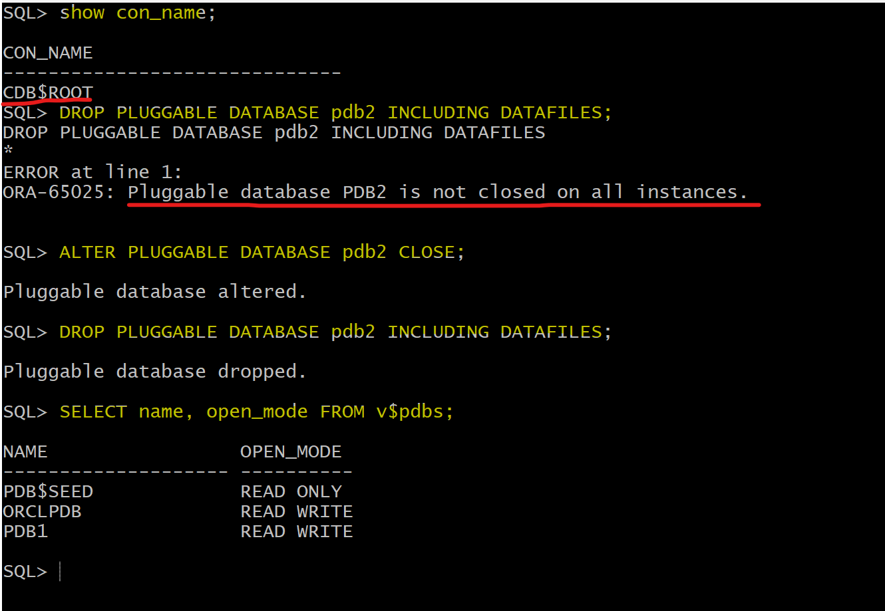
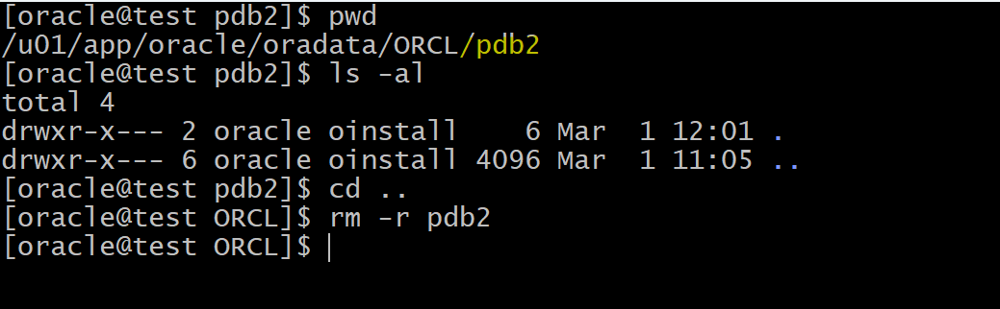
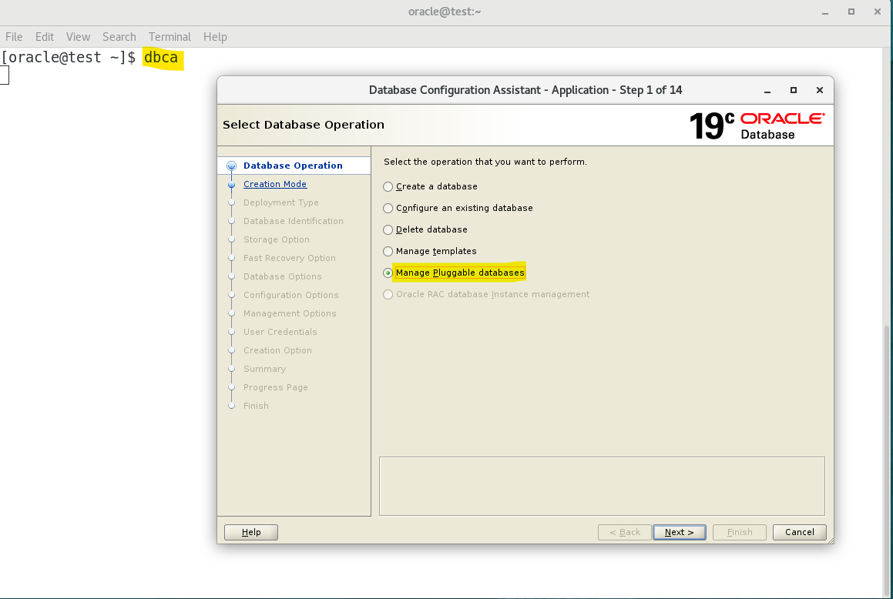
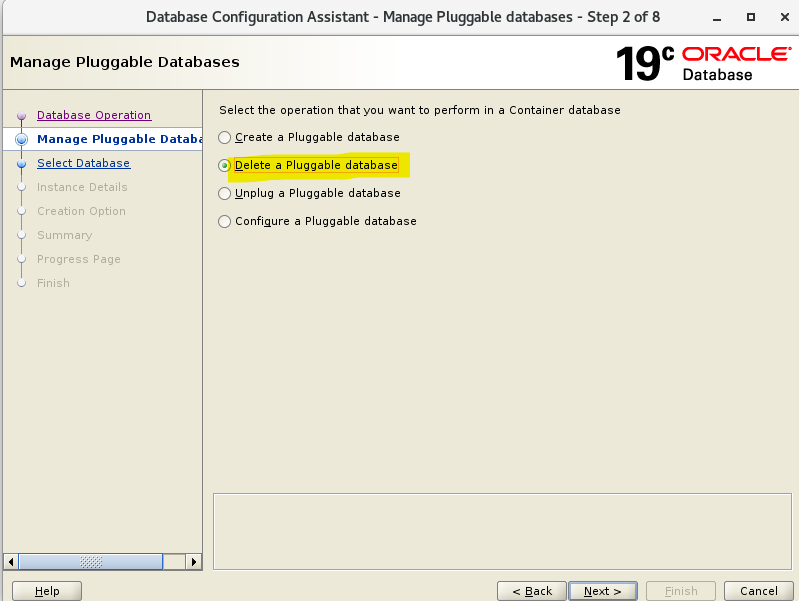
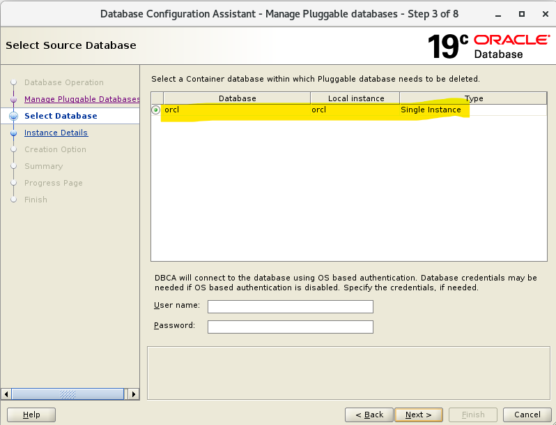
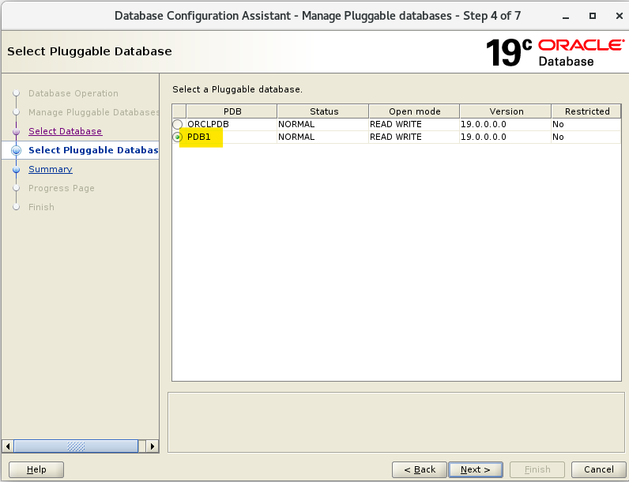
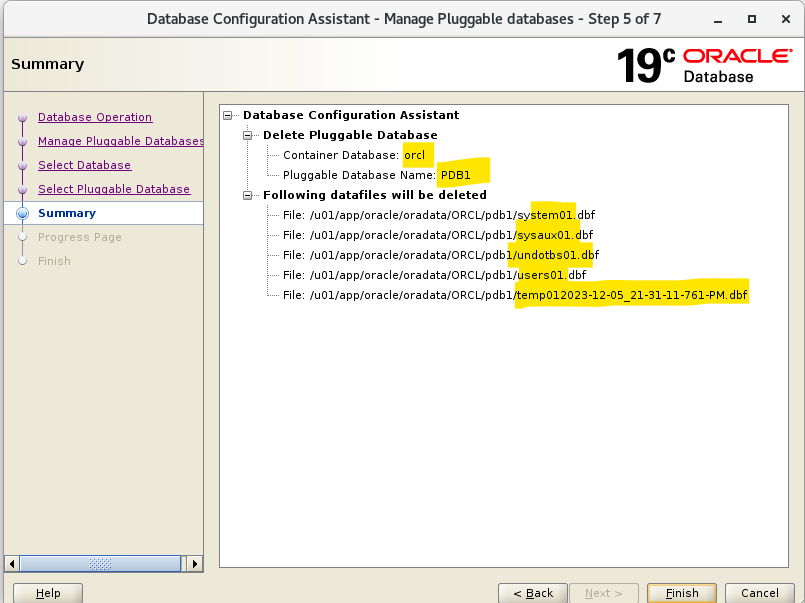

# DBA - Pluggable Database: Drop Pluggable Database

[Back](../../index.md)

- [DBA - Pluggable Database: Drop Pluggable Database](#dba---pluggable-database-drop-pluggable-database)
  - [Drop Pluggable Database](#drop-pluggable-database)
    - [Lab: Drop a pluggable database using SQL](#lab-drop-a-pluggable-database-using-sql)
    - [Lab: Drop a pluggable database using DBCA](#lab-drop-a-pluggable-database-using-dbca)

---

## Drop Pluggable Database

- prerequisite:

  - current session in the root
  - the target pdb is close

- Statement:

```sql
DROP PLUGGABLE DATABASE pdb2 INCLUDING DATAFILES;

```

- When sucessfully dropping a PDB, its service will be autimatically removed from the listener.

---

### Lab: Drop a pluggable database using SQL

```sql
-- confirm current in root
show con_name;

-- error if pdb is not closed
DROP PLUGGABLE DATABASE pdb2 INCLUDING DATAFILES;
#ERROR at line 1:
#ORA-65025: Pluggable database PDB2 is not closed on all instances.

-- close target pdb
ALTER PLUGGABLE DATABASE pdb2 CLOSE;
-- drop pdb
DROP PLUGGABLE DATABASE pdb2 INCLUDING DATAFILES;

-- confirm
SELECT name, open_mode FROM v$pdbs;
```



- The dir of the pdb is empty, and can be removed.



---

### Lab: Drop a pluggable database using DBCA







---

[TOP](#dba---pluggable-database-drop-pluggable-database)
