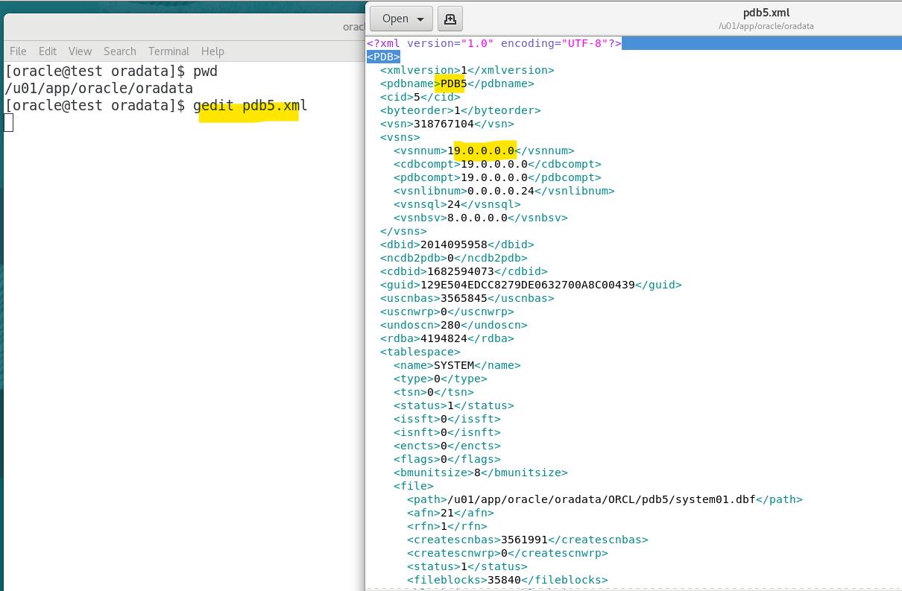
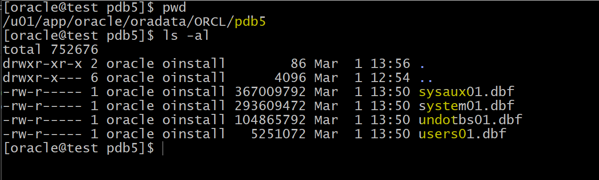
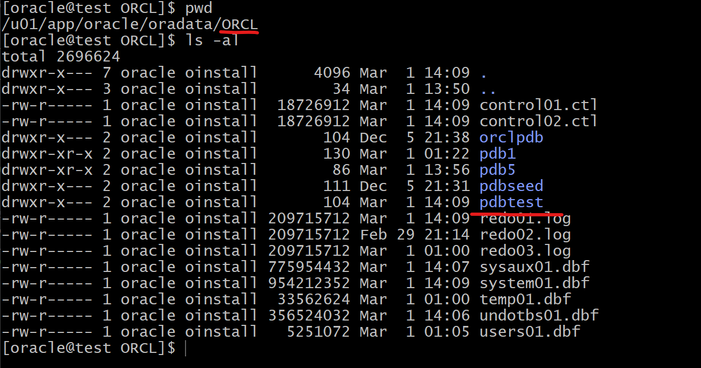
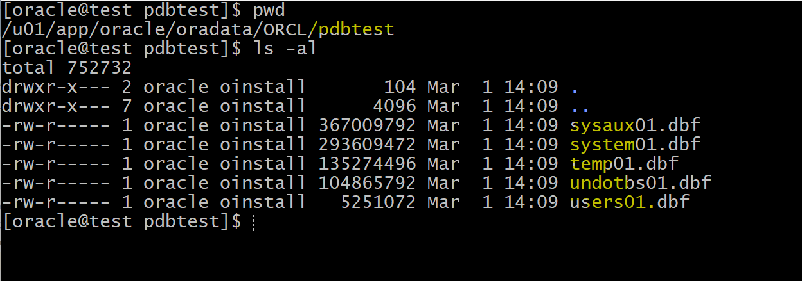

# DBA - Pluggable Database: Plugging and Unplugging Pluggable Database

[Back](../../index.md)

- [DBA - Pluggable Database: Plugging and Unplugging Pluggable Database](#dba---pluggable-database-plugging-and-unplugging-pluggable-database)
  - [Unplugging and plugging a PDB](#unplugging-and-plugging-a-pdb)
    - [Lab: Unplugging a PDB](#lab-unplugging-a-pdb)
    - [Lab: Plugging a PDB with a new location for data file](#lab-plugging-a-pdb-with-a-new-location-for-data-file)
    - [Lab: Plugging a PDB with the original location for data file](#lab-plugging-a-pdb-with-the-original-location-for-data-file)

---

## Unplugging and plugging a PDB

- `Unplugging a PDB`:

  - disassociating the PDB from its CDB

- `Plugging a PDB`:

  - associating the PDB from its CDB

- Can plug a PDB into the **same** or **another** CDB.

- Prerequisite:

  - current container must be the root.
  - pdb must be closed.

- Steps:

  - 1. Close the pdb1
  - 2. Unplug pdb1 to xml, which contains the definition of the database, but not the datafiles.
  - 3. Drop the pdb1 but keep the datafiles
  - 4. Check compatibility
  - 5. Plug the pdb1 using the xml

- Statement of **unplugging a pdb**

```sql
alter pluggable database pdb5 unplug into '/u01/app/oracle/oradata/pdb5.xml'
```

- Statement of **plugging a pdb**

```sql
# create a pdb with a new name using the xml, the definition
# using a new location for df
# it will automatically create a new dir for the new pdb.
create pluggable database pdbtest
using '/u01/app/oracle/oradata/pdb5.xml'
FILE_NAME_CONVERT=('/u01/app/oracle/oradata/ORCL/pdb5/',
                  '/u01/app/oracle/oradata/ORCL/pdbtest/');

# plug a pdb with new name and same location for df
# it will no create any dir for the new pdb
create pluggable database pdbtest1
using '/u01/app/oracle/oradata/pdbtest.xml'
NOCOPY TEMPFILE REUSE;


```

---

### Lab: Unplugging a PDB

- Unplug PDB5

```sql
# confirm in root
show con_name

# step1: close pdb
alter pluggable database pdb5 close immediate;

# confirm pdb close
select con_id, name, open_mode
from v$pdbs;
# 2	PDB$SEED	READ ONLY
# 3	ORCLPDB	READ WRITE
# 4	PDB1	READ WRITE
# 5	PDB5	MOUNTED

# step 2: unplug pdb into an xml file
alter pluggable database pdb5 unplug into '/u01/app/oracle/oradata/pdb5.xml';

# list pdbs, pdb5 still exists.
select con_id, name, open_mode
from v$pdbs;
# 2	PDB$SEED	READ ONLY
# 3	ORCLPDB	READ WRITE
# 4	PDB1	READ WRITE
# 5	PDB5	MOUNTED

# step 3: drop pdb structure from Oracle but keep df
drop pluggable database pdb5 keep datafiles;

# confirm the pdb has been dropped.
select con_id, name, open_mode
from v$pdbs;
# 2	PDB$SEED	READ ONLY
# 3	ORCLPDB	READ WRITE
# 4	PDB1	READ WRITE


```

- Check the xml file
  - contain no data files but only the definition regarding the pdb, such as pdb name.



- Check the data file
  - still exists



---

### Lab: Plugging a PDB with a new location for data file

```sql

--can run the following script, worked in 19c.
DECLARE
  l_result BOOLEAN;
BEGIN
  l_result := DBMS_PDB.check_plug_compatibility(
                pdb_descr_file => '/u01/app/oracle/oradata/pdb5.xml',
                pdb_name => 'PDB5');

  IF l_result THEN
    DBMS_OUTPUT.PUT_LINE('compatible');
  ELSE
    DBMS_OUTPUT.PUT_LINE('incompatible');
  END IF;
END;
# compatible

# create a pdb with a new name using the xml, the definition
# no need to create dir for the new pdb, it will create automatically.
create pluggable database pdbtest
using '/u01/app/oracle/oradata/pdb5.xml'
FILE_NAME_CONVERT=('/u01/app/oracle/oradata/ORCL/pdb5/',
                  '/u01/app/oracle/oradata/ORCL/pdbtest/');
# Pluggable database PDBTEST created.


# confirm the new pdb has been created
select con_id, name, open_mode
from v$pdbs;
# 2	PDB$SEED	READ ONLY
# 3	ORCLPDB	READ WRITE
# 4	PDB1	READ WRITE
# 5	PDBTEST	MOUNTED

# move to the new pdb
alter session set container=pdbtest;
# open current pdb
alter pluggable database open;
# confirm the objects in new pdb
select * from hr.employees;

# query for df
select con_id,file#, name from V$DATAFILE;
```

- check file in the OS
  - the original pdb5's datafiles remains existing.




---

### Lab: Plugging a PDB with the original location for data file

- Assumed that the pdbtest has been unplugged and dropped.

```sql
# plug a pdb with new name and same location for df
create pluggable database pdbtest1
using '/u01/app/oracle/oradata/pdbtest.xml'
NOCOPY TEMPFILE REUSE;

# confirm creation
select con_id, name, open_mode
from v$pdbs;
# 2	PDB$SEED	READ ONLY
# 3	ORCLPDB	READ WRITE
# 4	PDB1	READ WRITE
# 5	PDBTEST1	MOUNTED

alter session set container=pdbtest1;
alter pluggable database open;
# query df for location
# df exist in the original location.
select con_id,file#, name from V$DATAFILE
# 5	29	/u01/app/oracle/oradata/ORCL/pdbtest/system01.dbf
# 5	30	/u01/app/oracle/oradata/ORCL/pdbtest/sysaux01.dbf
# 5	31	/u01/app/oracle/oradata/ORCL/pdbtest/undotbs01.dbf
# 5	32	/u01/app/oracle/oradata/ORCL/pdbtest/users01.dbf
```

---

[TOP](#dba---pluggable-database-plugging-and-unplugging-pluggable-database)
