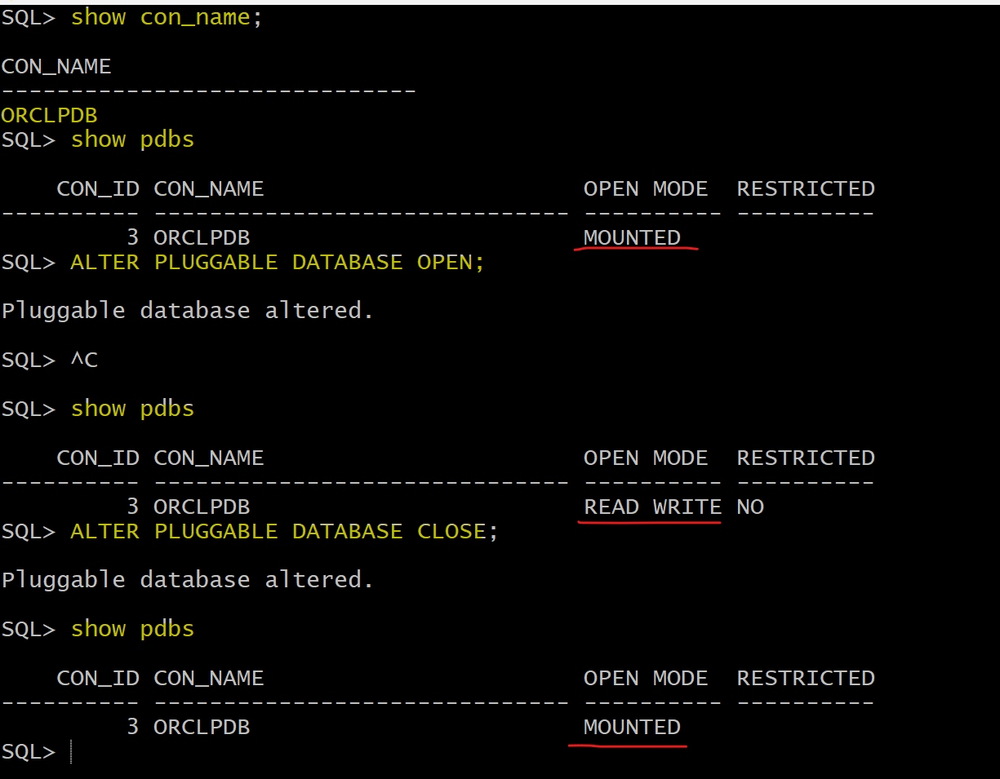

# DBA - Pluggable Database

[Back](../../index.md)

- [DBA - Pluggable Database](#dba---pluggable-database)
  - [Lab: Open and close PDB](#lab-open-and-close-pdb)
  - [Lab: Set the current session to PDB](#lab-set-the-current-session-to-pdb)
  - [Save state](#save-state)

---

## Lab: Open and close PDB

- List all pluggable databases
- Open a specific pluggable databases
- Close a specific pluggable databases

```sql
# show all pluggable databases
show pdbs
#    CON_ID CON_NAME                       OPEN MODE  RESTRICTED
#---------- ------------------------------ ---------- ----------
#         2 PDB$SEED                       READ ONLY  NO
#         3 ORCLPDB                        MOUNTED

# PDB$SEED: a template to create pluggable database.

ALTER PLUGGABLE DATABASE orclpdb OPEN;

ALTER PLUGGABLE DATABASE orclpdb CLOSE;

```


---

- Open all pluggable databases
- Close all pluggable databases

```sql
show pdbs
ALTER PLUGGABLE DATABASE ALL OPEN;
ALTER PLUGGABLE DATABASE ALL CLOSE;
```


---

## Lab: Set the current session to PDB

- Alter session to PDB

```sql
show con_name;
ALTER SESSION set container=orclpdb;
show con_name;  # confirm the current session is in the target pdb

```


---

- Open current PDB

```sql
show con_name;
show pdbs
ALTER PLUGGABLE DATABASE OPEN;      # because the current session is in a PDB, no need to specified the pdb name.
show pdbs
ALTER PLUGGABLE DATABASE CLOSE;
show pdbs
```



---

- Alter session to CDB

```sql
show con_name;
ALTER SESSION set container=cdb$root;
show con_name;
```


---

## Save state

- By default, the status of pdb is mounted, which means pdb is closed. It requires to be opened mannually each time the instance starts.
- To autimaticlly open a pdb, using save state

```sql
ALTER PLUGGABLE DATABASE orclpdb OPEN;
ALTER PLUGGABLE DATABASE orclpdb SAVE STATE;
```


---

[TOP](#dba---pluggable-database)
