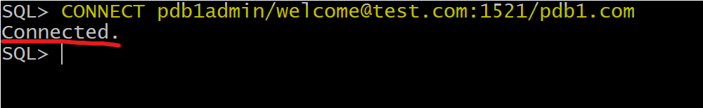

# DBA - Pluggable Database

[Back](../../index.md)

- [DBA - Pluggable Database](#dba---pluggable-database)
  - [PDB](#pdb)
    - [Lab: Get the PDB's service name](#lab-get-the-pdbs-service-name)
    - [Lab: Connect to PDB with service name](#lab-connect-to-pdb-with-service-name)
    - [Lab: Connect to PDB with tnsname](#lab-connect-to-pdb-with-tnsname)
    - [Lab: Open and close PDB](#lab-open-and-close-pdb)
    - [Lab: Set the current session to PDB](#lab-set-the-current-session-to-pdb)
  - [Save state](#save-state)
    - [Lab: Save PDB state](#lab-save-pdb-state)
  - [File Architecture](#file-architecture)

---

## PDB

---

### Lab: Get the PDB's service name

- Method01: Check the listener status

```sh
lsnrctl status
```


- Method02: query from v$services

```sql
show con_name;
# list all pdb to get the pdb name
show pdbs;
# move to pdb
ALTER session SET container=pdb1;
# confirm current container
show con_name;
# query service name
SELECT name FROM v$services;
# show db_domain
show parameter db_domain;

# the service = service_name.db_domain
```


---

### Lab: Connect to PDB with service name

- Using sql\*plus terminal with easy connect

```sql
CONNECT pdb1admin/welcome@test.com:1521/pdb1.com
```



---

- Using sql developer

- Note: no need tnsname.ora, because it uses a service name, not a tns name.


---

### Lab: Connect to PDB with tnsname

- Update the client side `tnsname.ora`

```config
PDB1 =
  (DESCRIPTION =
    (ADDRESS = (PROTOCOL = TCP)(HOST = test.com)(PORT = 1521))
    (CONNECT_DATA =
      (SERVER = DEDICATED)
      (SERVICE_NAME = pdb1.com)
    )
  )
```

- For sql\*plus, update `tnsname.ora`, then login

```sql
CONNECT pdb1admin/welcome@pdb1
show con_name
```


---

### Lab: Open and close PDB

- List all pluggable databases
- Open a specific pluggable databases
- Close a specific pluggable databases

```sql
# show all pluggable databases
show pdbs
#    CON_ID CON_NAME                       OPEN MODE  RESTRICTED
#---------- ------------------------------ ---------- ----------
#         2 PDB$SEED                       READ ONLY  NO
#         3 ORCLPDB                        MOUNTED

# PDB$SEED: a template to create pluggable database.

ALTER PLUGGABLE DATABASE orclpdb OPEN;

ALTER PLUGGABLE DATABASE orclpdb CLOSE;

# change session to pdb
ALTER session SET container=orclpdb;
ALTER PLUGGABLE DATABASE OPEN;
ALTER PLUGGABLE DATABASE CLOSE IMMEDIATE;

```


---

- Open all pluggable databases
- Close all pluggable databases

```sql
show pdbs
ALTER PLUGGABLE DATABASE ALL OPEN;
ALTER PLUGGABLE DATABASE ALL CLOSE;
```


---

### Lab: Set the current session to PDB

- Alter session to PDB

```sql
show con_name;
ALTER SESSION set container=orclpdb;
show con_name;  # confirm the current session is in the target pdb

```


---

- Open current PDB

```sql
show con_name;
show pdbs
ALTER PLUGGABLE DATABASE OPEN;      # because the current session is in a PDB, no need to specified the pdb name.
show pdbs
ALTER PLUGGABLE DATABASE CLOSE;
show pdbs
```


---

- Alter session to CDB

```sql
show con_name;
ALTER SESSION set container=cdb$root;
show con_name;
```


---

## Save state

- By default, the status of pdb is mounted, which means pdb is closed. It requires to be opened mannually each time the instance starts.
- To autimaticlly open a pdb, using save state

- Statement:

```sql
ALTER PLUGGABLE DATABASE orclpdb OPEN;
ALTER PLUGGABLE DATABASE orclpdb SAVE STATE;
```

---

### Lab: Save PDB state


---

## File Architecture

- `$ORACLE_BASE/oradata`: Dir for all Data Files
- `$ORACLE_BASE/oradata/<db_name>`: Dir for specific DB
- `$ORACLE_BASE/oradata/<db_name>`: Dir for specific DB's CDB
- `$ORACLE_BASE/oradata/<db_name>/pdbseed`: Dir for PDB seed
  - `system01.dbf`: Data file for system tbsp
  - `sysaux01.dbf`: Data file for sysaux tbsp
  - `undotbs01.dbf`: Data file for undo tbsp
  - `temp01<time_stamp>.dbf`: Data file for temp tbsp
- `$ORACLE_BASE/oradata/<db_name>/<pdb_name>`: Dir for specific PDB

- When creating a PDB, Oracle copys 4 data files in the `pdbseed`.

---

[TOP](#dba---pluggable-database)
