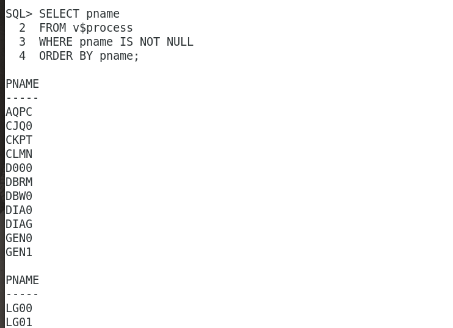
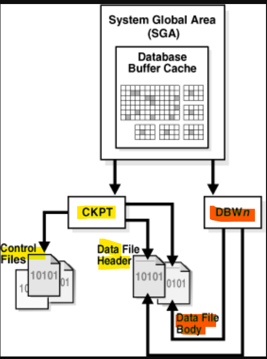
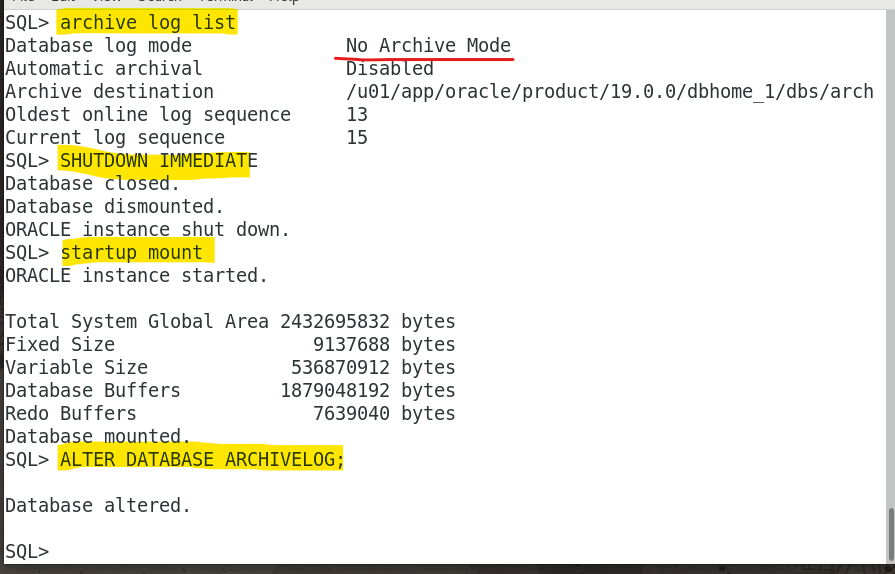
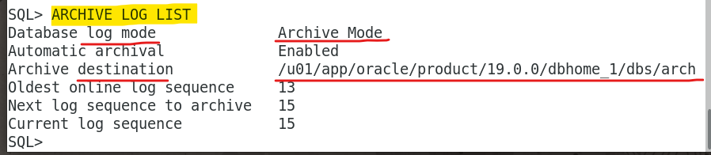

# DBA - Process: Background Processes

[Back](../../index.md)

- [DBA - Process: Background Processes](#dba---process-background-processes)
  - [Background Processes](#background-processes)
  - [Mandatory Background Processes](#mandatory-background-processes)
    - [Process Monitor Process (PMON) Group](#process-monitor-process-pmon-group)
      - [Database Resource Quarantine](#database-resource-quarantine)
    - [Process Manager (PMAN)](#process-manager-pman)
    - [Listener Registration Process (LREG)](#listener-registration-process-lreg)
    - [System Monitor Process (SMON)](#system-monitor-process-smon)
    - [Database Writer Process (DBW)](#database-writer-process-dbw)
    - [Log Writer Process (LGWR)](#log-writer-process-lgwr)
      - [LGWR and Commits](#lgwr-and-commits)
      - [LGWR and Inaccessible Files](#lgwr-and-inaccessible-files)
    - [Checkpoint Process (CKPT)](#checkpoint-process-ckpt)
    - [Manageability Monitor Processes (MMON and MMNL)](#manageability-monitor-processes-mmon-and-mmnl)
    - [Recoverer Process (RECO)](#recoverer-process-reco)
  - [Optional Background Processes](#optional-background-processes)
    - [Archiver Processes (ARCn)](#archiver-processes-arcn)
    - [Job Queue Processes (CJQ0 and Jnnn)](#job-queue-processes-cjq0-and-jnnn)
    - [Flashback Data Archive Process (FBDA)](#flashback-data-archive-process-fbda)
    - [Space Management Coordinator Process (SMCO)](#space-management-coordinator-process-smco)

---

## Background Processes

- `Background processes`

  - created by Oracle Database **automatically** when a database **instance starts**.
  - additional processes used by a multiprocess Oracle database. - **perform maintenance tasks** required to operate the database and to maximize performance for multiple users.

- **Each** `background process` has a **separate task**, but works with the other processes. 任务独立, 但相互配合.

  - e.g., the `LGWR` process **writes data** from the redo log buffer to the online redo log. When a **filled** redo log file is ready to be **archived**, LGWR signals another process to **archive** the redo log file.

- An `instance` can have **many** `background processes`, not all of which always exist in every database configuration.

---

- Command to query background processes

```sql
SELECT PNAME
FROM   V$PROCESS
WHERE  PNAME IS NOT NULL
ORDER BY PNAME;
```



---

## Mandatory Background Processes

- `Mandatory background processes`

  - presented in all typical database configurations.
    - run by default in a **read/write** database instance started with a `minimally configured initialization parameter file`.
    - A **read-only** database instance **disables** some of these processes.

- mandatory background processes:
  - Process Monitor Process (PMON) Group
  - Process Manager (PMAN)
  - Listener Registration Process (LREG)
  - System Monitor Process (SMON)
  - Database Writer Process (DBW)
  - Log Writer Process (LGWR)
  - Checkpoint Process (CKPT)
  - Manageability Monitor Processes (MMON and MMNL)
  - Recoverer Process (RECO)

---

### Process Monitor Process (PMON) Group

- The PMON group includes `PMON`, `Cleanup Main Process (CLMN)`, and `Cleanup Helper Processes (CLnn)`.

  - These processes are responsible for the **monitoring** and **cleanup** of other processes.

- The `PMON group` **oversees** cleanup of the buffer cache and the release of resources used by a client process.
  - e.g.: the PMON group is responsible for
    - resetting the status of the active transaction table,
    - releasing locks that are no longer required,
    - and removing the process ID of terminated processes from the list of active processes.

---

- `Process Monitor Process (PMON)` 监控

  - **detects the termination** of other background processes. 监控
  - If a server or dispatcher process **terminates abnormally**, then the PMON group is responsible for **performing process recovery**.

- `Cleanup Main Process (CLMN)`清理

  - `PMON` **delegates cleanup work** to the `cleanup main process (CLMN)`.
  - The task of detecting abnormal termination remains with PMON.
  - **periodically** performs cleanup of terminated processes, terminated sessions, transactions, network connections, idle sessions, detached transactions, and detached network connections that have exceeded their idle timeout.

- `Cleanup Helper Processes (CLnn)` 帮助清理
  - `CLMN` **delegates** cleanup work to the `CLnn helper processes`.
  - **assist** in the cleanup of terminated processes and sessions. The **number** of helper processes is proportional to the **amount of cleanup work** to be done and the current efficiency of cleanup.
    - Oracle Database can use **multiple** helper processes **in parallel** to perform cleanup, thus alleviating slow performance.可以多个同时

---

- `V$CLEANUP_PROCESS`:

  - provides information on the PMON processes.

- `V$DEAD_CLEANUP`:
  - shows the dead processes and killed sessions present in the instance and their cleanup status.

---

#### Database Resource Quarantine

- If a process or session terminates, then the PMON group **releases the held resources** to the database.

  - In some cases, the PMON group can **automatically quarantine** corrupted, unrecoverable resources so that the database instance is not immediately forced to terminate.自动隔离
  - The PMON group continues to perform as much cleanup as possible on the process or session that was holding the quarantined resource.尽可能清除

- `V$QUARANTINE`: provides information about quarantined objects.

---

### Process Manager (PMAN)

- `Process Manager (PMAN)`

  - **oversees** several background processes including shared servers, pooled servers, and job queue processes.

- PMAN **monitors**, **spawns**, and **stops** the following types of processes:
  - `Dispatcher` and `shared server processes`
  - `Connection broker` and `pooled server processes` for database resident connection pools
  - `Job queue processes`
  - `Restartable background processes`

---

### Listener Registration Process (LREG)

- `listener registration process (LREG)`

  - **registers** information about the `database instance` and `dispatcher processes` with the `Oracle Net Listener`.

- When an instance starts, `LREG` polls the listener to determine whether it is running.
  - If the listener is running, then `LREG` **passes** it relevant parameters.
  - If it is **not** running, then `LREG` **periodically** attempts to contact it.

---

### System Monitor Process (SMON)

- `system monitor process (SMON)`

  - in charge of a variety of **system-level cleanup** duties.

- Duties:

  - **Performing instance recovery**, if necessary, at instance **startup**.

    - In an Oracle `RAC` database, the `SMON` process of one database instance can perform instance recovery for a failed instance.

  - **Recovering terminated transactions** that were skipped during instance recovery because of file-read or tablespace offline errors.

    - SMON recovers the transactions when the tablespace or file is brought back online.

  - **Cleaning up unused temporary segments**.

    - e.g., Oracle Database allocates extents when creating an index. If the operation fails, then SMON cleans up the temporary space.

  - **Coalescing contiguous free extents** within dictionary-managed tablespaces.

- `SMON` **checks regularly** to see whether it is needed. 定期检查
- Other processes can **call** `SMON` if they detect a need for it. 可以被调用

---

### Database Writer Process (DBW)

- `database writer process (DBW)`

  - **writes** the contents of database `buffers` **to `data files`**.
  - **write** modified buffers in the database `buffer cache` **to disk**.

- **one** database `writer process (DBW0)` is **adequate** for most systems. 一个够用

  - can configure additional processes to improve write performance. 可以有多个
  - These additional DBW processes are **not** useful on `uniprocessor` systems.单进程系统无用

- Conditions to write dirty buffers to disk:

  - When a `server process` **cannot find a clean reusable buffer** after scanning a **threshold** number of buffers, it signals DBW to write. DBW writes dirty buffers to disk asynchronously if possible while performing other processing.
  - DBW **periodically** writes buffers **to advance the checkpoint**, which is the position in the redo thread from which instance recovery begins.
    - The log position of the checkpoint is determined by the **oldest** `dirty buffer` in the buffer cache.

- the writes tend to be **slower than** the **sequential** writes performed by `LGWR`. LGWR 是顺序写入, 快; DBW 是离散写入 block, 慢;
  - In many cases the blocks that `DBW` writes **are scattered** throughout the disk.
- `DBW` performs **multiblock writes** when possible to improve efficiency. 多从写入
  - The **number** of blocks written in a multiblock write **varies** by operating system.

---

### Log Writer Process (LGWR)

- `log writer process (LGWR)`

  - manages the `online redo log buffer`.
  - **writes** one portion of the `buffer` to the `online redo log`.

- Circumstances to write all redo entries

  - A user **commits** a transaction.
  - An online redo log **switch** occurs.
  - **Three seconds** have passed since LGWR last wrote.
  - The `redo log buffer` is **one-third full** or contains **1 MB** of buffered data.
  - `DBW` **must write** modified buffers to disk.

- **Before** `DBW` can write a dirty buffer, the database must write to disk the **redo records** associated with changes to the buffer (the write-ahead protocol). Redo 先于 buffer
  - If `DBW` discovers that some redo records have not been written, it **signals** `LGWR` to write the records to disk, and **waits** for LGWR to complete before writing the data buffers to disk.如果 redo 未写入, 则等待.

---

#### LGWR and Commits

- `fast commit mechanism`

  - used to improve performance for committed transactions.

- When a user issues a `COMMIT` statement, the transaction is assigned a `system change number (SCN)`.
- `LGWR` puts a commit record in the `redo log buffer` and writes it **to disk** immediately, along with the commit `SCN` and transaction's redo entries.

---

#### LGWR and Inaccessible Files

- `LGWR` writes **synchronously** to the active mirrored **group** of online redo log files. 同时写多个
  - If a log file is **inaccessible**, then `LGWR` continues writing to other files in the group and **writes an error** to the LGWR `trace file` and the `alert log`.单个失败将继续, 会有警告
  - If all files in a group are damaged, or if the group is unavailable because it has not been archived, then LGWR **cannot continue to function**. 全部文件写入失败, 则不再继续.

---

### Checkpoint Process (CKPT)

- `checkpoint process (CKPT)`

  - updates the `control file` and `data file` **headers** with checkpoint information. 与 cf 和 df 头部有关
  - signals DBW to write blocks to disk. 反馈给 DBW

- `Checkpoint information` includes

  - the checkpoint **position**,
  - SCN,
  - and location in `online redo log` to begin recovery.当恢复时用于与 redo log 对齐.

- `CKPT` does **not write data blocks** to `data files` or `redo blocks` to `online redo log files`.
  - 与数据 block 与 redo block 无关



---

### Manageability Monitor Processes (MMON and MMNL)

- `manageability monitor process (MMON)`

  - performs many tasks related to the `Automatic Workload Repository (AWR)`.
  - e.g.,`MMON` writes when a metric violates its threshold value, taking snapshots, and capturing statistics value for recently modified SQL objects.

- `manageability monitor lite process (MMNL)`
  - writes statistics from the `Active Session History (ASH)` buffer in the SGA to disk.
  - MMNL writes to disk when the ASH buffer is full.

---

### Recoverer Process (RECO)

- In a **distributed** database, the `recoverer process (RECO)` **automatically resolves** failures in distributed transactions.

- The RECO process of a node automatically connects to other databases involved in an `in-doubt distributed transaction`.
  - When RECO reestablishes a connection between the databases, it automatically resolves all in-doubt transactions, removing from each database's pending transaction table any rows that correspond to the resolved transactions.

---

## Optional Background Processes

- `optional background process`

  - any background process **not defined as mandatory**.
  - Most `optional background processes` are specific to **tasks or features**.
    - e.g., background processes that support Oracle ASM are only available when this feature is enabled.

- some common optional processes:
  - Archiver Processes (ARCn)
  - Job Queue Processes (CJQ0 and Jnnn)
  - Flashback Data Archive Process (FBDA)
  - Space Management Coordinator Process (SMCO)

---

### Archiver Processes (ARCn)

- `archiver process (ARCn)`

  - copies `online redo log files` to **offline storage** after a `redo log switch` occurs.
  - also collect transaction `redo data` and transmit it to **standby database destinations**.

- `ARCn processes` exist **only when** the database is in **`ARCHIVELOG` mode** and automatic archiving is enabled.

---

- Lab Change Archive Lod Mode

```sql
ARCHIVE LOG LIST        # check the current mode
SHUTDOWN IMMEDIATE
STARTUP MOUNT           # startup and mount the database
ALTER DATABASE ARCHIVELOG;  # alter db
ALTER DATABASE OPEN;        # Open the database
ARCHIVE LOG LIST            # check the current mode
```





---

### Job Queue Processes (CJQ0 and Jnnn)

- `job`

  - a **user-defined task** scheduled to run one or more times.

- `queue process`
  - runs user jobs, often in batch mode.

---

### Flashback Data Archive Process (FBDA)

- `flashback data archive process (FBDA)`

  - **archives** historical rows of tracked tables into `Flashback Data Archives`.

- When a transaction containing DML on a tracked table **commits**, this process stores the pre-image of the changed rows into the `Flashback Data Archive`. It also keeps metadata on the current rows.

- `FBDA` automatically manages the `Flashback Data Archive` for space, organization, and retention.
- Additionally, the process keeps track of how long the archiving of tracked transactions has occurred.

---

### Space Management Coordinator Process (SMCO)

- `SMCO` process

  - coordinates the execution of various space management related tasks.

- Typical tasks include **proactive space allocation** and **space reclamation**.
- SMCO dynamically **spawns** `slave processes (Wnnn)` to implement the task.

---

[TOP](#dba---process-background-processes)
