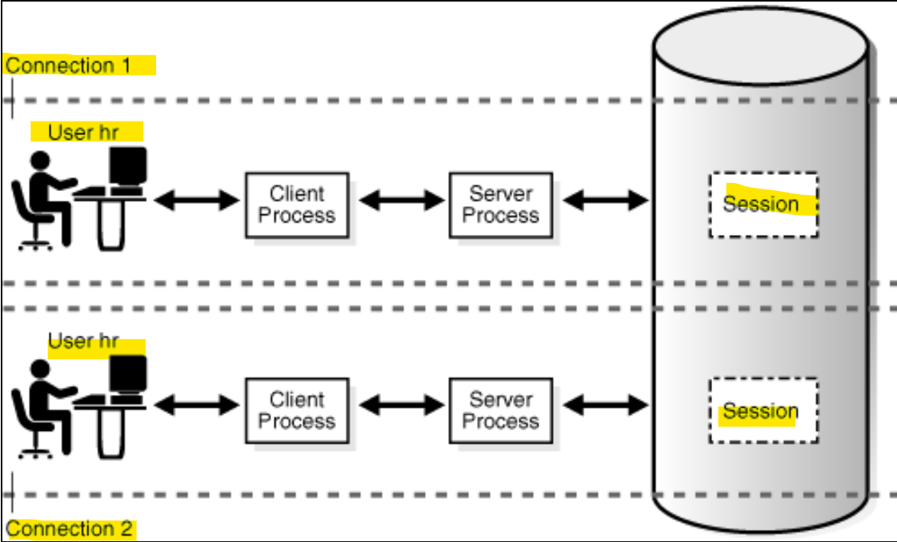
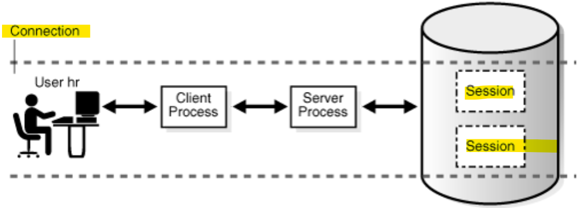
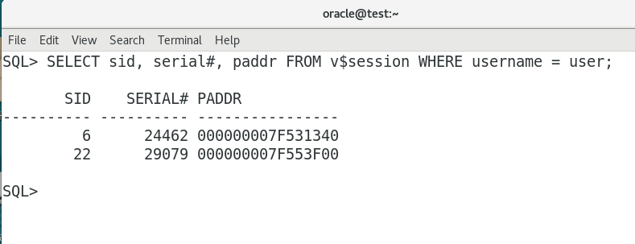

# DBA - Process: Client Processes

[Back](../../index.md)

---

## Client Processes

- When a user **runs an application** e.g., SQL\*Plus, the operating system **creates** a `client process` / `user process` to run the user application.
  - 当用户使用应用时, 系统创建

### Client and Server Processes

- `Client processes` vs `Oracle processes`:

  - `Oracle processes`:
    - can read from and write to the SGA. 可以读写 SGA
    - must run on the same host as the database host. 同一主机
  - `client process`
    - cannot read from and write to the SGA. 不能直接读写
    - can run on a host other than the database host. 可以是不同主机.

- Example:
  - a user on a client host starts SQL\*Plus, and then connects over the network to database sample on a different host when the database instance is not started
    - On the client host: a search of the processes shows only the sqlplus client process. 用户主机只显示 app 进程
    - On the database host: search of the processes hows a server process with a nonlocal connection, but no client process. DB 主机显示服务器进程, 不显示客户进程.

---

### Connections and Sessions

- `database connection`

  - a **physical communication** pathway between a `client process` and a `database instance`.

- a connection occurs

  - Typically between a `client process` and a `server process` or `dispatcher`,
  - can also between a `client process` and `Oracle Connection Manager (CMAN)`.

- `database session`:

  - a **logical entity** in the database instance **memory** that represents the **state of a current user login to a database**.
    - e.g.: when a user is **authenticated** by the database with a password, a **session is established** for this user.

- A session lasts from **the time the user is authenticated** by the database until the time the user **disconnects** or **exits** the database application.

- `connection` vs `session`
  - - A single `connection` can have 0, 1, or more `sessions` established on it. 连接可以由多个会话
  - The `sessions` are **independent**: a commit in one session does not affect transactions in other sessions.会话间独立.

---

- User vs `session`

- **Multiple** `sessions` can exist concurrently for a **single** database `user`.

- In **dedicated** server connections:
  - the database creates a `server process` on behalf of each connection.独享连接: 服务器进程即连接.
  - Only the `client process` that causes the **dedicated server** to be created **uses** it. 用户进程触发独享服务器进程的创建; 也只有用户能专用
- In a **shared** server connection

  - **many** `client processes` access a **single shared** `server process`. 单一共享服务器进程

- Example:



> - user hr can have multiple connections to a database.
>   单一用户可以由多个连接



> - user hr can have single connections to a database with multiple sessions.
>   单一用户可以有多个会话

---

### `V$SESSION`

- `V$SESSION`:
  - displays session information for each current session.

```sql
SELECT sid, serial#, paddr FROM V$SESSION WHERE username = user;
```



- `DISCONNECT` command actually ends the sessions, not the connection.

---

### Database Operations

- `database operation`

  - session activity between two points in time
  - defined by the end users or application code.

- `simple database operation`:

  - either a single SQL statement
  - or a single PL/SQL procedure or function

- `composite database operation`:

  - a set of single or composite operations

- User can **divide** a large set of `tasks` into `database operations`, and **subdivide** operations into `phases`.

  - By configuring the job as a database operation, you can identify and tune the expensive steps in the job.

- Each **execution** of a `database operation` is **uniquely** identified by a pair of attributes:

  - `operation name` and `execution ID.`

- One `session` can start or stop a `database operation` in a different session by specifying its `session ID` and `serial number`.

- Two occurrences of the **same** `database operation` can execute at the same time using the **same name but different** `execution IDs`.
- Each **execution** of a `database operation` with the same name can contain **different statements**.

| Target             | Identified                        |
| ------------------ | --------------------------------- |
| database operation | `operation name` + `execution ID` |
| session            | `session ID` + `serial number`    |

- 总结:
  - db operation can:
    - same name but diff statements
    - same name but diff ID
    - be divided

---

[TOP](#dba---process-client-processes)
