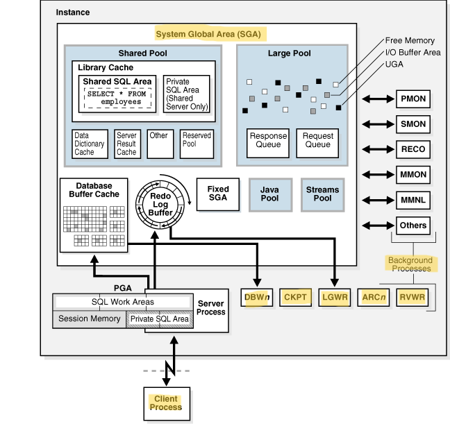

# DBA - Process Architecture

[Back](../../index.md)

- [DBA - Process Architecture](#dba---process-architecture)
  - [Processes](#processes)
    - [Types of Processes](#types-of-processes)
    - [Multiprocess and Multithreaded Oracle Database Systems](#multiprocess-and-multithreaded-oracle-database-systems)
    - [`V$PROCESS`](#vprocess)

---

## Processes

- Processes **run code modules**. 与代码关系
- All connected Oracle Database users must run the following **modules** to access a database instance: 必须与模组有关

  - **Application or Oracle Database utility**
    - A database user runs a **database application that issues SQL statements** to a database.
  - **Oracle database code**
    - Each user has **Oracle database code** executing on his or her behalf that interprets and processes the application's SQL statements.

- A process normally runs **in its own private memory area**. 内存关系
- Most processes can **periodically write** to an associated **trace file**. 文件关系

---

### Types of Processes

- Processes are divided into the following types:

  - `client process`:
    - runs the **application** or **Oracle tool code**.
  - An` Oracle process`
    - a unit of execution that **runs the Oracle database code**.
    - subtypes:
      - `background process`
        - **starts with** the database instance and perform **maintenance tasks**.
      - `server process`
        - performs work based on a **client request**.
        - Server processes, and the process memory allocated in these processes, run **in the database instance**.
        - The `instance` **continues to function** when server processes terminate.
      - `slave process`
        - performs additional **tasks for a background or server process**.

- `shared server` connection:
  - **each** `server process` that runs database code can serve **multiple** `client processes`.
- `dedicated server` connection:
  - Each `client process` is associated with its **own** `server process`, which has its own `program global area (PGA)`.



---

### Multiprocess and Multithreaded Oracle Database Systems

- `Multiprocess Oracle Database` / `multiuser Oracle Database`
  - uses **several processes** to run **different parts** of the Oracle Database code and **additional Oracle processes** for the **users**
  - By dividing the work of the database and applications into several processes, multiple users and applications can **connect** to an instance **simultaneously** while the system gives **good performance**.

---

### `V$PROCESS`

- `V$PROCESS`
  - displays information about the currently active processes.

```sql
# Get operating system process ID and operating system thread ID for each process
SELECT SPID, STID, PROGRAM FROM V$PROCESS ORDER BY SPID;
```


---

| Type         | Process           | Description                       |
| ------------ | ----------------- | --------------------------------- |
| Client       | Client Processes  | run the user application.         |
| Server       | Server Processes  | handle the requests.              |
| Mandatory BG | `PMON`            | monitor and cleanup processes     |
| Mandatory BG | `PMAN`            | oversees bg processes             |
| Mandatory BG | `LREG`            | registers listener                |
| Mandatory BG | `SMON`            | system-level cleanup              |
| Mandatory BG | `DBW`             | writes buffers to data files      |
| Mandatory BG | `LGWR`            | writes buffers to online redo log |
| Mandatory BG | `CKPT`            | control file + data file headers  |
| Mandatory BG | `MMON` and `MMNL` |                                   |
| Mandatory BG | `RECO`            | resolves failures                 |
| Optional BG  | `ARCn`            | copies to offline storage         |
| Optional BG  | `CJQ0`, `Jnnn`    | runs user jobs                    |
| Optional BG  | `FBDA`            | archives Flashback Data Archives  |
| Optional BG  | `SMCO`            | coordinates space management      |

---

[TOP](#dba---process-architecture)
