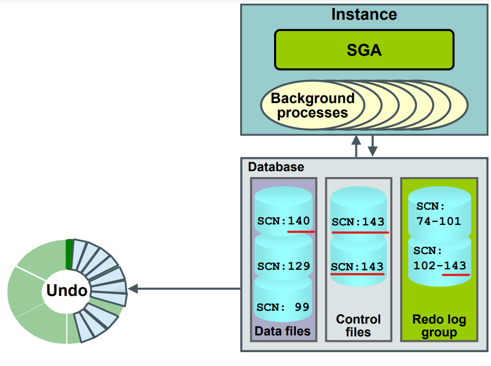
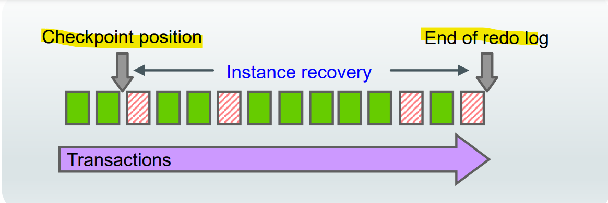
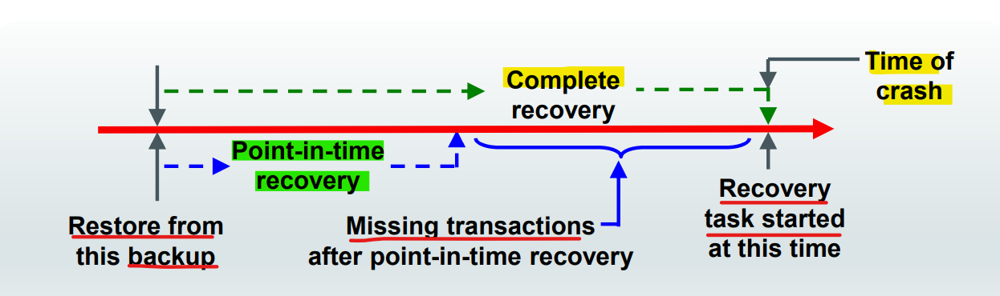
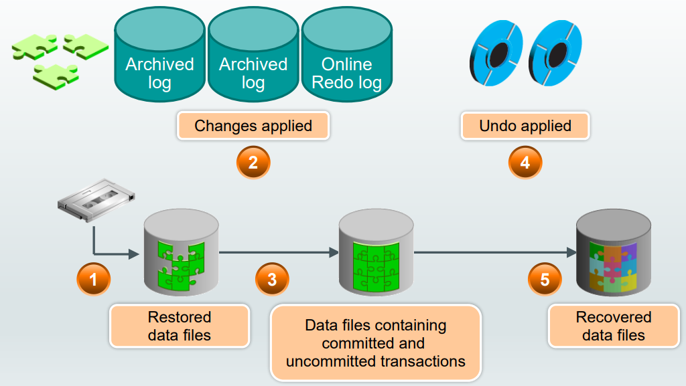
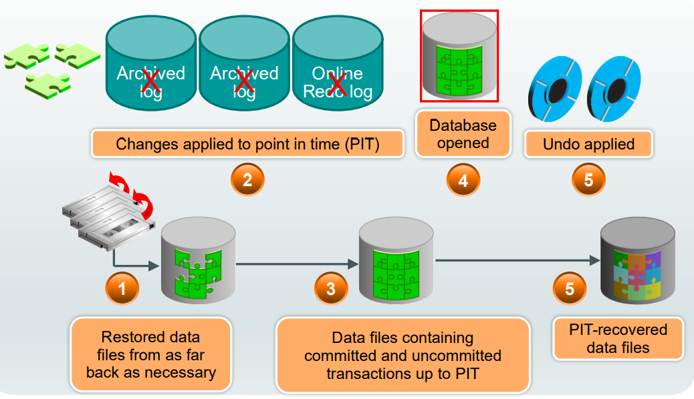
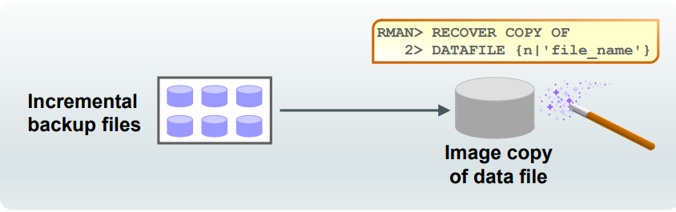

# Oracel Recovery

[Back](../../index.md)

- [Oracel Recovery](#oracel-recovery)
  - [Data Repair Techniques](#data-repair-techniques)
  - [Restoring and Recovering](#restoring-and-recovering)
    - [`RMAN` Command](#rman-command)
  - [File Loss](#file-loss)
  - [Instance Failure](#instance-failure)
    - [Instance Recovery](#instance-recovery)
    - [Phases of Instance Recovery](#phases-of-instance-recovery)
    - [Tuning Instance Recovery](#tuning-instance-recovery)
    - [Using the MTTR Advisor](#using-the-mttr-advisor)
  - [Media Failure](#media-failure)
    - [`Complete Recovery` VS `Incomplete Recovery`](#complete-recovery-vs-incomplete-recovery)
    - [Complete Recovery Process](#complete-recovery-process)
    - [Point-in-Time Recovery Process](#point-in-time-recovery-process)
  - [Recovery with `RESETLOGS` Option](#recovery-with-resetlogs-option)
  - [Quiz](#quiz)
  - [case study: e best approach for recovery](#case-study-e-best-approach-for-recovery)
    - [Case 1](#case-1)
    - [Case Study 2](#case-study-2)
    - [Case Study 3](#case-study-3)
  - [Performing Complete Recovery](#performing-complete-recovery)
    - [In `NOARCHIVELOG` Mode](#in-noarchivelog-mode)
    - [In `NOARCHIVELOG` Mode with `Incremental Backups`](#in-noarchivelog-mode-with-incremental-backups)
    - [IN `ARCHIVELOG` mode](#in-archivelog-mode)
  - [Recovering Image Copies](#recovering-image-copies)
    - [Performing a Fast Switch to Image Copies](#performing-a-fast-switch-to-image-copies)
  - [Restore Points](#restore-points)
  - [Quiz](#quiz-1)

---

## Data Repair Techniques

- Types of data loss:

  - **Physical failure**

    - e.g., missing or corrupted data file
    - Solution:
      - Data Recovery **Advisor**
      - Data **File Media** Recovery
      - **Block** Recovery

  - **Logical failure**
    - e.g., application or user error
    - Solution:
      - `Logical Flashback` Features
      - `Oracle Flashback Database`
      - `Point-in-Time Recovery`:
        - `Database Point-in-Time Recovery (DBPITR)`
        - `Tablespace Point-in-Time Recovery (TSPITR)`
        - `Table Point-in-Time Recovery (TPITR)`

---

## Restoring and Recovering

- `Restoring`:

  - Files:
    - Database (all data files)
    - Tablespaces
    - Archived redo logs
    - Control files
    - Server parameter files
  - Automatically done by RMAN:
    - **Backup selection**
    - Restore **failover**
    - Restore **optimization** and so on

- `Recovering`:
  - Redo log

---

### `RMAN` Command

- `RESTORE`:

  - Restores `database files` **from backup**

- `RECOVER`:

  - Recovers restored files by **applying changes** recorded in `incremental backups` and `redo log files`
  - after restoring, the goal is to bring the target up-to-date with latest changes.

```sql
-- rman command
-- take tbsp offline immediately, user cannot access the objects in the offline tbsp
ALTER TABLESPACE inv_tbs OFFLINE IMMEDIATE;

-- restores the specified tablespace inv_tbs from a backup.
RESTORE TABLESPACE inv_tbs;

-- Recovery is performed after restoring a tablespace to bring it up-to-date with changes that have occurred since the backup was taken.
-- Oracle applies archived redo logs or incremental backups to roll forward transactions and make the tablespace consistent with the rest of the database.
RECOVER TABLESPACE inv_tbs;
-- brings the specified tablespace inv_tbs back online, making it accessible to users and applications.
ALTER TABLESPACE inv_tbs ONLINE;
```

- The `Cloud Control Recovery Wizard` creates and runs an `RMAN` **script** to perform the recovery.

---

## File Loss

- `File loss`
- caused by:原因

  - User error
  - Application error
  - Media failure

- `noncritical file loss`:

  - one where the database can **continue to function**.

- **Solution**:
  - **Creating** a **new** file
  - **Rebuilding** the file
  - **Recovering** the lost or damaged file

---

## Instance Failure

- Solution for causes:

  - **Causes**:

    - Power outage
    - Hardware failure
    - **Solution**:
      - Restart the instance by using the `STARTUP` command. Recovering from instance failure is **automatic**, including `rolling forward changes` in the `redo logs` and then `rolling back` any **uncommitted** transactions.

  - **Cause**:
    - Failure of one of the **critical** `background processes`
    - Emergency shutdown procedures (`SHUTDOWN ABORT`)
    - **Solution**:
      - Investigate the causes of failure by using the `alert log`, `trace files`, and `Cloud Control`

---

### Instance Recovery

- **Automatic** instance or crash recovery:
  - caused by attempts to **open a database whose files are not synchronized on shutdown**
  - Uses information stored in `redo log groups` to synchronize files
  - Involves two distinct operations:
    - 1. `Rolling forward`:
      - Redo log changes (**both committed and uncommitted**) are applied to `data files`. 令到 df 对齐
    - 2. `Rolling back`:
      - Changes that are made but **not committed** are **returned to their original state**

---

### Phases of Instance Recovery

1. Startup instance (data files are out of sync)
2. Roll forward (redo)
3. Committed and uncommitted data in files
4. Database opened
5. Roll back (undo)
6. Committed data in files



---

### Tuning Instance Recovery

- During instance recovery, the transactions between the **checkpoint position** and the **end of the redo log** **must be applied** to `data files`.
- You tune instance recovery by **controlling the difference** between the **checkpoint position** and **the end of the redo log**.



---

### Using the MTTR Advisor

- Specify the desired time in seconds.
- The default value is 0 (disabled).
- The maximum value is 3,600 seconds (one hour)

```sql
ALTER SYSTEM SET fast_start_mttr_target = 30 SCOPE=BOTH;
```

---

## Media Failure

- Typical Causes:

  - Failure of **disk drive**
  - Failure of **disk controller**
  - Deletion or corruption of a file **needed for database operation**

- Possible Solutions
  1. **Restore** the affected file from backup.
  2. Inform the database about a new file **location** (if necessary).
  3. **Recover** the file by applying **redo information** (if necessary).

---

### `Complete Recovery` VS `Incomplete Recovery`

- `Complete recovery`:

  - Brings the database or tablespace **up to the present**, including all committed data changes made **to the point in time when the recovery was requested**.

- `Incomplete` or `point-in-time recovery (PITR)`:
  - Brings the database or tablespace **up to a specified point** in time in the past, **before** the recovery operation was requested



---

### Complete Recovery Process

1. Restored `data files`
2. Changes applied
   - `Archived log`
   - `Online Redo log`
3. `Data files` containing **committed** and **uncommitted** transactions
4. **Undo** applied
5. Recovered `data files`



---

### Point-in-Time Recovery Process

1. Restored `data files` **from as far back** as necessary
2. Changes applied to `point in time (PIT)`
   - No `Archived log`, `Online Redo log`
3. Data files containing **committed** and **uncommitted** transactions up to `PIT`
4. Database **opened**
5. **Undo** applied
6. PIT-recovered `data files`



---

## Recovery with `RESETLOGS` Option

- Issue: **Missing** archive logs for target recovery `SCN`
- Workflow:

1. **Restore** backups.
2. **Recover** as far forward as the unbroken series of archive logs allows.
3. Open the database with the `RESETLOGS` option.

- A new `database incarnation` is **automatically created** to avoid confusion when two different redo streams have the same SCNs, but occurred at different times.
- Note: **Changes** after the last applied `archive log` are **lost**.

- 重置 log, 避免同一个 SCN 有两个 redo

---

## Quiz

- Which of the following Oracle technologies enable you to recover from **logical errors** in the database?

  - a. Flashback technologies
  - b. LogMiner
  - c. RMAN TSPITR
  - Key: a, b, c

- During instance **recovery**, which of the following operations take place?

  - a. Data files are restored from backups.
  - b. Changes made by committed and uncommitted transactions are applied to the data files via redo log entries.
  - c. Uncommitted transactions are rolled back.
  - key: b,c, 实例恢复不涉及 df restore; 只有 media

- To perform point-in-time recovery, all data files must be restored by using backups taken **before** the requested recovery point.

  - a. True
  - b. False
  - key: a, before the point of time

- `Oracle Flashback Database` is the most efficient alternative to `DBPITR` because it does **not** require you to **restore data files** and requires only limited application of **redo** compared to media recovery.
  - a. True
  - b. False
  - key, flashbask = rollback, not restore df, a logical recovery.

---

## case study: e best approach for recovery

### Case 1

- Backups are taken during a nightly **shutdown**, with an `incremental backup` strategy. A level 1 backup is applied to the previous level 0 backup each night. The `ARCHIVE LOG LIST` command shows the following:

```sql
SQL> archive log list
-- Database log mode              No Archive Mode
-- Automatic archival             Disabled
-- Archive destination            USE_DB_RECOVERY_FILE_DEST
-- Oldest online log sequence     61
-- Next log sequence to archive   63
-- Current log sequence           63
```

- A disk containing the `SYSAUX` tablespace data files has crashed.

- Q:
  - 1. Is complete recovery possible? What are the steps?
    - no archvie, cannot recovery the last, not possible,
    - Complete recovery is not possible because the database is not in `archive log mode`, and `automatic archival` is **disabled**. Without archived redo logs, point-in-time recovery to a specific SCN (System Change Number) is not feasible. However, you can perform an `incomplete recovery` up to the latest available redo log sequence.
  - 2. If complete recovery is not possible, what are the steps to recover as much as possible? What data (transactions) is lost?
    - Steps:
      - Restore Backup Files
      - Mount the Database: `STARTUP MOUNT`
      - Restore and Recover Data Files: `RESTORE TABLESPACE SYSAUX;` + `RECOVER TABLESPACE SYSAUX;`
      - Open the Database: `ALTER DATABASE OPEN;`
    - Any transactions that occurred after the last available redo log sequence will be lost.

---

### Case Study 2

- Database backups are taken **nightly online**, with an `incremental backup` strategy. A level 1
  backup is applied to the previous level 0 backup each night. The` ARCHIVE LOG LIST` command
  shows the following:

```sql
SQL> archive log list
-- Database log mode              Archive Mode
-- Automatic archival             Enabled
-- Archive destination            USE_DB_RECOVERY_FILE_DEST
-- Oldest online log sequence     61
-- Next log sequence to archive   63
-- Current log sequence           63
```

- A data file that is part of the application tablespace, containing critical data, has been lost.
- Q: Describe the steps to perform a complete recovery.
  - Steps:
    - 1. Restore Level 0 Backup. RMAN> `RESTORE DATABASE FROM 'backup_location' LEVEL 0;`
    - 2. Apply Incremental Backups. RMAN> `RECOVER DATABASE;`
    - 3. Recover Lost Data File. RMAN> `RESTORE DATAFILE '<lost_datafile_path>';`
    - 4. Perform Media Recovery. RMAN> `RECOVER DATAFILE '<lost_datafile_path>';`
    - 5. Open Database. SQL> `ALTER DATABASE OPEN;`

---

### Case Study 3

- The effects of a batch job that was **incorrectly** executed on the database last night at **8:00 p.m.** have been removed by performing an `incomplete recovery` to **6:00 p.m**. After the incomplete recovery, the database was reopened.

- The checks that were performed following the recovery revealed that some **critical transactions** performed prior to **7:15 p.m**. are **not** in the database.

  - 1. What are the valid options to recover these transactions?

    - If` archived redo logs` containing the missing critical transactions are **available**, perform additional `Incomplete Recovery` to the point after 7:15 p.m. transactions.
    - If a `backup` taken after 7:15 p.m. is available, you can restore the database from that backup.

  - 2. Describe the requirements for recovering these transactions.
    - Archived Log Mode: Ensure that the database is operating in archived log mode. This mode is necessary for Oracle to archive redo logs, which are essential for recovering transactions.

---

## Performing Complete Recovery

- Check backup's availability

| RMAN                      | Command                                                                                                                                | Action |
| ------------------------- | -------------------------------------------------------------------------------------------------------------------------------------- | ------ |
| `RESTORE PREVIEW`         | RMAN **reports** the `backups` and `archived redo log files` that RMAN uses to restore and recover the database to the specified time. |
| `RESTORE VALIDATE`        | RMAN **determines** which backup sets, data file copies, and archived redo log files need to be restored and then **validates** them.  |
| `RECOVER VALIDATE HEADER` | **Reports and validates** the backups that RMAN could use to restore files needed for the recovery                                     |

---

### In `NOARCHIVELOG` Mode

- If the database is in `NOARCHIVELOG` mode and if any data file is lost, perform the following tasks:

1. **Shut down** the instance if it is not already down.
2. **Restore** the **entire** database, including all data and control files, from the backup.
3. **Open** the database.
4. Inform users that they must **reenter all changes** that were made since the last backup.

---

### In `NOARCHIVELOG` Mode with `Incremental Backups`

- Use incremental backups to perform limited recovery of a database in `NOARCHIVELOG` mode.

```sql
-- starts the instance but does not mount the database
STARTUP FORCE NOMOUNT;
-- restores the control file of the database
RESTORE CONTROLFILE;
-- mounted but not opened, control file is read
ALTER DATABASE MOUNT;
--  restores the database files from the incremental backups
RESTORE DATABASE;
-- applies incremental backups to roll forward changes made to the database since the last backup.
-- NOREDO option specifies that only incremental backups should be applied for recovery.
-- in NOARCHIVELOG mode, you cannot apply redo logs
-- 即使用backup来对齐, 而不是redo
RECOVER DATABASE NOREDO;
-- opens the database with resetlogs
-- resets the online redo logs and opens the database for normal operations with a new redo log sequence.
ALTER DATABASE OPEN RESETLOGS;
```

---

### IN `ARCHIVELOG` mode

- Loss of a **noncritical** `data file` in `ARCHIVELOG` mode:

  - If a data file is lost or corrupted, and if that file does not belong to the `SYSTEM` or `UNDO` tablespace, you restore and recover the missing data file **while the database is open**.可以在 db 打开时恢复非重要 df
  - Recovery is possible up to the time of the **last commit**, and **users are not required to reenter** any data. 对齐到上次提交

- Loss of a **critical** `data file` in `ARCHIVELOG` mode:

  - 1. The instance may or may not shut down automatically.
    - If it does not, use `SHUTDOWN ABORT` to bring the instance down.
  - 2. Mount the database.
  - 3. Restore and recover the missing data file.
  - 4. Open the database

- 重要的, 必须重启+离线恢复.

```sql
SHUTDOWN ABORT;
STARTUP MOUNT;
RECOVER DATAFILE '<datafile_name>';
ALTER DATABASE OPEN;
```

---

## Recovering Image Copies

- RMAN can recover `image copies` by using `incremental backups`:
  - Image copies are updated **with all changes up to** the `incremental backup SCN`.
  - Incremental backup **reduces** the time required for media recovery.
  - There is no need to perform an image copy after the incremental restoration.



```sql
RECOVER COPY OF
DATAFILE {n|'file_name'}
```

---

- Example:

- RMAN
  - If you run these commands daily:

```sql
recover copy of database with tag 'daily_inc';

backup incremental level 1 for recover of copy with tag 'daily_inc' database;
```

- Result:

|                  | RECOVER                             | BACKUP                     |
| ---------------- | ----------------------------------- | -------------------------- |
| Day 1            | Nothing                             | Create image copies        |
| Day 2            | Nothing                             | Create incremental level 1 |
| Day 3 and onward | Recover copies based on incremental | Create incremental level 1 |

---

### Performing a Fast Switch to Image Copies

- Perform `fast recovery` by performing the following steps:
  - 1. Take data files **offline**.
  - 2. Use the `SWITCH TO ... COPY` command to switch to `image copies`.
  - 3. Recover data files.
  - 4. Bring data files **online**.
  - Now the data files are recovered and usable in their new location.

- Optionally, do the following to put the files back into their original location:

  - 1. Create an `image copy` of the data file in the original location.
  - 2. Take data files **offline**.
  - 3. `SWITCH TO ... COPY`
  - 4. **Recover** data files.
  - 5. Bring data files **online**.

- Example: ` SWITCH DATAFILE 'filename' TO COPY;`

---

- Using `SET NEWNAME` for Switching Files

  - Use the `SET NEWNAME` command in a `RUN` block to restore to a **nondefault location**.
  - Instead of individual names, **specify a default name format** for **all files** in a database or in a named tablespace.
  - The **default name** is used for `DUPLICATE`, `RESTORE`, and `SWITCH` commands in the `RUN` block.
  - 指定为switch一个新的非默认路径

- Example:

```sql
RUN
{
  -- allocates an RMAN channel named dev1 for backup or restore operations.
  -- DEVICE TYPE DISK clause specifies that the channel will use disk devices for I/O operations.
  ALLOCATE CHANNEL dev1 DEVICE TYPE DISK;
  -- allocates another RMAN channel named dev2
  -- DEVICE TYPE sbt. The sbt device type typically refers to a third-party media management library, often used for tape backups.
  ALLOCATE CHANNEL dev2 DEVICE TYPE sbt;
  -- take the tablespace named users offline immediately.
  SQL "ALTER TABLESPACE users OFFLINE IMMEDIATE";
  -- specifies a new destination for the datafile located at /disk1/oradata/prod/users01.dbf.
  -- It tells RMAN to restore the datafile to the specified location /disk2/users01.dbf.
  SET NEWNAME FOR DATAFILE '/disk1/oradata/prod/users01.dbf'
  TO '/disk2/users01.dbf';
  -- restores the tablespace named users.
  -- It retrieves the necessary data files and other associated metadata from the backup media.
  RESTORE TABLESPACE users;
  -- switches all restored datafiles to their respective restored copies.
  -- After restoring a datafile to a new location, this command updates the control file to point to the new location of the datafile.
  SWITCH DATAFILE ALL;
  -- applies any necessary redo logs or incremental backups to bring the tablespace up to date.
  RECOVER TABLESPACE users;
  -- bring the tablespace named users back online
  SQL "ALTER TABLESPACE users ONLINE";
}
```

---

## Restore Points

- `restore point`
  - provides a **name** to a `point in time`.

```sql
-- now
CREATE RESTORE POINT before_mods;

-- Some time in the past:
CREATE RESTORE POINT end_q1 AS OF SCN 100;
```

---

## Quiz

- When the database is in `ARCHIVELOG` mode, the database can remain open while you recover from a loss to the `SYSTEM` tablespace.
  - a. True
  - b. False
  - key, false, system is critical, need shutdown and startup mount

---

[TOP](#oracel-recovery)
