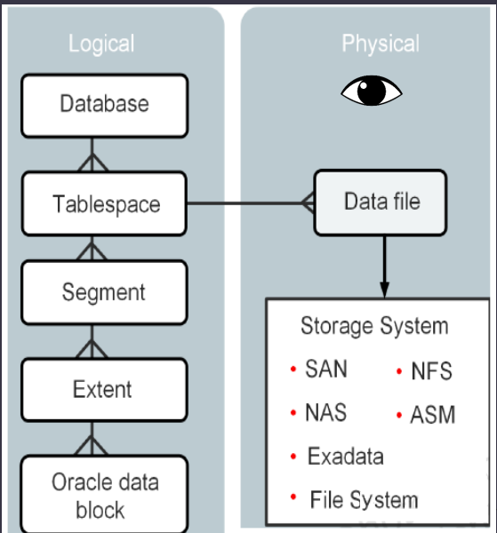
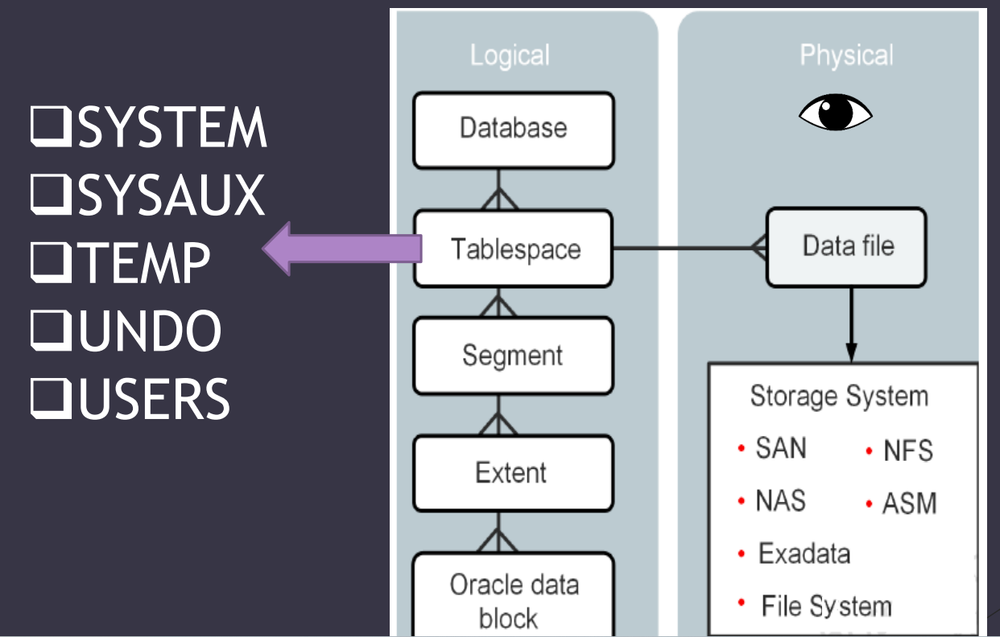

# DBA - Storage Structure

[Back](../index.md)

- [DBA - Storage Structure](#dba---storage-structure)
  - [Logical Storage Structures](#logical-storage-structures)
  - [Default tablespaces](#default-tablespaces)

---

## Logical Storage Structures

- `Logical storage structures`

  - enable Oracle Database to have fine-grained(精确的) control of disk space use.

- `physical`:

  - can be seen by eyes.

- `Data blocks`

  - At the finest level of granularity, **Oracle Database data is stored in `data blocks`**.
  - A single Oracle Data Block contains **one or more rows**
  - **One data block** corresponds to **a specific number of bytes** on disk.
  - 1 Block= 8 K by default

- `Extents`

  - a specific number of logically **contiguous data blocks**, obtained in a single allocation, used **to store a specific type of information**.

- `Segments`

  - a **set of extents** allocated for a **user object** (for example, a table or index), **undo data**, or **temporary data**.
  - allocated for certain **logical structures inside the database**
    - ex: table, index
    - ont table, index equals to one segment.

- `Tablespaces`
  - A database is divided into **logical storage units** called tablespaces.
  - A tablespace is the **logical container for segments**.
  - Tablespaces are logical storage groups that can be used to store logical database constructs, such as tables and indexes
  - Logically it stores the database files
    - Each tablespace consists of at least one data file.
    - Can be many to one relationship.

- `SAN`: Storage area network
- `NAS`: network attached storage
- `NFS`: network file system
- `ASM`: automatic storage management

---

## Default tablespaces

- `SYSTEM` tablespace

  - Used for **core functionality**.
  - Stores the `data dictionary`
    - belong to `sys` schema.
  - Oracle create system tablespace **automatically** when the database is created.
  - you **cannot rename or drop** the SYSTEM tablespace.

- `SYSAUX` tablespace

  - an **auxiliary** tablespace to the SYSTEM tablespace.
  - It **reduces the load** on the SYSTEM tablespace.
  - Oracle create it **automatically** when the database is created
  - you **cannot rename or drop** the SYSAUX tablespace.

- `TEMP` tablespace

  - are used to manage space **for database sort and joining operations** and for **storing global temporary tables**.
  - Other SQL operations that might require disk **sorting** are:
    - CREATE INDEX, ANALYZE,SELECT DISTINCT, ORDER BY, GROUP BY, UNION, INTERSECT, MINUS,…

- `UNDO` tablespace

  - is used to **roll back**, or **undo changes** to the database.
  - Roll back transactions when a `ROLLBACK` statement is issued
  - **Recover** the database
  - Provide read **consistency**

- `USERS` tablespace

  - Stores **users objects and data**
  - every database should have a tablespace for permanent user data that is assigned to users.
    - Otherwise, user objects will be created in the SYSTEM tablespace, which is not good practice.
  - In the preconfigured database, `USERS` is designated as the **default tablespace for all new users**.

- Note: all these tablespaces exits in the `container database` and also the `pluggable databases`.

---

[TOP](#dba---storage-structure)
