# DBA - Users: Common users VS Local users

[Back](../../index.md)

- [DBA - Users: Common users VS Local users](#dba---users-common-users-vs-local-users)
  - [Common User VS Local User](#common-user-vs-local-user)
    - [CDB Common User](#cdb-common-user)
    - [Local User](#local-user)
  - [Common Privilege VS Local Privilege](#common-privilege-vs-local-privilege)
  - [Common Role vs Local Role](#common-role-vs-local-role)
  - [Lab: Query Users](#lab-query-users)
    - [Query ALL Users](#query-all-users)
    - [Query `Common Users`](#query-common-users)
    - [Query `Local Users`](#query-local-users)
  - [Lab: `Common User`](#lab-common-user)
    - [Create a `Common User`](#create-a-common-user)
    - [Grant `Common User` Privileges](#grant-common-user-privileges)
    - [Revoke `Common User` Privileges](#revoke-common-user-privileges)
  - [Lab: `Local User`](#lab-local-user)
    - [Create a `Local User`](#create-a-local-user)
    - [Grant `Local User` Privileges](#grant-local-user-privileges)
  - [Lab: Role](#lab-role)
    - [Query all `Common Roles`](#query-all-common-roles)
    - [Create `Common Role`](#create-common-role)
    - [Commonly grant a `common user` a `common role`](#commonly-grant-a-common-user-a-common-role)
    - [Locally grant a `common user` a `common role`](#locally-grant-a-common-user-a-common-role)

---

## Common User VS Local User

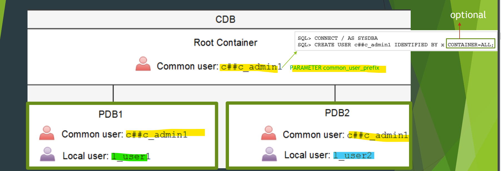

---

### CDB Common User

- `CDB common user`

  - a database account that is created **in the root container** and is **inherited by all PDBs** in the CDB, including future PDBs
    - can access root and all pdbs.
  - **can not have the same name** as any `local user` across all the PDBs.
  - can have different privileges in different PDBs.可以有不同权限

- All **Oracle-supplied administrative user** accounts are `CDB common users`

- Parameter `common_user_prefix`:

  - the names of `common users`, `roles`, and `profiles` in a multitenant container database (CDB) **must start with**.

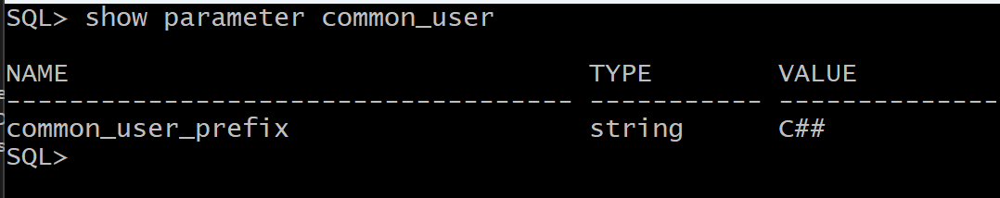

- `Common User` creation:

  - Must in the root.
  - need **prefix**, default = `C##`
    - e.g., `C##KHALED`

```sql
CON / as sysdba;
CREATE USER C##user_name IDENTIFIED BY pwd CONTAINER=ALL;
-- CONTAINER=ALL: optional.
```

---

### Local User

- `Local user`

  - a database user that **exists only in a single** PDB.
    - e.g., HR user in PDB orclpdb
  - can create same local account and password **in more than one PDB**
  - e.g.,:
    - HR user in PDB called pdb1,
    - HR user in PDB called pdb2,
    - HR user in PDB called pdb3

- vs `Common User`:
  - `Local user` **cannot create** `common user` or **grant them privileges**.
    - With the appropriate privileges,
      - A `common user` can **create and modify** `common user` or `local user`. 通用修改: 横向+纵向
      - A `local user` can **create and modify** `local user`. 本地修改: 横向
      - A `common user` can **grant and revoke** privileges, **commonly** or **locally**. 通用授权+褫夺: 横向+纵向
      - A `local user` can grant privileges to `common users` or `local users` **locally** in a given PDB. 本地授权: 通用+本地
  - DBA can grant `local user` the `common roles`. 本地可以有通用角色.
    - the privileges associated with the common role **only apply to the local user's PDB**. 角色权限仅限本地.
  - The `local user` account **must be unique only within its PDB**. 本地名:本地唯一
  - With the appropriate privileges, a `local user` can access objects in a `common user`'s **schema**. 本地可以访问通用的对象.

---

## Common Privilege VS Local Privilege

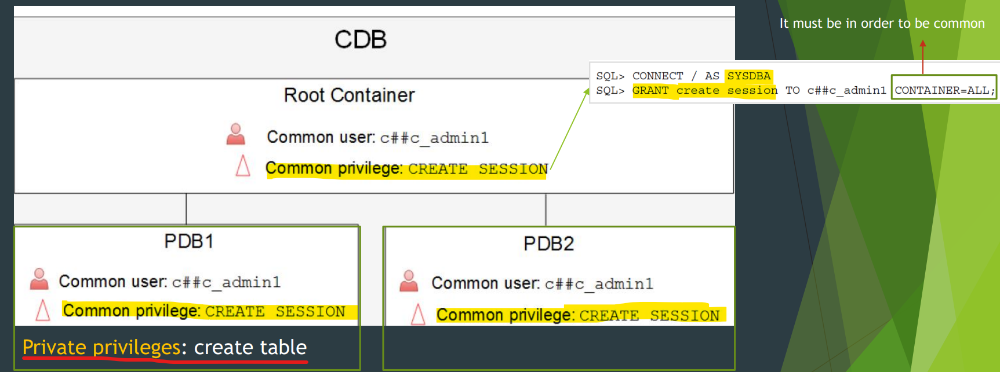

- Private Privileges:

  - only available for a pluggable database.

- To grant a common privilege, statement must contain `CONTAIN=ALL`.
  - Otherwise, it juse a Local privilege **available only in the CDB**.

---

## Common Role vs Local Role

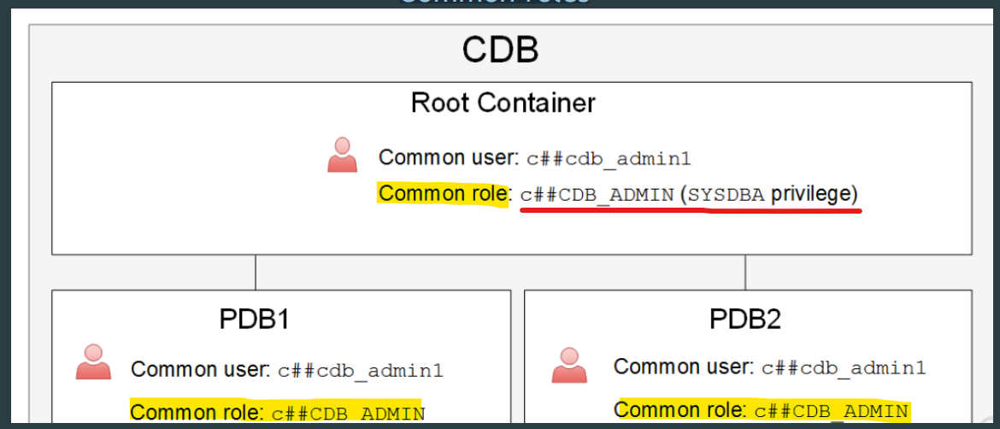

- Common Role Creation:

  - in root
  - with common_user_prefix

- Grant a role commonly:
  - grant the role to the user/role in all containers.
  - execute `grant` **in the root**
  - **Note, cannot grant a local user in the root.不能在 root 授权本地用户.**
    - 因为找不到本地用户
    - `Error report - ORA-01917: user or role 'T1' does not exist`
    - `01917. 00000 -  "user or role '%s' does not exist"`
    - `*Cause:    There is not a user or role by that name.`
    - `*Action:   Re-specify the name.`

```sql
conn / as sysdba;
GRANT common_role TO common_user/common_role CONTAINER=ALL;
```

- Grant a role commonly:
  - grant the role to the user/role **in a PDB only**.
  - execute `grant` **in a pdb.**
  - **重点 : If a `common user` is granted a `common role` locally, the privileges of the granted role available **only in the PDB**.本地授权角色, 但权限仅在当前 PDB.即使用户和角色都是通用的.**

```sql
conn sys@pdb as sysdba;
GRANT common_role/local_role TO common_user/local_user;
```

- Shortcut

| SQL                                           | Description           |
| --------------------------------------------- | --------------------- |
| `select * from cdb_roles WHERE common='YES';` | Query all Common role |
| `select * from cdb_roles WHERE common='NO';`  | Query all Local role  |

---

## Lab: Query Users

- Connect using sql developer
- Open all pdb

```sql
show con_name

--make sure that all pluggable is opned
select con_id,name,open_mode from v$pdbs;

alter pluggable database all open;
```

---

### Query ALL Users

- Query all users

```sql
# show all users in container and pdbs
select username,common,con_id from cdb_users
order by username;

# show all users in the current container, it has no con_id
select username, common
from dba_users;
# all common are yes, because current container is CDB, only returnt the common users.
```

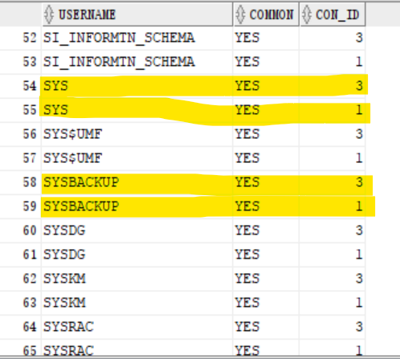

> note: sys and sysbackup are database administrate account. The result shows they have both in root and pdb.

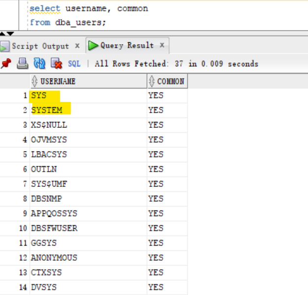

---

### Query `Common Users`

- Query common user
  - common users exist both in root and pdb (con_id)

```sql
select username,common,con_id from cdb_users
where common='YES'
order by username;

select distinct(username) from cdb_users
where common='YES';
```

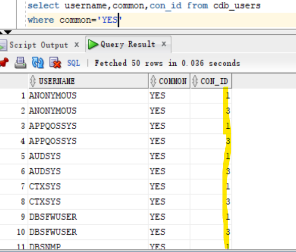

---

### Query `Local Users`

- Query local user

```sql
select username,common,con_id from cdb_users
where common='NO'
order by username;
```

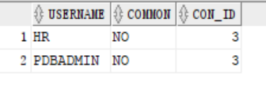

---

## Lab: `Common User`

### Create a `Common User`

- show the common_user_prefix

```sql
SHOW PARAMETER common_user_prefix
#NAME               TYPE   VALUE
#------------------ ------ -----
#common_user_prefix string C##
```

- In root, create a user without the prefix
  - return an error.

```sql
show con_name;
#CON_NAME
#------------------------------
#CDB$ROOT

CREATE USER t1 IDentified by t1;
```

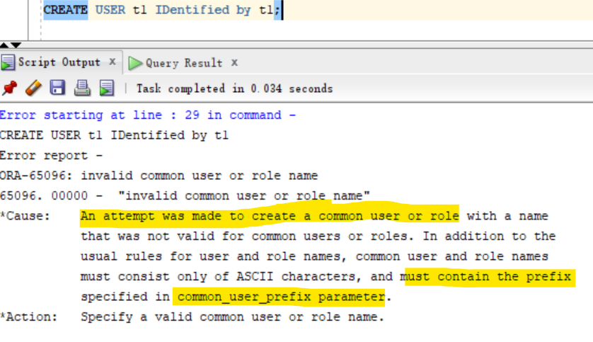

---

- Create a common user using prefix

```sql

CREATE USER C##t1 IDentified by welcome;

select distinct(username) from cdb_users
where common='YES';
```

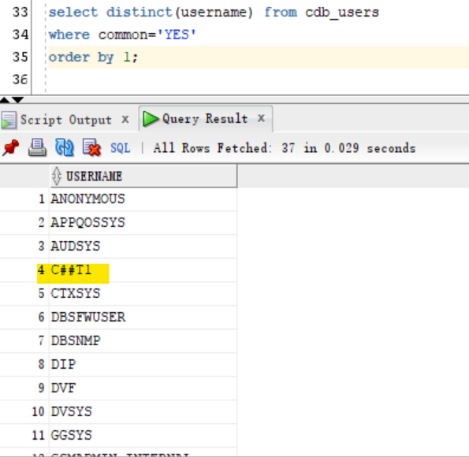

---

### Grant `Common User` Privileges

- Try to connect as c##t1 using developer

  - access deny
  - error: `Status : Failure -Test failed: ORA-01045: user C##T1 lacks CREATE SESSION privilege; logon denied`

- Grant privilege without `CONTAINER=ALL`;
  - can access the root orcl.com
  - cannot access pdb

```sql
GRANT create session TO C##t1;
```

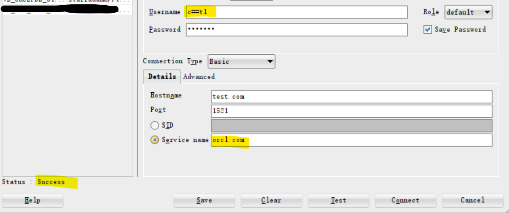

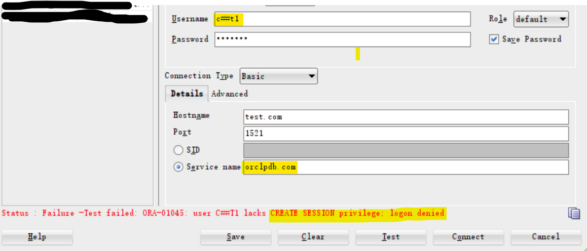

- Correctly grant common privilege
  - can access root and pdb

```sql
grant create session to c##t1 container=all;
```

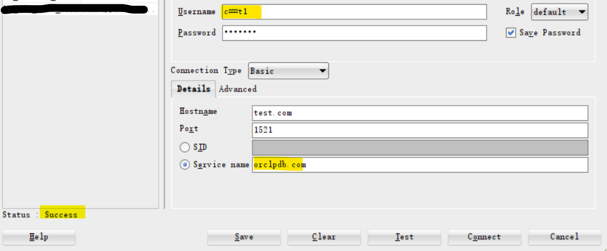

---

### Revoke `Common User` Privileges

- revoke
  - cannot create session both root and pdb.

```sql
revoke create session from c##t1 container=all;
```

---

## Lab: `Local User`

### Create a `Local User`

- change session to a pdb
- Create a local user

```sql

alter session set container=orclpdb;

show con_name;
#CON_NAME
#------------------------------
#ORCLPDB

create user t1 identified by t1;

select username,common,con_id from cdb_users
where common='NO'
order by username;
```

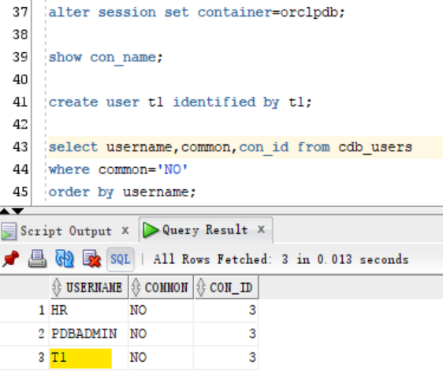

---

### Grant `Local User` Privileges

- Connect to pdb as new user.
  - Cannot access

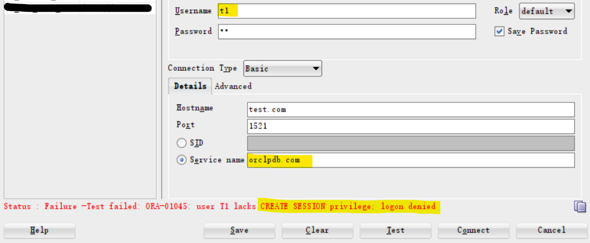

- Grant privilege

```sql
grant create session to t1;
```

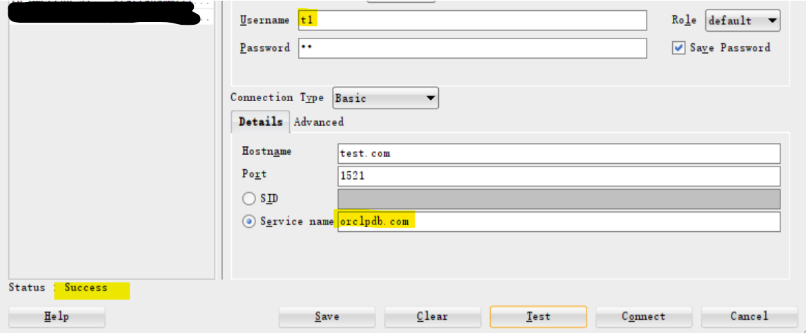

---

## Lab: Role

### Query all `Common Roles`

```sql
connect / as sysdba;
show con_name;
# query all common roles
select * from dba_roles;
```

---

### Create `Common Role`

```sql
-- in root

-- cannot create local role in the root
-- common role must have common prefix
create role test_role;
/* ORA-65096: invalid common user or role name
65096. 00000 -  "invalid common user or role name"
*Cause:    An attempt was made to create a common user or role with a name
           that was not valid for common users or roles. In addition to the
           usual rules for user and role names, common user and role names
           must consist only of ASCII characters, and must contain the prefix
           specified in common_user_prefix parameter.
*Action:   Specify a valid common user or role name. */

show parameter common_user_prefix;
-- NAME               TYPE   VALUE
-- ------------------ ------ -----
-- common_user_prefix string C##

# create a common role
create role c##test_role container=all;

# grant privileges
grant create session to c##test_role container=all ;
grant create table to c##test_role container=all ;
```

---

### Commonly grant a `common user` a `common role`

```sql
-- now the session is in the root
create user c##dark identified by dark;

grant c##test_role to c##dark container=all;
```

- Test connection
  - can create session with root and pdb

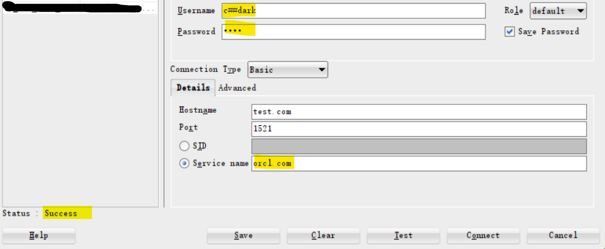
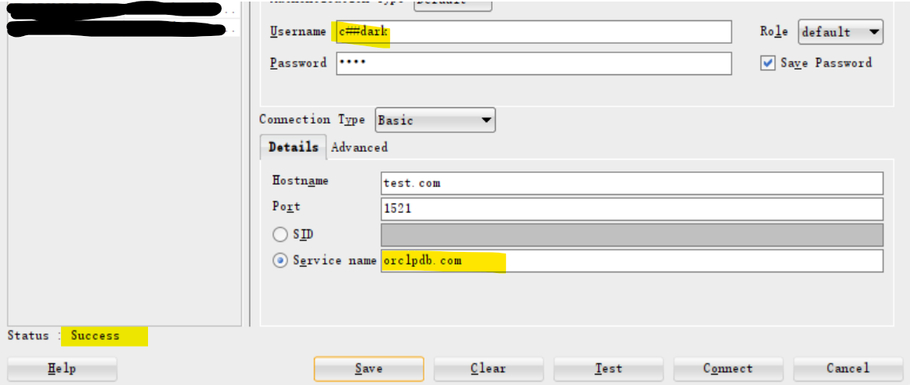

---

### Locally grant a `common user` a `common role`

```sql
create user c##kim identified by kim;

alter session set container=orclpdb
show con_name

# locally grant a common user a common role
grant c##test_role to c##kim
```

- Test connection
  - cannot access to root
  - can access to pdb

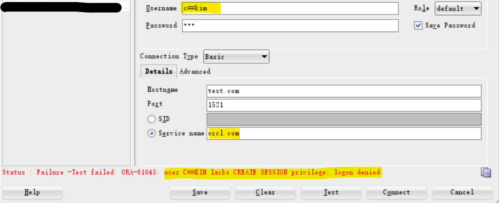

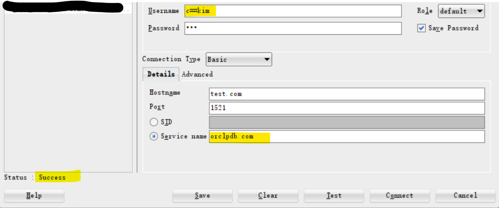

---

[TOP](#dba---users-common-users-vs-local-users)
