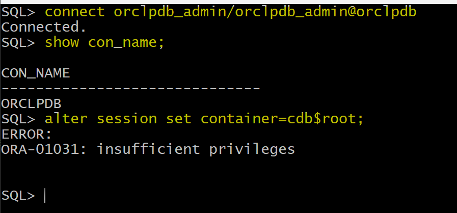
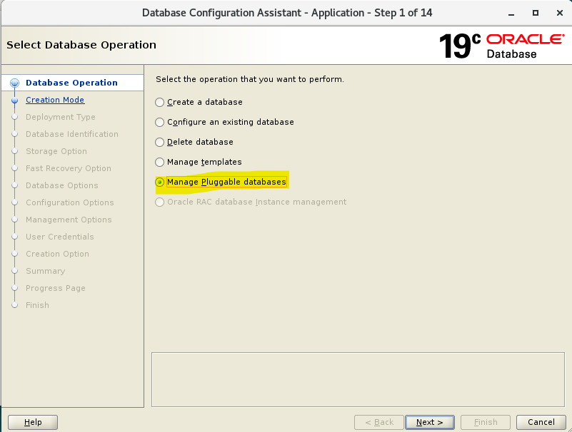
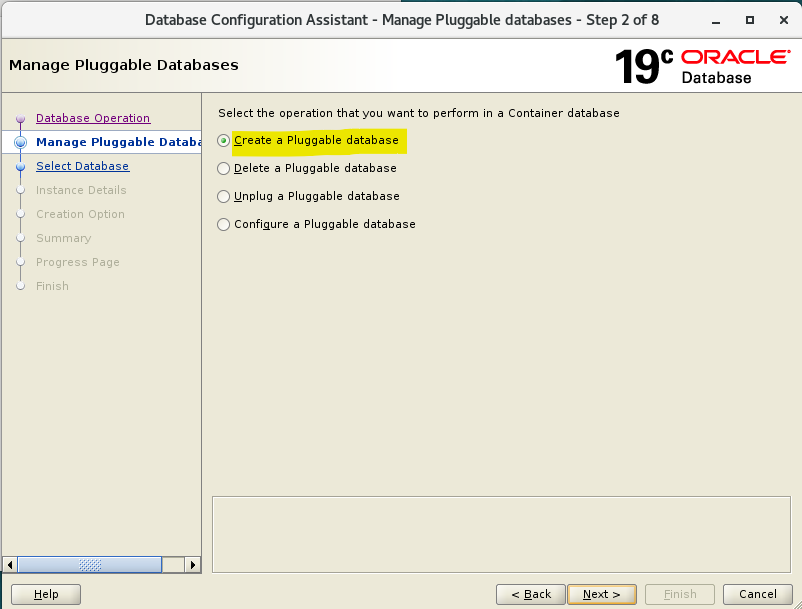
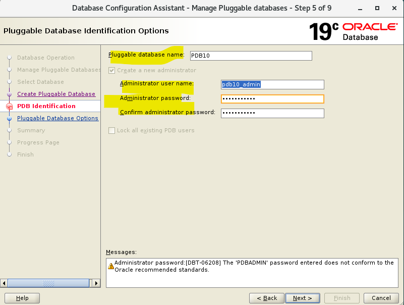
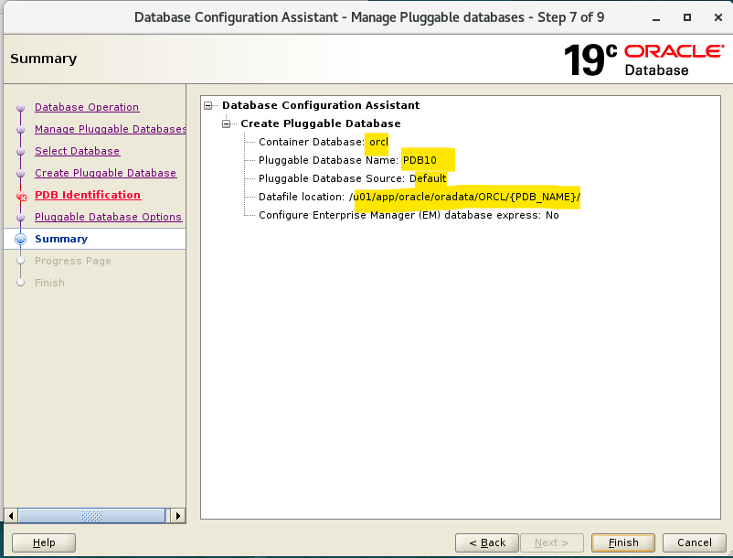
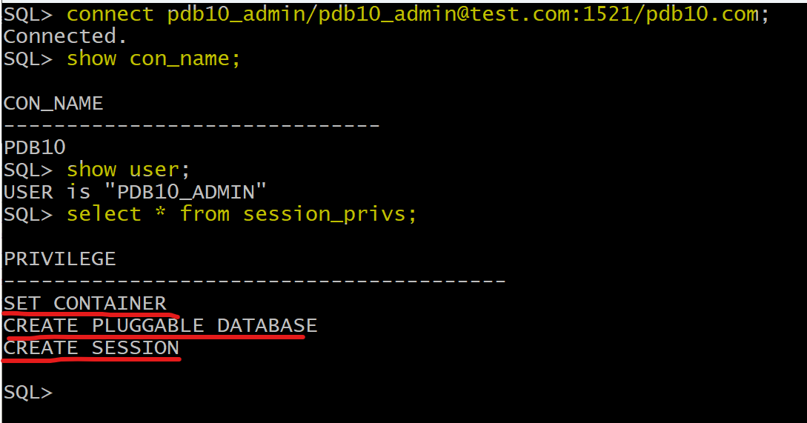
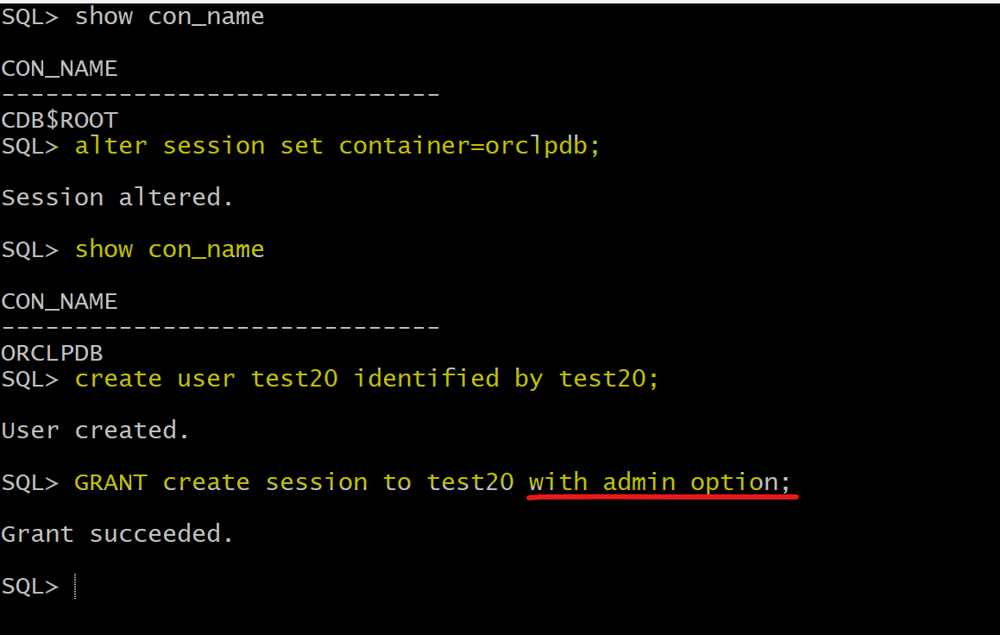

# DBA - User: Grant Admin Privileges

[Back](../../index.md)

- [DBA - User: Grant Admin Privileges](#dba---user-grant-admin-privileges)
  - [Best Practice: Creat a `Common User` like `SYS`](#best-practice-creat-a-common-user-like-sys)
  - [Best Practice: Creat a `Pluggable Database Admin`](#best-practice-creat-a-pluggable-database-admin)
  - [`PDB_DBA` Role](#pdb_dba-role)
    - [Lab: Using DBCA to create pdb admin](#lab-using-dbca-to-create-pdb-admin)
  - [Granting the `ADMIN OPTION`](#granting-the-admin-option)
    - [Lab: with admin option](#lab-with-admin-option)

---

## Best Practice: Creat a `Common User` like `SYS`

- Connect as sys
- Create a common user

```sql
show con_name
show user

# get the container id of the root
show con_id;
# list all tbsp in the root. Need the tbsp for user creation.
select * from V$TABLESPACE
where con_id=1;
-- 1	SYSAUX	YES	NO	YES		1
-- 0	SYSTEM	YES	NO	YES		1
-- 2	UNDOTBS1	YES	NO	YES		1
-- 4	USERS	YES	NO	YES		1
-- 3	TEMP	NO	NO	YES		1

-- create a common user, using pwd for authentication
create user c##copysis identified by copysis
-- default tbsp is users
default tablespace users
-- assign temp tbsp to temp
temporary tablespace temp
-- account status
account unlock;

-- Query the user
select * from dba_users
where username=upper('c##copysis');
# account_status: OPEN
# default_tablespace: USERS
# temporary_tablespace: TEMP
# profile: DEFAULT
# initial_rsrc_consumer_group: DEFAULT_CONSUMER_GROUP
# authentication_type: PASSWORD
# common: YES
```

- Grant privileges.

```sql

grant
    -- privs to connect
    create session,
    -- a role
    dba,
    -- special privs
    sysdba
to c##copysis
-- a common privilege
container=all;
```

---

- Connect using new user in sqlplus, using `AS SYSDBA`.

```sql
# using "as sysdba"
connect c##copysis/copysis@orcl as sysdba;

show con_name;
-- CON_NAME
-- ------------------------------
-- CDB$ROOT

# even though logging in using new user, it return user to be "sys", because using "as sysdba" to login.
show user;
-- USER is "SYS"

# query privileges: show 253 rows selected. Same privilegs as SYS.
select * from session_privs;
```

---

- Connect using new user in sqlplus, without `AS SYSDBA`.

```sql
# without "AS SYSDBA"
connect c##copysis/copysis@orcl;
show con_name;
# CON_NAME
# ------------------------------
# CDB$ROOT

# return the use name, because not using "AS SYSDBA"
show user;
# USER is "C##COPYSIS"

# return less privileges, because not using "AS SYSDBA"
select * from session_privs;
-- 237 rows selected.

```

---

## Best Practice: Creat a `Pluggable Database Admin`

- Connect as sys
- Create a pdb user

```sql
show con_name;
--CON_NAME
--------------------------------
--CDB$ROOT
show user;
--USER is "SYS"
ALTER PLUGGABLE DATABASE ALL OPEN;
show pdbs;
--    CON_ID CON_NAME                       OPEN MODE  RESTRICTED
------------ ------------------------------ ---------- ----------
--         2 PDB$SEED                       READ ONLY  NO
--         3 ORCLPDB                        READ WRITE NO

-- move to pdb
alter session set container=orclpdb;
show con_name;
--CON_NAME
--------------------------------
--ORCLPDB
show con_id;
--CON_ID
----------------------------
--3

select * from V$TABLESPACE;
--0	SYSTEM	YES	NO	YES		3
--1	SYSAUX	YES	NO	YES		3
--2	UNDOTBS1	YES	NO	YES		3
--3	TEMP	NO	NO	YES		3
--5	USERS	YES	NO	YES		3

-- create pdb user
create user orclpdb_admin identified by orclpdb_admin
default tablespace users
temporary tablespace temp
account unlock;

-- confirm and query new user has been created.
select * from dba_users
where username=upper('orclpdb_admin');

-- Confirm new user
select
    USERNAME
    , CREATED
    , ACCOUNT_STATUS
    , AUTHENTICATION_TYPE
    , COMMON
    , DEFAULT_TABLESPACE
    , TEMPORARY_TABLESPACE
    , PROFILE
from dba_users
where username=upper('orclpdb_admin');
--ORCLPDB_ADMIN	11-Mar-2024	OPEN	PASSWORD	NO	USERS	TEMP	DEFAULT

```

---

- Grant privileges

```sql

-- grant privileges
grant create session, dba to orclpdb_admin;
```

---

- Login as pdb admin

```sql
connect orclpdb_admin/orclpdb_admin@orclpdb;
show con_name;

alter session set container=cdb$root;
-- ERROR:
-- ORA-01031: insufficient privileges
```



---

## `PDB_DBA` Role

- admin created by `DBCA` has

  - not direct system privileges.
  - a `PDB_DBA` role, which contains
    - system privileges:
      - `CREATE PLUGGABLE DATABASE`
      - `CREATE SESSION`
    - `CONNECT` role
      - `SET CONTAINER`
      - `CREATE SESSION`

- So, an pdb admin need more privileges.

---

### Lab: Using DBCA to create pdb admin

- Create a pluggable database using `DBCA`






---

- Connect as sysdba

```sql
show con_name;
--CON_NAME
------------------------------
--ORCLPDB
show user;
--USER is "SYS"

-- confirm pdb has been created.
show pdbs;

-- confirm user has been created
SELECT
    username
    , account_status
    , created
    , authentication_type
    , common
    , default_tablespace
    , temporary_tablespace
FROM CDB_USERS
WHERE USERNAME='PDB10_ADMIN';
--PDB10_ADMIN	OPEN	11-Mar-2024	PASSWORD	NO	USERS	TEMP

select * from CDB_SYS_PRIVS
where GRANTEE='PDB10_ADMIN';
-- no rows
--NO SYS PRIVS dirict to PDB10_ADMIN


select * from CDB_role_PRIVS
where GRANTEE='PDB10_ADMIN'; -- so he has role called PDB_DBA
-- PDB10_ADMIN	PDB_DBA	YES	NO	YES	NO	NO	8
-- When a user as a pdb admin is created by DBCA, it has only one role. it deos not have sys privis directly

ALTER SESSION SET CONTAINER=PDB10;
SHOW CON_NAME;
--CON_NAME
----------------------------
--PDB10

SELECT * FROM ROLE_SYS_PRIVS
WHERE ROLE='PDB_DBA' ;--This contains sys priv granted to role  ( direct or using another role )
--PDB_DBA	CREATE PLUGGABLE DATABASE	NO	NO	NO
--PDB_DBA	CREATE SESSION	NO	NO	NO

select * from DBA_role_PRIVS
where GRANTEE='PDB_DBA';
-- PDB_DBA	CONNECT	NO	NO	YES	NO	NO
-- a role, connect, is granted to another role, pdb_dba.
-- a subrole, connect, is granted to role PDB_DBA

SELECT * FROM ROLE_SYS_PRIVS
WHERE ROLE='CONNECT'
--CONNECT	SET CONTAINER	NO	YES	YES
--CONNECT	CREATE SESSION	NO	YES	YES

```

---

```sql
connect pdb10_admin/pdb10_admin@test.com:1521/pdb10.com;
show con_name;
show user;
select * from session_privs;
```



---

## Granting the `ADMIN OPTION`

- A user or role that is granted a privilege or role specifying the `WITH ADMIN OPTION` clause has several expanded capabilities:

  - The grantee can **grant** or **revoke** the `system privilege` or `role` to or **from any user or other role** in the database.
    - Users cannot revoke a role from themselves.
  - The grantee can **further grant** the `system privilege` or `role` with the `ADMIN OPTION`.
  - The grantee of a `role` can **alter** or **drop** the `role`.

- Example:

```sql
-- In the following statement, the security administrator grants the new_dba role to michael:

GRANT new_dba TO michael WITH ADMIN OPTION;
-- The user michael cannot only use all of the privileges implicit in the new_dba role, but can grant, revoke, or drop the new_dba role as deemed necessary.
-- 被授权人自身可以使用角色所有的权限
-- 被授权人可以授予, 褫夺, 删除角色.
```

- When a user creates a role, the role is automatically granted to the creator with the `ADMIN OPTION`. 用户创建角色时, 角色自动应用于用户本身, 如 Admin option 一样.

- 授权的权限仅限于被授权人所有的权限.

---

### Lab: with admin option

- Connect as sysdba

```sql
show con_name
create user test20 identified by test20;
GRANT create session to test20 with admin option;
```



```sql
connect test20/test20@orclpdb;
show con_name
show user;
SELECT * FROM session_privs;
grant create session to hr;
grant resource to hr;
/* grant resource to hr
      *
ERROR at line 1:
ORA-01924: role 'RESOURCE' not granted or does not exist */

```


[TOP](#dba---user-grant-admin-privileges)

```

```
