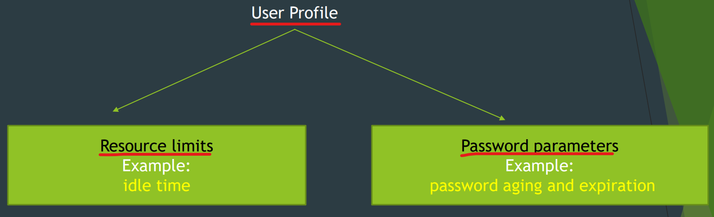
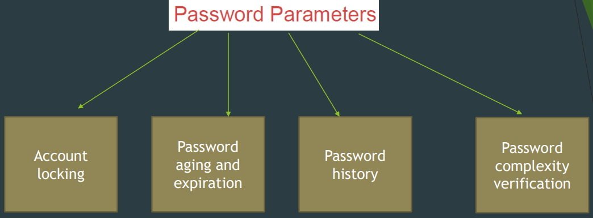
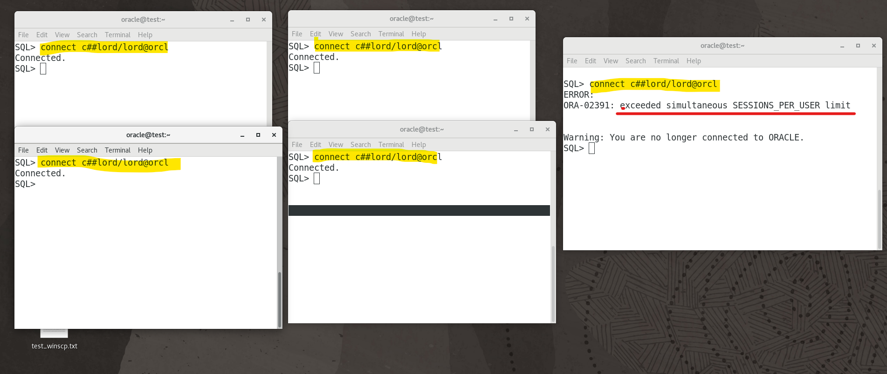
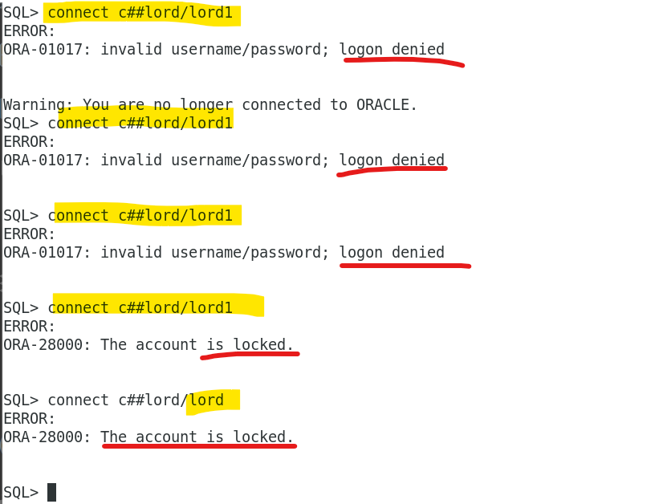
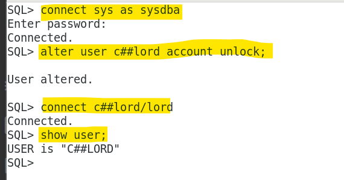
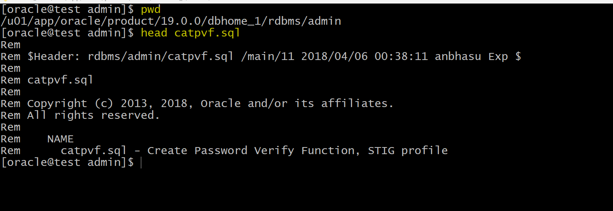
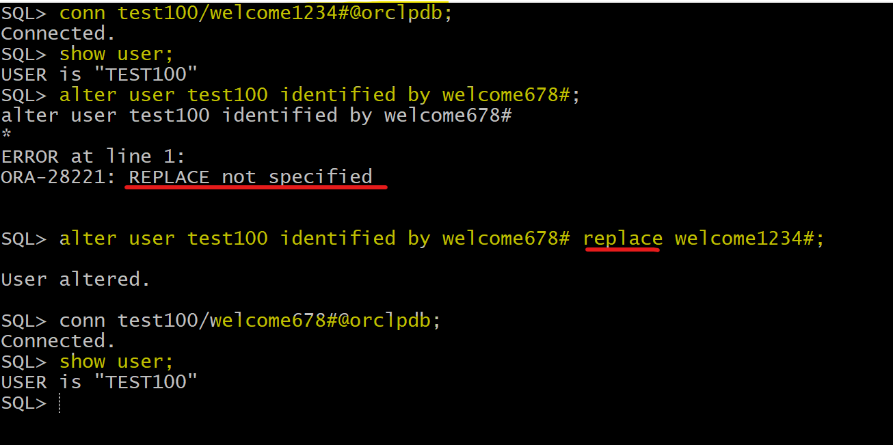

# DBA - User: User Profile

[Back](../../index.md)

- [DBA - User: User Profile](#dba---user-user-profile)
  - [User Profile](#user-profile)
    - [Common Profile vs Local Profile](#common-profile-vs-local-profile)
    - [Assigning Profiles](#assigning-profiles)
  - [Password Parameters](#password-parameters)
    - [Account Loking](#account-loking)
    - [Password aging and expiration](#password-aging-and-expiration)
    - [Password History](#password-history)
    - [Password complexity verification](#password-complexity-verification)
    - [Oracle-Supplied Password Verfication Functions](#oracle-supplied-password-verfication-functions)
      - [`verify_function_11G` Function](#verify_function_11g-function)
      - [`ora12c_verify_function` Function](#ora12c_verify_function-function)
      - [`ora12c_strong_verify_function` Function](#ora12c_strong_verify_function-function)
  - [Resource Parameters](#resource-parameters)
  - [Lab: Default Profile in `root`](#lab-default-profile-in-root)
  - [Lab: Create a `Common Profile`](#lab-create-a-common-profile)
    - [Test resource parameters](#test-resource-parameters)
    - [Test password parameters](#test-password-parameters)
  - [Lab: Default profile in pdb](#lab-default-profile-in-pdb)
  - [Lab: Create a local profile](#lab-create-a-local-profile)
  - [Lab: Query Password Verification Function](#lab-query-password-verification-function)
  - [Lab: Password Verification Function](#lab-password-verification-function)

---

## User Profile

- `User profile`
  - a named set of `resource limits` and `password parameters` that **restrict** database **usage** and database instance **resources** for a user.
    - By default when you crate a user, it will be assigned to `default profile`, unless you specified another profile
    - Every user , including the administrators is **assigned to only one** profile. 只有一个
    - If you assign a profile to a user, then that user **can not exceed those limits**. 限制使用范围



---

### Common Profile vs Local Profile

- Common Profile
  - Created by `sysdba`
  - Name prefix: `c##`
  - in `CDB$root` container
  - must use `CONTAINER=ALL`

```sql
connect / as sysdba;
create profile c##cprofile_dev
limi ...
CONTAINER=ALL;
```

- 注意: 在以下 lab: query default profile 中, 默认没有任何 common profile, 即没有任何 profile 参数的 common=yes.
  - 即在 cdb$root 下的默认 profile 只属于 root.

---

- Local Profile
  - created by `sysdba`
  - in PDB
  - Cannot use `CONTAINER=ALL`

```sql
CONNECT sys@pdb_name AS SYSDBA;
create profile c##cprofile_dev
limi ...

```

---

### Assigning Profiles

- Commonly:
  - profile assignments is replicated in all current and future containers.

```sql
connect / as sysdba
ALTER USER common_user  PROFILE common_profile CONTAINER ALL;
```

- Locally:
  - profile assignments is occured in one PDB (stand-alone or application container) only.

```sql
connect sys@PDB_name AS SYSDBA;
ALTER USER common_user/local_user  PROFILE common_profile/local_profile;
```

---

## Password Parameters



- `Password Parameters`

  - used to control account locking, password aging and expiration, history, conplexity verfication.

- The type of `resource_type` in `dba_profiles`: `password`

### Account Loking

- Account locking

  - enables automatic locking of accounts for a set duration
    - when users fail to log in to the system in the specified number of attempts
    - or when accounts sit inactive for a pre-defined number of days.

- parametera:
  - `FAILED_LOGIN_ATTEMPTS`: the number of failed login attempts before the lockout of the account.尝试次数
  - `PASSWORD_LOCK_TIME`: the **number of days** for which the account is locked after the specified number of failed login attempts.锁定时长
  - `INACTIVE_ACCOUNT_TIME`: number of days an account can be inactive before it is locked. 不活跃时长.

---

### Password aging and expiration

- Password aging and expiration

  - enables user passwords to have a lifetime, after which the passwords expire and must be changed.

- Parameters:

  - `PASSWORD_LIFE_TIME`: the lifetime of the password in day, after which the password expires. 失效时长
    - e.g., =90, after 90 days, user should change the pwd.
  - `PASSWORD_GRACE_TIME`: a grace period in days for changing the password after the first successful login after the password has expired.宽限期

---

### Password History

- Password History
  - check the new password to ensure that the password is not reused for a specified amount of time or a specified number of password changes.
- Parameters:
  - `PASSWORD_REUSED_TIME`: a user cannot reuse a password for a given number of days.不能重复时长
  - `PASSWORD_REUSED_MAX`: the number of password changed that are required before the current password can be reused.重用前修改次数

---

### Password complexity verification

- Password complexity verification

  - makes a complexity check on the password to verirfy that it meets certain rules.

- parameter: `PASSWORD_VERIFY_FUNCTION`:
  - check the password complexity for the SYS user.
  - a PL/SQL function to perform complexity check
  - this function owened by user `SYS`
  - must return Boolean(true/false)
  - A model verification function is provided in script called `$ORACLE_HOME/rdbms/admin/utlpwdmg.sql`

---

### Oracle-Supplied Password Verfication Functions

- **Complexity verification** checks that each password is **complex enough** to provide reasonable protection against intruders who try to break into the system by guessing passwords.

  - You can **create** your own password verification functions.可以自定义
  - Oracle-Supplied functions that you can choose one of these
    - `ORA12C_VERIFY_FUNCTION`
    - `ORA12C_STRONG_VERIFY_FUNCTION`
    - `VERIFY_FUNCTION 11G`
    - Note:
      - in the documentation, they are in the `utlpwdmg.sal` script, the only script for Default Password Resource Limits
      - actually, they are in `catpvf.sql`

- The functions above must be **owned by** the sy`s user.
  - Password complexity checking is **not** enforced for the `sys` user.不对 sys 检查

---

#### `verify_function_11G` Function

- `verify_function_11G`:
  - The password contains **no fewer than 8** characters and includes **at least one numeric and one alphabetic character**.
  - The password is **not the same as the user name**, nor is it the user name **reversed** or **with the numbers** 1,100 appended.
  - The password is not the same as the **server name** or the **server name with the numbers** 1-100 appended.
  - The password does **not contain oracle** (for example, oracle with the numbers 1- 100 appended).
  - The password is **not too simple** (for example, welcome, databasel, account 1, user1234, password1, oracle123, computer1, abedefg1, or change_on_install).
  - The password **differs from the previous password** by at least 3 characters.
  - The following internal check is also applied:
    - The password does not contain the double-quotation character (").
    - However, it can be **surrounded by double-quotation marks**.

---

#### `ora12c_verify_function` Function

- `ora12c_verify_function` Function:
  - The password contains **no fewer than 8** characters and includes **at least one numeric and one alphabetic** character.
  - The password is not the same as the **user name** or the **user name reversed**.
  - The password is not the same as the **database name**.
  - The password does not contain the word **oracle** (such as oracle123).
  - The password **differs from the previous password** by at least 8 characters.
  - The password contains **at least 1 special character**.
  - The following internal check is also applied:
    - The password does not contain the doLie-quotation character (").
    - However, it can be surrounded by double-quotation marks.

---

#### `ora12c_strong_verify_function` Function

- `ora12c_strong_verify_function` Function:
  - The password must contain **at least 2 upper case** characters, **2 lower case** characters, **2 numeric characters**, and **2 special characters**. These special characters are as follows:
    - `-！@＃$8~＆＊こ！・＊"（［\/^>・・；？・： /（space)`
  - The password must **differ from the previous password** by at least 4 characters.
  - The followina internal check is also applied:
    - The password does not contain the doLie-quotation character (").
    - However, it can be surrounded by double-quotation marks.

---

## Resource Parameters

- In a profile, we can control:

  - **CPU Resources** may be limited on a per-session or per-call basis. There are two parameters for this resource
    - `CPU_PER_SESSION`,
    - `CPU_PER_CALL`: a single call made by the user cannot consume morethen a given seconds of CPU time.
  - For **network and memory** resources you can specify the following
    - Connect time
    - Idle time
    - Concurrent sessions
    - Private SGA.
  - **Disk I/O Resources** which limit the **amount of data a user can read** at the per session level or per call level

- Profiles **cannot** impose resource limitations on users **unless** the `RESOURCE_LIMIT` initialization parameter is set to `TRUE`.
- The `RESOURCE_LIMIT` at its **default value** of `FALSE`, the profile resource limitations are **ignored**.

- Profiles also allow compose limits, which are **based on weighted combinations** of CPU/session, reads/session, connect time, and private SGA.比例组合.

- The type of `resource_type` in `dba_profiles`: `Kernel`
- By default, the values of all resource parameters are `unlimited`.

---

- Example:

```sql
CREATE PROFILE app_user LIMIT
   SESSIONS_PER_USER          UNLIMITED
   CPU_PER_SESSION            UNLIMITED
   CPU_PER_CALL               3000
   CONNECT_TIME               45
   LOGICAL_READS_PER_SESSION  DEFAULT
   LOGICAL_READS_PER_CALL     1000
   PRIVATE_SGA                15K
   COMPOSITE_LIMIT            5000000;

```

- If you assign the app_user profile to a user, then the user is subject to the following limits in subsequent sessions:

  - The user can have any **number of concurrent sessions**.
  - In a single session, the user can consume an **unlimited amount of CPU time**.
  - A single call made by the user **cannot consume more than 30 seconds of CPU time**.
  - A single session **cannot last for more than 45 minutes**.
  - In a single session, the number of **data blocks read** from memory and disk is subject to the limit specified in the `DEFAULT` profile.
  - A single call made by the user **cannot read more than 1000 data blocks** from memory and disk.
  - A single session **cannot allocate more than 15 kilobytes of memory in the SGA**.
  - In a single session, the **total resource cost cannot exceed 5 million service units**. The formula for calculating the total resource cost is specified by the ALTER RESOURCE COST statement.

- Since the app_user profile omits a limit for `IDLE_TIME` and for password limits, the user is subject to the limits on these resources specified in the `DEFAULT` profile.

---

## Lab: Default Profile in `root`

- Note: even in the CDB, the vaue of common column of each parameters is NO.

```sql
show con_name;
--CON_NAME
--------------------------------
--CDB$ROOT

-- Query default profile
select * from dba_PROFILES
where PROFILE='DEFAULT';
--PROFILE,  RESOURCE_NAME,              RESOURCE_TYPE,  LIMIT,      COMMON,     INHERITED,  IMPLICIT
--DEFAULT	COMPOSITE_LIMIT             KERNEL          UNLIMITED	NO          NO	        NO
--DEFAULT	SESSIONS_PER_USER           KERNEL          UNLIMITED	NO          NO	        NO
--DEFAULT	CPU_PER_SESSION             KERNEL          UNLIMITED	NO          NO	        NO
--DEFAULT	CPU_PER_CALL                KERNEL          UNLIMITED	NO          NO	        NO
--DEFAULT	LOGICAL_READS_PER_SESSION   KERNEL          UNLIMITED	NO          NO	        NO
--DEFAULT	LOGICAL_READS_PER_CALL      KERNEL          UNLIMITED	NO          NO	        NO
--DEFAULT	IDLE_TIME                   KERNEL          UNLIMITED	NO          NO	        NO
--DEFAULT	CONNECT_TIME                KERNEL          UNLIMITED	NO          NO	        NO
--DEFAULT	PRIVATE_SGA                 KERNEL          UNLIMITED	NO          NO	        NO
--DEFAULT	FAILED_LOGIN_ATTEMPTS       PASSWORD        10	        NO          NO	        NO
--DEFAULT	PASSWORD_LIFE_TIME          PASSWORD        180	        NO          NO	        NO
--DEFAULT	PASSWORD_REUSE_TIME         PASSWORD        UNLIMITED	NO          NO	        NO
--DEFAULT	PASSWORD_REUSE_MAX          PASSWORD        UNLIMITED	NO          NO	        NO
--DEFAULT	PASSWORD_VERIFY_FUNCTION    PASSWORD        NULL        NO          NO	        NO
--DEFAULT	PASSWORD_LOCK_TIME          PASSWORD        1	        NO          NO	        NO
--DEFAULT	PASSWORD_GRACE_TIME         PASSWORD        7	        NO          NO	        NO
--DEFAULT	INACTIVE_ACCOUNT_TIME       PASSWORD        UNLIMITED	NO          NO	        NO
```

---

## Lab: Create a `Common Profile`

- Connect as sys
- create common profile

```sql
show con_name;
--CON_NAME
--------------------------------
--CDB$ROOT

-- create common profile
create profile C##GENERAL limit
    SESSIONS_PER_USER 4
    IDLE_TIME 15
    FAILED_LOGIN_ATTEMPTS 3
    PASSWORD_LIFE_TIME 180
    container=all;

-- confirm the profile
select * from DBA_PROFILES
where PROFILE= upper('C##GENERAL')
order by limit;
--PROFILE,      RESOURCE_NAME,              RESOURCE_TYPE,  LIMIT,  COMMON, INHERITED,  IMPLICIT
--C##GENERAL	IDLE_TIME                   KERNEL          15      YES     NO          NO
--C##GENERAL	PASSWORD_LIFE_TIME          PASSWORD        180     YES     NO          NO
--C##GENERAL	FAILED_LOGIN_ATTEMPTS       PASSWORD        3       YES     NO          NO
--C##GENERAL	SESSIONS_PER_USER           KERNEL          4       YES     NO          NO
--C##GENERAL	LOGICAL_READS_PER_CALL      KERNEL          DEFAULT YES     NO          NO
--C##GENERAL	CONNECT_TIME                KERNEL          DEFAULT YES     NO          NO
--C##GENERAL	INACTIVE_ACCOUNT_TIME       PASSWORD        DEFAULT YES     NO          NO
--C##GENERAL	PASSWORD_REUSE_TIME         PASSWORD        DEFAULT YES     NO          NO
--C##GENERAL	PASSWORD_REUSE_MAX          PASSWORD        DEFAULT YES     NO          NO
--C##GENERAL	PASSWORD_VERIFY_FUNCTION    PASSWORD        DEFAULT YES     NO          NO
--C##GENERAL	PASSWORD_LOCK_TIME          PASSWORD        DEFAULT YES     NO          NO
--C##GENERAL	PASSWORD_GRACE_TIME         PASSWORD        DEFAULT YES     NO          NO
--C##GENERAL	LOGICAL_READS_PER_SESSION   KERNEL          DEFAULT YES     NO          NO
--C##GENERAL	CPU_PER_CALL                KERNEL          DEFAULT YES     NO          NO
--C##GENERAL	CPU_PER_SESSION             KERNEL          DEFAULT YES     NO          NO
--C##GENERAL	COMPOSITE_LIMIT             KERNEL          DEFAULT YES     NO          NO
--C##GENERAL	PRIVATE_SGA                 KERNEL          DEFAULT YES     NO          NO
```

---

- Create a common user

```sql
-- Create a common user
create user c##lord identified by lord container=all;
grant create session, create table, unlimited tablespace to c##lord container=all;


-- confirm user has been created
SELECT
    username
    , account_status
    , created
    , profile
    , authentication_type
    , common
    , default_tablespace
    , temporary_tablespace
FROM DBA_users
WHERE USERNAME=upper('c##lord');
--C##LORD	OPEN	12-Mar-2024	DEFAULT	PASSWORD	YES	USERS	TEMP
```

- check initialization parameter `RESOURCE_LIMIT`
- Alter profile

```sql

show parameter RESOURCE_LIMIT;
--NAME           TYPE    VALUE
---------------- ------- -----
--resource_limit boolean TRUE

alter user c##lord profile C##GENERAL container=all;

-- confirm
SELECT
    username
    , account_status
    , created
    , profile
    , authentication_type
    , common
    , default_tablespace
    , temporary_tablespace
FROM DBA_users
WHERE USERNAME=upper('c##lord');
--C##LORD	OPEN	12-Mar-2024	C##GENERAL	PASSWORD	YES	USERS	TEMP
```

---

### Test resource parameters

- Try to connect as new common user with 5 sessions
  - the 5th session fails, due to the profile resource parameter



---

### Test password parameters

- Try to connect as new common user with wrong psw
  - after 3 times attempts, the account is locked.



- Unlock the account

```sql
connect sys as sysdba
alter user c##lord account unlock;

connect c##lord/lord
```



---

## Lab: Default profile in pdb

```sql
show con_name;
--CON_NAME
--------------------------------
--CDB$ROOT

alter session set container=orclpdb;

show con_name;
--CON_NAME
--------------------------------
--ORCLPDB

-- Query local default profile
select * from dba_PROFILES
where PROFILE='DEFAULT';
--PROFILE,  RESOURCE_NAME,              RESOURCE_TYPE,  LIMIT,      COMMON,     INHERITED,  IMPLICIT
--DEFAULT	COMPOSITE_LIMIT             KERNEL          UNLIMITED	NO          NO	        NO
--DEFAULT	SESSIONS_PER_USER           KERNEL          UNLIMITED	NO          NO	        NO
--DEFAULT	CPU_PER_SESSION             KERNEL          UNLIMITED	NO          NO	        NO
--DEFAULT	CPU_PER_CALL                KERNEL          UNLIMITED	NO          NO	        NO
--DEFAULT	LOGICAL_READS_PER_SESSION   KERNEL          UNLIMITED	NO          NO	        NO
--DEFAULT	LOGICAL_READS_PER_CALL      KERNEL          UNLIMITED	NO          NO	        NO
--DEFAULT	IDLE_TIME                   KERNEL          UNLIMITED	NO          NO	        NO
--DEFAULT	CONNECT_TIME                KERNEL          UNLIMITED	NO          NO	        NO
--DEFAULT	PRIVATE_SGA                 KERNEL          UNLIMITED	NO          NO	        NO
--DEFAULT	FAILED_LOGIN_ATTEMPTS       PASSWORD        10	        NO          NO	        NO
--DEFAULT	PASSWORD_LIFE_TIME          PASSWORD        180	        NO          NO	        NO
--DEFAULT	PASSWORD_REUSE_TIME         PASSWORD        UNLIMITED	NO          NO	        NO
--DEFAULT	PASSWORD_REUSE_MAX          PASSWORD        UNLIMITED	NO          NO	        NO
--DEFAULT	PASSWORD_VERIFY_FUNCTION    PASSWORD        NULL        NO          NO	        NO
--DEFAULT	PASSWORD_LOCK_TIME          PASSWORD        1	        NO          NO	        NO
--DEFAULT	PASSWORD_GRACE_TIME         PASSWORD        7	        NO          NO	        NO
--DEFAULT	INACTIVE_ACCOUNT_TIME       PASSWORD        UNLIMITED	NO          NO	        NO
```

## Lab: Create a local profile

```sql
-- create a local profile
create profile orclpdbprofile limit
    SESSIONS_PER_USER UNLIMITED
    IDLE_TIME UNLIMITED
    FAILED_LOGIN_ATTEMPTS 10
    PASSWORD_LIFE_TIME 180
    INACTIVE_ACCOUNT_TIME 10;
--Error report -
--ORA-02377: invalid profile limit INACTIVE_ACCOUNT_TIME
--02377. 00000 -  "invalid profile limit %s"
--*Cause:    A value of 0 or lower was specified for the limit.
--*Action:   Specify a limit greater than 0. For password profile parameters,
--           some additional restrictions apply:
--           * The specified limit of the PASSWORD_ROLLOVER_TIME profile
--           parameter cannot exceed either 60 days, or the current
--           value of the PASSWORD_GRACE_TIME limit of the profile,
--           or the current value of the PASSWORD_LIFE_TIME limit of
--           the profile; whichever value is lowest.
--           * When the PASSWORD_ROLLOVER_TIME profile parameter is
--           non-zero (the password rollover feature is enabled),
--           the specified limit cannot be less than 1 hour, to give
--           the application time to switch over to the new password.
--           * The PASSWORD_LIFE_TIME and PASSWORD_GRACE_TIME limits
--           cannot be less than the PASSWORD_ROLLOVER_TIME limit.
--           * For the INACTIVE_ACCOUNT_TIME profile parameter, the specified
--           limit cannot be less than 15 days.
--           * For the PASSWORD_GRACE_TIME profile parameter, 0 is allowed
--           as a permissible value.

create profile orclpdbprofile limit
    SESSIONS_PER_USER UNLIMITED
    IDLE_TIME UNLIMITED
    FAILED_LOGIN_ATTEMPTS 10
    PASSWORD_LIFE_TIME 180
    INACTIVE_ACCOUNT_TIME 15;
--Profile ORCLPDBPROFILE created.

-- confirm
select * from DBA_PROFILES
where PROFILE= upper('orclpdbprofile')
order by limit;
--ORCLPDBPROFILE	FAILED_LOGIN_ATTEMPTS	PASSWORD	10	NO	NO	NO
--ORCLPDBPROFILE	INACTIVE_ACCOUNT_TIME	PASSWORD	15	NO	NO	NO
--ORCLPDBPROFILE	PASSWORD_LIFE_TIME	PASSWORD	180	NO	NO	NO
--ORCLPDBPROFILE	LOGICAL_READS_PER_SESSION	KERNEL	DEFAULT	NO	NO	NO
--ORCLPDBPROFILE	LOGICAL_READS_PER_CALL	KERNEL	DEFAULT	NO	NO	NO
--ORCLPDBPROFILE	CONNECT_TIME	KERNEL	DEFAULT	NO	NO	NO
--ORCLPDBPROFILE	CPU_PER_CALL	KERNEL	DEFAULT	NO	NO	NO
--ORCLPDBPROFILE	CPU_PER_SESSION	KERNEL	DEFAULT	NO	NO	NO
--ORCLPDBPROFILE	COMPOSITE_LIMIT	KERNEL	DEFAULT	NO	NO	NO
--ORCLPDBPROFILE	PRIVATE_SGA	KERNEL	DEFAULT	NO	NO	NO
--ORCLPDBPROFILE	PASSWORD_GRACE_TIME	PASSWORD	DEFAULT	NO	NO	NO
--ORCLPDBPROFILE	PASSWORD_REUSE_TIME	PASSWORD	DEFAULT	NO	NO	NO
--ORCLPDBPROFILE	PASSWORD_REUSE_MAX	PASSWORD	DEFAULT	NO	NO	NO
--ORCLPDBPROFILE	PASSWORD_VERIFY_FUNCTION	PASSWORD	DEFAULT	NO	NO	NO
--ORCLPDBPROFILE	PASSWORD_LOCK_TIME	PASSWORD	DEFAULT	NO	NO	NO
--ORCLPDBPROFILE	SESSIONS_PER_USER	KERNEL	UNLIMITED	NO	NO	NO
--ORCLPDBPROFILE	IDLE_TIME	KERNEL	UNLIMITED	NO	NO	NO

```

- Create user and assign profile

```sql
create user sara identified by sara
profile orclpdbprofile;
grant create session, create table, unlimited tablespace to sara

SELECT
    username
    , account_status
    , created
    , profile
    , authentication_type
    , common
    , default_tablespace
    , temporary_tablespace
FROM DBA_users
WHERE USERNAME=upper('sara');
--SARA	OPEN	12-Mar-2024	ORCLPDBPROFILE	PASSWORD	NO	USERS	TEMP
```

---

## Lab: Query Password Verification Function

- function file



---

- In oracle, no need to run script

  - the function is an object in the database.

- Query function object in root

```sql
SHOW CON_NAME;
--CON_NAME
--------------------------------
--CDB$ROOT

-- query verification function
select * from dba_objects
where object_name like '%VERIFY%'
AND OBJECT_TYPE='FUNCTION';
--SYS	ORA12C_VERIFY_FUNCTION
--SYS	VERIFY_FUNCTION_11G
--SYS	VERIFY_FUNCTION
--SYS	ORA12C_STRONG_VERIFY_FUNCTION
--SYS	ORA12C_STIG_VERIFY_FUNCTION
```

---

- Query function object in pdb

```sql
ALTER SESSION SET CONTAINER=ORCLPDB;
SHOW CON_NAME;
--CON_NAME
--------------------------------
--ORCLPDB

select * from dba_objects
where object_name like '%VERIFY%'
AND OBJECT_TYPE='FUNCTION';
--SYS	ORA12C_VERIFY_FUNCTION
--SYS	VERIFY_FUNCTION_11G
--SYS	VERIFY_FUNCTION
--SYS	ORA12C_STRONG_VERIFY_FUNCTION
--SYS	ORA12C_STIG_VERIFY_FUNCTION
```

---

## Lab: Password Verification Function

- use a password verification function in a local profile.

```sql
CREATE PROFILE TEST_PASS LIMIT
    PASSWORD_VERIFY_FUNCTION ORA12C_VERIFY_FUNCTION;

SELECT * FROM DBA_PROFILES
WHERE PROFILE='TEST_PASS'
AND resource_name='PASSWORD_VERIFY_FUNCTION';
--TEST_PASS	PASSWORD_VERIFY_FUNCTION	PASSWORD	ORA12C_VERIFY_FUNCTION	NO	NO	NO
```

---

- create user and assign the profile, with different passwords

```sql
create user test100 identified by welcome  profile TEST_PASS;
--ORA-28003: password verification for the specified password failed
--ORA-20000: password length less than 8 bytes
--28003. 00000 -  "password verification for the specified password failed"
--*Cause:    The new password did not meet the necessary complexity
--           specifications and the password_verify_function failed
--*Action:   Enter a different password. Contact the DBA to know the rules for
--           choosing the new password

create user test100 identified by welcome1234 profile TEST_PASS;
--Error report -
--ORA-28003: password verification for the specified password failed
--ORA-20000: password must contain 1 or more special characters
--28003. 00000 -  "password verification for the specified password failed"
--*Cause:    The new password did not meet the necessary complexity
--           specifications and the password_verify_function failed
--*Action:   Enter a different password. Contact the DBA to know the rules for
--           choosing the new password

create user test100 identified by welcome1234#  profile TEST_PASS;
--User TEST100 created.

grant create session to test100;
```

---

- Connect as new user
- Change psw.
  - error if without "REPLACE", due to lack of alter user privilege and the use of password function
  - succedd if using "REPLACE".

```sql
conn test100/welcome1234#@orclpdb;
show user;
-- USER is "TEST100"

alter user test100 identified by welcome678#;
/* Cause : ORA-28221 error occurs when an user tries to reset his own password
without specifying the REPLACE keyword, provided the user does not have ALTER USER privilege
and the user is having a profile with password verify function. */

alter user test100 identified by welcome678# replace welcome1234#;
-- User altered.

conn test100/welcome678#@orclpdb;
```



---

[TOP](#dba---user-user-profile)
