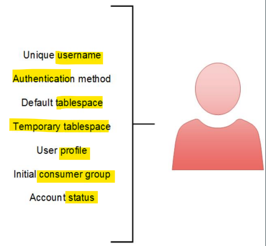

# DBA - User Account

[Back](../../index.md)

- [DBA - User Account](#dba---user-account)
  - [Users Account](#users-account)
    - [Schema](#schema)
  - [User Account Routine](#user-account-routine)
    - [Lab: Change User as DBA](#lab-change-user-as-dba)
    - [Lab: Unlock a user account](#lab-unlock-a-user-account)
  - [Oracle-supplied administrator accounts](#oracle-supplied-administrator-accounts)
    - [`SYS` Account](#sys-account)
    - [`SYSTEM` Account](#system-account)
    - [Others](#others)
  - [Special system privileges for administrators](#special-system-privileges-for-administrators)
  - [Oracle–supplied roles](#oraclesupplied-roles)
  - [Best Practice: Creat a `Common User` with `SYS` user's privileges](#best-practice-creat-a-common-user-with-sys-users-privileges)
  - [Lab: Comparing `SYS`'s privileges with `DBA` role's privileges](#lab-comparing-syss-privileges-with-dba-roles-privileges)

---

## Users Account



- `user account`

  - identified by a user name

- User's **attributes**:

  - **Username**:
    - **unique**
    - cannot exceed 30 bytes
    - cannot container special characters
    - must **start with a letter**.
  - **Authentication Method**
    - most common method is pwd
  - **Default tablespace:**
    - a place where a user **creates objects** if the user does not specify some other tablespace.
  - **Temporary tablespace.**
    - a place where **temporary objects**, such as sorts and temporary tables, are created on behalf of the user by the isntance.
    - No quota is applied to temporary tbsp.
    - if it does not specified, the **system-defined temporary** tbsp is used.
  - **User profile**
    - a set of resource and password restrictions assigned to the user.
  - **Initial consumer group**
    - used by resource manager
  - **Account status:**
    - Users can access only open accounts.
    - The account status may be locked and/or expired.
    - by default: unlock.

---

### Schema

- `Schema`:

  - a collection of objects, such as tables, views, and sequences.
  - a **logical container** for the `database objects` (such as tables, views, triggers, and so on) that the `user` **creates**.
  - can be used to unambiguously **refer to objects** owned by the `user`.
    - e.g., `HR.EMPLOYEES` refers to the table named `EMPLOYEES` in the `HR` schema. (The EMPLOYEES table is owned by HR.)

- `users` and `schemas` are **database users**

  - `schema` name = `user` name
  - but when the `user` **has objects**, we call it `schema`.
    - When you **create** a `user`, you are also implicitly **creating** a `schema` for that user. 创建时, 隐含创建.
    - When you **drop (delete)** a `user`, you **must** either first **drop all** the user's schema **objects**, or use the **cascade** feature of the drop operation, which simultaneously drops a user and all of that user's schema objects.删除时, 同时删除用户对象.

---

## User Account Routine

### Lab: Change User as DBA

```sql
# Connect as dba
CONNECT sys as sysdba;

# confirm current user
SHOW user;

# Alter user's passwords
ALTER USER user_name
IDENTIFIED BY "new_password";

```

---

### Lab: Unlock a user account

```sql
select username from all_users where username = 'HR';    # confirm hr user exist.
ALTER USER hr ACCOUNT UNLOCK;   # unlock the account
ALTER USER hr IDENTIFIED BY "hr";   # set a new pwd

CONNECT hr/hr@orclpdb;    # Connect using hr

SELECT table_name FROM user_tables;
```


- Configure connection in SQL developer


- Query


---

## Oracle-supplied administrator accounts

### `SYS` Account

- `SYS`

  - the account can perform **all administrative functions**.
  - The `SYS` user is granted the `SYSDBA` privilege, which enables a user to perform **high-level administrative tasks** such as backup and recovery.

- **`SYS schema`**

  - the schema where all **base (underlying) tables and views for the database data dictionary** are stored
  - To maintain the integrity of the data dictionary, tables in the `SYS schema` are **manipulated only by the database**. 底层字典和表只能由数据库操控.
  - They should **never be modified** by any `user` or `database administrator`. 不能被任何用户, 包括 DBA 修改.
  - DBA **must not create any tables** in the `SYS schema`. 不能创建任何表.

---

### `SYSTEM` Account

- `SYSTEM`
  - the account can perform **all** administrative functions **except** the following:
    - **Backup** and **recovery**
    - Database **upgrade**

---

### Others

| Account     | Description                                                                |
| ----------- | -------------------------------------------------------------------------- |
| `SYSBACKUP` | Facilitates `Oracle Recovery Manager (RMAN)` backup and recoery operations |
| `SYSDG`     | Facilitates `Oracle Data Guard` operations                                 |
| `SYSKM`     | Facilitates `Transparent Data Encryption` wallet operations                |
| `SYSRAC`    | For `Real Application Cluster` database administration tasks               |
| `SYSMAN`    | For `Oracle Enterprise Manager` database administration tasks              |

- `Oracle Data Guard`:

  - provides the management, monitoring, and automation software to create and maintain one or more **standby databases** to **protect Oracle data from failures, disasters, human error, and data corruptions** while providing high availability for mission critical applications.
  - `Data Guard` is included with `Oracle Database Enterprise Edition`.

- `Transparent Data Encryption (TDE)` enables you to **encrypt** sensitive data that you store in tables

---

## Special system privileges for administrators

- `SYSDBA`:

  - a system privilege that is **assigned only to user `SYS`**.
  - It enables `SYS` to perform high-level administrative tasks such as starting up and shutting down the database.
  - Operation:
    - `STARTUP` and `SHUTDOWN`
    - `ALTER DATABASE`: open, mount, back up, or change character set
    - `CREATE DATABASE`, `DROP DATABASE`
    - `CREATE SPFILE`
    - `ALTER DATABASE ARCHIVELOG`
    - `ALTER DATABASE RECOVER`
    - Including the `RESTRICTED SESSION` privilege
    - including the **ability to view user data.**

- `SYSOPER`:

  - Perform `STARTUP` and `SHUTDOWN` operations
  - `CREATE SPFILE`
  - `ALTER DATABASE OPEN/MOUNT/BACKUP`
  - `ALTER DATABASE ARCHIVELOG`
  - `ALTER DATABASE RECOVER`
    - **Complete recovery only**.
    - Any form of incomplete recovery, such as UNTIL TIME|CHANGE|CANCEL|CONTROLFILE requires connecting as SYSDBA.
  - Includes the `RESTRICTED SESSION` privilege
  - allow a user to perform basic operational tasks
  - **cannot view user data**.与 SYSDBA 最大区别

- `SYSBACKUP`:

  - allows a user to **perform backup and recovery** operations either from `Oracle Recovery Manager (RMAN)` or `SQL\*Plus`.

- `SYSDG`:

  - administrative privilege to perform the Data Guard operations.
  - can use with the `Data Guard Broker` and the `DGMGRL` command-line interface.

- `SYSKM`:

  - enables the SYSKM user to manage Transparent Data Encryption (TDE) wallet operations.

- `SYSRAC`:

  - allows the Oracle agent of Oracle Clusterware to perform Oracle Real Application Clusters (Oracle RAC) operation.

- `SYSASM`:
  - a system privilege that the separation of the `SYSDBA` database administration privilege from the Oracle ASM storage administration privilege.

---

## Oracle–supplied roles

- `DBA`:

  - Includes most system privileges and several other roles.
  - Users with this role can connect to the `CDB` or `PDB` **only when it is open**.
    - less privileges than `SYSDBA`.

- `RESOURCE`:

  - CREATE CLUSTER,
  - CREATE INDEXTYPE,
  - CREATE OPERATOR,
  - CREATE PROCEDURE,
  - CREATE SEQUENCE,
  - CREATE TABLE,
  - CREATE TRIGGER,
  - CREATE TYPE.

- `SCHEDULER_ADMIN`:

  - It includes all of the **job scheduler system privileges** and is included in the DBA role.

- `SELECT_CATALOG_ROLE`

  - Provides `SELECT` privilege on objects in the `data dictionary`.

- Note:
  - `SYS` and `SYSTEM` users already have `DBA` role by default.
  - They hava `SYSDBA` privilege.

---

## Best Practice: Creat a `Common User` with `SYS` user's privileges

- Connect as sys

```sql
show con_name
show user

# get the container id of the root
show con_id;
# list all tbsp in the root. Need the tbsp for user creation.
select * from V$TABLESPACE
where con_id=1;
-- 1	SYSAUX	YES	NO	YES		1
-- 0	SYSTEM	YES	NO	YES		1
-- 2	UNDOTBS1	YES	NO	YES		1
-- 4	USERS	YES	NO	YES		1
-- 3	TEMP	NO	NO	YES		1

-- create a common user, using pwd for authentication
create user c##copysis identified by copysis
-- default tbsp is users
default tablespace users
-- assign temp tbsp to temp
temporary tablespace temp
-- account status
account unlock;


grant
    -- privs to connect
    create session,
    -- a role
    dba,
    -- special privs
    sysdba
to c##copysis
-- a common privilege
container=all;

-- Query the user
select * from dba_users
where username=upper('c##copysis');
# account_status: OPEN
# default_tablespace: USERS
# temporary_tablespace: TEMP
# profile: DEFAULT
# initial_rsrc_consumer_group: DEFAULT_CONSUMER_GROUP
# authentication_type: PASSWORD
# common: YES
```

---

- Connect using new user in sqlplus, using `AS SYSDBA`.

```sql
# using "as sysdba"
connect c##copysis/copysis@orcl as sysdba;

show con_name;
-- CON_NAME
-- ------------------------------
-- CDB$ROOT

# even though logging in using new user, it return user to be "sys", because using "as sysdba" to login.
show user;
-- USER is "SYS"

# query privileges: show 253 rows selected. Same privilegs as SYS.
select * from session_privs;
```

---

- Connect using new user in sqlplus, without `AS SYSDBA`.

```sql
# without "AS SYSDBA"
connect c##copysis/copysis@orcl;
show con_name;
# CON_NAME
# ------------------------------
# CDB$ROOT

# return the use name, because not using "AS SYSDBA"
show user;
# USER is "C##COPYSIS"

# return less privileges, because not using "AS SYSDBA"
select * from session_privs;
-- 237 rows selected.

```

---

## Lab: Comparing `SYS`'s privileges with `DBA` role's privileges

- Connect as sysdba
- Query privileges
  - sysdba > DBA

```sql
SELECT * FROM SESSION_PRIVS;
-- 253 rows

select * from role_sys_privs
where role='DBA';
-- 235 rows
```

- Get the additional privileges that SYS has.

```sql
SELECT * FROM SESSION_PRIVS
WHERE PRIVILEGE NOT IN (select PRIVILEGE from role_sys_privs where role='DBA');
/*
UNLIMITED TABLESPACE
SYSDBA
SYSOPER
EXEMPT ACCESS POLICY
EXEMPT IDENTITY POLICY
ALTER PUBLIC DATABASE LINK
ALTER DATABASE LINK
ADMINISTER KEY MANAGEMENT
KEEP DATE TIME
KEEP SYSGUID
PURGE DBA_RECYCLEBIN
EXEMPT REDACTION POLICY
INHERIT ANY PRIVILEGES
TRANSLATE ANY SQL
INHERIT ANY REMOTE PRIVILEGES
READ ANY ANALYTIC VIEW CACHE
WRITE ANY ANALYTIC VIEW CACHE
TEXT DATASTORE ACCESS */
```

---

[TOP](#dba---user-account)
