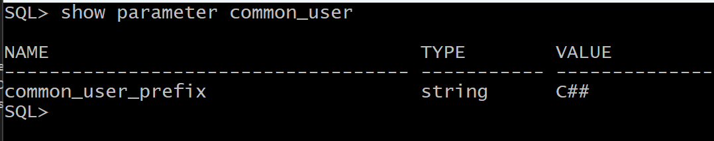
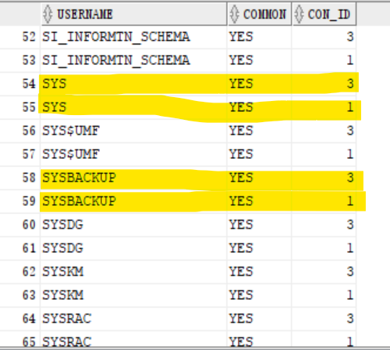
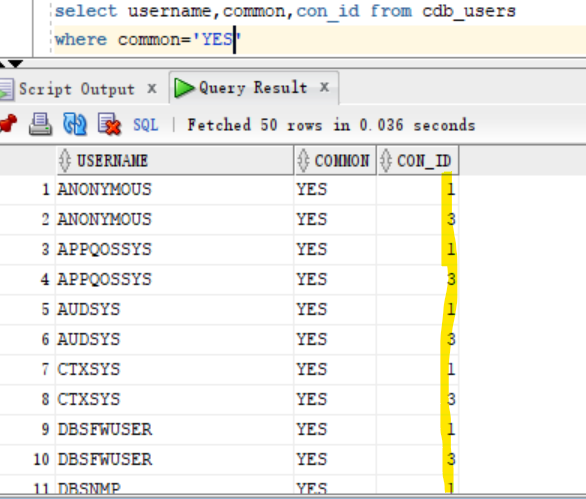
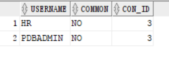
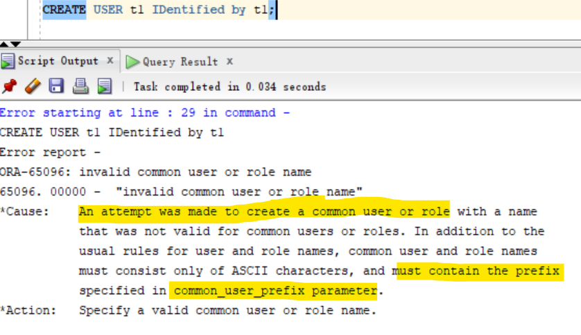
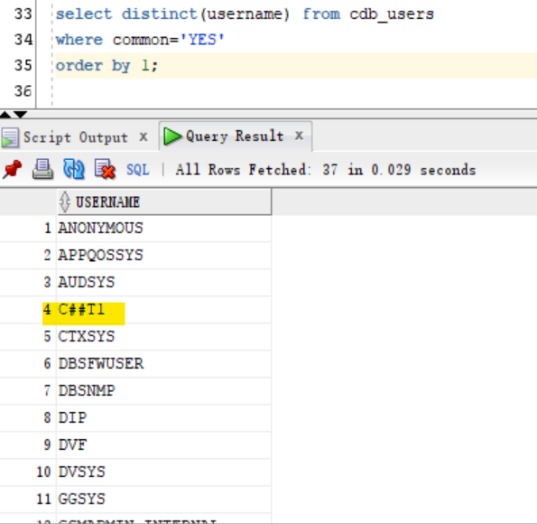
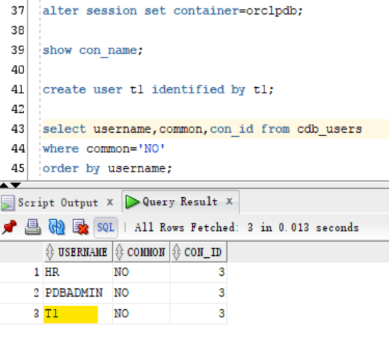

# DBA - User

[Back](../../index.md)

- [DBA - User](#dba---user)
  - [Change password](#change-password)
  - [Unlock a user account](#unlock-a-user-account)
  - [Common users VS local users](#common-users-vs-local-users)
  - [Lab: Query common users and local users](#lab-query-common-users-and-local-users)
  - [Lab: Create a common user](#lab-create-a-common-user)
  - [Lab: create a local user](#lab-create-a-local-user)

---

## Change password

```sql
# Connect as dba
CONNECT sys as sysdba;

# Alter user's passwords
ALTER USER user_name IDENTIFIED BY "new_password";

```

---

## Unlock a user account

```sql
select username from all_users where username = 'HR';    # confirm hr user exist.
ALTER USER hr ACCOUNT UNLOCK;   # unlock the account
ALTER USER hr IDENTIFIED BY "hr";   # set a new pwd

CONNECT hr/hr@orclpdb;    # Connect using hr

SELECT table_name FROM user_tables;
```


- Configure connection in SQL developer


- Query


---

## Common users VS local users

- `CDB common user`

  - a database account that is created **in the root container** and is **inherited by all PDBs** in the CDB, including future PDBs
  - **can not have the same name** as any `local user` across all the PDBs.
  - e.g., sys, system

- When creating a common user , but DBA need **user defined prefix** `C##`

  - e.g., `C##KHALED`

- The **user defined prefix** can be defined in **parameter** called `common_user_prefix`



---

- `Local user`
  - DB user created **in a specific PDB**
  - e.g., HR user in PDB orclpdb
  - can create same local account and password **in more than one PDB**
  - e.g.,:
    - HR user in PDB called pdb1,
    - HR user in PDB called pdb2,
    - HR user in PDB called pdb3

---

## Lab: Query common users and local users

- Connect using sql developer
- Open all pdb

```sql
show con_name

--make sure that all pluggable is opned
select con_id,name,open_mode from v$pdbs;

alter pluggable database all open;
```

- Query all users

```sql
# show all users in container and pdbs
select username,common,con_id from cdb_users
order by username;
```



> note: sys and sysbackup are database administrate account. The result shows they have both in root and pdb.

---

- Query common user
  - common users exist both in root and pdb (con_id)

```sql
select username,common,con_id from cdb_users
where common='YES'
order by username;

select distinct(username) from cdb_users
where common='YES';
```



---

- Query local user

```sql
select username,common,con_id from cdb_users
where common='NO'
order by username;
```



---

## Lab: Create a common user

- show the common_user_prefix

```sql
SHOW PARAMETER common_user_prefix
#NAME               TYPE   VALUE
#------------------ ------ -----
#common_user_prefix string C##
```

- When in root, create a user without the prefix will return an error.

```sql
show con_name;
#CON_NAME
#------------------------------
#CDB$ROOT

CREATE USER t1 IDentified by t1;
```



---

- Create a common user using prefix

```sql

CREATE USER C##t1 IDentified by welcome;

select distinct(username) from cdb_users
where common='YES';
```



---

## Lab: create a local user

- change session to a pdb
- Create a local user

```sql

alter session set container=orclpdb;

show con_name;
#CON_NAME
#------------------------------
#ORCLPDB

create user t1 identified by t1;

select username,common,con_id from cdb_users
where common='NO'
order by username;
```



---

[TOP](#dba---user)
