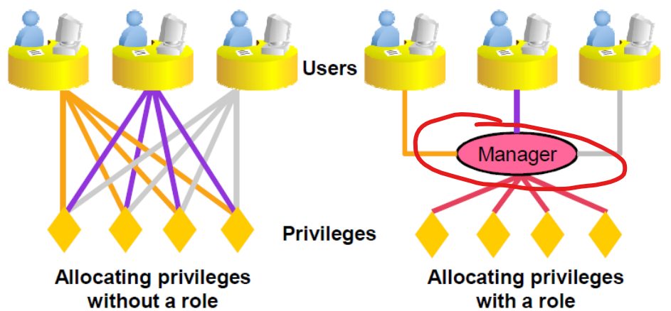
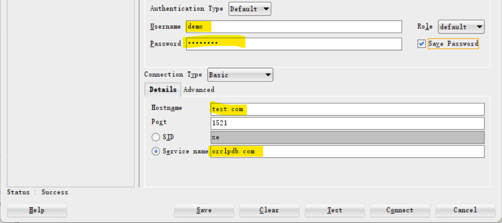
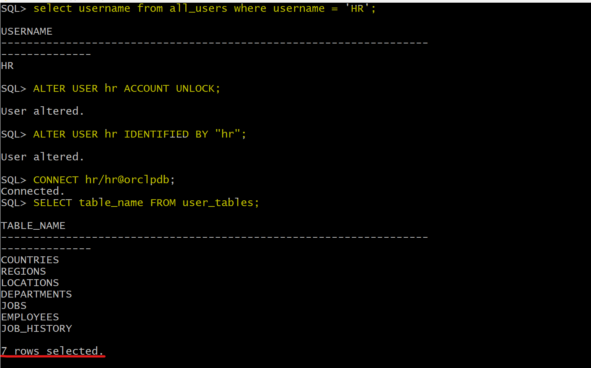
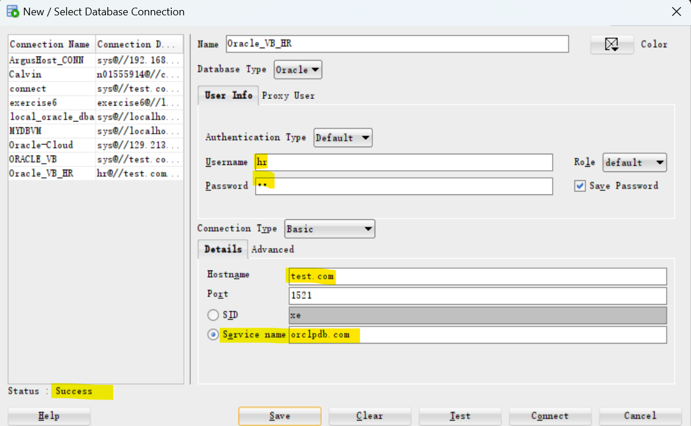
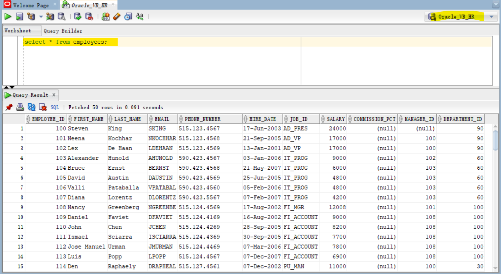

# DBA - User Security

[Back](../../index.md)

- [DBA - User Security](#dba---user-security)
  - [Privileges](#privileges)
    - [System privileges](#system-privileges)
    - [Object privileges](#object-privileges)
    - [Data Dictionary View](#data-dictionary-view)
  - [Roles](#roles)
  - [User Accounts](#user-accounts)
    - [User System Privilege](#user-system-privilege)
    - [User Object Privilege](#user-object-privilege)
  - [User Account Management](#user-account-management)
    - [Create user](#create-user)
  - [Lab:](#lab)
    - [Create a Local User](#create-a-local-user)
    - [User Change password](#user-change-password)
    - [`System Privileges`: Grant](#system-privileges-grant)
    - [`System Privileges`: Test](#system-privileges-test)
    - [`System Privilege`: List](#system-privilege-list)
    - [`Object Privileges`: DBA Grant](#object-privileges-dba-grant)
    - [`Object Privileges`: Test](#object-privileges-test)
    - [`Object Privileges`: List](#object-privileges-list)
    - [`Object Privileges`: Owner Grant](#object-privileges-owner-grant)
    - [Change user](#change-user)
      - [Change password](#change-password)
    - [Delete user](#delete-user)
    - [Unlock a user account](#unlock-a-user-account)

---

## Privileges

- `Privileges`

  - used to **control access** to database objects
  - controls whether a user can modify an object owned by another user.
  - granted or revoked
    - either **by the instance administrator**, a user with the ADMIN privilege
    - or **by the owner of the object**.
    - 要么是 dba, 要么是拥有者

- two main types of user privileges:
  - System privileges
  - Object privileges

---

### System privileges

- `System privileges`: admin 权限

  - enable users to perform specific database operations.
  - the permission
    - to perform a **particular action** 特定操作
    - or to perform **an action on any object** of a particular type.特定类型对象的操作
  - privileges can be granted **only by**:

    - **DBA**
    - a **user with `ADMIN` privilege**

- The dba has high-level system privileges for critical tasks

  - e.g., create or remove users, remove tb, backup tb.

- `system_privilege_map` table:

  - contains all the `system privileges` available. based on the version release.

- some prvileges:

  - `CREATE TABLE`: only can create table in user's shcema.
  - `CREATE ANY TABLE`: only can create table in any shcema.

- DBA can gran specific `system privileges` to a user.

---

### Object privileges

- `Object privileges`: admin + user 权限

  - controls access to a specific object.对单一对象.
  - the permission
    - to perform a **particular action on an object** 一个对象的特定操作
    - or to **access another user's object**. 访问其他用户对象.

- An object's **owner** has **all** `object privileges` for that object, and those privileges cannot be revoked.拥有者有所有权限, 权限不能被褫夺.

- The object's **owner** can **grant** `object privileges` for that object to **other users**.拥有者可以授权.

- A user with `ADMIN` privilege can **grant and revoke** `object privileges` from users who **do not own** the objects on which the privileges are granted. Admin 可以授权或褫夺对象权限.

---

### Data Dictionary View

| view            | Description                                                      |
| --------------- | ---------------------------------------------------------------- |
| `SESSION_PRIVS` | show system privileges that are currently available to the user. |

---

## Roles

- `roles`

  - A group of privileges or other roles. 权限/角色组, 权限/角色的集合.
  - **Unlike** `schema objects`, `roles` are **not** contained in any `schema`. 权限不是 schema 对象, 不属于任何 schema

- some **predefined roles**:

  - `DBA`,
    - enables a user to perform most administrative functions
    - **not include** the privileges to **start up** or **shut down** the database
  - `CONNECT`:
    - has the `CREATE SESSION` privilege.
  - `RESOURCE`
    - extends the privileges of a user beyond those granted by the `CONNECT` role.

- A `user` can have **several** `roles`, and **serveral** `users` can be assigned the same `role`.

---

- example:
- DBA **create** `roles`, **grant** `system privileges` and `object privileges` to the `roles`, and then **grant** `roles` to `users`. 先创建权限集合, 再将权限集合授予用户.

```sql
# create a role
CREATE ROLE manager;
# grant privileges to the role
GRANT create table, create view TO manager;
# grant role to a user;
GRANT manager TO alice;
```



---

## User Accounts

- `user account`

  - identified by a user name
  - contains the user's attributes:
    - **Password** for database authentication
    - **Privileges** and **roles**
    - **Default tablespace** for database objects
    - **Default temporary tablespace** for query processing work space

- `Schema`:

  - a collection of objects, such as tables, views, and sequences.
  - a **logical container** for the `database objects` (such as tables, views, triggers, and so on) that the `user` **creates**.
  - can be used to unambiguously **refer to objects** owned by the `user`.
    - e.g., `HR.EMPLOYEES` refers to the table named `EMPLOYEES` in the `HR` schema. (The EMPLOYEES table is owned by HR.)

- `users` and `schemas` are **database users**

  - `schema` name = `user` name
  - but when the `user` **has objects**, we call it `schema`.
    - When you **create** a `user`, you are also implicitly **creating** a `schema` for that user. 创建时, 隐含创建.
    - When you **drop (delete)** a `user`, you **must** either first **drop all** the user's schema **objects**, or use the **cascade** feature of the drop operation, which simultaneously drops a user and all of that user's schema objects.删除时, 同时删除用户对象.

---

### User System Privilege

- DBA can grant specific system privileges to a user.

```sql
# grant privilege(s) to a user
GRANT privilege, privilege, ...
TO user_name, user_name, ...;

# grant privilege(s) to a role
GRANT privilege, privilege, ...
TO role_name, role_name, ...;

# grant privilege(s) to the public
GRANT privilege, privilege, ...
TO role_name, role_name, ...;
```

---

### User Object Privilege

- The **owner** can **grant** specific privileges on owner's object to **another user**.

- **Grant:**

```sql
# grant object privilege to user
GRANT obj_privilege, obj_privilege, ...
ON oject_name
TO user_name, user_name, ...
WITH GRANT OPTION;

# grant object privilege to role
GRANT obj_privilege, obj_privilege, ...
ON oject_name
TO role_name, role_name, ...
WITH GRANT OPTION;

# grant object privilege to the public
GRANT obj_privilege, obj_privilege, ...
ON oject_name
TO PUBLIC
WITH GRANT OPTION;
```

- `WITH GRANT OPTION`: enables the grantee to grant object privileges to other users and roles.转授权.

---

- Revoke
  - privileges granted to other through the `WITH GRANT OPTION` are also revoked.

```sql
REVOKE obj_privilege, obj_privilege, ...
ON oject_name
FROM user_name | role_name | PUBLIC;
```

---

- Example:

```sql
GRANT select
ON employees
TO demo;

GRANT update(department_name, location_id)
ON departments
TO demo, manager;

GRANT select
ON departments
TO PUBLIC;

REVOKE select, insert
ON departments
FROM demo;
```

---

## User Account Management

### Create user

## Lab:

### Create a Local User

```sql
CONNECT sys AS SYSDBA;
show con_name;
ALTER session SET container=orclpdb;
show con_name;

# Create a local user.
CREATE USER demo IDENTIFIED BY demo1234;
```

---

### User Change password

- Connect as new user.

```sql
alter user demo identified by demo_green;
```

---

### `System Privileges`: Grant

```sql
# session
GRANT create session TO demo;

# grant tbsp in which table can be created.
GRANT UNLIMITED TABLESPACE TO demo;

# grant privileges
GRANT
  create table,
  create sequence,
  create view,
  create synonym
TO demo;
```

---

### `System Privileges`: Test

- Create connection as new user



- test system privileges with operations.

```sql
# ========Test for create table
create table emp
( empid number constraint emp_pk primary key,
  ename varchar2(100)
);

# demo is the owner of emp, he has all  pris on this tb.
insert into emp values (1,'khaled');

select * from emp;

alter table emp
add (salary number);

select * from emp;

# demo owns tb, so he can create index
create index ename_ind on emp (ename);

# ========Test CREATE SEQUENCE
create sequence emp_s;

# ========Test CREATE SEQUENCE
create index ename_ind on emp (ename);

# ========Test CREATE VIEW
create or replace view emp_v
as
select empid, ename
from emp;
```

---

### `System Privilege`: List

- Create connection as new user

```sql
# show privileges the user has for the current session, regardless if these privileges direct from a role. 包括从角色获取的权限
select * from session_privs;
# CREATE SESSION
# UNLIMITED TABLESPACE
# CREATE TABLE
# CREATE SYNONYM
# CREATE VIEW
# CREATE SEQUENCE

# show privileges that come direct to the user.
select * from user_sys_privs;
# DEMO	CREATE SESSION	NO	NO	NO
# DEMO	CREATE TABLE	NO	NO	NO
# DEMO	UNLIMITED TABLESPACE	NO	NO	NO
# DEMO	CREATE SEQUENCE	NO	NO	NO
# DEMO	CREATE VIEW	NO	NO	NO
# DEMO	CREATE SYNONYM	NO	NO	NO
```

---

### `Object Privileges`: DBA Grant

- Connect as sys

```sql
CONNECT sys AS SYSDBA;
show con_name;
ALTER session SET container=orclpdb;
show con_name;

# Grant Object Privileges
grant select on hr.employees to demo;

grant update (salary)  on hr.employees to demo;

grant delete on hr.employees to demo;

grant all on hr.locations to demo;

grant select, insert
on hr.jobs to demo;

grant select
on hr.countries
to public;
```

---

### `Object Privileges`: Test

- Connect as new user.


```sql
# ===== test select
# must with 'hr.', because it is granted.
#
select * from hr.employees;

# the demo user can make select * from employees without hr. only if there is public syonym for hr.employees
select * from all_synonyms
where table_name='EMPLOYEES';
# return none, because no sysnoym is created named EMPLOYEES.

# ======== test update
# cannot, because only salary column is granted.
update hr.employees
set department_id =null
where employee_id=1;
/* SQL Error: ORA-01031: insufficient privileges
01031. 00000 -  "insufficient privileges"
*Cause:    An attempt was made to perform a database operation without
           the necessary privileges.
*Action:   Ask your database administrator or designated security
           administrator to grant you the necessary privileges */

update hr.employees
set salary =500
where employee_id=1;
```

---

### `Object Privileges`: List

- Connect as new user.

```sql
# object priviledges granted to the user.
# note: privileges are consistent with grant statement
# the granters are HR, that is, sys grant act like the owner.
select * from user_tab_privs_recd
order by 2;
# HR	EMPLOYEES	HR	DELETE	NO	NO	NO	TABLE	NO
# HR	EMPLOYEES	HR	SELECT	NO	NO	NO	TABLE	NO
# HR	JOBS	HR	INSERT	NO	NO	NO	TABLE	NO
# HR	JOBS	HR	SELECT	NO	NO	NO	TABLE	NO
# HR	LOCATIONS	HR	SELECT	NO	NO	NO	TABLE	NO
# HR	LOCATIONS	HR	UPDATE	NO	NO	NO	TABLE	NO
# HR	LOCATIONS	HR	REFERENCES	NO	NO	NO	TABLE	NO
# HR	LOCATIONS	HR	READ	NO	NO	NO	TABLE	NO
# HR	LOCATIONS	HR	ON COMMIT REFRESH	NO	NO	NO	TABLE	NO
# HR	LOCATIONS	HR	QUERY REWRITE	NO	NO	NO	TABLE	NO
# HR	LOCATIONS	HR	DEBUG	NO	NO	NO	TABLE	NO
# HR	LOCATIONS	HR	INSERT	NO	NO	NO	TABLE	NO
# HR	LOCATIONS	HR	INDEX	NO	NO	NO	TABLE	NO
# HR	LOCATIONS	HR	FLASHBACK	NO	NO	NO	TABLE	NO
# HR	LOCATIONS	HR	ALTER	NO	NO	NO	TABLE	NO
# HR	LOCATIONS	HR	DELETE	NO	NO	NO	TABLE	NO

# show obj privileges on specific columns
select * from user_col_privs_recd;
# HR	EMPLOYEES	SALARY	HR	UPDATE	NO	NO	NO
```

---

### `Object Privileges`: Owner Grant

```sql
grant select on emp to hr;

# show tb privilege that the owner gives to another user.
select * from user_tab_privs_made;
# HR	EMP	DEMO	SELECT	NO	NO	NO	TABLE	NO
# PUBLIC	DEMO	DEMO	INHERIT PRIVILEGES	NO	NO	NO	USER	NO
# INHERIT PRIVILEGES to PUBLIC: any object demo creaated can be granted to public. Here the talbe name demo means any table created by user demo.

grant update (ename) on emp to hr;

# show the privileges for column that the owner gives to another user.
select * from user_col_privs_made;
# HR	EMP	ENAME	DEMO	UPDATE	NO	NO	NO
```

---

### Change user

#### Change password

```sql
# Connect as dba
CONNECT sys as sysdba;

# confirm current user
SHOW user;

# Alter user's passwords
ALTER USER user_name
IDENTIFIED BY "new_password";

```

### Delete user

---

### Unlock a user account

```sql
select username from all_users where username = 'HR';    # confirm hr user exist.
ALTER USER hr ACCOUNT UNLOCK;   # unlock the account
ALTER USER hr IDENTIFIED BY "hr";   # set a new pwd

CONNECT hr/hr@orclpdb;    # Connect using hr

SELECT table_name FROM user_tables;
```



- Configure connection in SQL developer



- Query



---

[TOP](#dba---user-security)
