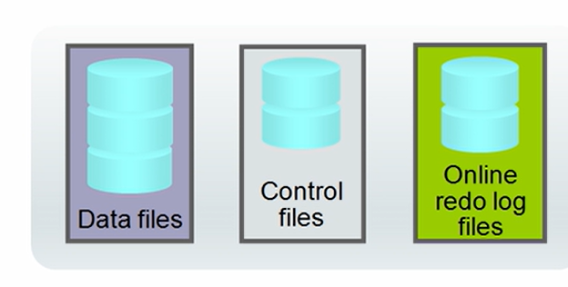
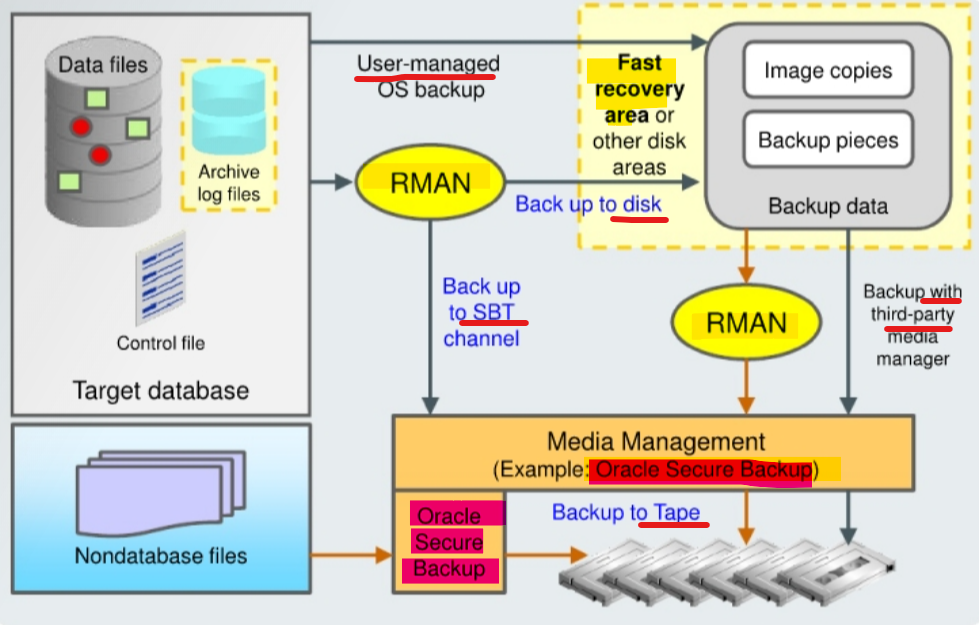
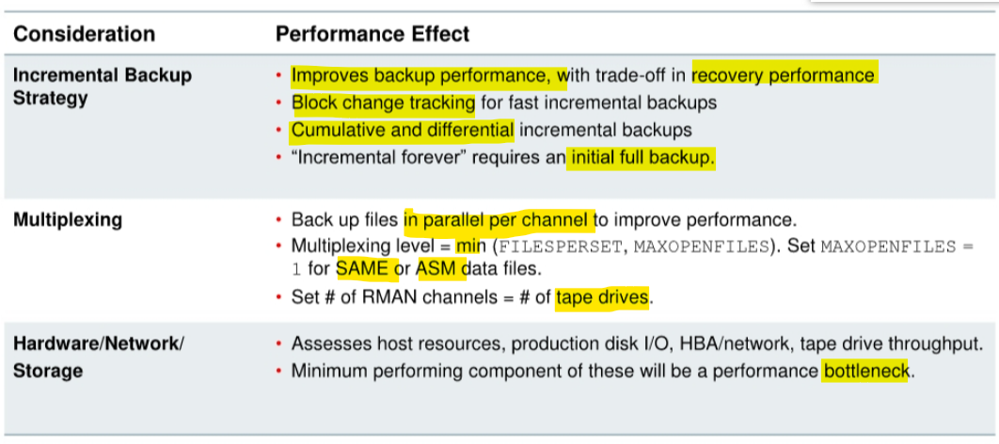

# DBA - Backup

[Back](../../index.md)

- [DBA - Backup](#dba---backup)
  - [Backup Terminology](#backup-terminology)
  - [RMAN Backup Types](#rman-backup-types)
  - [Backup Solutions 工具](#backup-solutions-工具)
  - [Balancing Backup and Restore Requirements 性能](#balancing-backup-and-restore-requirements-性能)
    - [Incremental Backup Strategy](#incremental-backup-strategy)
    - [RMAN Multiplexing](#rman-multiplexing)

---

## Backup Terminology

- 备份对象

  - Data File
  - Control File
  - Online redo log file



- 空间完整性

  - `Whole Database Backup`:
    - Includes **all** `data files` and `at least one` `control file`(all control files in a database are identical).
  - `Partial Database Backup`:
    - May include zero or more `tablespaces` and zero or more `data files`.
    - May or may not include a `control file`.

- 时间完整性

  - `Full Backup`:
    - Copies each `data block` **containing data** within the files being backed up. 只要有数据的 block 都会被备份
  - `Incremental Backup`:

    - Copies all `data blocks` that have **changed since the last backup**. 只包括自上次备份后改变的 block

- Oracle supports two levels of **incremental backup**: `level 0` and `level 1`.

  - `Level 1 Incremental Backup`:
    - Can be `cumulative` or `differential`.
      - `Cumulative`: Backs up all changes **since the last** `level 0` backup.
      - `Differential`: Backs up all changes **since the last** `incremental backup` (either level 0 or level 1).

- RMAN supports **change tracking** for `incremental backups`.

- db 是否打开

  - `Offline Backups` / `cold` / `consistent backup`:

    - Taken while the **database is not open**.
    - **Consistent** because the `system change number (SCN)` in `data file` headers **matches** the `SCN` in the `control files`.

  - `Online Backups` / `hot` / `inconsistent backup`:
    - Taken while the **database is open**.
    - **Inconsistent** because there is **no** guarantee that `data files` are synchronized with `control files` while the database is open.

---

- **Backup strategy** may include:
  - Entire database (`whole`)
  - Portion of the database (`partial`)
- **Backup type** may indicate inclusion of:
  - **All** data blocks within your chosen files (`full`)
  - Only information that has **changed** since a previous backup (`incremental`)
    - `Cumulative` (changes since last level 0)
    - `Differential` (changes since last incremental)
- **Backup mode** may be:
  - `Offline` (consistent, cold)
  - `Online` (inconsistent, hot)

---


## RMAN Backup Types

- `Full Backups`

  - different from a `whole database backup`.
  - a backup that **includes every used data block** in the file.已使用的, 不包括空白未使用的.

  - RMAN **copies all blocks** into the **backup set** or **image copy**, skipping only those data file blocks that are **not part of an existing segment**.

  - For a full `image copy`, the **entire file contents** are reproduced exactly.

- A `full backup` **cannot be part** of an `incremental backup strategy`: it **cannot be** the **parent** for a subsequent `incremental backup`.

- `Incremental Backups`:

  - either a `level 0 backup`, which **includes every block** in the data files **except blocks that have never been used**,
  - or a `level 1 backup`, which includes only those **blocks** that have been **changed** since a previous backup was taken.

- A `level 0 incremental backup` is physically identical to a `full backup`. The only difference is that the `level 0 backup` (as well as an image copy) can be used **as the base** for a `level 1 backup`, but a `full backup` can **never** be used as the **base** for a `level 1 backup`. 物理上相同, 但在实操中 full 不作为累进备份的基础, level 0 可以.

- RMAN can create **multilevel** `incremental backups` as follows:
  - `Differential`:
    - **default** type of `incremental backup`
    - backs up all blocks changed after the most recent incremental backup at **either** `level 1` or `level 0`
  - `Cumulative`: Backs up all blocks changed after the most recent backup at `level 0`

---

- `full backup`
  - contains **all used data** file blocks.
- `level 0 incremental backup` is equivalent to a `full backup` that has been marked as level 0.
- `cumulative level 1`:
  - contains only blocks **modified** since the last `level 0` incremental backup.
- `differential level 1`:
  - contains only blocks modified since the last **incremental backup**.

---

- Command:

```sql
-- incremental backup at level 0
BACKUP INCREMENTAL LEVEL 0 DATABASES;

-- diferentil incremental backup
BACKUP INCREMENTAL LEVEL 1 DATABASE:
-- cumulative incremental backup
BACKUP INCREMENTAL LEVEL 1 CUMULATIVE DATABASE
```

---

- By Default, `RMAN` performs `full backups`

  - With unused block compression, blocks that have **never been written** are **skipped** during data file backups to `backup sets`, even for `full backups`. 没有用的都会压缩.

- A `full backup` does **not impact** subsequent `incremental backups` and isn't considered part of an `incremental backup strategy`.

  - However, a `full image copy backup` can be incrementally updated by applying `incremental backups` with the `RECOVER` command. 恢复时, 可以作为基础. 但备份时, 不作为累进备份.

- `NOARCHIVELOG` mode:
  - can perform any type of backup (full or incremental) of a database in mode as long as the database is not open.
  - recovery is limited to the time of the **last backup**.仅限于最后一次备份
  - The database can be recovered to the last committed transaction only when it is in `ARCHIVELOG` mode.

---

## Backup Solutions 工具



- `Recovery Manager (RMAN)` is the **recommended method** of backing up your Oracle database. 推荐工具=rman

  - can use it to back up: 备份到磁盘或 SBT
    - to **disk**
    - or to a `System Backup to Tape (SBT)` channel.

- Disk Backup: 磁盘备份=FRA

  - stored in the `Fast Recovery Area (FRA)`

- Tap Backup:

  - `Oracle Secure Backup`(interacts transparently with RMAN), by adding backup **to tape** and **backup of file system data**.
  - **Third-party media managers** can also be used to back up to tape. 第三方

- **User-managed backups** are non-RMAN backups, for example, using an `OS utility`. They are often based on **scripts** that a DBA must write. 用户自定义备份, 脚本.

---

## Balancing Backup and Restore Requirements 性能



---

### Incremental Backup Strategy

- `Incremental Backup Strategy`

  - Incremental backups generally **take up less space** than a `full backup` and typically **take less time to create**.
  - **Recovery** with incremental backups is generally **faster** than using redo log files to apply changes to a backup.

- By incrementally updating backups, you can **avoid the overhead** of making `full image copy backups` of data files, while also **minimizing time** required for media **recovery** of your database. 避免 full 的开销; 恢复时,用时少.

- The `block change tracking` feature for incremental backups can improve backup performance by recording changed chunks of blocks for each data file.背后基于块追踪技术.

  - If `block change tracking` is enabled on a primary or standby database, RMAN uses a block change tracking file to **identify a chunk of change blocks** for incremental backups.
  - By reading this small bitmap file, RMAN **avoids having to scan every block** in the `data file` that it is backing up.避免扫描所有.

- differential vs cumulative
  - When **recovery time is more important** than disk space, `cumulative backups` are **preferable**
    - because fewer incremental backups need to be applied during recovery.

---

### RMAN Multiplexing

- `RMAN channel`

  - a **single backup file stream**.
  - A channel can
    - read **multiple** `data files` or `archived logs` into a multiplexed `backup set`
    - read **one file** at a time for an `image copy backup.`

- **Increasing the number** of RMAN channels increases backup **parallelism**, which may **reduce the time** required to create the backup.
- `RMAN multiplexing`: 多路复用，是指从多个输入文件读，但写向同一 backupset。image copy 不支持多路复用。

  - the **number** of `data files` or `archived logs` that are read by one channel at any time.
  - The **default** is `min (FILESPERSET, MAXOPENFILES)`.

    - `FILESPERSET`
      - specified in the `BACKUP` command and defaults to `64`.
    - `MAXOPENFILES`
      - specified in the `CONFIGURE CHANNEL` command and defaults to `8`.

  - `Multiplexing` therefore **defaults** to `8`:
    - a maximum of eight files will be read **by one channel at any one time**.默认每路 8 个.

- For `Stripe and Mirror Everything (SAME)` and `ASM storage`, `MAXOPENFILES` should be set to `1` because all files are striped appropriately across available disks and will be read efficiently by RMAN.

- Do **not** use **media management multiplexing** (multiple channels per **tape drive**). tape 不适用.
  - `RMAN backup pieces` will not be efficiently restored due to the interleaving of pieces on the same tape volume, which may necessitate the forward and backward movement of the tape.

---

[TOP](#dba---backup)
