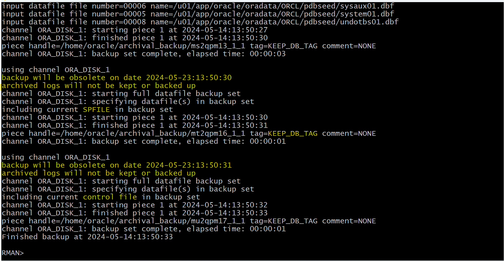

# Backup - Archival Backups

[Back](../../index.md)

- [Backup - Archival Backups](#backup---archival-backups)
  - [Archival Backups](#archival-backups)
  - [Lab: Creating an Archival Backup](#lab-creating-an-archival-backup)

---

## Archival Backups

- Problem:

  - to simply keep the specific backup (and what is necessary to keep it consistent and recoverable) for a specified amount of time, e.g., for two years, and to maintain a retention policy 长期保留备份的同时不改变留存政策

- `archival backup`:

  - a **snapshot of the database** at a point in time that can be used, for example, to **restore** the database to another host, for testing purposes.
  - a backup that is **not** under your normal `retention policies`
    - a marker on backup that **overrides any configured retention policy**
    - either considered **obsolete only after** a specific time that you specify
    - or **never considered obsolete**.
      - need to use a recovery catalog.
  - can be created with an `open` or a `mounted` database.


- **Prerequisite**:

  - use a recovery catalog for an `OPEN` database.
  - not use a recovery catalog: database in `MOUNTED` state.

- **Characteristics**:

  - `Archival backups` **cannot be written** to the `fast recovery area`.
    - So if you have one, you must provide a `FORMAT` clause to specify a different location.
  - An `archival backup` also guarantees that **all of the files needed** to restore the backup are **included**.
    - Including:
      - `data files`
      - `SPFILE`
      - `archived log files` (only those needed to recover an online backup)
      - the **relevant autobackup files**.
    - All these files must go to the **same media family** (or group of tapes).
  - The only `redo logs` that are kept are those required to restore this backup to a **consistent state**.

  - An `archival backup` is retained for as long as specified. Even if you have a much smaller `retention window` and run the `DELETE OBSOLETE` command, the `archival backup` remains.不会被删除直到指定时间

---

- **Syntax**:

```sql
BACKUP ... KEEP {FOREVER|UNTIL TIME 'SYSDATE + <n>'} RESTORE POINT <restore_point_name>

-- Example
KEEP {FOREVER | UNTIL TIME [=] ' date_string '}
NOKEEP
[RESTORE POINT rsname]

-- List all restore points known to the RMAN repository:
LIST RESTORE POINT ALL;

-- Display a specific restore point:
LIST RESTORE POINT 'rsname';

-- -------- Managing Archival Database Backups
-- Archiving a database backup forever:
CONNECT CATALOG rman/rman@catdb  -- required catalog
CHANGE BACKUP TAG 'consistent_db_bkup' KEEP FOREVER;

-- Changing the status of a database copy:
-- to make a backup that is currently exempt from the retention policy eligible for the OBSOLETE status.
-- applies to all backups of the type specified if tag is not specified.
CHANGE COPY OF DATABASE CONTROLFILE NOKEEP;
```

- `UNTIL TIME` clause: 标明备份保留时间
  - enables you to **specify** when the archival backup is **no longer immune** to the `retention policy`.
- `FOREVER`:

  - the backup is an archival backup **until** you take some other action to **change** that.

- `RESTORE POINT` clause:标明数据对齐的时间点
  - to specify the **name of a restore point** to be associated with this backup.
    - creates a **consistency point** in the `control file`.
    - assigns a name to a specific `SCN`.
      - The SCN is **captured just after** the data file backup completes.
  - The archival backup can be** restored and recovered for this point in time**, enabling the database to be **opened**.
  - In contrast, the` UNTIL TIME` clause specifies the date until which the backup **must be kept**.
  - not valid with the `CHANGE` command,
    - because there is no way to create the restore point for a time that has already passed (when the backup was created).一旦生成, 无法更改

---

## Lab: Creating an Archival Backup

```sql
-- mount db
SHUTDOWN IMMEDIATE;
STARTUP MOUNT;
```

```sql
-- to make an archival backup of your ORCLCDE database with the KEEP FOREVER option
BACKUP AS COPY DATABASE KEEP FOREVER;
-- It failed because a backup with the KEEP FOREVER option requires the use of a recovery catalog.
-- A recovery catalog is required when KEEP FOREVER is specified because backup records will eventually age out of the control file.
```


```sql
-- to make an archival backup of your ORCLCDE database that will be kept for 9 days.
BACKUP AS COPY DATABASE KEEP UNTIL TIME 'SYSDATE+9';
-- It failed because a backup with the KEEP option (an archival backup) cannot be written to the Fast Recovery Area.
-- Allowing this has the potential of causing the Fast Recovery Area to quickly run out of space.
```


```sql
-- create dir: /home/oracle/archival_backup/
-- Create an archival backup with a FORMAT clause that will direct RMAN to create the backup in the /home/oracle/backup directory and keep it for 9 days.
BACKUP DATABASE FORMAT '/home/oracle/archival_backup/%U' TAG keep_db_tag KEEP UNTIL TIME 'SYSDATE+9';
```




```sql
ALTER DATABASE open;

LIST BACKUP;

-- delete obsolete backup in FRA
DELETE OBSOLETE;
```


- Confirm the archival backup will not be removed

```sh
ls /home/oracle/archival_backup/
```


---

[TOP](#backup---archival-backups)
