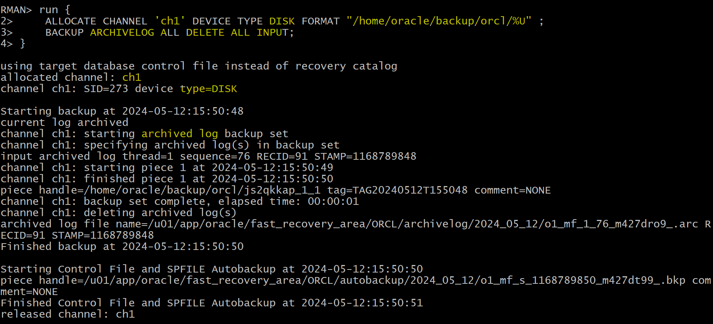

# Backup - Archivelog Files

[Back](../../index.md)

- [Backup - Archivelog Files](#backup---archivelog-files)
  - [Lab: Back up the archive log files and delete the files after the backup completes.](#lab-back-up-the-archive-log-files-and-delete-the-files-after-the-backup-completes)

---

## Lab: Back up the archive log files and delete the files after the backup completes.

```sql
run {
    ALLOCATE CHANNEL "chl" DEVICE TYPE DISK FORMAT "/home/oracle/backup/orcl/%U";
    BACKUP ARCHIVELOG ALL DELETE ALL INPUT;
}
```



---

[TOP](#backup---archivelog-files)
