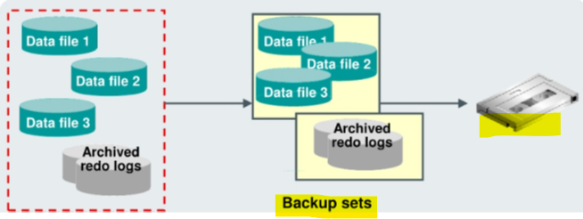
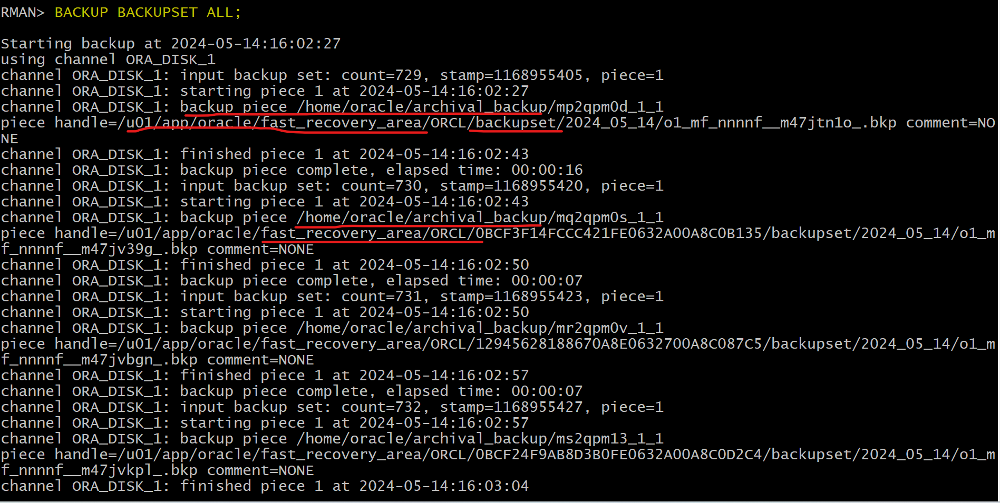

# Backup - Backing Up Backup

[Back](../../index.md)

- [Backup - Backing Up Backup](#backup---backing-up-backup)
  - [Backing Up Backup Sets](#backing-up-backup-sets)
    - [Lab: Backing up Backup Set](#lab-backing-up-backup-set)
  - [Backing Up Image Copies](#backing-up-image-copies)

---

## Backing Up Backup Sets

- `Backing Up Backup Sets`:

  - to back up previously created backup sets.
  - By default, uses the **default disk channel** to copy `backup sets` from disk to disk. 默认磁盘到磁盘
    - must either configure or manually allocate a **nondisk** channel.必须手动设置非磁盘

\_

- **Note**:

  - Only `backup sets` that were created on device type `DISK` can be backed up using RMAN. 只有备份片能被 RMAN 备份.
  - The `backup sets` can be backed up to any available device type.
  - cannot duplex backups when running `BACKUP BACKUPSET`. RMAN always makes one and only one copy on the specified media when performing `BACKUP BACKUPSET`. 不能备份到 tape 的同时多份备份.

- **Syntax**

```sql
BACKUP BACKUPSET;
```

- **Example:**

```sql
-- Prerequisite: sbt channel have been configured.

-- Backup the database and archived redo logs to disk as backup sets.
BACKUP DEVICE TYPE DISK AS BACKUPSET DATABASE PLUS ARCHIVELOG;

-- Backup all database files and archived redo logs to SBT (System Backup to Tape) storage as backup sets.
BACKUP DEVICE TYPE sbt BACKUPSET ALL;


-- Optional: Perform a backup of all database files and archived redo logs to SBT (System Backup to Tape) storage as backup sets, and delete the input files (backup pieces) after a successful backup.
BACKUP DEVICE TYPE sbt BACKUPSET ALL DELETE INPUT;
```

---

### Lab: Backing up Backup Set

```sql
-- backup database and archivelog as backupset, by default,the device type is disk
BACKUP AS BACKUPSET DATABASE PLUS ARCHIVELOG;

-- Backup all backupset
BACKUP BACKUPSET ALL;
-- note that here using default device type, the disk
-- the backup of backup set is backed up to FRA

```



---

## Backing Up Image Copies

- **Scenarios:**

  - when you want to back up image copies on disk to tape, because all backups to tape must be backup sets.

- **Good Practice:**

  - When backing up your image copies, identifying the image copy to back up is easier if you provide **tags** for your backups. 用标签
  - the `tag` of the `image copy` being backed up will also be assigned to the **new backup**. 自动继承标签
  - When multiple image copies have the **same tag**, the **most recent image copy** of a file with the specified tag will be backed up.自动适用最新备份映像.

- **Syntax & Example:**

```sql
-- backs up the latest image copy of the database to tape:
BACKUP DEVICE TYPE sbt COPY OF DATABASE;

-- backs up the latest image copy backup of a database in backup sets on tape, and then deletes the input disk backups:
BACKUP DEVICE TYPE sbt COPY OF DATABASE DELETE INPUT;
```

---

[TOP](#backup---backing-up-backup)
