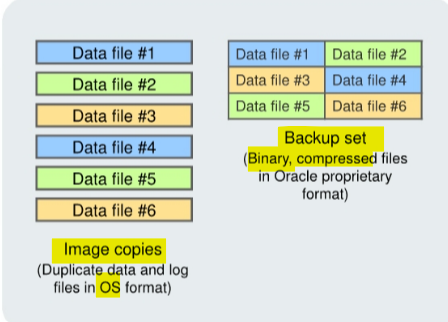

# DBA - `Backup Sets` and `Image Copies`

[Back](../../index.md)

- [DBA - `Backup Sets` and `Image Copies`](#dba---backup-sets-and-image-copies)
  - [Dynamic Views](#dynamic-views)
  - [Backup Sets](#backup-sets)
    - [Command](#command)
  - [Image Copies](#image-copies)
    - [Command](#command-1)
  - [`Backup Set` vs `Image Copy`](#backup-set-vs-image-copy)
  - [Proxy copies](#proxy-copies)

---

## Dynamic Views

- Dynamic Views about backups:

| Dynamic View      | Description                                               |
| ----------------- | --------------------------------------------------------- |
| `V$BACKUP_SET`    | Backup sets created                                       |
| `V$BACKUP_ PIECE` | Backup pieces that exist                                  |
| `V$DATAFILE_COPY` | Copies of data files on disk                              |
| `V$BACKUP_ FILES` | Information about all files created when creating backups |

- If using recovery catalog:

| View               | Description                                               |
| ------------------ | --------------------------------------------------------- |
| `RC_BACKUP_SET`    | Backup sets created                                       |
| `RC_BACKUP_ PIECE` | Backup pieces that exist                                  |
| `RC_DATAFILE_COPY` | Copies of data files on disk                              |
| `RC_BACKUP_ FILES` | Information about all files created when creating backups |

---

## Backup Sets

- `backup pieces`

  - a binary file contains a backup of one or more `database files`.

- `Backup sets`:

  - a collection of `backup pieces`
  - an **RMAN-exclusive format**
    - only created and accessed through `RMAN`
    - the only form in which `RMAN` can write backups to `media managers` such as **tape drives** and **tape libraries**.

- **Characteristics**:

  - can be sent
    - to the **disk**
    - to the **tape** directly.
  - **empty data blocks** are not stored, thereby causing backup sets to **use less space** on the disk or tape.
  - can be **compressed** to further reduce the space requirements of the backup.
  - A `backup set` can contain **multiple** `data files`.
    - e.g.,
      - you can back up 10 data files into a **single** `backup set` consisting of a **single** `backup piece`.
      - In this case, RMAN creates **one** `backup piece` as output. The backup set contains **only** this `backup piece`.

- **Advantage:**

  - better space usage, significantly reduce the space required by the backup.

- **Disadvantage:**

  - With backup sets, the **entire** backup set **must be retrieved** from your backup location **before** you **extract** the file or files that are needed.

- In most systems, the advantages of backup sets outweigh the advantages of image copies.

---

### Command

- The `FORMAT` parameter

  - specifies a **pattern** to use in creating a **file name** for the backup pieces created by this command.

- The FORMAT specification can also be provided through the `ALLOCATE CHANNEL` and `CONFIGURE` commands.

```sql
BACKUP AS BACKUPSET
FORMAT '/BACKUP/df_%d_%s_%p.bus'
TABLESPACE hr data;
```

---

## Image Copies

- `Image copies`:

  - a bit-by-bit copy of a single `data file`, `archived redo log`, or `control file`.

- can be created 创建方式

  - with the `BACKUP AS COPY` command
  - with an **operating system command**.

- When you create the image copy with the RMAN `BACKUP AS COPY` command, the server session **validates** the blocks in the file and **records** the copy information in the control file. 验证并记录在 cf 中

- **Characteristics**:

  - can be written **only to disk**.只能写到磁盘.注意该处是**直接写入**. image copy 可以拷贝到 tape.

    - When large files are being considered, copying may take a long time, but restoration time is reduced considerably because the copy is available on the disk. 备份时长, 但恢复时短

  - If files are stored on disk, they can be **used immediately** by using the `SWITCH` command in RMAN, which is equivalent to the `ALTER DATABASE RENAME FILE` SQL statement. 在磁盘上可以马上使用

  - In an image copy, **all blocks are copied**, whether they contain data or not, because an Oracle database process copies the file and performs additional actions such as **checking for corrupt** blocks and registering the copy in the control file. 复制所有块, 包括未使用的.

  - To speed up the process of copying, you can use the `NOCHECKSUM` parameter. By default, RMAN **computes a checksum** for each block backed up and stores it with the backup. When the backup is restored, the checksum is **verified**.作为恢复时验证项之一.默认项.
  - An image copy can be part of a `full` or `incremental level 0 backup` because a file copy always includes all blocks. You must use the level 0 option if the copy will be used in conjunction with an incremental backup set. 可以作为全备份

- **Advantage:**

  - improved **granularity of the restore operation**. With an image copy, only the file or files need to be **retrieved** from your backup location. 可以精准取回需要的文件.

- **Disadvantage:**

  - Space usage, Image copies back up every data block, even if the data block is empty.

---

### Command

Configuration:

```sql
CONFIGURE DEVICE TYPE DISK BACKUP TYPE TO COPY;
```

Backup

```sql
BACKUP AS COPY DATABASE PLUS ARCHIVELOG;
BACKUP AS COPY DATAFILE '/ORADATA/users_01_db0l.dbf';
BACKUP AS COPY ARCHIVELOG LIKE '/arch$';
```

---

## `Backup Set` vs `Image Copy`

- advantage of creating backups as `image copies`

  - It improves the **granularity of the restore operation**.
    - With an `image copy`, **only** the file or files **need** to be **retrieved from** your backup location. 仅提取必须文件
    - With `backup sets`, the **entire** backup set must be **retrieved** from your backup location before you **extract** the file or files that are needed. 整体提取.

- the advantage of creating backups as `backup sets`
  - It has better **space usage**.
    - In most databases, 20% or more of the `data blocks` are **empty blocks**.
    - `Image copies` back up **every** `data block`, even if the data block is empty.
    - `Backup sets` significantly **reduce the space** required by the backup.
  - In most systems, the advantages of backup sets outweigh the advantages of image copies.

---

## Proxy copies

- `Proxy copies`:
  - a feature that enables a `media manager` to manage completely the **transfer of data** between **disk** and **backup media**.
  - The media manager then determines how and when to move the data.

---

- Backups may be stored as:
  - `Image copies`
  - `Backup sets`
  - Proxy copies



---

[TOP](#dba---backup-sets-and-image-copies)
