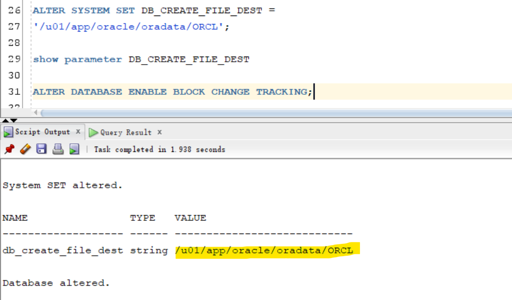

# DBA - Backup: Block Change Tracking Feature

[Back](../../index.md)

- [DBA - Backup: Block Change Tracking Feature](#dba---backup-block-change-tracking-feature)
    - [Block Change Tracking](#block-change-tracking)
  - [Block Change Tracking File](#block-change-tracking-file)
  - [Lab: Configuring Block Change Tracking](#lab-configuring-block-change-tracking)

---

### Block Change Tracking

- `Block Change Tracking`

  - By **default**, not enable
  - used to implement `Fast Incremental Backup` to **improve the performance** of incremental backup’s by recording information of changed database blocks in `change tracking file`.
  - maintains a record of `block chunks` that have **changed** since the last backup
  - Writes this record **to a file**, **as redo is generated** redo 产生时生产文件
  - **optimized** for up to **eight** `incremental backups`
  - recommended when your changes are `20` percent or less.
  - can make incremental backup **faster**
    - When it is time to perform the `incremental backup`, RMAN can look at the `block change tracking file`, determine the **modified** `block chunks`, and **back up only those blocks**.
    - It does **not** have to **scan every block** to see whether it has changed since the last backup.

---

## Block Change Tracking File

- `Block Change Tracking File`

  - a **binary file** to track modified block since the last `incremental backups`.

- **Characteristics**:

  - If the `change tracking file` is stored in the database area with your database files, it is **deleted** when you **disable** change tracking. 如果文件在数据库文件中, 自动删除
  - Consider the **eight-bitmap limit**8 个
    - contain only **eight bitmaps**, so the backup **cannot be optimized** if there have been more than eight incremental backups since the **parent-level backup** that the new incremental will be based on.
    - e.g.,
      - if you make a `level 0 database backup` followed by **seven** `differential incremental backups`, then the `block change tracking file` now includes **eight** bitmaps. 包括 level 0
      - If you then make a `cumulative level 1 incremental backup`, RMAN cannot optimize the backup because the bitmap corresponding to the parent level 0 backup is **overwritten** with the bitmap that tracks the current changes.
  - The maintenance of the `tracking file` is fully **automatic** and does **not require your intervention**.
  - The **minimum size** for the `block change tracking file` is **10 MB**, and any new space is allocated **in 10 MB increments**.
  - should not place `block change tracking file` in the `fast recovery area`.

    - RMAN does **not** support **backup** and **recovery** of the `block change tracking file`.

- Prerequisite:

  - must be in the `MOUNT` state

- Tools:

  - `Enterprise Manager Cloud Control`
  - SQL command

---

- **Initialization Parameter**:

  - `DB_CREATE_FILE_DEST`:
    - default destination of the `BCT` file
    - default: null

- SQL Command:

```sql
show parameter DB_CREATE_FILE_DEST

-- Enable the block change tracking
ALTER DATABASE
ENABLE BLOCK CHANGE TRACKING
[USING FILE 'path'];

-- Disable the block change tracking
ALTER DATABASE
DISABLE BLOCK CHANGE TRACKING;

-- Rename the block change tracking
-- The database must be in MOUNT state.
ALTER DATABASE
RENAME FILE 'path' TO 'path';
```

- Views

| View                      | Description                                      |
| ------------------------- | ------------------------------------------------ |
| `V$BLOCK_CHANGE_TRACKING` | Show info of `block change tracking file`        |
| `V$BACKUP_DATAFILE`       | how **effective** the `block change tracking` is |

```sql
-- Query block change tracking file
SELECT filename, status, bytes
FROM v$block change_tracking;

-- Query efficiency of block change tracking file
SELECT file#, avg(datafile_blocks), avg(blocks_read),
avg (blocks_read/datafile_blocks) * 100 AS PCT_READ_FOR_BACKUP,
avg (blocks)
FROM v$backup_datafile
WHERE used_change_tracking = 'YES' AND incremental_level > 0
GROUP BY file#;

-- shows how **effective** the `block change tracking` is in minimizing the `incremental backup` I/O - `PCT_READ_FOR_BACKUP` column:
--  A **high** value indicates that RMAN reads **most** blocks in the data file during an incremental backup.
--  You can **reduce** this ratio by **decreasing the time** between the `incremental backups`.
```

---

## Lab: Configuring Block Change Tracking

```sql
-- view the parameter before configuration
show parameter DB_CREATE_FILE_DEST

-- Set the DB_CREATE_FILE_DEST initialization parameter
ALTER SYSTEM SET DB_CREATE_FILE_DEST =
'/u01/app/oracle/oradata/ORCL';

-- confirm
show parameter DB_CREATE_FILE_DEST

-- Enable block change tracking
ALTER DATABASE ENABLE BLOCK CHANGE TRACKING;
```



---

[TOP](#dba---backup-block-change-tracking-feature)
