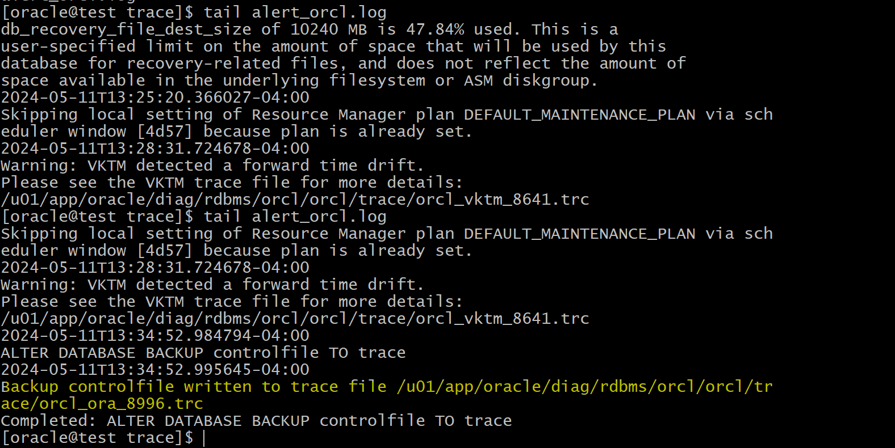
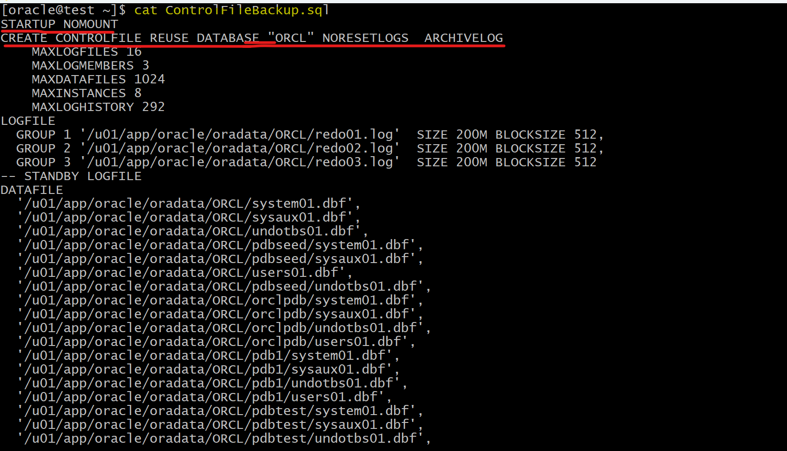
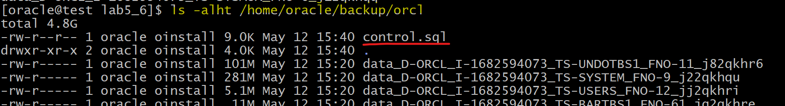

# Backup - Control File

[Back](../../index.md)

- [Backup - Control File](#backup---control-file)
  - [Lab: Verifying Automatic Backups of the Control File and SPFILE](#lab-verifying-automatic-backups-of-the-control-file-and-spfile)
  - [Backing Up the Control File to a Trace File](#backing-up-the-control-file-to-a-trace-file)
    - [Lab: Back up the control file to a trace file](#lab-back-up-the-control-file-to-a-trace-file)
    - [Lab: Creates a SQL script to re-create a control file.](#lab-creates-a-sql-script-to-re-create-a-control-file)

---

## Lab: Verifying Automatic Backups of the Control File and SPFILE

- When `ON`,RMAN **automatically back up** the `control file` and `server parameter file (SPFILE)` with every **backup** and **database structural change**
- It will back up **only one** of the **multiplexed** `control files` because all control files in a database are identical.

```sql
-- rman

-- query all configuration
show all;
-- CONFIGURE CONTROLFILE AUTOBACKUP ON; # default
```

---

## Backing Up the Control File to a Trace File

- `Trace files`

  - copies of the `control files`.

- `Control file trace backup`

  - contains the **SQL statement** required to **re-create** the `control files` in the event that all control files are lost.
  - may be used to **recover** from loss of all control files.

- It is recommended to do **after each change in the physical structure of the database**.

  - e.g., adding tablespaces or data files, adding additional redo log group, database attribute change (`ARCHIVELOG`)

- **Choose your DBA tool:**
  - `Enterprise Manager Database Express`
  - `Enterprise Manager Cloud Control`
  - command line
    - location specified by the `DIAGNOSTIC_DEST` initialization parameter.

---

### Lab: Back up the control file to a trace file

```sql
-- Verify that the control files are multiplexed.
SELECT name FROM v$controlfile;
-- /u01/app/oracle/oradata/ORCL/control01.ctl
-- /u01/app/oracle/fast_recovery_area/ORCL/control02.ctl

-- Query the diagnostic path
show parameter DIAGNOSTIC_DEST;
-- /u01/app/oracle

-- Back up the control file to a trace file
ALTER DATABASE BACKUP CONTROLFILE TO TRACE;
-- in this case, the dest is /u01/app/oracle
--  then cf path: /u01/app/oracle/diag/rdbms/orcl/orcl/trace/
```

- View trace file

```sh
cd /u01/app/oracle/diag/rdbms/orcl/orcl/trace
ls
# look for the last trace file
tail alert_orcl.log
# Backup controlfile written to trace file /u01/app/oracle/diag/rdbms/orcl/orcl/trace/orcl_ora_8996.trc
```



- View the trace file
  - trace file contains the sql statement to create file.

```sh
cat orcl_ora_8996.trc
```

- Copy the code of noresetlog
- Create a sql script `ControlFileBackup.sql` in the home dir
- Paste teh code



> - The code use `CREATE CONTROLFILE` command to re-create the control file.
> - Execute this sql script to re-create control file
> - The code includes
>   - all `data` and `temp` files of the different **containers** (the CDB root, CDB seed, PDB1, and so on)
>   - the **multiplexed** `redo log` files
>   - the `ARCHIVELOG` mode
>   - the character set
>   - the name of the CDB

- Question: Why are there two cases—Set #1. NORESETLOGS and Set #2. RESETLOGS?
- Answer:
  - Set #1. NORESETLOGS case:
    - to execute a `complete database recovery`.
    - Use this only if the current versions of **all `online logs` are available**.
  - Set #2. RESETLOGS:
    - execute an `incomplete database recovery`.
    - Use this only if `online logs` are damaged.
      - The contents of online logs will be lost, and all backups will be invalidated.

---

### Lab: Creates a SQL script to re-create a control file.

```sql
-- Generate a trace file with a path
ALTER DATABASE BACKUP CONTROLFILE TO TRACE AS
'/home/oracle/backup/orcl/control.sql';
```

- Confirm
  - by default, the code is NORESETLOGS case



---

[TOP](#backup---control-file)
