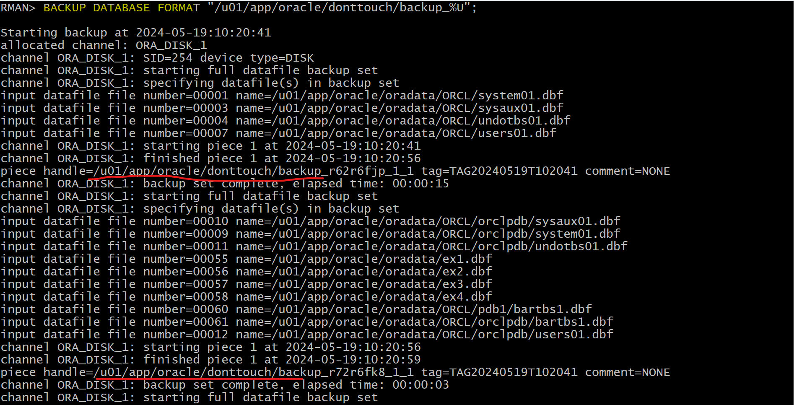

# Backup - `Colde Backup` and `Hot Backup`

[Back](../../index.md)

- [Backup - `Colde Backup` and `Hot Backup`](#backup---colde-backup-and-hot-backup)
  - [Lab: Perform a cold database backup](#lab-perform-a-cold-database-backup)
  - [Lab: Perform a hot database backup](#lab-perform-a-hot-database-backup)

---

## Lab: Perform a cold database backup

- Create a directory to preserve the backup.

```sh
mkdir -p /u01/app/oracle/donttouch
```

- Perform a cold database backup.

```sql
rman target /

SHUTDOWN IMMEDIATE;
STARTUP MOUNT;

-- backup to a separate location
BACKUP DATABASE FORMAT "/u01/app/oracle/donttouch/backup_%U";

ALTER DATABASE OPEN;
EXIT;
```



---

## Lab: Perform a hot database backup

- Create a hot backup to the RMAN configured location.

```sql
sqlplus / as sysdba
-- confirm fra is enable
show parameter db_recovery_file_dest
exit
```

- Perform the backup to the default location.

```sql
rman target /
BACKUP DATABASE;
EXIT;
```

---

[TOP](#backup---colde-backup-and-hot-backup)
