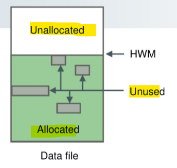
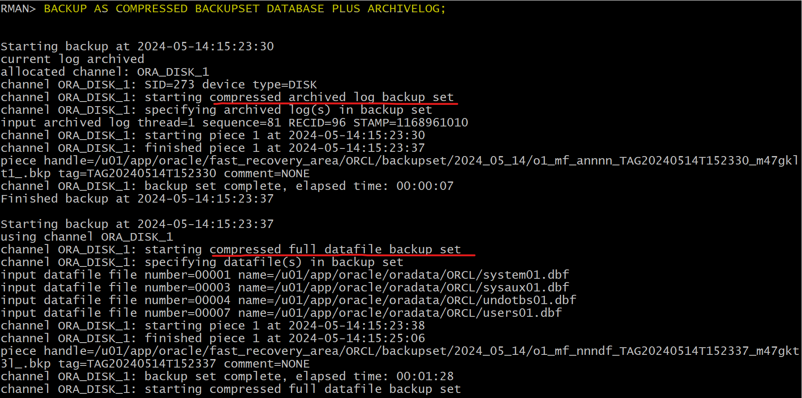
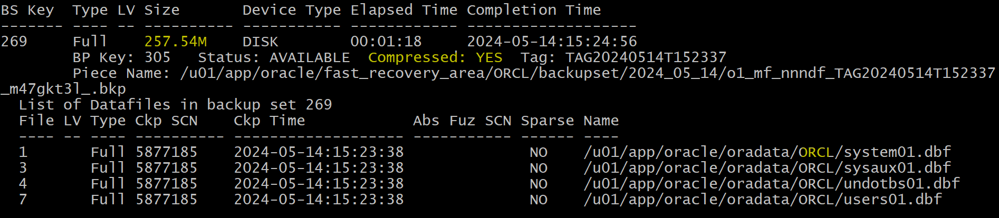
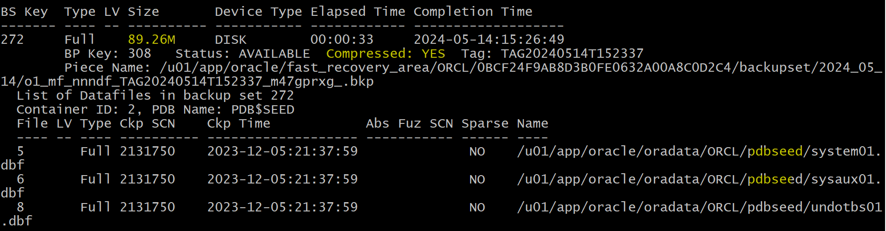
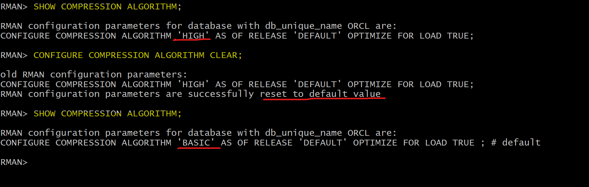

# Backup - Compress Backups

[Back](../../index.md)

- [Backup - Compress Backups](#backup---compress-backups)
  - [Unsed Block Compression](#unsed-block-compression)
    - [Block Compression](#block-compression)
    - [Binary Compression Algorithms of Backup Sets](#binary-compression-algorithms-of-backup-sets)
    - [Syntax](#syntax)
  - [Lab: Compressing Backup using High Algorithm](#lab-compressing-backup-using-high-algorithm)

---

## Unsed Block Compression

### Block Compression

- `high-water mark`:

  - the point in a segment beyond which `data blocks` are **unformatted** and have **never been used**.未格式化或从来未用过
  - A full table **scan** reads all blocks **below** the `HWM` as per definition.

- `Low high-water mark`:

  - the point below which all blocks are **in formatted state** because they either **contain data** or **formerly contained data**.曾经装有或现在有数据

- `Unsed Block Compression`:

  - used to save backup space
  - skips blocks:
    - `Unallocated blocks`:
      - the blocks are above the `high-water mark` (`HWM`).未格式或未用过
    - `Unused blocks`:
      - the blocks that have been **allocated** but **no longer belong to** a `seament`.
      - If:
        - **No** `guaranteed restore points` are defined.
        - The `data file` contains data only for **locally managed** `tablespaces`. 数据文件只用于本地 tbsp
        - The `data file` is being backed up to a `backup set` as part of a `full backup` or a `level 0 incremental`. 数据文件已经全备份
        - The backup is going to **disk**, or `Oracle Secure Backup` is the `media manager`.



- `Block Compression`

  - **decreases the number of blocks**
  - used to **algorithmically compact the data** that is written. 压缩数据

- `Block Compression` do **not** need to perform any **additional steps** when restoring a compressed backup. 恢复压缩备份时, 无需额外动作.

- **Perfomance**

  - **Compression** and **Decompression** operations **require CPU resources**.需要 CPU 资源
  - both creating and restoring a `compressed backup` will probably **take longer** and **require more system resources**
  - When choosing an algorithm, consider your disk space in addition to dynamic system resources such as `CPU` and `memory`.

---

### Binary Compression Algorithms of Backup Sets

- RMAN can perform **binary compression** on any `backup set` that is generated. 只适用于 backup set

- `Compression Algorithms`:

  - `BASIC`:
    - the **only** mode does not require the `Oracle Advanced Compression` option.
    - Fair. Compression ratio similar to `MEDIUM` at expense of **additional CPU usage**.
    - Compression ratio between MEDIUM and HIGH.
  - `LOW`:
    - **Fastest**. Best suited to address backup: CPU resources.
  - `MEDIUM`:
    - Fast Good **balance** of CPU usage and compression
  - `HIGH`:
    - Best compression ratio at the expense of high CPU, consumption. Best suited to address backup constraint: network.

---

### Syntax

- Command `BACKUP AS COMPRESSED BACKUPSET` if not necessary if the a global configuration is done.

```sql
-- By default
CONFIGURE COMPRESSION ALGORITHM 'BASIC' AS OF RELEASE 'DEFAULT' OPTIMIZE FOR LOAD TRUE ; # default

-- Configure compression per device
CONFIGURE COMPRESSION ALGORITHM 'HIGH/MEDIUM/LOW/BASIC';

-- Set compression individually
run {
SET COMPRESSION ALGORITHM 'HIGH/MEDIUM/LOW/BASIC'
}

-- use compression for a particular backup device
BACKUP AS COMPRESSED BACKUPSET DATABASE PLUS ARCHIVELOG;
```

---

## Lab: Compressing Backup using High Algorithm

```sql
-- configure algorithm
CONFIGURE COMPRESSION ALGORITHM 'HIGH';
```


```sql
-- backup
BACKUP AS COMPRESSED BACKUPSET DATABASE PLUS ARCHIVELOG;
```



---

Comparison:

|         | Basic   | High    |
| ------- | ------- | ------- |
| ORCL    | 1.44G   | 257.54M |
| pdbseed | 554.55M | 89.26M  |




```sql
-- reset configuration
CONFIGURE COMPRESSION ALGORITHM CLEAR;
-- confirm
SHOW COMPRESSION ALGORITHM;
```



---

[TOP](#backup---compress-backups)
