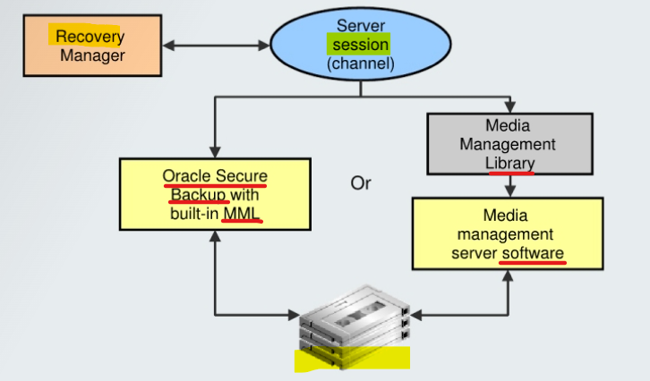

# Backup - Channels and Devices

[Back](../../index.md)

- [Backup - Channels and Devices](#backup---channels-and-devices)
  - [Channels and Devices](#channels-and-devices)
    - [Disk](#disk)
    - [System Backup to Tape(SBT)](#system-backup-to-tapesbt)
      - [Media Manager](#media-manager)
        - [MML + Media manager software](#mml--media-manager-software)
        - [BSP](#bsp)
      - [Example: Backup with `Media Manager`](#example-backup-with-media-manager)
  - [Commands](#commands)

---

## Channels and Devices

- The RMAN-supported device types are `DISK` and `SBT` (`system backup to tape`).

---

### Disk

- `DISK`
  - Default Device Type
  - If you use a `DISK` channel for a backup, then the channel creates the backup on disk in the file name space of the target database instance creating the backup.
  - RMAN does not call a media manager when making DISK backups.

---

### System Backup to Tape(SBT)

- `SBT device`

  - controlled by a **third-party** **media management software**.
  - Typically, SBT devices are **tape libraries** and **tape drives**.

- RMAN contacts the `media manager` whenever the channel type allocated is **not DISK**.

  - To create backups on `non-disk media`, you must use `media management software` such as `Oracle Secure Backup` and allocate channels supported by this software.
  - How and when the SBT channels cause the media manager to allocate resources is **vendor-specific**.

- To use tape storage for your database backups, RMAN requires `Oracle Secure Backup` or a `media manager`.

#### Media Manager

- `Media manager`

  - is a utility that **loads, labels, and unloads** `sequential media` (such as tape drives) for the purpose of backing up, restoring, and recovering data.



---

##### MML + Media manager software

- `Media Management Library (MML)`

  - software routines called by the Oracle Database server to back up and restore data files to and from media that is controlled by the `media manager`. 一个包
  - Oracle Database server does not need to connect to the `MML` software when it backs up **to disk**. 备份到磁盘时, 无需连接 MML

- `media management software`
  - An application required for RMAN to interact with `sequential media devices` such as `tape libraries`.
  - **Before** you can begin using RMAN with a `media manager`, you must install the `media manager software` and make sure that RMAN can **communicate** with it.

##### BSP

- `Oracle Backup Solutions Program (BSP)`

  - provides a range of **media management products** that are compliant with Oracle's `MML` specification.
  - Software that is compliant with the `MML interface` enables an Oracle database **session** to **back up** data to a `media manager` and **request** the `media manager` to **restore** backups. Check with your media vendor to determine whether it is a member of Oracle BSP.

---

#### Example: Backup with `Media Manager`

- RMAN script to performs a data file backup **to a tape drive** controlled by a `media manager`:

```sql
run {
# Allocating a channel of type 'sbt' for serial device
ALLOCATE CHANNEL chl DEVICE TYPE sbt;

BACKUP DATAFILE 3;
}
```

> This command sends the backup request to the Oracle database **session** performing the backup.
> The Oracle database session identifies the **output channel** as a `media management device` and requests the `media manager` to load a tape and write the output..

---

## Commands

```sql
-- configured default device type:
CONFIGURE DEFAULT DEVICE TYPE TO DISK; # default
CONFIGURE DEFAULT DEVICE TYPE TO sbt;

-- override the default device
BACKUP DEVICE TYPE sbt DATABASE;
BACKUP DEVICE TYPE DISK DATABASE;
```

---

[TOP](#backup---channels-and-devices)
