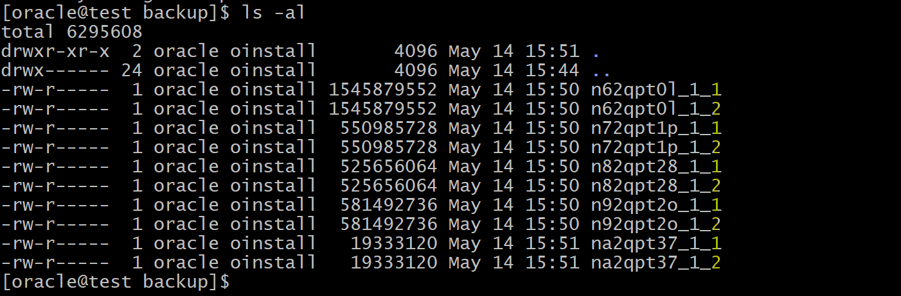

# Backup - Duplexing Backup Sets

[Back](../../index.md)

- [Backup - Duplexing Backup Sets](#backup---duplexing-backup-sets)
  - [Duplexing Backup Sets](#duplexing-backup-sets)
  - [Command](#command)
  - [Lab: Backing up backup set](#lab-backing-up-backup-set)

---

## Duplexing Backup Sets

- A copy of a `duplexed backup set`:

  - a copy of each `backup piece` in the `backup set`, with each copy getting a **unique copy number** (for example, 0tcm8u2s_1_1 and 0tcm8u2s_1_2).

- **Maximum**:

  - **four** copies of a `backup set` **simultaneously**

- Duplexing applies **only** to `backup sets`, **not** `image copies`.

  - cannot specify the `BACKUP... COPIES` when creating `image copy backups`
  - `CONFIGURE... BACKUP COPIES` setting is **ignored** for `image copy backups`.

- **Device Type**:

  - It is not possible to **duplex backup sets** to the `fast recovery area`. 不能 FRA
  - can duplex backups to **either** `disk` **or** `tape`,
  - **cannot** duplex backups to `tape` **and** `disk` simultaneously.
  - `DISK` channels
    - use `FORMAT` option to specify multiple copies to different physical disks.
  - `SBT` channels
    - if you use a media manager that **supports** Version 2 of the SBT API, then the media manager automatically **writes each copy to a separate medium** (for example, a separate tape).
    - When backing up to tape, ensure that the **number of copies** does not exceed the **number of available tape devices**.

- **Performance**:
  - Duplexed backups require **additional resources**.
  - e,g,. if a nonduplexed backup to tape uses **three** RMAN **channels** (each requiring one tape drive), then **duplexing** this backup (making **two copies**) requires **six tape drives**.


---

## Command

```sql
CONFIGURE...BACKUP COPIES
BACKUP...COPIES
```

---

## Lab: Backing up backup set

```sql
-- backup to a path in 2 copies
BACKUP AS BACKUPSET FORMAT '/home/oracle/backup/%U'
COPIES 2
INCREMENTAL LEVEL 0
DATABASE;
```


- Confirm



---

[TOP](#backup---duplexing-backup-sets)
