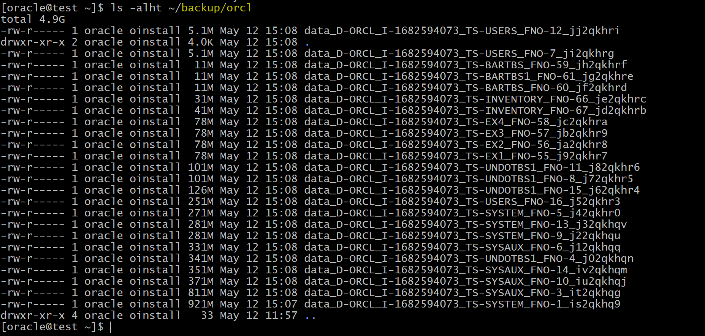

# DBA - Backup: `Full Backup` and `Incremental Backup`

[Back](../../index.md)

- [DBA - Backup: `Full Backup` and `Incremental Backup`](#dba---backup-full-backup-and-incremental-backup)
  - [Full Backup](#full-backup)
  - [Incremental Backups](#incremental-backups)
    - [Incrementally Updated Backups](#incrementally-updated-backups)
    - [Lab: Applying the incremental backup to the level 0 image copies](#lab-applying-the-incremental-backup-to-the-level-0-image-copies)
      - [Setup](#setup)
      - [Perform Level 0 incremental Backup](#perform-level-0-incremental-backup)
      - [Perform Level 1 Incremental Backup](#perform-level-1-incremental-backup)
      - [Recovery from Level 0 Backup](#recovery-from-level-0-backup)
      - [Clear up](#clear-up)

---

## Full Backup

- `Full Backups`

  - different from a `whole database backup`.
  - a backup that includes every used `data block` in the file.

- **Features**:

  - RMAN makes `full backups` by **default** if neither `FULL` nor `INCREMENTAL` is specified. 默认备份类型
  - RMAN copies `all blocks` into the `backup set` or `image copy`, **skipping** only those data file blocks that are not part of an **existing segment**.
    - `image copy`: the **entire** file contents are **reproduced exactly**.
    - `backup sets`: `Unused block compression` causes **never-written blocks** to be **skipped**.注意, 忽略未用 block;忽略不在 segment 的 block.

- **vs `incremental backup strategy`**

  - Diff:没有关系和影响
    - A `full backup`
      - **cannot be part** of an `incremental backup strategy`
      - **cannot** be the **parent** for a subsequent `incremental backup`.
      - **has no effect on** subsequent `incremental backups`
  - Sim:
    - physically identical to `level 0 backup` 物理上相同
    - a `full image copy backup` can be **incrementally updated** by applying `incremental backups` with the `RECOVER` command.恢复时, 映像备份可以加载

- **`NOARCHIVELOG` mode**
  - It is possible to perform any type of backup (`full` or `incremental`) of a database that is in `NOARCHIVELOG` mode, if the database is not open.
  - recovery is limited to the time of the last backup.

---

## Incremental Backups

- `Incremental Backup`

  - `level 0 backup`
  - `level 1 backup`
    - `Differential`: default
    - `Cumulative`

---

- `Incremental Backups`

  - is either a `level 0 backup` or a `level 1 backup`.

- `level 0 backup`:

  - A backup that includes **every block** in the `data files` **except blocks that have never been used**.
  - physically identical to a `full backup`.

- VS `Full backup`: 对 level 1 的影响

  - the `level 0 backup` (as well as an `image copy`) can be used as the **base** for a `level 1 backup`
  - a `full backup` can **never** be used as the base for a `level 1 backup`.

---

- `level 1 backup`:

  - A backup that includes **only blocks** that have been **changed** since a previous backup was taken.

- `Differential`:

  - default type of `incremental backup`
  - backs up **all blocks changed** after the most recent `incremental backup` at either `level 1` or `level 0`.

- `Cumulative`:

  - backs up **all blocks changed** after the most recent backup at `level 0`

---

- Syntax:

```sql
-- To perform an incremental backup at level 0
BACKUP INCREMENTAL LEVEL 0 DATABASE;

-- To perform a differential incremental backup
BACKUP INCREMENTAL LEVEL 1 DATABASE;

-- To perform a cumulative incremental backup
BACKUP INCREMENTAL LEVEL 1 CUMULATIVE DATABASE;

-- to apply incremental backups to data file image copies.
BACKUP AS COPY INCREMENTAL LEVEL 0 DATABASE;

```

---

### Incrementally Updated Backups

- `Image copies` are **updated with all changes** up to the `incremental backup` `SCN`.
- `Incremental backup` **reduces the time** required for `media recovery`.
- With `incrementally updated backups`, you can use the `SWITCH` command during the recovery operation.

---

- **Applying `incremental backups` to `data file image copies`**:

  - **Solution**
    - RMAN can `roll forward (recover)` an `image copy` to the specified **point in time** by applying the `incremental backups` to the `image copy`. 可以将增量备份适用到映像备份上
    - The `image copy` is updated with all changes up through the `SCN` at which the incremental backup was taken. 通过 SCN, 最终将映像备份更新到增量备份的时间点.
    - RMAN uses the resulting **updated data file** in `media recovery` just as it would use a `full image copy` taken at that `SCN` 结果与全映像相同
  - **Benefits**:

    - **without the overhead** of performing a `full image copy` of the database **every day**.好处是减少日常开销
    - **reduce the time** required for `media recovery` (using `archive logs`)恢复时, 用时短,因为减少使用 archivelog

      - because you need to apply `archive logs` `only since the last` `incremental backup`.

    - do **not** need to perform a `full image copy` after the incremental restoration.


- If the recovery process **fails** during the application of the `incremental backup file`, you simply **restart** the recovery process. RMAN **automatically** determines the required incremental backup files to apply, from before the image data file copy until the time at which you want to stop the recovery process. 如果恢复失败, 则只需重启恢复即可. 将会自动决定适用文件.
- If there is **more than one version** of an image copy recorded in the RMAN `catalog`, RMAN automatically uses the **latest version** of the `image copy`. 自动选择最新的映像备份
  - RMAN reports an error if it cannot merge an incremental backup file with an `image copy`.不能合并时,会报错.

---

Example

- If you execute these commands daily:

```sql
recover copy of database with tag 'daily inc';
backup incremental level 1 for recover of copy with tag 'daily inc' database;
```

- result:

|                  | RECOVER                             | BACKUP                     |
| ---------------- | ----------------------------------- | -------------------------- |
| Day 1            | Nothing                             | Create image copies        |
| Day 2            | Nothing                             | Create incremental level 1 |
| Day 3 and onward | Recover copies based on incremental | Create incremental level 1 |

- **Day 1:**
  - The `RECOVER` command does nothing.
  - There are **no** `image copies` to recover.
  - The `BACKUP` command creates the `image copies`.
- **Day 2:**
  - The `RECOVER` command, again, does nothing. This is because there is no incremental backup yet.
  - The `BACKUP` command creates the `incremental backup`, now that baseline `image copies` have been created on day 1. 产生第一个增量备份
- **Day 3:**
  - The `RECOVER` command applies the **changes** from the `incremental backup` to the `image copies`.
  - The `BACKUP` command takes **another** `incremental backup`, which will be used to recover the image copies on day **4**.
  - The cycle continues like this.

---

### Lab: Applying the incremental backup to the level 0 image copies

#### Setup

- Setting up tbsp using script
  - Create a tbsp INVENTORY and commit

```sh
#!/bin/sh

sqlplus /nolog <<EOF
connect / as sysdba

ALTER SESSION set container=pdb1;

DROP TABLESPACE INVENTORY INCLUDING CONTENTS and DATAFILES CASCADE CONSTRAINTS;

CREATE SMALLFILE TABLESPACE "INVENTORY"
 DATAFILE '/u01/app/oracle/oradata/ORCL/pdb1/inventory01.dbf' SIZE 30M,
          '/u01/app/oracle/oradata/ORCL/pdb1/inventory02.dbf' size 40M REUSE
 AUTOEXTEND ON NEXT 1M MAXSIZE UNLIMITED LOGGING
 EXTENT MANAGEMENT LOCAL SEGMENT SPACE MANAGEMENT AUTO;

drop user inventory cascade;

create user inventory identified by pass4INV
default tablespace inventory;

grant connect, resource to inventory;
ALTER USER inventory QUOTA UNLIMITED ON INVENTORY;

exit;
EOF


sqlplus / as sysdba <<EOF

ALTER SESSION set container=pdb1;

CREATE TABLE INVENTORY.PRODUCT_MASTER
( PRODUCT_ID NUMBER(7)
, PRODUCT_NAME VARCHAR2(50) NOT NULL
, CODE VARCHAR2(10) NOT NULL
, REORDER_THRESHOLD NUMBER(5)
, COST NUMBER(5, 2)
, PRICE NUMBER(5, 2)
, CONSTRAINT PK_INV PRIMARY KEY (PRODUCT_ID) VALIDATE ,
CONSTRAINT CHK_GT_0 CHECK (reorder_threshold > 0) VALIDATE ) TABLESPACE INVENTORY;

CREATE TABLE INVENTORY.PRODUCT_ON_HAND
(
WAREHOUSE_ID NUMBER(3),
PRODUCT_ID NUMBER(7),
QUANTITY NUMBER(5),
WAREHOUSE_CITY VARCHAR2(30),
LAST_UPDATE DATE,
  CONSTRAINT PK_POH
    PRIMARY KEY (WAREHOUSE_ID, PRODUCT_ID) VALIDATE,
  CONSTRAINT FK_PROD_ON_HAND_PROD_ID
    FOREIGN KEY (PRODUCT_ID) REFERENCES
      INVENTORY.PRODUCT_MASTER (PRODUCT_ID) VALIDATE
);

CREATE TABLE INVENTORY.OBSOLETE_PRODUCTS
AS select product_id, product_name, code, cost, price
from inventory.product_master;

CREATE INDEX INVENTORY.OBS_CODE ON INVENTORY.OBSOLETE_PRODUCTS (CODE);

create index inventory.prod_name_code
on inventory.product_master(product_name,code);

create index inventory.poh_prod_id_qty on
inventory.product_on_hand(product_id, quantity);


set echo on
alter table inventory.product_master nologging
/
insert /*+ append */ into INVENTORY.PRODUCT_MASTER
select
100000 + rownum,
'NAME' || dbms_random.string('a',mod(abs(dbms_random.random),30) + 16),
dbms_random.string('a',10),
mod(abs(dbms_random.random),1000) + 100,
25.25,
50.88
from dba_objects
/
commit
/
insert /*+ append */ into inventory.product_master
select
200000 + rownum,
'NAME' || dbms_random.string('a',mod(abs(dbms_random.random),30) + 16),
dbms_random.string('a',10),
mod(abs(dbms_random.random),1000) + 100,
25.25,
50.88
from dba_objects
/
commit
/
insert /*+ append */ into inventory.product_master
select
300000 + rownum,
'NAME' || dbms_random.string('a',mod(abs(dbms_random.random),30) + 16),
dbms_random.string('a',10),
mod(abs(dbms_random.random),1000) + 100,
25.25,
50.88
from dba_objects
/
commit
/
alter table inventory.product_master logging
/

create index inventory.code_func on inventory.product_master (upper(substr(code,5,2)));

alter table inventory.product_master add (primary_source varchar2(50), secondary_source varchar2(50));

alter table inventory.product_master add (obsoleted date);

exit
EOF
```

---

- Create a directory for backup

```sh
mkdir -p /home/oracle/backup/orcl
```

---

#### Perform Level 0 incremental Backup

- Run script in RMAN

```sql
run {
-- set channel's name, device type as DISK, set path to store backup
  ALLOCATE CHANNEL "chl" DEVICE TYPE DISK FORMAT "/home/oracle/backup/orcl/%U";

-- implement incremental level 0 bacup db as image copies, add tag,
  BACKUP AS COPY TAG 'BASE01' INCREMENTAL LEVEL 0 DATABASE;
}
```

> The script performs an incrimental level 0 backup to a specific directory.


- Confirm



---

#### Perform Level 1 Incremental Backup

- Run script to update records

```sh
#!/bin/sh

sqlplus / as sysdba<<EOF
ALTER SESSION set container=pdb1;
CONNECT inventory/pass4INV@pdb1
/* retrieve a random integer between 1 an 100 use that as a mod function */
/* to change the obsolete date for product ids in the table */


update product_master set obsoleted = SYSDATE
where mod(product_id,100) IN (
  select (round(dbms_random.value(1,100))) from dual)
/
commit;
exit
EOF

```

---

- Run script to perform incremental level 1 backup

```sql
run {
-- set channel's name, device type as DISK, set path to store backup
  ALLOCATE CHANNEL "chl" DEVICE TYPE DISK FORMAT "/home/oracle/backup/orcl/%U";

-- implement incremental level 1 backup, add tag,
  BACKUP TAG 'incr_update' INCREMENTAL LEVEL 1 DATABASE;
}
```


---

#### Recovery from Level 0 Backup

```sql
run {
ALLOCATE CHANNEL "chl" DEVICE TYPE DISK FORMAT "/home/oracle/backup/orcl/%U";
RECOVER COPY OF DATABASE WITH TAG 'BASE01';
}
```


---

#### Clear up

```sh
#!/bin/sh

rman target "'/ as sysdba'"<<EOF
delete NOPROMPT backup of tablespace pdb1:INVENTORY;
exit;
EOF

sqlplus /nolog >> /tmp/cleanup.log 2>&1 <<EOF
connect / as sysdba
alter session set container=pdb1;
DROP USER inventory cascade;
DROP TABLESPACE INVENTORY INCLUDING CONTENTS and DATAFILES;
exit
EOF
```

---

[TOP](#dba---backup-full-backup-and-incremental-backup)
