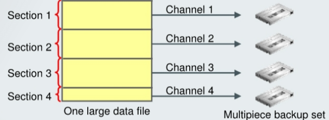

# Backup - Multisection for Very Large Files

[Back](../../index.md)

- [Backup - Multisection for Very Large Files](#backup---multisection-for-very-large-files)
  - [Multisection Large File Backup](#multisection-large-file-backup)
  - [Views](#views)
  - [Command](#command)

---

## Multisection Large File Backup

- **Multisection** backups of a single file:
  - Are created by RMAN, with your specified **size value**
  - Are processed **independently** (serially or in parallel)
  - Produce multipiece `backup sets` and `image copies`
  - **Improve performance** of the backup



---

- Oracle `data files` can be up to `128 TB` in size.

  - Normally, the **smallest** unit of an RMAN backup is an **entire** file.

- `Multisection`

  - **break up** `large files` into **sections** and back up and restore these sections **independently**.
  - can be done for `backup sets` and `image copies`.
  - can **improve the performance** of the backup operation
  - allows large file backups to be **restarted**.

- Each file `section`:

  - a **contiguous range** of **blocks** of a file.
  - can be processed **independently**,
    - either **serially**
    - or in **parallel**.

- A `multisection backup` job produces a `multipiece backup set`.

  - Each piece contains one section of the file.
  - All sections of a multisection backup, except perhaps for the last section, are of the **same size**.
  - a **maximum** of **256** sections per file.

---

- Multisection backups of a single data file are:
  - Created by RMAN, with your **specified size value**
  - For `backup sets` and `image copies`
  - For `full` and `incremental backups`
- **Benefits**:
  - Reduce `image copy` **creation time**
  - Are processed **independently** (serially or in parallel)
  - Benefit `Exadata`
  - Do **not** apply large values of parallelism to back up a large file that resides on a **small number of disks**.

---

- **Multisection image copies**

  - reduce the `image copy` **creation time** for **large** data files, in particular benefiting `Exadata` environments.
  - reduce completion time for **nonbackup** use cases
    - e,g,.copying a file as part of transportable tablespace procedure or creating a clone with active database duplication.

- **should not** apply **large values of parallelism** to back up a large file that resides on a **small number of disks**,
  - because that would defeat the purpose of the parallel operation.
  - Multiple simultaneous accesses to the same disk device would be competing with each other.

---

## Views

| View                 | Description                                                                                   |
| -------------------- | --------------------------------------------------------------------------------------------- |
| `V$BACKUP_SET`       | displays information about backup sets from the control file.                                 |
| `V$BACKUP_DATAFILE`  | displays information about control files and data files in backup sets from the control file. |
| `RC_BACKUP_SET`      | lists information about backup sets for all incarnations of the database.                     |
| `RC_BACKUP_DATAFILE` | lists information about data files in backup sets.                                            |

- the `MULTI_SECTION` column in `RC_BACKUP_SET` and `V$BACKUP_SET`

  - indicates whether this is a multisection backup or not.

- the `SECTION_SIZE` column in `V$BACKUP_DATAFILE` and `RC_BACKUP_DATAFILE`
  - specifies the number of blocks in each section of a multisection backup.
  - Zero means a `whole-file backup`.

```sql
SELECT MULTI_SECTION FROM V$BACKUP_SET;

SELECT SECTION_SIZE FROM V$BACKUP_DATAFILE;
```

---

## Command

```sql
-- Backup datafile with a specific secion size
BACKUP <options> SECTION SIZE <integer> [K | M | G]
-- Validate datafile with a specific secion size
VALIDATE DATAFILE <options> SECTION SIZE <integer> [K | M | G]

-- e.g.,
BACKUP DATAFILE 5 SECTION SIZE = 25M TAG 'section25mb';
```

---

[TOP](#backup---multisection-for-very-large-files)
