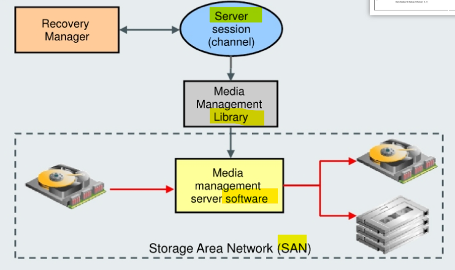

# Backup - Proxy Copy

[Back](../../index.md)

- [Backup - Proxy Copy](#backup---proxy-copy)
  - [Proxy Copies](#proxy-copies)
  - [View](#view)

---

## Proxy Copies



- `proxy copy`:

  - RMAN turns over control of the **data transfer** to a `media manager`.
  - cannot be used with channels of type `DISK`.

- RMAN queries the `media manager` to determine **whether it can perform** a proxy copy.

  - If the `media manager` **cannot** proxy copy the file, then RMAN backs up the file as if the `PROXY` option had **not** been used.

- `Control files` are **never backed up** with `proxy copy`. 不会备份 cf

  - If the `PROXY` option is specified on an operation backing up a control file, then it is **silently ignored** for the purposes of backing up the control file.

- **Command**:

  - `PROXY` option
    - specifies that a backup is a proxy copy.
  - `PROXY ONLY` option
    - to force RMAN to fail if a proxy copy cannot be performed.

- **Syntax**:

```sql
BACKUP [AS BACKUPSET] .. PROXY [ONLY] DATABASE |TABLESPACE;

-- to view information about the proxy copy
LIST BACKUP;
```

---

## View

| View                         | Description                                                             |
| ---------------------------- | ----------------------------------------------------------------------- |
| `V$PROXY_DATAFILE`           | info about the proxy datafile and control file backups                  |
| `V$PROXY_ARCHIVEDLOG`        | info about the proxy archived log backups                               |
| `V$PROXY_ARCHIVELOG_SUMMARY` | summary information about the output proxy archive log file.            |
| `V$PROXY_ARCHIVELOG_DETAILS` | information about all available archive log proxy copies.               |
| `V$PROXY_COPY_SUMMARY`       | Summary of information about data file proxy copies                     |
| `V$PROXY_COPY_DETAIL`        | information about all available control file and datafile proxy copies. |

- Some `media management products` can completely manage all data movement between **Oracle data files** and the **backup devices**. Some products that use high-speed connections between storage
  and media subsystems can **reduce much of the backup load** from the primary database server. This
  is beneficial in that the copying takes place across the SAN instead of the LAN. At that point, RMAN
  is **no longer involved in the operation**, except for communicating **status** across the LAN to and from the MML.
