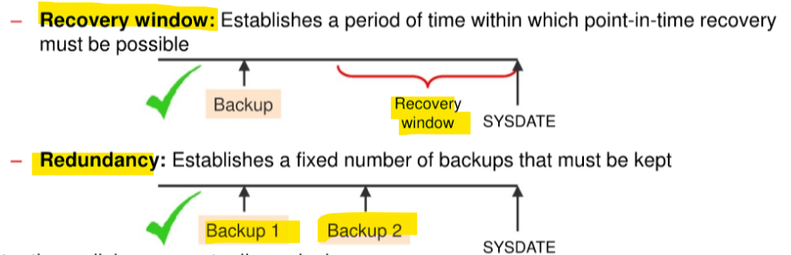
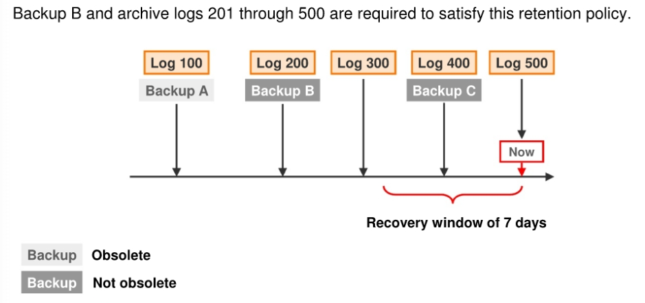

# DBA - Backup Rentention Policy

[Back](../../index.md)

- [DBA - Backup Rentention Policy](#dba---backup-rentention-policy)
  - [Take-Away:](#take-away)
  - [Retention Policy](#retention-policy)
    - [Recovery Window Retention Policy](#recovery-window-retention-policy)
    - [Redundancy Retention Policy](#redundancy-retention-policy)
    - [Disabling the Retention Policy](#disabling-the-retention-policy)
  - [Batch Deletes of Obsolete Backups](#batch-deletes-of-obsolete-backups)

---

## Take-Away:

| Command                                                         | Description                                     |
| --------------------------------------------------------------- | ----------------------------------------------- |
| `SHOW RETENTION POLICY;`                                        | Show the current retention policy               |
| `CONFIGURE RETENTION POLICY CLEAR;`                             | To revert to the default value                  |
| `CONFIGURE RETENTION POLICY TO REDUNDANCY 1;`                   | **Default**, Enable Redundancy Retention Policy |
| `CONFIGURE RETENTION POLICY TO RECOVERY WINDOW OF <days> DAYS;` | Enable Recovery Window Retention Policy         |
| `CONFIGURE RETENTION POLICY TO NONE;`                           | Disable Retention Policy                        |
| `REPORT OBSOLETE;`                                              | Report obsolete backup                          |
| `DELETE OBSOLETE;`                                              | Delete obsolete backup                          |

---

## Retention Policy

- `retention policy`

  - determines **how long** backups are kept for and **how many** copies are retained.
  - can set the value of the retention policy by using the `RMAN` `CONFIGURE` command or `Enterprise Manager`.

- There are two types of retention policies:

  - `Recovery window`: Establishes a period of time within which `point-in-time recovery` must be possible
  - `Redundancy`: Establishes a fixed number of backups that must be kept

- Retention policies are **mutually exclusive**.



---

### Recovery Window Retention Policy

- `Recovery Window`

  - a period of time during which it will be possible to **discover logical errors** and **fix the affected objects** by doing a `point-in-time recovery` to just **before the error occurred**.

- `Recovery Window Retention Policy`

  - specified in number of days.
  - If configure the `RECOVERY WINDOW OF <days> DAYS`, the window stretches

    - from the current time, which is the value of `SYSDATE`
    - to the `point of recoverability`, which is the earliest date to which you want to recover.
    - `point of recoverability`: `SYSDATE` - `<days>`

  - For each `data file`, there must always exist **at least one backup** that satisfies the following condition:
    - `SYSDATE` - `backup_checkpoint_time` >= `recovery_window`

- To **prevent** the record of older backups from being **overwritten** in the control file.

| `recovery catalog` | `CONTROL_FILE_RECORD_KEEP_TIME` parameter              |
| ------------------ | ------------------------------------------------------ |
| not using          | >=`recovery window`                                    |
| using              | >=the time period between `catalog resynchronizations` |

- Resynchronizations happen when:

  - Create a backup. In this case, the synchronization is done implicitly.
  - Execute the `RESYNC CATALOG` command.

- **Command**:

```sql
-- where <days> is the size of the recovery window.
CONFIGURE RETENTION POLICY TO RECOVERY WINDOW OF <days> DAYS;
```

- **Disadvantage**:
  - Although the `recovery window` is the best practice for specifying a retention policy, it can **complicate disk space usage** planning because the **number of backups** that must be kept by the `recovery window` is not constant and depends on the `backup schedule`. 原因在于恢复窗口期内备份的个数受到备份日程的影响, 从而造成磁盘空间难以计划.
  - 此时可以使用 Redundancy

---

- Example:

  - a retention policy requiring recovery capability for any point within the last seven days.



- Configuring policy:

```sql
CONFIGURE RETENTION POLICY TO RECOVERY WINDOW OF 7 DAYS;
```

- Q: for point-in-time recovery, which file is needed?

  - Some backups and logs are now obsolete because they are unnecessary for recovery within the seven-day window.
  - Based on the backups and archived log files available, only **Backup B** and **logs 201 through 500** are needed to recover to any point within the recovery window.
    - Backup A is not required because there is **a later backup** (Backup B) that was taken **before the recovery window**.
    - Backup C alone does not suffice because it **doesn't allow recovery to points** in time **at the beginning of the recovery window**.

- **Take away**
  - The needed backup for point-in-time recovery:
    - The **most recent backup** taken **before** the **start** of the `recovery window`, along with **all subsequent logs**, is necessary for complete recovery.
      - `SYSDATE` - `backup_checkpoint_time` >= `recovery_window` 恢复窗口外
      - the most recent one. 最近的备份

---

### Redundancy Retention Policy

- `Redundancy-based retention policy`

  - specifies how many backups of each datafile must be retained.
  - Used to maintain a **specific number** of backups.
  - requires cataloging **a specified number of backups** before any backup is considered **obsolete**.
    - A backup is considered obsolete when **a newer version of the same file has been backed up**.新版本
  - **Default**: `1`

- **Command**:

```sql
-- Replace <copies> with the desired number of copies to meet your policy requirements.
CONFIGURE RETENTION POLICY TO REDUNDANCY <copies>;
```

---

### Disabling the Retention Policy

- Disabling the Retention Policy if:

  - using a separate system outside of RMAN to back up your disk backups to tape.

- Consequences of disabling the retention policy:

  - RMAN will **never mark a backup as obsolete**.
    - Since RMAN won't need to decide when to remove a backup from disk (as another utility will manage that), it doesn't need to be configured for this decision.
  - RMAN will **retain** records of each backup **for the duration** specified by the `CONTROL_FILE_RECORD_KEEP_TIME` initialization parameter.

- **Exceptions**:

  - You can make a backup an exception to the `retention policy` by creating an `archival backup`.

- Command:

```sql
CONFIGURE RETENTION POLICY TO NONE;
```

---

## Batch Deletes of Obsolete Backups

- Backup files can be marked as `expired` or `obsolete`. 备份文件标记

  - `Expired`:
    - RMAN has performed a **crosscheck** and the file **cannot be found**
  - `Obsolete`
    - based on the retention policy the file is **not needed for recovery**

- The `backup retention policy` only applies to

  - backup type:
    - `full` or `level 0`
  - File type:
    - `datafile` and `control file`.

- The `retention policy` does **not directly affect** `archived redo logs` and `incremental level 1 backups`.

  - These files become **obsolete** when no `full backups` exist that need them. 当其需要的父备份不存在时

- `Datafile backup sets` **cannot be deleted** until **all** datafile backups within the backup set are **obsolete**. 整体性

```sql
-- identify which backups are obsolete
REPORT OBSOLETE;

-- Deletes obsolete data file backups, copies, archived redo log files and log backups.
DELETE OBSOLETE;
```

- **Best practice:**
  - should run `DELETE OBSOLETE` periodically to minimize space wasted by storing obsolete backups.
    - e,g,.can run `DELETE OBSOLETE` in a weekly script.

---

[TOP](#dba---backup-rentention-policy)
