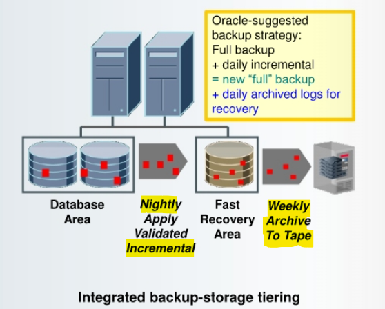
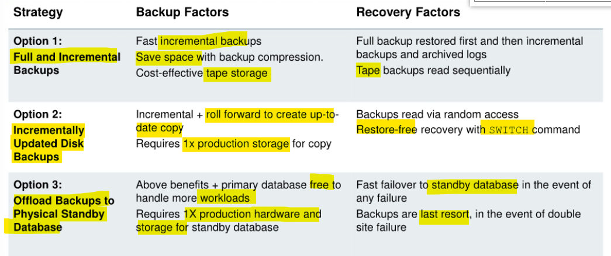
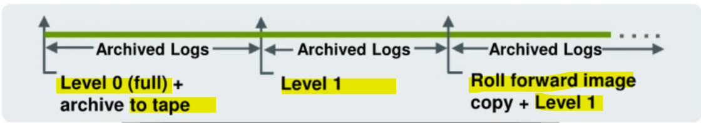

# DBA - Backup: Strategies

[Back](../../index.md)

---

## Oracle-Suggested Backup

- Integrated **disk-to-disk backup and recovery**:
  - Low-cost disks used for `fast recovery area`
- `Fast incremental backups`:
  - Back up **only changed blocks**
- Nightly `incremental backup` **rolls forward** recovery area backup:
  - No need to do full backups

---



- `tiered storage configuration`:(as shown in the slide)

  - used by RMAN to fully automates **disk-based backup and recovery**
  - You can use **different types of storage** for the `database files` and the `fast recovery area (FRA)`.

- `Oracle-suggested backup strategy`:
  - perform a `full backup` of your database (an `image copy` of each data file).
  - set up automated **nightly** `incremental backups`, **stored** in the `FRA`.
    - **Only changed data blocks** are backed up, which save considerable storage space.
    - You can implement `block change tracking` to track the changed blocks more efficiently.
    - The nightly `incremental backups` can be used to **roll forward** the database backup (by applying an incremental `level 1 backup`) and automatically **create a `full backup`**.
      - This procedure **enables** `faster backups` by propagating changes to the `FRA`.
      - In addition, **restores are faster** because backup files are copied from the `FRA` or a copy of the file in the FRA. (If recovery is needed, then **only the daily** `archived redo logs` need to be applied to yesterday's full backup.) 可以提高恢复效率,因为只适用前一日的 redo log

---


- `Oracle-suggested backup strategy` with `Enterprise Manager`

  - By default, there is a **24-hour** `recovery window` from **disk**.
  - uses the `incremental backup` and `incrementally updated backup` features, providing faster recoverability than is possible when applying database changes from the `archived log files`. 比使用 archive log 的恢复快.

- `Enterprise Manager`'s Schedule Backup function:
  - The Oracle-suggested strategy takes a `full database copy` as the first backup.第一次备份=full&whole
    - Because it is a `whole database backup`, you might want to consider taking this at a period of least activity.
  - An `incremental backup` **to disk** is taken **every day**.
  - Optionally, a **weekly** `tape backup` can be made, which backs up all recovery-related files.

---

## Backup Strategies



### Full and Incremental Backups

- **Well suited for:**

  - Databases that can tolerate **hours/days** `RTO` 日级恢复时间
  - Environments where **disk** is premium 磁盘不足
  - **Low-medium change frequency** between backups (<20%) 备份间变化不大

- **Backup strategy:**

  - **Weekly** `level 0` and **daily** `differential incremental backup sets` to **tape**,
  - optional backup compression
  - Enable `block change tracking` so that **only** changed block chunks are read and written during incremental backup.
  - Back up `archived logs` and retain **on-disk**, as needed.


---

- take advantage of RMAN support for **binary compression** of `backup sets`. 可以利用压缩,除非以下情况
  - if your tape device performs its own compression, you should not use both `RMAN` **backup set compression** and the `media manager vendor`'s **compression**.
  - In most cases, the `media manager` **compression** provides better results.
- When you enable `block change tracking`, RMAN uses a `block change tracking file` to identify modified block chunks, and backs up only those blocks.
  - Instead of scanning every block in the `data file` that is being backed up, RMAN **reads the small bitmap file** to determine which blocks have changed.

---

### Incrementally Updated Disk Backups

- **Well suited for:**

  - Databases that can tolerate no more than **a few hours** `RTO` 小时级恢复时间
  - Environments where **disk can be allocated** for 1x size of database or most critical tablespaces 磁碟可用

- **Backup strategy:**
  - Initial `image copy` to `FRA`, **daily** `incremental backups`
  - New **on-disk copy** by using `incrementals` to roll forward copy 磁碟拷贝
  - `Full backup` **archived to tape** as needed
  - `Archived logs` backed up and retained **on-disk** as needed
  - **Fast recovery** from disk or `SWITCH` to use image copies



---

- Create an `image copy` of each data file and then apply **daily** `level 1 incremental backups` to **roll forward** the `image copy`.
  - avoid the **overhead** of creating multiple **full image copies** of your data files,
  - can take advantage of using `image copies` during a recovery operation to **minimize recovery time**.

---

### Offloading Backups to Physical Standby Database in Data Guard Environment

- **Well suited for:**

  - Databases that require no more than **several minutes of recovery time** in the event of any failure 分钟级恢复时间
  - Environments that can preferably allocate **symmetric hardware and storage** for `physical standby database` 镜像备用实例
  - Environments with **tape** infrastructure that can be **shared** between primary and standby database sites 共享磁盘

- **Backup strategy:**
  - `Full and incremental backups` offloaded to physical standby database
  - `Fast incremental backup` on standby with `Active Data Guard`
  - Backups restored to primary or standby database
  - Backups taken at each database for optimal local protection

---

- In a `Data Guard` environment, you can **offload** `incremental backups` to a` physical standby database`.

  - `Incremental backups` of a standby and primary database are **interchangeable**.
  - You can apply an `incremental backup` of a standby database to a primary database or apply an `incremental backup` of a primary database to a standby database. 备份可以互换

- Note: The `Oracle Active Data Guard` option is required for the use of `block change tracking` on the `physical standby database`. 需要使用到 ADG

---

### Backing Up Read-Only Tablespaces

- Backup optimization causes RMAN to back up `read-only tablespaces` only when **no backup exists that satisfies the retention policy**.
  - Because `read-only tablespaces` are **not being written to**, there is no need to continually back them up as you do read/write tablespaces.
  - If you **change** the tablespace to **read/write**, back it up **immediately**.
- You can use the `SKIP READONLY` option of the RMAN `BACKUP` command to skip `read-only tablespaces` or `data files`.

- 备份可以略过只读.一旦变为可读写, 则需立即备份

---

### Data Warehouse Backup and Recovery

- Exploit **partitioning** and **read-only tablespaces**:
  - **Older partitions** that contain data that is **no longer changing** can be moved to read-only tablespaces.
  - Back up `read-only tablespaces` **once** and then periodically depending on tape retention policy.
- Divide `full backup` workload across multiple days. 全备份需数日
- Leverage database and backup compression.压缩
- Save time with `tablespace-level backups`.
  - Back up `index tablespaces` **less frequently than** `data tablespaces`.
  - Back up scarcely used tablespaces less frequently.
  - Reduce restore time for most critical tablespaces, by grouping them together **in separate `backup sets`**.
- Take incremental backup when `NOLOGGING` operations finish to ensure recoverability.

---

- To divide the full backup workload across multiple:

```sql
BACKUP DATABASE NOT BACKED UP SINCE 'SYSDATE-3' DURATION 06:00 PARTIAL
MINIMIZE TIME;
```

- When you execute the command on the **first day**, a `full backup` begins.
  - It executes for six hours.
- On the next day when the command executes again, the backup **starts with the last file** not backed up and **resumes the full backup**, again in a six-hour backup window.
- Over the course of a few days, the entire database will be backed up.

---

[TOP](#dba---backup-strategies)
