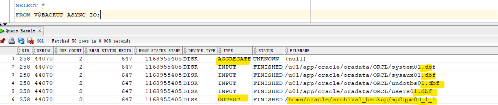
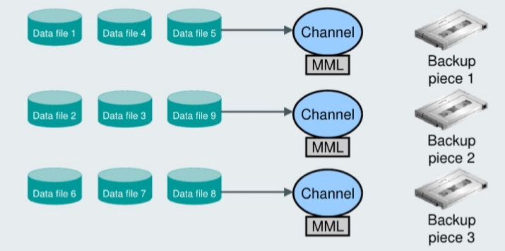
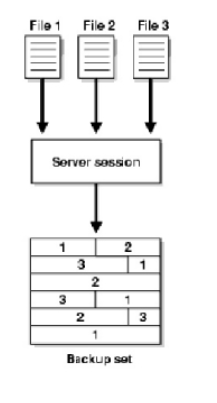
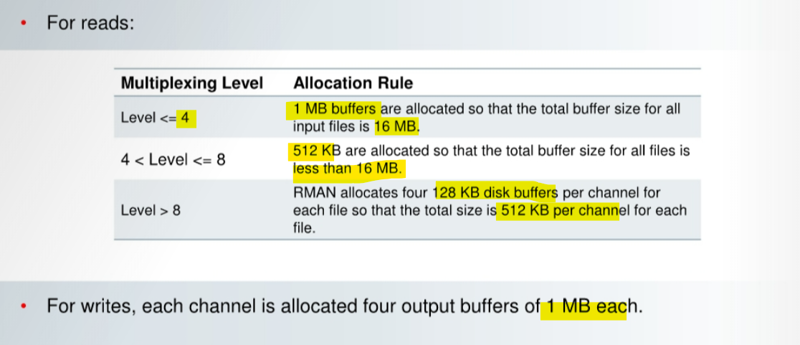

# Backup - Tuning Backup Performance

[Back](../../index.md)

- [Backup - Tuning Backup Performance](#backup---tuning-backup-performance)
  - [Views to Diagnose RMAN Performance](#views-to-diagnose-rman-performance)
  - [`VALIDATE` Command](#validate-command)
  - [Identify read or write bottleneck](#identify-read-or-write-bottleneck)
  - [Identify Backup and Restore Bottlenecks](#identify-backup-and-restore-bottlenecks)
    - [Asynchronous I/O Bottlenecks](#asynchronous-io-bottlenecks)
    - [Synchronous I/O Bottlenecks](#synchronous-io-bottlenecks)
  - [Tuning RMAN Backup Performance](#tuning-rman-backup-performance)
    - [Parallelization of Backup Sets](#parallelization-of-backup-sets)
    - [Multiplexing](#multiplexing)

---

## Views to Diagnose RMAN Performance

| View                | Use                                                                   |
| ------------------- | --------------------------------------------------------------------- |
| `V$SESSION_LONGOPS` | Monitoring the progress of backups and restore jobs                   |
| `V$BACKUP_SYNC_IO`  | Determining whether the tape is streaming when the I/O is synchronous |
| `V$BACKUP_ASYNC_IO` | Determining the rate of asynchronous I/O                              |

```sql
-- Determine the value in EFFECTIVE BYTES PER SECOND < storage media throughput
SELECT DEVICE_TYPE, TYPE ,BYTES, EFFECTIVE_BYTES_PER_SECOND
FROM V$BACKUP_ASYNC_IO
WHERE TYPE = UPPER('aggregate');

-- Monitor the progress of backup and restore operations
-- 未验证
SELECT SID,SERIAL#,CONTEXT,SOFAR, TOTALWORK,
ROUND (SOFAR/TOTALWORK*100,2) "%_COMPLETE"
FROM V$SESSION_LONGOPS
WHERE OPNAME LIKE 'RMANS'
AND OPNAME NOT LIKE '%aggregate%'
AND TOTALWORK != 0
AND SOFAR <> TOTALWORK;
--  OPNAME: A text description of the row.
--      Detail rows include RMAN:datafile copy, RMAN:full datafile backup, and RMAN:full datafile restore.
-- CONTEXT: For backup output rows, the value of this column is 2.
--      For all the other rows except proxy copy (which does not update this column), the value is 1.
```

---

## `VALIDATE` Command

- `BACKUP VALIDATE` command

  - perform all steps of the backup **up to the point of writing the data to the output device**; then the data is discarded, and nothing is written.执行直到输出
  - Compression: inclusive
    - Best practice:
      - Run without compression first, to measure the speed of reading the input files
      - Run with compression
  - Encryption: exclusive

- `RESTORE VALIDATE`:
  - perform all the steps of a restore, up **to the point where it is about to write the restored data to disk**; then the data is discarded, and nothing is written.
  - used to
    - validate the integrity of `backup media`
    - diagnose performance problems with the **read and processing operations** of a `RESTORE` command.
  - Inclusive: both **decryption** and **decompression** if the backup was created with those options.

---

## Identify read or write bottleneck

- Query the `EFFECTIVE_BYTES_PER_SECOND` column in `V$BACKUP_SYNC_IO` or `V$BACKUP_ASYNC_IO` for `aggregate` row.
  - if the value < storage media throughput, then it indicates problem, because they should be the same.
- By comparing the **time** of your backup operations with the **time** taken by the `BACKUP VALIDATE` command, you should be able to determine whether the bottleneck is due to **reads** or **writes**. 通过对比备份时间与`BACKUP VALIDATE`的时间, 从而决定是读取还是写入问题.

- If the execution **time** of the `BACKUP VALIDATE` command approximates the **actual backup time**, the **read** phase is most likely the bottleneck. 读取时间占比大: 读取

  - Solution:Vy adjusting the **multiplexing level**:
    - Implement appropriate RMAN **multiplexing** and **buffer usage** guidelines.
    - Investigate slow performing files:
      - Find the data file with the highest `LONG_WAITS/IO_COUNT` ratio.
        - If `ASM`, add **disk spindles** and/or **rebalance disks**.
        - Move the file to a new disk or multiplex with another **slow** file.

- If the execution **time** for the `BACKUP VALIDATE` command is significantly **less than** the actual backup time, **writing** to the output device is most likely the bottleneck.

  - Solution:

    - Implement backup compression and encryption guidelines:
      - Verify that **uncompressed** backup performance scales properly, as **channels** are added
      - If you are using **compression**, set the compression to `LOW` or `MEDIUM`
      - Use the AES128 encryption algorithm because it is the least CPU intensive
    - If tape backup, check media management (MML) settings:
      - TCP/IP buffer size
      - Media management client/server buffer size
      - Client/socket timeout
      - Media server hardware, connectivity to tape
      - Enable tape compression (but not RMAN compression)

---

- Additional Methods to Analyze write process

- Method 1:

  1. create a new tablespace with a data file on the disk and **time** the operation.
  2. If the same issues occur, general Oracle performance to this device should be tuned, not RMAN-specific parameters.

- Method 2: a write I/O driver
  - The write driver is invoked by calling the `DBMS_BACKUP_RESTORE.SETPARMS` **function** with parameters:
    - p0=>6
    - p1=>buffer size in bytes (specify NULL or 0 to use default)
    - p2 => number of buffers (specify NULL or 0 to use default)
    - p3 => number of blocks to write
    - p4 => block size in bytes (must be specified, 8192 is a good choice)
    - p5 => file name to write
    - p6=>1
  - The write I/O driver is also helpful when you are tuning disk channel output by executing commands with varying buffer sizes and counts.

---

## Identify Backup and Restore Bottlenecks

- Use to determine the source of bottlenecks and backup job progress:

  - `V$BACKUP_SYNC_IO`
  - `V$BACKUP_ASYNC_IO`

- The following rows exist for a backup or restore:

  - One row for each data file
  - One aggregate data file row
  - One row for each backup piece



- The **maximum backup speed** is limited by the available **hardware**.

  - It is not possible to back up any faster than the **aggregate tape bandwidth**.
  - One exception to this is if there are many **empty blocks** in the data files that need not be backed up.

- One of the **components** of the backup system will be a bottleneck-which one depends on the relative speeds of the **disk**, **tape drive**, and any other transport components such as the **network**.
  - As an example, if the bottleneck is the tape drive, and the tape is streaming, then the backup cannot possibly proceed any faster.

---

### Asynchronous I/O Bottlenecks

- Use `V$BACKUP_ASYNC_IO` to monitor **asynchronous I/O**.

  - `IO_COUNT`: Number of `I/O`s performed on the file
  - `LONG_WAITS`: Number of times the backup/restore process **directed the OS to wait** until I/O was complete

- **Wait times should be zero** to avoid bottlenecks.

  - SHORT_WAIT_TIME_TOTAL
  - LONG_WAIT_TIME_TOTAL

- The file that has the largest ratio of `LONG_WAITS` to `IO_COUNT` is probably the **bottleneck**.

---

### Synchronous I/O Bottlenecks

Synchronous I/O is considered to be a bottleneck.

- Query the `DISCRETE_BYTES_PER_SECOND` column from `V$BACKUP_SYNC_IO` to view the **I/O rate**.
  - Compare this rate with the **device's maximum rate**.
  - If the rate is lower than what the device specifies, this is a tuning opportunity.

---

## Tuning RMAN Backup Performance

To tune RMAN backup performance, perform the following steps:

1. Remove `RATE` settings from configured and allocated channels.
   - The `RATE` parameter is used to set the maximum number of bytes (default), kilobytes (K), megabytes (M), or gigabytes (G) that **RMAN reads each second** on the channel.
   - It sets an u**pper limit for bytes read** so that RMAN does not consume too much disk bandwidth and degrade performance.
   - If your backup is **not** streaming to **tape**, ensure that the `RATE` parameter is **not set** on the `ALLOCATE CHANNEL Of CONFIGURE CHANNEL` command.
2. Set the `DBWR_IO_SLAVES` parameter if you **use synchronous disk I/O**.
   - If your disk does **not support** `asynchronous I/O`, try setting the `DBWR_IO_SLAVES` initialization parameter to a **nonzero value**.
     - Any nonzero value for `DBWR_IO_SLAVES` causes a **fixed number** (four) of **disk I/O slaves** to be used for backup and restore, simulating asynchronous I/O.
     - If I/O slaves are used, **I/O buffers** are obtained from the SGA.
     - The `large pool` is used if configured.
       - Otherwise, the `shared pool` is used.
   - Note: By setting `DBWR_IO_SLAVES`, the database writer processes will use slaves as well. You may need to **increase the value** of the `PROCESSES` initialization parameter.
3. If there is failure in shared memory allocation, set the `LARGE_POOL_SIZE` initialization
4. Tune the RMAN read, write, and copy phases.

---

### Parallelization of Backup Sets

- Parallelization of backup sets is achieved by:

  - 1. Configuring `PARALLELISM` to **greater than 1** or allocating **multiple** `channels`
  - 2. Specifying many files to back up

- When you create **multiple** `backup sets` and allocate **multiple** `channels`, RMAN **automatically** parallelizes its operation and writes multiple backup sets in parallel.

  - The allocated `server sessions` **share the work** of backing up the specified data files, control files, and archived redo logs.
  - You cannot stripe a **single** `backup set` across **multiple** `channels`. 一个渠道处理一个备份 set



- Example
  - There are nine files that need to be backed up (data files 1 through 9).
  - Assign the data files to a backup set so that each set has approximately the same number of data blocks to back up (for efficiency).
  - Datafiles 1, 4, and 5 are assigned to backup set 1.
  - Datafiles 2, 3, and 9 are assigned to backup set 2.
  - Datafiles 6, 7, and 8 are assigned to backup set 3.

```sql
RUN {
  ALLOCATE CHANNEL cl DEVICE TYPE sbt;
  ALLOCATE CHANNEL c2 DEVICE TYPE sbt;
  ALLOCATE CHANNEL c3 DEVICE TYPE sbt;
  BACKUP
  INCREMENTAL LEVEL = 0
  (DATAFILE 1,4,5 CHANNEL cl)
  (DATAFILE 2,3,9 CHANNEL c2)
  (DATAFILE 6,7,8 CHANNEL c3);
  SQL 'ALTER SYSTEM ARCHIVE LOG CURRENT';
}
```

---

### Multiplexing



- RMAN uses **two** different types of buffers for I/O:

  - `disk`
  - `tape`.

- RMAN `multiplexing`

  - determines how RMAN **allocates disk buffers**.
  - the **number of files** in a backup **read** **simultaneously** and then **written** to the same backup piece.



- The degree of multiplexing depends on

  - the `FILESPERSET` parameter of the `BACKUP` command
  - the `MAXOPENFILES` parameter of the `CONFIGURE CHANNEL` Or `ALLOCATE CHANNEL` command.

- Note: RMAN multiplexing is set at the channel level. For ASM or RAID1, set MAXOPENFILES to 1 or 2.

- `Multiplexing level`:

  - Maximum **number** of files **read by one channel**, at any time, during backup 单渠道读取文件最大个数

- Value:

  - `Min (MAXOPENFILES, FILESPERSET)`
    - Default for `MAXOPENFILES` is `8`.
    - Default for `FILESPERSET` default is `64`.

- `MAXOPENFILES` determines the number and size of input buffers.
  - All buffers allocated from `PGA`, unless disk or tape I/O slaves, are enabled.
