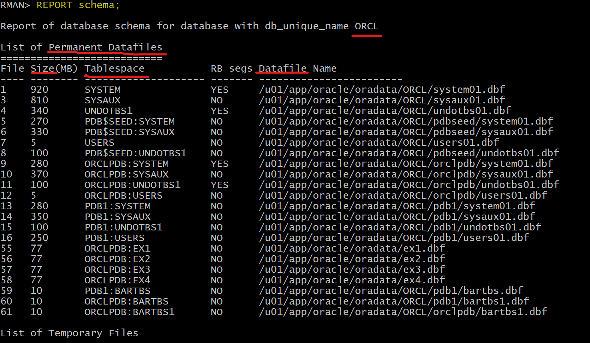

# DBA - `Whole Database Backup` and `Partial Database Backup`

[Back](../../index.md)

- [DBA - `Whole Database Backup` and `Partial Database Backup`](#dba---whole-database-backup-and-partial-database-backup)
  - [`Whole Database Backup`](#whole-database-backup)
    - [Command](#command)
    - [Lab: Creating a Whole Database Backup](#lab-creating-a-whole-database-backup)
    - [Lab: Back up the database and archive logs as image copies.](#lab-back-up-the-database-and-archive-logs-as-image-copies)
  - [`Partial Database Backup`](#partial-database-backup)
    - [Backup Pluggable Database](#backup-pluggable-database)
      - [Connect with CDB](#connect-with-cdb)
      - [Lab: Backup Pluggable Database in CDB root](#lab-backup-pluggable-database-in-cdb-root)
      - [Connect with PDB](#connect-with-pdb)
      - [Lab: Backup Pluggable Database in PDB](#lab-backup-pluggable-database-in-pdb)
    - [Backup Tablespace](#backup-tablespace)
      - [Connect with CDB](#connect-with-cdb-1)
      - [Lab: Back up the tablespace in CDB](#lab-back-up-the-tablespace-in-cdb)
      - [Connect with PDB](#connect-with-pdb-1)
      - [Lab: Back up the tablespace in PDB](#lab-back-up-the-tablespace-in-pdb)

---

## `Whole Database Backup`

- `Whole Database Backup`:

  - a copy of all `data files` and the `control file`.
  - Back up all `PDBs` datafiles and `CDB` root files.

- **Prerequisites**

  - target database is mounted **or** opened.不必须打开数据.

- **Steps:**

  - start `RMAN` and connect to the **target** database.
  - use `BACKUP` command


---

### Command

| Command                                         | Backup Description      | Storage      |
| ----------------------------------------------- | ----------------------- | ------------ |
| `BACKUP DATABASE;`                              | DF, CF                  | backup set   |
| `BACKUP COPY OF DATABASE;`                      | DF, CF                  | image copies |
| `BACKUP DATABASE PLUS ARCHIVELOG;`              | DF,CF,ARLF              | backup set   |
| `BACKUP AS COPY DATABASE PLUS ARCHIVELOG;`      | DF,CF,ARLF              | image copies |
| `BACKUP DATABASE PLUS ARCHIVELOG DELETE INPUT;` | DF,CF,ARLF, remove ARLF | backup set   |

---

### Lab: Creating a Whole Database Backup

```sql
-- rman

-- View the structure of the CDB in terms of PDBs, tablespaces, and data files (permanent and temporary).
REPORT schema;
-- Back up the whole database.
BACKUP DATABASE;
-- List the backup sets.
LIST BACKUP;
```



- Backup of Control file and Spfile


- The operation creates multiple backup sets.


- Verify that the files are stored on disk in the FRA.

```sh
cd /u01/app/oracle/fast_recovery_area/ORCL
ls -ltR
```


---

Takw-away:

- As long as the database is in `ARCHIVELOG` mode, the backup can take place while the database is **opened**. This is a `hot backup` (or `online backup`).

  - `Online backups` are **inconsistent** because with the database **opened**, there is **no guarantee** that the `data files` are **synchronized** with the `control files`.

- If the database is in `NOARCHIVELOG` mode, it requires the database is closed. This is a `cold backup` (or `offline backup`).

  - `offline backups` taken while the database is **not opened** are **consistent** because, at the time of the backup, the `system change number (SCN)` in `data file` headers matches the `SCN` in the `control files`.

- Question: How can `hot backups` (`inconsistent backups`) be used in `complete database recovery`?
  - During a `complete recovery`, restored `online backups` are recovered **until the current `SCN` is matched**, with the use of the `archive log files` and `online redo log files.`
  - 即**online backups + archive log files + oneline redo log files = complete recovery**

---

### Lab: Back up the database and archive logs as image copies.

```sql
-- rman

BACKUP AS COPY DATABASE PLUS ARCHIVELOG DELETE INPUT;
-- order:
--    archived log copy
--    delete archived log copy
--    datafile copy
--    SPFILE backup set
--    archived log copy
--    delete archived log copy
```


---

- Troubleshooting


- solution:
  - Increase the `DBE_RECOVERY_FILE_DEST_SIZE` parameter value

```sql
ALTER SYSTEM SET db_recovery file dest size = 30G SCOPE=both;
```

---

## `Partial Database Backup`

- `Partial CDB Backup`

  - Back up the CDB root and/or individual PDBs.
  - including:
    - the entire set of `datafiles` of the `CDB root`,
    - all `datafiles` of defined `PDBs`,
    - and the `control file` and `SPFILE` (configured to be backed up automatically)

- **Autobackup** is also valid for `partial backups`.

---

### Backup Pluggable Database

#### Connect with CDB

```sql
rman TARGET /

-- backup all datafiles in the CDB$root, including system, sysaux, undo, users
BACKUP PLUGGABLE DATABASE "CDB$ROOT";   -- quotation is needed

-- backup all datafiles in
BACKUP PLUGGABLE DATABASE pdb1;

-- backup all datafiles in Both CDB$root and pdb1
BACKUP PLUGGABLE DATABASE "CDB$ROOT", pdb1;

-- backup both CDB$root and pdb1 and archive log
BACKUP PLUGGABLE DATABASE "CDB$ROOT", pdb1 PLUS ARCHIVELOG;
```

> When in CDB, backing up the archivelog with PDB is allowed.

---

#### Lab: Backup Pluggable Database in CDB root

```sql
-- rman
rman target /

BACKUP PLUGGABLE DATABASE pdb1 PLUS ARCHIVELOG;
```


> - How many backup sets are created?
>   - Four backup sets:
>     - one for the `PDB data files`,
>     - one for the `SPFILE` and `control file`,
>     - one for the `archived log files` **before** the data file backup set,
>     - and one for the `archived log files` **after** the data file backup set.

---

#### Connect with PDB

- Backup PDB

```sql
rman TARGET username@pdb

-- backup all df within the current pdb only
BACKUP DATABASE;

-- Do the same
BACKUP PLUGGABLE DATABASE pdb1;
```

---

#### Lab: Backup Pluggable Database in PDB

```sql
-- Connect with pdb
rman target SYS@pdbl

-- backup current pdb
BACKUP DATABASE;
```


> Notice that the `SPFILE` and `control file` are - not backed up.

- Backup outside of the current pdb is not allowed


- Backup archivelog is not allowed


- Try to configure the recovery setting for the PDB so that the SPFILE and control file
  - get an error message because you must be connected to the CDB root to configure any recovery settings.


---

### Backup Tablespace

#### Connect with CDB

```sql
rman TARGET /

-- Show the names of all data files (permanent and temporary) and tablespaces
REPORT SCHEMA;

-- Backup a tbsp in a pdb
BACKUP TABLESPACE pdb1:users;

-- Backup multiple tbsp in different pdbs
-- if one of the identifiers is not correct, all backup will fail.
BACKUP TABLESPACE pdb1:system, orclpdb:sysaux;

-- Without pdb name: backup the tbsp within the CDB$ROOT
BACKUP TABLESPACE SYSTEM, orclpdb:users, SYSAUX;
-- order:
--    tbsp of current pdb
--    cf, spf
--    tbsp of other pdb
```

---

#### Lab: Back up the tablespace in CDB

```sql
rman target /

BACKUP TABLESPACE pdb1:users;
```


> SPFILE and control file are autobackup

---

#### Connect with PDB

```sql
-- connect with pdb
rman TARGET "'backupadmin@pdb1 as sysdba'"

-- Report schema in current pdb
REPORT SCHEMA;

-- Backup a tbsp in current a pdb
BACKUP TABLESPACE pdb1:users;

-- the pdb name can be ignore
BACKUP TABLESPACE system,users;
```

---

#### Lab: Back up the tablespace in PDB

```sql
rman target SYS@pdb1

BACKUP TABLESPACE users;
```


> SPFILE and Control file is not autobackup.

---

[TOP](#dba---whole-database-backup-and-partial-database-backup)
