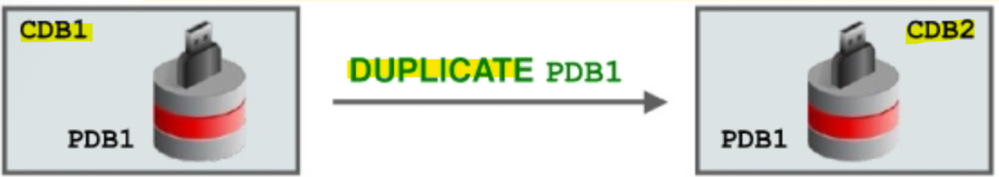
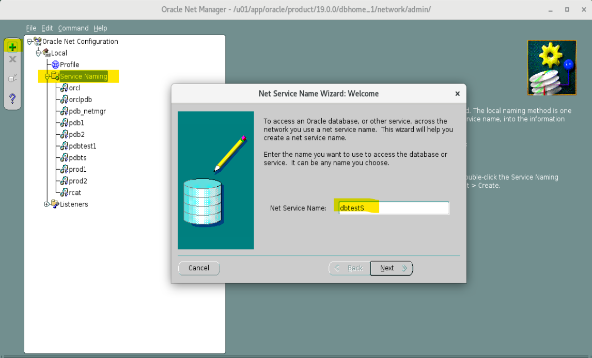
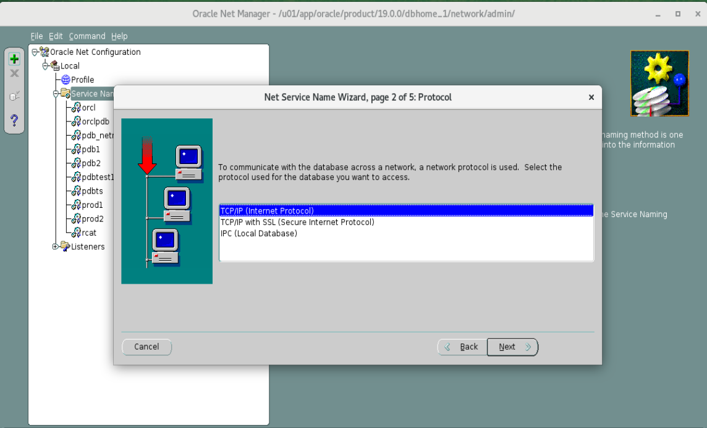
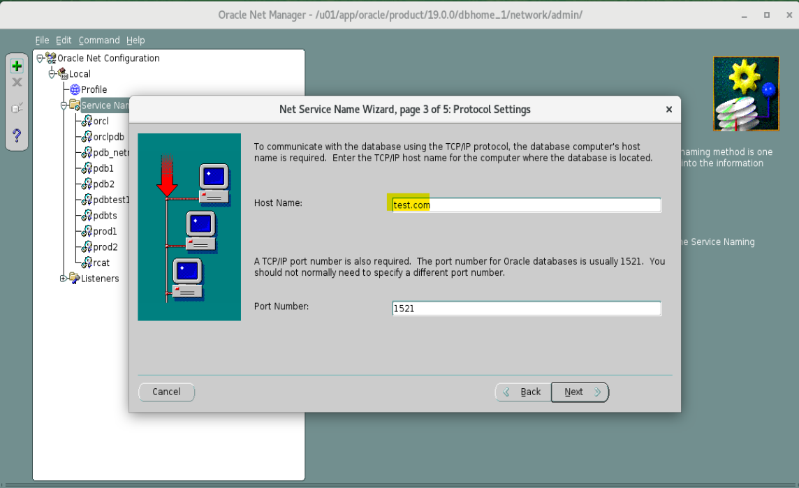
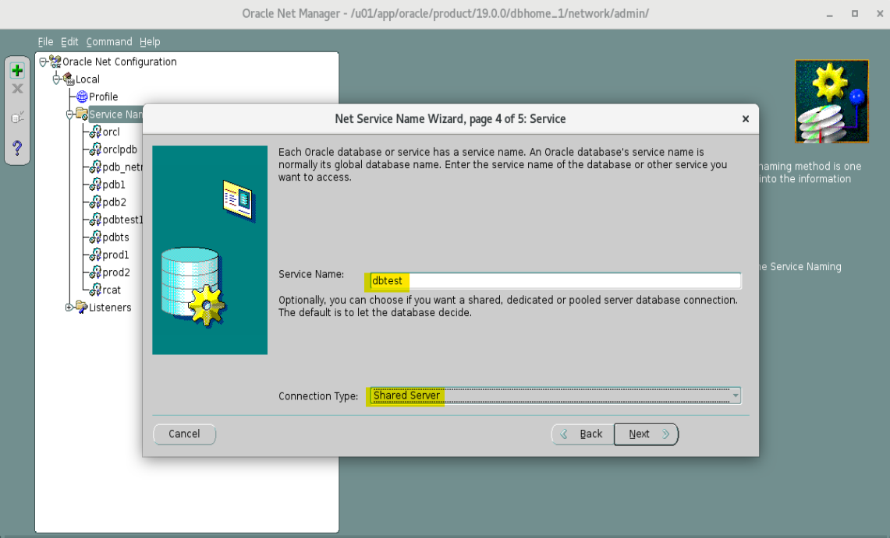
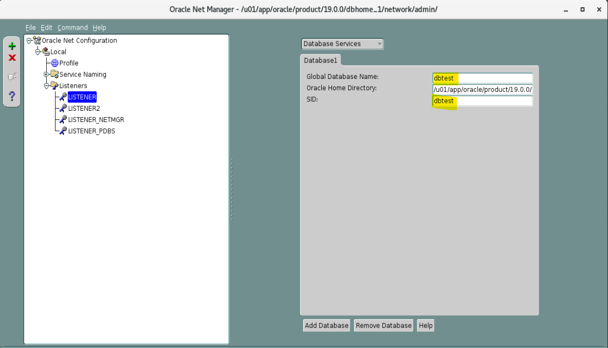

# DBA2 - Backup-Based Duplicate Database

[Back](../../index.md)

- [DBA2 - Backup-Based Duplicate Database](#dba2---backup-based-duplicate-database)
  - [Backup-Based Duplicate Database Overview](#backup-based-duplicate-database-overview)
    - [Creating an Initialization Parameter File for the Auxiliary Instance](#creating-an-initialization-parameter-file-for-the-auxiliary-instance)
    - [Specifying New Names for Your Destination](#specifying-new-names-for-your-destination)
      - [Using the SET NEWNAME Clauses](#using-the-set-newname-clauses)
      - [Substitution Variables for `SET NEWNAME`](#substitution-variables-for-set-newname)
      - [Specifying Parameters for File Naming](#specifying-parameters-for-file-naming)
    - [Starting the Instance in NOMOUNT Mode](#starting-the-instance-in-nomount-mode)
    - [Ensuring That Backups and Archived Redo Log Files Are Available](#ensuring-that-backups-and-archived-redo-log-files-are-available)
    - [Allocating Auxiliary Channels](#allocating-auxiliary-channels)
    - [RMAN Duplication Operation](#rman-duplication-operation)
      - [Specifying Options for the `DUPLICATE` Command](#specifying-options-for-the-duplicate-command)
  - [Duplicating Selected PDBs in a CDB](#duplicating-selected-pdbs-in-a-cdb)
    - [Cloning an Active PDB into an Existing CDB](#cloning-an-active-pdb-into-an-existing-cdb)
    - [Example: Duplicating PDB1 from CDB1 to CDB2 as PDB1](#example-duplicating-pdb1-from-cdb1-to-cdb2-as-pdb1)
    - [Example: Duplicating PDB1 from CDB1 to CDB2 as PDB2](#example-duplicating-pdb1-from-cdb1-to-cdb2-as-pdb2)
  - [Lab: Duplicating a Database](#lab-duplicating-a-database)
    - [Configuration for Duplicated Database](#configuration-for-duplicated-database)
  - [Lab: Duplicating a PDB into an Existing CDB](#lab-duplicating-a-pdb-into-an-existing-cdb)
    - [Clean up](#clean-up)

---

## Backup-Based Duplicate Database Overview

- basic steps:
  1. **Create** an Oracle `password file` for the `auxiliary instance`.
  2. **Establish** Oracle Net **connectivity** to the `auxiliary instance`.
  3. **Create** an `initialization parameter file` for the `auxiliary instance`.
  4. **Start** the `auxiliary instance` in `NOMOUNT` mode.
  5. **Mount or open** the `target database`.
  6. Ensure that `backups` and `archived redo log files` are **available**.
  7. **Allocate** `auxiliary channels` if needed.
  8. **Execute** the `DUPLICATE` command.

---

### Creating an Initialization Parameter File for the Auxiliary Instance

- must create a `text initialization parameter file` for the `auxiliary instance`.
- The `text initialization parameter file` must reside on the **same host as the RMAN client** that you use to execute the DUPLICATE command.

- Specify **parameters** as follows:

  - `DB_NAME`(required):

    - If the `target database` and the `duplicate database` are in the **same** `Oracle home`, you must set `DBE_NAME` to a **different** name.
    - If they are in **different** `Oracle homes`, you must ensure that the name of the duplicate database **differs from the other names** in its `Oracle home`.
    - Be sure to use the same database name that you set for this parameter when you **execute** the `DUPLICATE` command.

  - `CONTROL_FILES`
    - required when you are not using the `SET NEWNAME` option and Oracle Managed Files (OMF).

- Be sure to verify the settings of all initialization parameters that **specify path names**.
- Verify that **all specified paths** are **accessible** on the `duplicate database host`.

---

### Specifying New Names for Your Destination

- Available techniques to specify new names for `data files`:
  - `SET NEWNAME` command:
    - Include the `SET NEWNAME FOR DATAFILE` command within a **RUN block** to specify new names for the `data files`.
  - `CONFIGURE AUXNAME` command (deprecated for recovery set data files)
  - Specify the `DB_FILE NAME CONVERT` parameter with the `DUPLICATE` command.

---

#### Using the SET NEWNAME Clauses

- `SET NEWNAME` clauses:

  - specify a **default name format for all files** in a `database` or in a named `tablespace`.
  - The default name is **used** for `DUPLICATE`, `RESTORE`, and `SWITCH` commands in the RUN
    block.
  - to set file names with **a single command** rather than setting each file name individually.

- The order of precedence for the `SET NEWNAME` command is as follows:

  1. `SET NEWNAME FOR DATAFILE` and `SET NEWNAME FOR TEMPFILE`
  2. `SET NEWNAME FOR TABLESPACE`
  3. `SET NEWNAME FOR DATABASE`

- Example:

```sql
RUN {
    SET NEWNAME FOR DATABASE TO '/uOl/app/oracle/oradata/dupldb/%b';
    DUPLICATE TARGET DATABASE TO dupldb
    LOGFILE
    GROUP 1 ('/u0l/app/oracle/oradata/dupldb/redo0Ola.log', '/u0l/app/oracle/oradata/dupldb/redo0lb.log') SIZE 50M REUSE,
    GROUP 2 ('/u0l/app/oracle/oradata/dupldb/redo02a.log', '/u0l/app/oracle/oradata/dupldb/redo02b.log') SIZE 50M REUSE,
    GROUP 3 ('/u0l/app/oracle/oradata/dupldb/redo03a.log"', '/u0l/app/oracle/oradata/dupldb/redo03b.log') SIZE 50M REUSE;
}
```

---

#### Substitution Variables for `SET NEWNAME`

| Syntax Element | Description                                                                             |
| -------------- | --------------------------------------------------------------------------------------- |
| `%b`           | Specifies the **file name** without the directory path _*NEW*_                          |
| `%f`           | Specifies the absolute file number of the data file for which the new name is generated |
| `%I`           | Specifies the `DBID`                                                                    |
| `%N`           | Specifies the tablespace name                                                           |
| `%U`           | Specifies a system-generated file name of the format: `data-D-%d_id-%I_TS-%N_FNO-%f`    |

- To avoid possible name collisions when restoring to another location, use the `substitution variables` of the `SET NEWNAME` command.
  - Specify at least one of the following substitution variables: `%b`, `%f`, and `$U`.
  - `%I` and `%N` are optional variables.

```sql
-- The example shows the SET NEWNAME FOR TABLESPACE command to set default names with a substitution variable, together with explicit SET NEWNAME clauses.
RUN
{
    SET NEWNAME FOR DATAFILE 1 TO '/oradatal/system0l.dbf';
    SET NEWNAME FOR DATAFILE 2 TO '/oradata2/sysaux0l.dbf';
    SET NEWNAME FOR DATAFILE 3 TO '/oradata3/undotbs0l.dbf';
    SET NEWNAME FOR DATAFILE 4 TO '/oradatad/usersOl.dbf';
    SET NEWNAME FOR TABLESPACE example TO '/oradata5/%b'; --

    DUPLICATE TARGET DATABASE TO dupldb;
  }
```

---

#### Specifying Parameters for File Naming

- Alternatively, specify the following parameters to explicitly control the naming of the files of your auxiliary database:

  - `CONTROL_FILES`
  - `DB_FILE_NAME_CONVERT`
  - `LOG_FILE_NAME_CONVERT`

- RMAN **generates names** for the required `database files` when you execute the `DUPLICATE` command.
- You can **control the naming** of the files by specifying the following `initialization parameters` in the `auxiliary instance` `initialization parameter file`:

  - `CONTROL_FILES`:

    - Specify the **names** of the `control files` in this parameter.
    - If you do **not set** the names via this parameter, the Oracle server creates an **Oracle-managed** `control file` in a **default** `control destination`.
    - Refer to the SQL `CREATE CONTROLFILE` command in the SQL Reference manual for specific information.

  - `DB_FILE_NAME_CONVERT`:

    - Specify the **names** of `data files` for the `auxiliary database`.
    - It has the format `DB_FILE_NAME_CONVERT` = `'stringl'`, `'string2'`,
      - `string1`: the **pattern** of the `target database` **file name**
        - `string2`: the **pattern** of the `auxiliary database` **file name**.
    - can also specify the `DB_FILE_NAME_CONVERT` parameter as an option to the `DUPLICATE DATABASE` command.

  - `LOG_FILE_NAME_CONVERT`:
    - Specify the **names** of the `redo log files` for the `auxiliary database`.
    - It has the format `LOG_FILE_NAME_CONVERT` = `'stringl'`, `'string2'`,
      - `string1`: the **pattern** of the `target database` **file name**
      - `string2`: the **pattern** of the `auxiliary database` **file name**.
    - You can also use the `LOGFILE` clause of the `DUPLICATE DATABASE` command to specify `redo log file` names.

- Alternatively using the `initialization parameters` to control the naming of the files, you can use the following techniques to **rename** the `redo log files`:
  - Use the `LOGFILE` clause of the `DUPLICATE` command.
  - Set the Oracle Managed Files `initialization parameters`:
    - `DB_CREATE_FILE_DEST`,
    - `DB_CREATE_ONLINE_DEST_n`,
    - `DB_RECOVERY_FILE_DEST`.

```sql
CONTROL_FILES='/u0l/app/oracle/oradata/aux/control0l.ctl"', '/u0l/app/oracle/oradata/aux/control02.ctl', '/u0l/app/oracle/oradata/aux/control03.ctl'

DB_FILE NAME CONVERT='/u0l/app/oracle/oradata/orcl','/u0l/app/oracle/oradata/aux'

LOG_FILE_NAME CONVERT='/u0l/app/oracle/oradata/orcl','/u0l/app/oracle/oradata/aux'
```

---

### Starting the Instance in NOMOUNT Mode

- After you have created the `text initialization parameter file`, **invoke** SQL\*Plus to start the `auxiliary instance` in `NOMOUNT` mode.
- RMAN **creates** a **default** `server parameter file` for the `auxiliary instance` if the following conditions are true:

  - Duplication does **not involve** a `standby database`.
  - `Server parameter files` are **not being duplicated**.
  - The `auxiliary instance` was **not** started with a `server parameter file`.

- If these conditions are not met, create a `server parameter file (SPFILE)` from your `text initialization parameter file`.
- You can execute `CREATE SPFILE` before or after you have started the instance.

```sql
-- start up nomount
startup nomount pfile='$HOME/auxinstance/initAUX.ora'

create spfile from pfile='$HOME/auxinstance/initAUX.ora';
```

---

### Ensuring That Backups and Archived Redo Log Files Are Available

- **Backups** of all **target database** data files must be **accessible** on the `duplicate host`.
  - The **backup copies** must be available on **local storage** or on a **networked storage** solution such as a `network file system (NFS)` mounted file system or a `storage area network (SAN) LUN`.
- **Backups** can be a combination of `full and incremental backups` during the duplication process.
- `Archived redo log files` needed to recover the duplicate database to the desired point in time must be **accessible** on the `duplicate host`.
- `Archived redo log files` can be:
  - **Backups** on a media manager
  - **Image copies**
  - Actual **archived redo log files**
- The backups or copies can be **transferred** to the `local disk` of the `duplicate database` node or **mounted** across a network by some means such as `network file system (NFS)`.要么传输到本地或 mount

---

### Allocating Auxiliary Channels

- `Auxiliary channels`:

  - specify a **connection** between `RMAN` and an `auxiliary database instance`.

- If **automatic channels** are **not** configured, can **manually allocate** auxiliary channels:

  - Start RMAN with a connection to the `target database instance`, `the auxiliary instance`, and `recovery catalog` if applicable.
  - **Allocate** at least one `auxiliary channel` within the **RUN block**.

- The channel type specified on the `ALLOCATE AUXILIARY CHANNEL` command must match the media where the **backups** of the target database are **located**.备份能被渠道接触
  - If the backups **reside on disk**, you can allocate **more than one** channel to reduce the time it takes for the duplication process.
  - For **tape** backups, you can specify the **number of channel**s that correspond to the **number of devices** available.
- The `auxiliary instance` must be started with the `NOMOUNT` option, and the `target database` must be **mounted** or **open**.

```sql
rman target sys@trgt auxiliary sys@auxdb
RUN
{
    -- multiple channel
    ALLOCATE AUXILIARY CHANNEL auxl DEVICE TYPE DISK;
    ALLOCATE AUXILIARY CHANNEL aux2 DEVICE TYPE DISK;
    DUPLICATE TARGET DATABASE to auxdb;
    -- ...
}
```

---

### RMAN Duplication Operation

- When you **execute** the `DUPLICATE` command, RMAN performs the operations:

  - 1A. RMAN creates a **default** `server parameter file` for the `auxiliary instance` if the following conditions are true:
    - Duplication does **not** involve a **standby** database.
    - `Server parameter file`s are **not** being **duplicated**.
    - The `auxiliary instance` was **not started with** a `server parameter file`.
  - 1B. RMAN **restores** from backup
    - for the **standby** database
    - for backup-based duplication **without** `target connection`.
  - 2. RMAN **mounts** the restored or the copied backup `control file` from the **active database**.
  - 3. For backup-based duplication:
    - RMAN uses the RMAN **repository** to **select the backups** for restoring the `data files` to the `auxiliary instance`.
  - 4. RMAN **restores and copies** the duplicate `data files`.
  - 5. RMAN **recovers** the `data files` with `incremental backups` and `archived redo log files` to a **noncurrent** point in time.
    - RMAN **must** perform database **point-in-time recovery**, even when no explicit point in time is provided for duplication.
      - because the `online redo log files` in the `source database` are **not backed up** and **cannot be applied** to the duplicate database.
    - The **farthest point** of recovery of the duplicate database is the **most recent** `redo log file` **archived** by the source database. 最近的恢复点是最新近的 redo log
  - 6. RMAN **shuts down and restarts** the `auxiliary instance` in `NOMOUNT` mode.
  - 7. RMAN **creates** a new `control file`, which then creates and stores the new, `unique database identifier DBID` in the data files of the duplicated database.
  - 8. RMAN **opens** the `duplicate database` with the `RESETLOGS` option.
  - 9. RMAN **creates** the `online redo log files` for the duplicate database.

- Note: If the `DUPLICATE DATABASE` command **fails**, you can **re-execute** the `DUPLICATE DATABASE` command and the duplication process attempts to **resume from the point of failure**. 如果失败, 可以重新执行.将从失败点开始.

---

#### Specifying Options for the `DUPLICATE` Command

| Option            | Purpose                                                                                        |
| ----------------- | ---------------------------------------------------------------------------------------------- |
| `SKIP READONLY`   | Excludes read-only tablespaces                                                                 |
| `SKIP TABLESPACE` | Excludes named tablespaces                                                                     |
| `TABLESPACE`      | Includes named tablespaces                                                                     |
| `NOFILENAMECHECK` | Prevents checking of file names                                                                |
| `OPEN RESTRICTED` | Enables `RESTRICTED SESSION` automatically                                                     |
| `NOOPEN`          | Leaves duplicate database in MOUNT mode                                                        |
| `NOREDO`          | Signals RMAN that the application of redo logs should be suppressed during recovery            |
| `UNDO TABLESPACE` | Must be specified when target database is not open and there is no recovery catalog connection |

- `SKIP TABLESPACE`:

  - cannot exclude the `SYSTEM` tablespace or tablespaces **containing undo or rollback segments**.

- `NOFILENAMECHECK`:

  - Use to **prevent** RMAN from **checking** whether `target database` data files with the **same name** as `duplicate database` data files are in use.
  - You **must specify** this option when the `target database` and `duplicate database` data files and redo log files use the **same names**.
  - You would typically use this when you create a duplicate database on a host that has the **same disk configuration**, **directory structure**, and **file names** as the `target database` host.
    - If you do not specify `NOFILENAMECHECK` in this situation, RMAN returns an **error**.

- `NOOPEN`:

  - Use to finish with the duplicate database in `MOUNT` mode.
  - Use this option before:
    - **Modifying** `block change tracking`
    - Configuring `fast incremental backups` or `flashback database` settings
    - **Moving the location** of the database (for example, to ASM)
    - **Upgrading** a database

- `NOREDO`:

  - used to signal RMAN that `redo logs` should **not be applied** during the recovery phase of the duplication operation.
  - This option **should** be specified when the database was in `NOARCHIVELOG` mode at the time of the backup or when the archived `redo log files` are **not available** for use during the duplication operation.
  - This option is **appropriate** if a database that is currently in `ARCHIVELOG` mode is being duplicated to a point in time when it **was** in `NOARCHIVELOG` mode.
  - If you are planning a **targetless** `DUPLICATE` operation and the database is in `NOARCHIVELOG` mode, you **must** use the `NOREDO` option to inform RMAN of the database mode.
    - **Without** a connection to the target database, RMAN **cannot determine the mode**.

- `UNDO TABLESPACE`:
  - RMAN checks that there are **no objects** belonging to the `sys` user in any of the duplicated tablespaces during nonwhole database duplication.
  - The `SYSTEM`, `SYSAUX`, and `undo segment tablespaces` are **excluded** from this check.
  - However, if the `target database` is **not open** and a `recovery catalog` is **not** being used during the duplication, RMAN **cannot** obtain the `undo tablespace` names.
    - So you must use the `UNDO TABLESPACE` option to provide the names of undo segment tablespaces.

---

## Duplicating Selected PDBs in a CDB

- You must be **logged in** to the `CDB root` as a user who is granted the `SYSDBA` or `SYSBACKUP` role.

- RMAN enables you to **duplicate** `multitenant container databases` including **all** or **individual** `PDBs` by using the DUPLICATE command.
- To duplicate PDBs, you **must create** the `auxiliary instance` as a `CDB`.
  - start the instance with the `ENABLE_PLUGGABLE_DATABASE=TRUE` in the `initialization parameter file`.
  - When you **duplicate** one or more `PDBs`, RMAN **also duplicates** the `CDB root (CDESR0OOT)` and the `PDB seed (pDB$ SEED)`.
  - The resulting duplicate database is a **fully new, functional** `CDB` that contains the `CDB root`, the `CDB seed`, and the duplicated `PDBs`. 会复制 CDB+seed+pdb

```sql
-- duplicate a single PDB
DUPLICATE DATABASE TO cdbl
PLUGGABLE DATABASE pdbl;

-- duplicate a set of PDBs
DUPLICATE DATABASE TO cdbl
PLUGGABLE DATABASE pdbl, pdb3;

-- duplicate all the databases in the CDB, except a PDB
DUPLICATE DATABASE TO cdbl
SKIP PLUGGABLE DATABASE pdb3;

-- duplicate a PDB and tablespaces of other PDBs
DUPLICATE DATABASE TO cdbl
PLUGGABLE DATABASE pdbl TABLESPACE pdb2:users;
```

---

### Cloning an Active PDB into an Existing CDB

- Duplicate a PDB or PDB tablespaces in **active mode** to an existing **opened** CDB.

  - Clone only **one** `PDB` **at a time**.
  - Set the `COMPATIBLE` **initialization parameter** to `18.1` or higher.
  - Set the `destination CDB` in `READ WRITE` mode.
  - Set the `REMOTE_RECOVERY_FILE_DEST` **initialization parameter** in the `destination CDB` to the location where to restore foreign `archive log files`.

- An **active** `PDB` can be duplicated directly into an **open** `CDB`.
- The **passwords** for `target` and `auxiliary` connections must be the **same** when using active duplicate.

- RMAN should be connected to the `CDB root` of the `target` and `auxiliary instances`.

- **Limitations**:
  - `Non-CDB` to `PDB` duplication is **not supported**.
  - **Encryption** is **not** supported for PDB cloning.
  - `SPFILE`, `NO STANDBY`, `FARSYNC STANDBY`, and `LOG_FILE_NAME_CONVERT` keywords are **not** supported.
- `NORESUME`, `DB_FILE_NAME_CONVERT`, `SECTION SIZE`, and `USING COMPRESSED BACKUPSET` keywords are supported.

---

### Example: Duplicating PDB1 from CDB1 to CDB2 as PDB1



1. **Set** the `REMOTE_RECOVERY_FILE_DEST` initialization parameter in `CDB2`.

```sql
ALTER SYSTEM
SET REMOTE_RECOVERY_FILE_DEST='/dir_to_restore_archive log files';
```

2. **Connect** to the source (`TARGET` for DUPLICATE command): **CDB1**

```sql
CONNECT TARGET "sys@cdbl AS SYSDBA"
```

3. **Connect** to the existing **CDB2** that acts as the `auxiliary instance`
   - CDB2 needs to be **opened** in `read/write` mode.

```sql
CONNECT AUXILIARY "sys@cdb2 AS SYSDBA"
```

4. **Start** the duplication.
   - the source PDB1 is **opened**.

```sql
DUPLICATE PLUGGABLE DATABASE pdbl TO cdb2 FROM ACTIVE DATABASE;
```

---

### Example: Duplicating PDB1 from CDB1 to CDB2 as PDB2

1. **Set** the `REMOTE_RECOVERY_FILE_DEST` initialization parameter in CDB2.

```sql
ALTER SYSTEM SET REMOTE_RECOVERY_ FILE DEST='/dir_to_restore_archive log files';
```

2. **Connect** to the source (`TARGET` for DUPLICATE command): CDB1

```sql
CONNECT TARGET "sys@cdb1 AS SYSDBA"
```

3. **Connect** to the existing CDR2 that acts as the `auxiliary instance`:
   - CDB2 needs to be **opened** in `read/write` mode.

```sql
CONNECT AUXILIARY "sys@cdb2 AS SYSDBA"
```

4. Start the duplication.
   - the source PDB1 is **opened**.

```sql
DUPLICATE PLUGGABLE DATABASE pdbl AS pdb2 TO cdb2 FROM ACTIVE DATABASE;
```

---

## Lab: Duplicating a Database

- Goal:
  - to duplicate an active database.
- `ORCLCDE`: the active database
- `DBTEST`: the aulilary database
- Steps:
  - Prepare the destination for the future `DETEST` database
    - password file
    - a minimal initialization parameter file (`initdbtest.ora`).
  - Confirm source database configuration settings.
  - Duplicate the ORCLCDE database by using RMAN.
  - Test access to the cloned database.

---

### Configuration for Duplicated Database

- Create new directories for the dbtest database.

```sql
-- create dir for df of dbtest database
mkdir -p /u01/app/oracle/oradata/dbtest

-- create dir for fra of dbtest database
mkdir -p /u01/app/oracle/dbtest_fra

-- create dir for cdb in dbtest'fra
mkdir -p /u01/app/oracle/dbtest_fra/orclcdb
```

- Prepare Oracle Net connectivity by using the Oracle Net Manager utility.
- Add a service named dbtest to the tnsnames.ora file.

```sh
# Launch the Oracle Net Manager utility.
netmgr
```

- Add Service Naming






- Add Listener



- Confirm in tnsnames.ora file.

```sh
cat $ORACLE_HOME/network/admin/tnsnames.ora
```

- Reload listener

```sh
# reload listener
lsnrctl reload

# check listener status
lsnrctl status
```

---

- set environment variables to dbtest

```sh
. oraenv

# ORACLE_SID = [orclcdb] ? dbtest
# ORACLE HOME = [/home/oracle] ? /u01/app/oracle/product/19.0.0/dbhome_1
```

- Create password file

```sh
orapwd file=$ORACLE_HOME/dbs/orapwdbtest entries=15
# welcome!23

ls $ORACLE_HOME/dbs/*pwdbtest*
```

- Create a minimal initialization parameter file

```sql
-- create spfile
vi $ORACLE_HOME/dbs/initdbtest.ora
# db_name=dbtest
# remote_login_passwordfile=exclusive

-- confirm
cat $ORACLE_HOME/dbs/initdbtest.ora
```

---

- start dbtest instance in `MOUNT` mode with pfile

```sql
sqlplus / as sysdba

startup NOMOUNT pfile='/u01/app/oracle/product/19.0.0/dbhome_1/dbs/initdbtest.ora'

exit

-- confirm: show how many instance is running by smon
pgrep -lfa smon
```

---

- Confirm the ORCLCDB source database configuration settings

```sql
. oraenv
-- ORACLE_SID = [dbtest] ? orcl

sqlplus / as sysdba

-- confirm compatible
show parameter compatible

-- Confirm your backup location and size.
show parameter db_recover

-- confirm archive log mode
ARCHIVE LOG LIST
```

- Use RMAN to duplicate the ORCLCDE database as the DBTEST database.

```sql
rman target sys@orcl auxiliary sys@dbtest
```

- Duplicate the `ORCL` database as the `DETEST` database

```sql
DUPLICATE TARGET DATABASE TO dbtest FROM ACTIVE DATABASE
SPFILE PARAMETER_VALUE_CONVERT
'/u01/app/oracle/oradata/ORCL', '/u01/app/oracle/oradata/dbtest',
'/u01/app/oracle/fast_recovery_area','/u01/app/oracle/dbtest_fra',
'ORCL', 'DBTEST'
SET DB_RECOVERY_FILE_DEST_SIZE='10G'
SET DB_FILE_NAME_CONVERT='ORCL', 'DBTEST';
```

---

- Confirm the information of dbtest

```sql
. oraenv

# ORACLE_SID = [orclcdb] ? dbtest
# ORACLE HOME = [/home/oracle] ? /u01/app/oracle/product/19.0.0/dbhome_1

sqlplus / as sysdba

-- get cdb
SELECT NAME, CDB, CON_ID FROM V$DATABASE;

-- get db and mode
select dbid, name, created, open_mode from v$database;

-- list pdb
show pdbs
```

---

## Lab: Duplicating a PDB into an Existing CDB

- Confirm table data in a pdb

```sql
. oraenv
-- ORACLE_SID = [dbtest] ? orcl
sqlplus hr@ORCLPDB

SELECT * FROM regions;

exit
```

- Configuration of aulilary database

```sh
# Create dir to Set the initialization parameter `REMOTE_RECOVERY_FILE_DEST` to restore foreign archive logs.
mkdir -p /home/oracle/labs/fra

# Create the directory for the new PDB data files.
mkdir -p /u01/app/oracle/oradata/DBTEST/dbtestpdb1
```

- Create dir to Set the initialization parameter `REMOTE_RECOVERY_FILE_DEST`

```sql
. oraenv
-- ORACLE_SID = [dbtest] ? dbtest
-- ORACLE HOME = [/home/oracle] ? /u01/app/oracle/product/19.0.0/dbhome_1

sqlplus / AS SYSDBA

ALTER SYSTEM SET
REMOTE_RECOVERY_FILE_DEST='/home/oracle/labs/fra'
SCOPE=BOTH;

EXIT
```

- Duplicate a pdb as a new pdb in DBTEST

```sql
rman

-- connect target
CONNECT TARGET sys@ORCL

-- Connect to the auxiliary instance DBTEST into which you will duplicate ORCLPDE1 as DBTESTPDBI.
CONNECT AUXILIARY sys@DBTEST

-- duplicate a pdb
DUPLICATE PLUGGABLE DATABASE orclpdb AS dbtestpdb1
FROM ACTIVE DATABASE
DB_FILE_NAME_CONVERT
('/u01/app/oracle/oradata/ORCL/orclpdb/', '/u01/app/oracle/oradata/DBTEST/dbtestpdb1/');

exit
```

- Confirm in auxiliary database

```sql
sqlplus / AS SYSDBA

SHOW PDBS

ALTER SESSION SET CONTAINER=DBTESTPDB1;
SELECT * FROM hr.regions;

EXIT
```

---

### Clean up

- Remove backup and database

```sql
rman TARGET "'sys@dbtest AS sysdba'"

STARTUP FORCE MOUNT
ALTER SYSTEM ENABLE RESTRICTED SESSION;
DROP DATABASE INCLUDING BACKUPS NOPROMPT;
```

- Remove listener

```sql
vi /u01/app/oracle/product/19.0.0/dbhome_1/network/admin/listener.ora

vi /u01/app/oracle/product/19.0.0/dbhome_1/network/admin/tnsnames.ora

lsnrctl reload
lsnrctl status
```

- Remove dir

```sql
rm -rf /home/oracle/labs/fra
rm -rf /u01/app/oracle/oradata/dbtest
rm -rf /u01/app/oracle/dbtest_fra
```

---

[TOP](#dba2---backup-based-duplicate-database)
