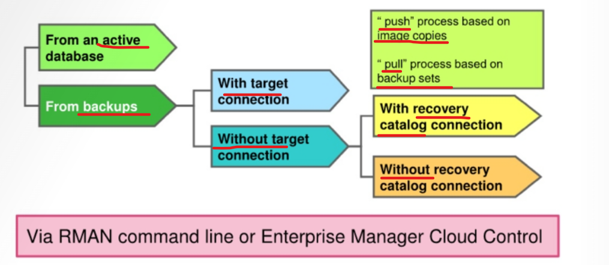
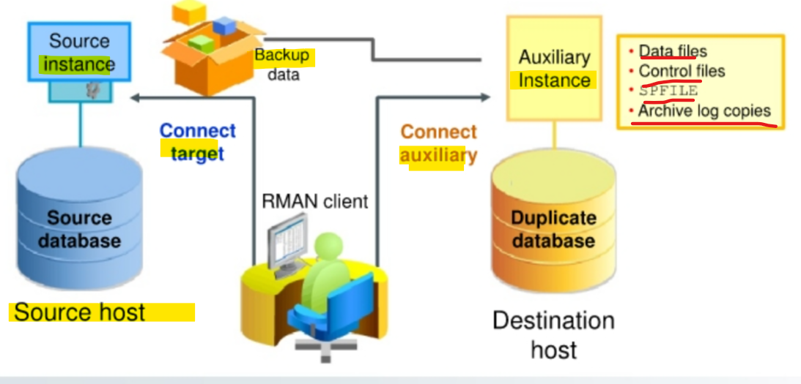
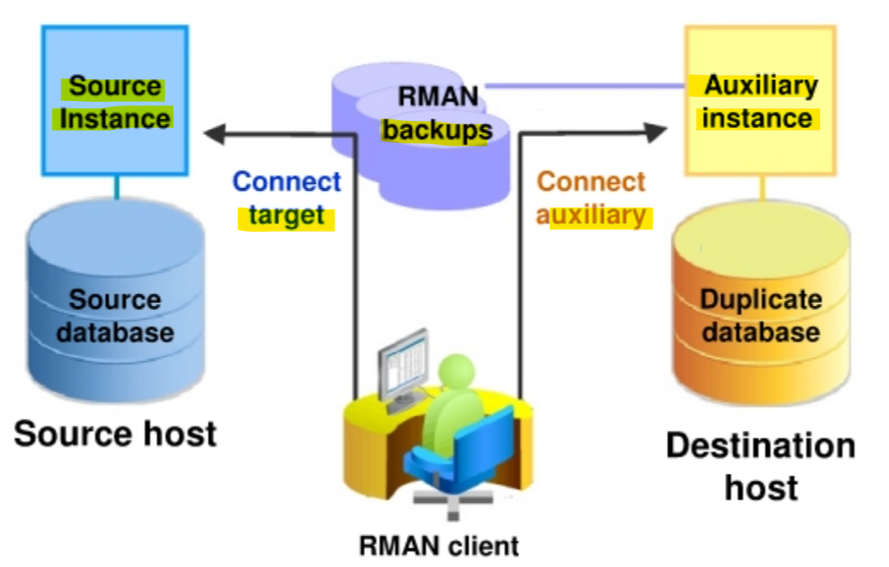
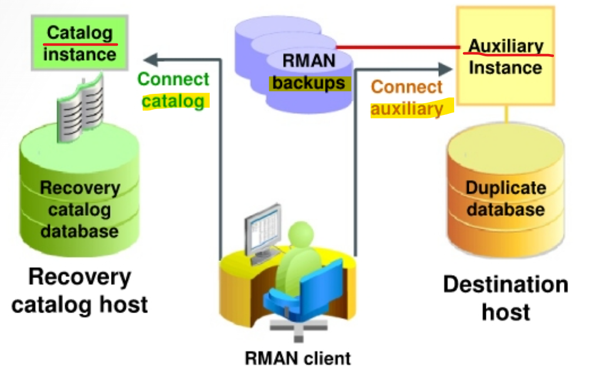
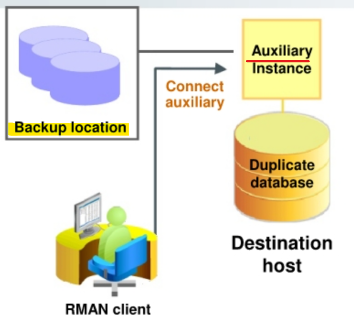

# DBA2 - Database Duplication

[Back](../../index.md)

- [DBA2 - Database Duplication](#dba2---database-duplication)
  - [Duplicate Database](#duplicate-database)
  - [Database Duplication Techniques](#database-duplication-techniques)
    - [`Push` Method](#push-method)
    - [`Pull` Method](#pull-method)
    - [`Push` Method vs `Pull` Method](#push-method-vs-pull-method)
    - [With a `Target Connection`](#with-a-target-connection)
    - [With a `Recovery Catalog`](#with-a-recovery-catalog)
    - [Without a `Recovery Catalog` or `Target Connection`](#without-a-recovery-catalog-or-target-connection)

---

## Duplicate Database

- `duplicate database`

  - a **copy** of target database.

- It is used to:

  - **Test** backup and recovery procedures
  - **Recover** objects that were inadvertently dropped from the target database by creating an **export containing the objects** in the duplicate database and **importing them into** the production database, 相当整个 DB 的备份
    - although you will probably find that Flashback Query, Flashback Drop, Flashback Table, and table recovery from backup are much easier and faster solutions to recover objects.性能上比闪回慢.

- `FOR STANDBY` clause:
  - if specified: it keeps the **same** `unique database identifier (DB1D)`;
  - if **not** specified, it creates a **new** `DBID`.
- if `FOR STANDBY` is not specified, it creates a new DBID.

- Create a duplicate database:

  - With the RMAN `DUPLICATE` command
  - On the same or separate hosts
  - With the identical content or subset of source
  - Performed by auxiliary channels for backup-based duplication

- Features:

  - It can **include the same content** or only a **subset** from the source database. 可以包括源数据库的全部或部分
  - It can be in the **same** host or a **separate** host.
  - The principal work of the duplication is **performed by the auxiliary channels**.
    - These channels correspond to a server session on the `auxiliary instance` on the destination host for backup-based duplication.
  - For active database duplication, the **target channels** perform the work of **pushing data file copies** to the `auxiliary instance` (if number of allocated target channels is greater than the number of allocated auxiliary channels).

- `DUPLICATE` command

---

## Database Duplication Techniques

- You can **duplicate** a `source database` to a `destination database`, which can be on the **same** or **different** computers.

- `auxiliary instance`:

  - The database instance associated with the `duplicate database`

- All duplication techniques require a connection to the `auxiliary instance`.
  - From an **active database**, connected to the `target` and `auxiliary instances`, it is a **“pull” (or restore)** process based on `backup sets`.
  - From **backup**, connected to the `target` and `auxiliary instances`
  - From **backup**, connected to the `auxiliary instance`, **not** connected to the `target`, but with `recovery catalog` connection
  - From **backup**, connected to the `auxiliary instance`, **not** connected to the `target` and the `recovery catalog`



---

### `Push` Method

- `“push”-based method`:

  - an active database duplication
  - “Push” method based on `image copies`
  - Via Enterprise Manager or RMAN command line
  - With network (use the `FROM ACTIVE DATABASE` clause)
  - With a customized `SPFILE`

- RMAN connects as `TARGET` to the **source database instance** and as `AUXILIARY` to the **auxiliary instance**. 同时连接

- The required files (`data files`, `control files`, `SPFILE`, and `archive log copies`) are **copied** from the `source` to an `auxiliary instance` via an **inter-instance network connection**.
- RMAN then uses a **“memory script”** (one that is contained only in memory) to **complete recovery and open** the database.



- RMAN `DUPLICATE ... FROM ACTIVE DATABASE` :

  - instruct the `source database` to **send a “clone” of itself** directly to the `auxiliary instance`
  - Preexisting backups are **neither needed** **nor used** for this operation. 不使用现成的备份
  - `source database create` `online image copies` and directly transmit via `Oracle Net` (they are not written to disk).
  - The `source database` can be **open** or **mounted**.

---

### `Pull` Method

- The `“pull” (or restore)` process:

  1. A **connection** is first established with the `source database instance`.
  2. The `auxiliary instance` then **retrieves the required database files** from the source database as `backup sets`.
  3. A **restore operation** is performed from the `auxiliary instance`.

- Therefore, **fewer resources** are used on the `source database`.
- The `pull method` requires TNS connections to `target` and `auxiliary instances`. 同时连接

- Based on the `DUPLICATE` clauses, RMAN **dynamically determines which process** to use (push or pull). This ensures that existing customized scripts continue to function.

- `USING BACKUPSET` clause:

  - RMAN uses the `pull method`.

- `SET ENCRYPTION` clause:

  - RMAN **automatically** uses the `pull method` and **creates** `backup sets`.
  - The backups sent to the destination are **encrypted**.

- `SECTION SIZE` clause:

  - **divides** `data files` **into subsections** that are restored in parallel across **multiple channels** on the auxiliary database.
  - For an effective use of parallelization, allocate more **AUXILIARY channels**.

- `USING COMPRESSED BACKUPSET` clause:
  - the files are transferred as **compressed** `backup sets`.
  - RMAN **uses unused block compression** while creating backups, thus reducing the size of backups that are transported over the network.

```sql
-- pull
SET ENCRYPTION ..;
DUPLICATE TARGET DATABASE TO orcldb
FROM ACTIVE DATABASE
[USING BACKUPSET]
[SECTION SIZE ..]
[USING COMPRESSED BACKUPSET]
```

---

### `Push` Method vs `Pull` Method

- The `push` process is based on `image copies`.
- The `pull` process is based on `backup sets`.
  - RMAN uses the pull method when it finds:
    - `USING BACKUPSET`
    - `SECTION SIZE`
    - Encryption
    - Compression

---

### With a `Target Connection`

- When you duplicate a database with a `target database` connection, RMAN can **obtain metadata about backups** either from the `target database` `control file` or from the `recovery catalog`.

- Required connection:
  - RMAN connects to the `target` (`source database instance`).
  - RMAN connects to the `auxiliary instance`.



> - The diagram illustrates backup-based duplication with a target connection.
> - RMAN connects to the source database instance and the auxiliary instance.

---

### With a `Recovery Catalog`

- When you duplicate a database **without** a `target database` connection, but **with** a `recovery catalog`, RMAN uses the `recovery catalog` to **obtain metadata about the backups**.

- The `destination host` must have access to the RMAN backups required to create the `duplicate database`.

- Required connection:

  - RMAN connects to a `recovery catalog instance` for backup metadata.
  - RMAN connects to the `auxiliary instance`, which **must have access** to the RMAN `backups`.



> - The diagram illustrates backup-based duplication without a target connection.
> - RMAN connects to a `recovery catalog` database instance and the `auxiliary instance`.

---

### Without a `Recovery Catalog` or `Target Connection`

- When you duplicate a database **without** a `target database` connection and `recovery catalog`, RMAN **uses a backup location** where all necessary backups and copies reside.

- RMAN connects to the `auxiliary instance`, which **must have access** to a **backup location**.
- A **disk backup location** containing all the backups or copies for duplication **must be available** to the `destination host`.



> - The diagram illustrates backup-based duplication **without** connections to the target or to the recovery catalog database instance.

---

[TOP](#dba2---database-duplication)
